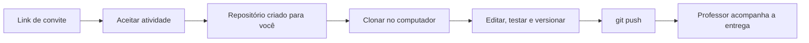

# Como Receber e Entregar Atividades no GitHub Classroom

## Objetivos de aprendizagem

- Aceitar uma atividade no GitHub Classroom sem expor dados da turma.
- Clonar, editar, versionar e enviar uma atividade com `Git` e `GitHub`.
- Consultar prazo, autograding e feedback do professor no repositório da tarefa.

**Tempo estimado:** 45min

## Vídeo de contexto

Vídeo oficial do GitHub Classroom. A interface do vídeo está em inglês, mas o fluxo geral é o mesmo.


---

## 1. O que acontece quando você recebe uma atividade

Quando o professor pública uma atividade no GitHub Classroom, você recebe um **link de convite**.

Ao aceitar o convite:

1. o GitHub Classroom associa sua conta pessoal do GitHub a atividade;
2. um novo repositório e criado para você dentro da organização da disciplina;
3. esse repositório passa a ser o local oficial da sua entrega.



!!! warning
    Não compartilhe o link de convite com outras pessoas. Quem tiver esse link pode aceitar a atividade e associar uma conta pessoal do GitHub a lista da turma.

---

## 2. Preparacao mínima antes de aceitar

Você precisa de:

- uma conta pessoal no `GitHub`;
- `Git` instalado no computador;
- `VS Code` ou outra IDE;
- `g++` para atividades em `C++`;
- `python3` para atividades em `Python`.

Checklist rápido no terminal:

```bash
git --version
code --version
g++ --version
python3 --version
```

Se algum comando falhar, resolva isso antes de iniciar a atividade.

---

## 3. Como aceitar a atividade

### 3.1 Abrir o convite

1. Abra o link de convite enviado pelo professor.
2. Entre com sua conta do `GitHub`, se necessário.
3. Clique no botao para aceitar a atividade.

### 3.2 Conferir o repositório criado

Depois da confirmacao, o Classroom cria um repositório para você.

O nome costuma seguir este formato:

```text
prefixo-da-atividade-seu-usuario-github
```

Exemplo genérico:

```text
poo-20261-cenario-01-seuusuario
```

### 3.3 Ler o `README.md`

Assim que o repositório abrir:

- leia o `README.md` por completo;
- identifique os arquivos da atividade;
- confira critérios de aceite;
- verifique se a atividade pede `issue`, `branch`, `pull request` ou `AI_LOG.md`.

---

## 4. Como trabalhar localmente no seu computador

### 4.1 Clonar o repositório

Na página principal do repositório, clique em `Code` e copie a URL `HTTPS`.

No terminal:

```bash
git clone <url-do-repositorio-da-sua-atividade>
cd <nome-da-pasta-clonada>
```

### 4.2 Criar uma branch de trabalho

Se a atividade pedir organização por branch, faca isso logo no início:

```bash
git switch -c feature/minha-entrega
```

Se o professor pedir entrega direta na `main`, siga exatamente a orientacao da atividade.

### 4.3 Executar o projeto

Leia os comandos descritos no `README.md`. Em geral:

Para `C++`:

```bash
g++ -std=c++17 -Wall -Wextra -O2 arquivo.cpp -o programa
./programa
```

Para `Python`:

```bash
python3 app.py
```

---

## 5. Como salvar o progresso com Git

Fluxo essencial:

```bash
git status
git add .
git commit -m "feat: descreve sua mudanca"
git push -u origin feature/minha-entrega
```

Se você estiver trabalhando na `main`, o `push` costuma ser:

```bash
git push origin main
```

### 5.1 Quando fazer commit

Faca um commit sempre que terminar uma unidade logica de trabalho.

Exemplos:

- corrigiu um erro de compilação;
- implementou uma classe;
- atualizou o `README.md`;
- preencheu o `AI_LOG.md`.

### 5.2 O que evitar

- não subir arquivos temporarios sem necessidade;
- não apagar arquivos do template sem justificativa;
- não reescrever o histórico com comandos avancados se você não domina o fluxo;
- não colocar token, senha ou chave privada no repositório.

---

## 6. Como abrir `issue` e `pull request`, quando a atividade pedir

Algumas atividades do curso usam fluxo de mercado:

- `issue` para definir a tarefa;
- `branch` para desenvolver;
- `pull request` para registrar e revisar a entrega.

Fluxo recomendado:

1. abra a `issue` com base no template;
2. crie uma branch ligada a essa tarefa;
3. desenvolva localmente;
4. faca `push`;
5. abra o `pull request`;
6. preencha o template do `pull request` com contexto, evidencias e uso de IA.

Se o professor pedir uma `issue` por etapa, não concentre tudo em um único `pull request`.

---

## 7. Onde ver prazo, autograding e feedback

### 7.1 Prazo

O prazo pode aparecer no próprio repositório da atividade, geralmente perto do `README.md`.

Se a atividade usar **data de corte**, você pode perder acesso de escrita depois do horário limite.

### 7.2 Autograding

Se o professor configurou testes automaticos:

- cada `push` pode disparar uma nova verificacao;
- você ve o resultado na guia `Actions` do repositório;
- falhas de compilação e testes aparecem nos logs.

### 7.3 Feedback do professor

Se a atividade usar `feedback pull requests`, o professor pode comentar em um `pull request` dedicado de feedback.

Em repositórios privados, esse feedback fica visivel apenas para as pessoas autorizadas na atividade.

### 7.4 Se aparecer `Repository Access Issue`

Em algumas turmas, o GitHub Classroom pode criar o repositório da atividade, mas redirecionar você para a tela:

```text
Repository Access Issue
You no longer have access to your assignment repository.
```

Quando isso acontecer:

1. confirme que você está logado na conta correta do `GitHub`;
2. abra `https://github.com/settings/organizations`;
3. procure convite pendente relacionado a organização da disciplina;
4. aceite o convite;
5. volte ao link do assignment ou abra novamente o repositório da atividade.

Se não houver convite pendente ou se o erro continuar, envie ao professor:

- seu `@usuário` do GitHub;
- o link do assignment;
- um print da tela de erro.

Esse procedimento costuma resolver o problema sem precisar recriar a atividade.

---

## 8. Ponte C++ -> Python

O fluxo de entrega e o mesmo nas duas linguagens. O que muda e o comando de execução e teste.

| Etapa | C++ | Python |
|---|---|---|
| Ler a atividade | `README.md` | `README.md` |
| Clonar repo | `git clone ...` | `git clone ...` |
| Executar localmente | `g++ ... && ./programa` | `python3 app.py` |
| Versionar | `git add`, `git commit`, `git push` | `git add`, `git commit`, `git push` |
| Entregar | repositório + PR, quando pedido | repositório + PR, quando pedido |

Conceito estavel:

- aceitar a atividade;
- trabalhar no próprio repositório;
- registrar o histórico com commits;
- enviar a entrega por `push`.

Detalhe que muda:

- comando de compilação em `C++`;
- comando de execução em `Python`;
- estrutura de pastas e arquivos do projeto.

---

## 9. Mini-caso prático

Você recebeu uma atividade de correcao de código. O professor publicou o convite, você aceitou a tarefa, clonou o repositório, corrigiu os erros localmente, fez commits pequenos, abriu um `pull request` e acompanhou o feedback no próprio repositório da atividade.

Esse e o fluxo esperado ao longo da disciplina.

---

## 10. Capturas oficiais e atualizadas

Para manter esta página pública sem expor dados internos da turma, este guia usa um passo a passo textual e links para capturas oficiais do GitHub Docs, que podem mudar com o tempo.

Leituras com imagens e telas atuais:

- Clonar um repositório no GitHub: https://docs.github.com/pt/repositories/creating-and-managing-repositories/cloning-a-repository
- Visualizar resultados da avaliação automática: https://docs.github.com/pt/education/manage-coursework-with-github-classroom/learn-with-github-classroom/view-autograding-results
- Como exibir o prazo de uma tarefa: https://docs.github.com/pt/education/manage-coursework-with-github-classroom/learn-with-github-classroom/viewing-your-assignments-deadline

Revisado em `1 de abril de 2026`.

---

## 11. Perguntas de revisão rápida

1. O que acontece no GitHub Classroom quando você aceita um link de convite?
2. Onde você consulta o prazo e o resultado do autograding?
3. Qual a diferença entre editar localmente e apenas navegar no repositório pelo navegador?

---

## 12. Fontes de referência

- https://docs.github.com/pt/education/manage-coursework-with-github-classroom/teach-with-github-classroom/create-an-individual-assignment
- https://docs.github.com/pt/education/manage-coursework-with-github-classroom/learn-with-github-classroom/view-autograding-results
- https://docs.github.com/pt/education/manage-coursework-with-github-classroom/learn-with-github-classroom/viewing-your-assignments-deadline
- https://github.com/orgs/community/discussions/72283
- https://docs.github.com/pt/repositories/creating-and-managing-repositories/cloning-a-repository
- https://docs.github.com/pt/get-started/getting-started-with-git/about-remote-repositories
- https://classroom.github.com/videos
