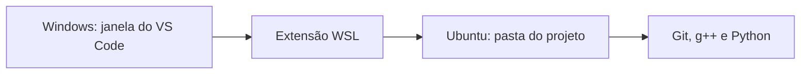
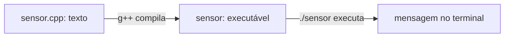
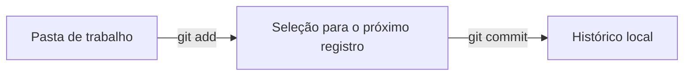
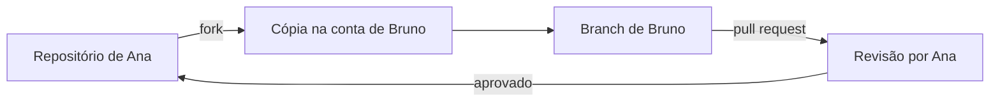

# Fundamentos de ambiente de programação, Git e GitHub

## Objetivos de aprendizagem

- Preparar um ambiente de programação no próprio computador e reconhecer as partes principais do VS Code.
- Criar um projeto, acompanhar suas mudanças com Git e publicar uma cópia no GitHub com autenticação por SSH.
- Colaborar com outra pessoa por meio de uma alteração isolada, um fork e um pull request revisável.

**Tempo estimado:** 8h, incluindo instalações, pausas e atividade em dupla.

## Vídeo de contexto

O vídeo **Git: mini curso para você sair do zero**, do canal Código Fonte TV, apresenta em português os conceitos e o fluxo inicial de versionamento. Ele serve como visão geral; os procedimentos atualizados e as explicações passo a passo estão detalhados nesta página.


---

## 1. Antes de programar: arquivo, pasta, editor e terminal

Um programa começa como texto. Esse texto é salvo em um **arquivo**, como `sensor.cpp` ou `sensor.py`. Os arquivos relacionados ficam reunidos em uma **pasta de projeto**. O computador não entende a intenção de quem escreveu: ele lê os caracteres do arquivo segundo as regras de uma linguagem de programação.

Para trabalhar com esses arquivos serão usadas quatro peças diferentes:

| Peça | Função | Exemplo neste curso |
|---|---|---|
| Editor de código | Escrever e organizar arquivos de texto | VS Code |
| Terminal | Receber comandos digitados | terminal integrado do VS Code |
| Ferramenta da linguagem | Transformar ou executar o código | `g++` e `python3` |
| Controle de versão | Registrar mudanças no projeto | Git |

O **VS Code** reúne o editor, um explorador de arquivos e um terminal na mesma janela. Ele não é o compilador de C++, não é o Python e não é o Git. Essas ferramentas são instaladas separadamente e o VS Code oferece uma interface para usá-las.

!!! note
    VS Code e Visual Studio são produtos diferentes. Nesta disciplina será usado o **Visual Studio Code**, cujo ícone azul tem o formato de uma fita angular.

### 1.1 As regiões da janela do VS Code

Ao abrir uma pasta, a janela apresenta estas regiões:

| Região | Onde aparece | Para que serve |
|---|---|---|
| Barra de atividades | faixa vertical à esquerda | alternar entre arquivos, busca, Git, execução e extensões |
| Barra lateral | ao lado da barra de atividades | mostrar o conteúdo da ferramenta selecionada |
| Editor | área central | abrir e modificar arquivos |
| Painel | parte inferior | exibir terminal, mensagens e problemas |
| Barra de status | borda inferior | informar linguagem, linha, coluna e ambiente conectado |

O **Explorador**, primeiro ícone da barra de atividades, mostra a pasta aberta. Clicar uma vez em um arquivo abre seu conteúdo no editor. O menu **Terminal > Novo Terminal** abre uma linha de comandos no painel inferior.

O cursor no editor altera o conteúdo de um arquivo. O cursor no terminal aguarda um comando. Essa distinção evita um erro comum: comandos como `git status` não são escritos dentro de `main.cpp`; são digitados no terminal.

Leitura visual oficial: [interface do VS Code](https://code.visualstudio.com/docs/getstarted/userinterface).

---

## 2. Instalação no Windows: VS Code e WSL

### 2.1 Por que usar Linux dentro do Windows

Windows e Linux organizam comandos e ferramentas de maneiras diferentes. O **WSL**, Subsistema do Windows para Linux, permite executar um ambiente Linux dentro do Windows sem substituir o sistema instalado. Assim, a turma usa os mesmos comandos de compilação e de Git em computadores Windows e Linux.

O VS Code permanece como aplicativo do Windows. Os compiladores, o Python, o Git e as pastas dos projetos ficam no Ubuntu instalado pelo WSL. A extensão WSL conecta as duas partes.



### 2.2 Instalar o WSL e o Ubuntu

Estas etapas exigem Windows 10 versão 2004 ou posterior, ou Windows 11.

1. Abra o menu Iniciar e procure por `PowerShell`.
2. Clique com o botão direito em **Windows PowerShell** e escolha **Executar como administrador**.
3. Digite:

```powershell
wsl --install
```

4. Reinicie o computador quando solicitado.
5. Abra **Ubuntu** pelo menu Iniciar.
6. Na primeira abertura, escolha um nome de usuário Linux e uma senha.

Ao digitar a senha no terminal Linux, nenhum caractere ou asterisco aparece. A senha está sendo recebida mesmo assim. Pressione `Enter` ao terminar.

No PowerShell, confirme a instalação:

```powershell
wsl --list --verbose
```

A coluna `VERSION` deve mostrar `2` para o Ubuntu. Em computadores administrados pela instituição, a instalação pode exigir autorização do setor responsável.

### 2.3 Instalar e reconhecer o VS Code

1. Acesse [code.visualstudio.com](https://code.visualstudio.com/) e escolha a versão estável para Windows.
2. Execute o instalador baixado.
3. Mantenha marcada a opção de adicionar o comando `code` ao caminho do sistema, quando ela for apresentada.
4. Abra o VS Code.
5. Clique em **Extensões**, o ícone de blocos na barra de atividades.
6. Procure e instale as extensões publicadas pela Microsoft:
   - `WSL`;
   - `C/C++`;
   - `Python`.

Extensão é um complemento do editor. Instalar `C/C++` ou `Python` no VS Code melhora a leitura e a edição do código, mas não instala o compilador nem o interpretador.

### 2.4 Instalar Git, C++ e Python dentro do Ubuntu

Abra o Ubuntu pelo menu Iniciar. Os comandos seguintes usam `apt`, o gerenciador de pacotes do Ubuntu, para atualizar a lista de programas disponíveis e instalar as ferramentas do curso:

```bash
sudo apt update
sudo apt install -y git build-essential python3
```

`sudo` autoriza uma tarefa administrativa e pede a senha criada na primeira abertura do Ubuntu. `git` instala o controle de versão; `build-essential` inclui o compilador `g++`; e `python3` instala o interpretador Python.

!!! important
    No Windows, execute esses comandos no terminal **Ubuntu**, não no PowerShell. O projeto ficará no WSL e será acompanhado pelo Git instalado no mesmo ambiente.

### 2.5 Abrir uma pasta do Ubuntu no VS Code

Abra o Ubuntu e execute, uma linha de cada vez:

```bash
mkdir -p ~/curso-poo
cd ~/curso-poo
code .
```

`mkdir` cria a pasta, `cd` entra nela e `code .` abre no VS Code a pasta atual. Na primeira execução, o VS Code pode instalar o componente de conexão com o WSL. No canto inferior esquerdo da janela deve aparecer uma indicação semelhante a `WSL: Ubuntu`.

!!! warning
    Para este curso, mantenha os projetos na pasta pessoal do Ubuntu, como `~/curso-poo`. Evite misturar comandos do Git para Windows com arquivos do WSL. Uma única cópia do projeto e um único Git tornam o caminho mais previsível.

Guia oficial atualizado: [desenvolvimento no VS Code com WSL](https://code.visualstudio.com/docs/remote/wsl).

---

## 3. Instalação no Linux ou macOS

Quem usa Windows e concluiu a seção anterior deve seguir diretamente para a seção 4.

### 3.1 Ubuntu ou Linux baseado em Debian

Abra o terminal e instale as ferramentas:

```bash
sudo apt update
sudo apt install -y build-essential python3 git
```

Instale o VS Code conforme o [guia oficial para Linux](https://code.visualstudio.com/docs/setup/linux) e acrescente as extensões `C/C++` e `Python`, ambas publicadas pela Microsoft.

### 3.2 macOS

Instale o VS Code conforme o [guia oficial para macOS](https://code.visualstudio.com/docs/setup/mac). No Terminal, instale as ferramentas de linha de comando da Apple:

```bash
xcode-select --install
```

O macOS normalmente fornece o comando `python3`, mas a versão disponível deve ser confirmada. A atividade pode ser realizada com `clang++` no lugar de `g++`.

---

## 4. Primeiro contato com o terminal e as ferramentas

Um terminal trabalha sempre a partir de uma pasta atual. O símbolo `~` representa a pasta pessoal do usuário. Antes de alterar arquivos, é importante saber onde o terminal está e o que existe ali.

```bash
pwd
ls
cd ~/curso-poo
```

- `pwd` mostra o caminho da pasta atual;
- `ls` lista seu conteúdo;
- `cd` muda a pasta atual.

Não é necessário memorizar todos os comandos. Leia cada um antes de executá-lo e confira o resultado. Verifique as instalações:

```bash
code --version
git --version
g++ --version
python3 --version
```

Cada comando deve mostrar um número de versão. `command not found` significa que a ferramenta não foi instalada nesse ambiente ou não está disponível no caminho de comandos.

---

## 5. Criar, executar e compreender o primeiro projeto

### 5.1 Criar a pasta do projeto

No terminal do Ubuntu, Linux ou macOS:

```bash
cd ~/curso-poo
mkdir primeiro-projeto
cd primeiro-projeto
code .
```

No Explorador do VS Code, crie dois arquivos: `sensor.cpp` e `sensor.py`. O trecho depois do ponto no nome do arquivo é a **extensão**. Ela ajuda o editor e as ferramentas a reconhecerem a linguagem usada.

### 5.2 Um programa em C++

Escreva em `sensor.cpp`:

```cpp
#include <iostream>

int main() {
    double temperatura = 26.5;
    std::cout << "Sensor ativo: " << temperatura << " C\n";
    return 0;
}
```

Neste primeiro contato, basta reconhecer o percurso: o valor `26.5` é guardado com o nome `temperatura`, e `std::cout` envia uma mensagem para o terminal. Os demais elementos serão estudados nas aulas de C++.

C++ é uma linguagem compilada. O arquivo escrito por uma pessoa precisa ser traduzido para um arquivo executável adequado ao computador:



Abra **Terminal > Novo Terminal** e execute:

```bash
g++ -std=c++17 -Wall -Wextra sensor.cpp -o sensor
./sensor
```

O primeiro comando cria o executável `sensor`. O segundo o executa. A saída esperada é:

```text
Sensor ativo: 26.5 C
```

### 5.3 O mesmo resultado em Python

Escreva em `sensor.py`:

```python
temperatura = 26.5
print(f"Sensor ativo: {temperatura} C")
```

Execute:

```bash
python3 sensor.py
```

Python executa o arquivo por meio do interpretador `python3`; por isso não houve uma etapa separada para criar um executável. C++ e Python expressam aqui a mesma sequência: guardar um valor e mostrá-lo. A diferença observada é da forma de execução de cada linguagem, ainda não um conceito de orientação a objetos.

### 5.4 Salvar não é executar

Salvar transfere a versão atual do editor para o arquivo no armazenamento. Compilar lê o arquivo C++ e tenta criar um executável. Executar inicia o programa. Alterar uma mensagem exige salvar e executar novamente; em C++, exige também recompilar.

---

## 6. Por que surgiu o controle de versão

Projetos mudam continuamente. Sem uma ferramenta própria, é comum criar arquivos como `sensor_final.cpp`, `sensor_final_agora-vai.cpp` e `sensor_final_corrigido.cpp`. Esses nomes não informam com segurança quem alterou, quando alterou, qual era a intenção nem quais linhas mudaram.

Sistemas de controle de versão surgiram para registrar a evolução dos arquivos de forma consultável. Os primeiros sistemas mantinham o histórico em um servidor central. Em 2005, o Git foi criado durante o desenvolvimento do kernel Linux para oferecer velocidade, integridade do histórico e trabalho distribuído. Em um sistema distribuído, cada cópia de trabalho pode conter o histórico completo, e os registros podem ser produzidos mesmo sem conexão com a internet.

Git e GitHub não são a mesma coisa:

| Ferramenta | Onde funciona | Responsabilidade |
|---|---|---|
| Git | no computador | observar arquivos e registrar versões |
| GitHub | serviço na internet | hospedar repositórios e apoiar colaboração e revisão |

Um projeto acompanhado pelo Git é chamado **repositório**. O repositório contém os arquivos atuais e uma área interna chamada `.git`, onde ficam os registros necessários para reconstruir o histórico.

---

## 7. Criar o primeiro repositório local

### 7.1 Informar a autoria

O Git grava nome e e-mail em cada registro. Configure-os com os mesmos dados que serão usados no GitHub:

```bash
git config --global user.name "Seu Nome"
git config --global user.email "seu-email@example.com"
```

As aspas preservam os espaços do nome. Confira:

```bash
git config --global --list
```

Esses dados identificam a autoria dos commits; não são senha nem autenticação.

### 7.2 Iniciar e observar

No terminal, dentro de `primeiro-projeto`:

```bash
git init -b main
git status
```

`git init` transforma a pasta atual em repositório, sem enviar nada à internet. `-b main` dá o nome `main` à primeira linha do histórico. `git status` é um comando de consulta: mostra em que branch você está e quais arquivos ainda não foram registrados.

Crie também um arquivo `README.md`:

```markdown
# Monitor de temperatura

Primeiro projeto da disciplina de Programação Orientada a Objetos.
```

`README.md` é a apresentação do projeto. O formato Markdown permite títulos, listas e links usando texto simples.

### 7.3 Da mudança ao commit

Um commit é um ponto identificado no histórico. Ele reúne o conteúdo selecionado, a autoria, o instante e uma mensagem. A seleção ocorre em duas etapas para que arquivos independentes não sejam misturados sem intenção.



Consulte, selecione e registre:

```bash
git status
git add README.md sensor.cpp sensor.py
git status
git commit -m "Cria primeiro monitor de temperatura"
```

O segundo `git status` permite conferir a seleção antes de registrá-la. O commit deve descrever uma mudança concluída. Consulte o resultado:

```bash
git log --oneline
```

### 7.4 Fazer uma segunda mudança

Troque `26.5` por `27.0` nos dois programas, salve e execute-os novamente. Em seguida:

```bash
git diff
git add sensor.cpp sensor.py
git commit -m "Atualiza leitura de temperatura do exemplo"
git log --oneline
```

`git diff` mostra linhas removidas e acrescentadas antes do commit. Agora o histórico conta uma sequência compreensível, em vez de guardar somente a última versão.

!!! tip
    `git status`, `git diff` e `git log` apenas consultam o repositório. Use-os com frequência para compreender o estado atual antes de decidir o próximo passo.

---

## 8. Criar uma conta no GitHub e preparar a chave SSH

### 8.1 Criar e proteger a conta

1. Acesse [github.com/signup](https://github.com/signup).
2. Informe um e-mail acessível, uma senha forte e um nome de usuário adequado ao contexto acadêmico e profissional.
3. Confirme o endereço de e-mail.
4. Ative a autenticação em dois fatores nas configurações da conta e guarde os códigos de recuperação em local seguro.

O nome de usuário faz parte do endereço público dos repositórios. O e-mail configurado no Git deve pertencer à conta para que o GitHub associe corretamente os commits ao perfil. É possível usar o [e-mail privado fornecido pelo GitHub](https://docs.github.com/pt/account-and-profile/how-tos/email-preferences/setting-your-commit-email-address) para não divulgar o endereço pessoal.

### 8.2 O que a chave SSH resolve

Ao enviar alterações, o GitHub precisa confirmar que o computador está autorizado a agir em nome da conta. SSH usa um par de chaves:

- a **chave privada** permanece no computador e nunca deve ser publicada ou enviada a alguém;
- a **chave pública** pode ser cadastrada no GitHub.

As duas partes se correspondem matematicamente. O GitHub confirma a posse da parte privada sem receber esse segredo.

No terminal do mesmo ambiente em que o Git foi instalado — Ubuntu/WSL para usuários Windows — gere o par:

```bash
ssh-keygen -t ed25519 -C "seu-email@example.com"
```

Pressione `Enter` para aceitar o local sugerido. Uma frase secreta protege a chave caso o arquivo seja copiado; use uma que consiga guardar com segurança.

Inicie o agente que mantém a chave disponível durante a sessão e adicione-a:

```bash
eval "$(ssh-agent -s)"
ssh-add ~/.ssh/id_ed25519
```

Mostre apenas a chave pública:

```bash
cat ~/.ssh/id_ed25519.pub
```

Copie toda a linha exibida. No GitHub, abra **foto do perfil > Settings > SSH and GPG keys > New SSH key**, dê um nome que identifique o computador e cole a chave pública.

Teste:

```bash
ssh -T git@github.com
```

Na primeira conexão, confirme o endereço do serviço digitando `yes`. Uma mensagem com seu nome de usuário e a informação de autenticação bem-sucedida confirma a configuração; o GitHub não fornece acesso a um terminal remoto.

!!! danger
    Nunca copie o conteúdo de `~/.ssh/id_ed25519`. Esse arquivo é a chave privada. Somente o arquivo terminado em `.pub` deve ser cadastrado.

Vídeo de apoio em português: [Git + GitHub + SSH (básico), de Otávio Miranda](https://www.youtube.com/watch?v=SnTBOhYFr28). Use a documentação escrita como referência para nomes e telas atuais.

---

## 9. Publicar o repositório local no GitHub

O repositório local já existe e possui commits. Agora será criado um repositório vazio na internet e estabelecida uma ligação entre eles.

1. No GitHub, clique em **New repository**.
2. Use o nome `primeiro-projeto-poo`.
3. Escolha a visibilidade indicada pelo professor.
4. Não marque a criação de `README`, `.gitignore` ou licença, pois o projeto local já possui conteúdo.
5. Clique em **Create repository**.
6. Na página seguinte, selecione **SSH** e copie o endereço semelhante a `git@github.com:usuario/primeiro-projeto-poo.git`.

No terminal do projeto, substitua o endereço pelo seu:

```bash
git remote add origin git@github.com:usuario/primeiro-projeto-poo.git
git remote -v
git push -u origin main
```

Um **remote** é um nome local para o endereço de outro repositório. Por convenção, `origin` nomeia o repositório do qual se envia ou recebe conteúdo. `push` envia commits; `-u` guarda a ligação entre a branch local `main` e a branch remota correspondente.

Atualize a página do GitHub. Os três arquivos e os dois commits devem aparecer. O GitHub não substituiu o Git local: passou a hospedar uma cópia sincronizável.

### 9.1 O ciclo cotidiano

Depois da primeira publicação, o ciclo básico é:

```bash
git status
git diff
git add <arquivos-relacionados>
git commit -m "Descreve a mudança concluída"
git push
```

| Comando | Movimento ou pergunta |
|---|---|
| `git status` | pergunta o estado atual |
| `git diff` | pergunta o que mudou |
| `git add` | escolhe conteúdo para o próximo commit |
| `git commit` | registra localmente |
| `git push` | envia commits ao repositório remoto |

---

## 10. Trabalhar sem interromper a versão principal: branches

Imagine que o programa publicado funciona, mas uma nova mensagem ainda precisa ser testada. Alterar diretamente a linha principal torna mais difícil separar trabalho incompleto de uma versão estável.

Uma **branch** é um nome móvel que acompanha uma linha de commits. Criar uma branch não duplica manualmente todos os arquivos. Ela fornece um caminho de trabalho isolado a partir de um ponto conhecido.

Crie uma branch:

```bash
git switch -c melhoria/mensagem-status
git status
```

Altere a mensagem dos dois programas para incluir `Leitura recebida`, salve, execute e registre:

```bash
git diff
git add sensor.cpp sensor.py
git commit -m "Melhora mensagem da leitura do sensor"
git push -u origin melhoria/mensagem-status
```

Agora o GitHub possui a `main` e a proposta de mudança em outra branch. Nenhuma revisão aconteceu ainda; apenas foi criado um lugar seguro para a alteração.

---

## 11. Colaboração: por que existem fork e pull request

### 11.1 Dois problemas diferentes

Em uma equipe com permissão de escrita no mesmo repositório, cada integrante pode criar uma branch ali. Porém, não é adequado conceder permissão de escrita a qualquer pessoa que queira sugerir uma melhoria.

O **fork** resolve esse limite de permissão: cria na conta do colaborador um repositório ligado ao original. O colaborador pode enviar branches ao próprio fork sem escrever diretamente no projeto de outra pessoa.

O **pull request**, ou PR, resolve o momento de integração: é uma proposta comparável e discutível para levar commits de uma branch a outra. Ele reúne diferenças, explicação, comentários, verificações e decisão de aceitar ou não.



| Técnica | Melhor uso | Esforço | Entregável | Limitação |
|---|---|---|---|---|
| Branch no mesmo repositório | equipe com acesso de escrita | baixo | branch e PR internos | exige permissão no repositório |
| Fork | contribuição sem acesso de escrita | médio | repositório derivado, branch e PR | requer manter a cópia sincronizada |
| Edição direta na `main` | mudança individual muito simples | baixo | commit na linha principal | reduz a oportunidade de revisão antes da integração |

Use branch no mesmo repositório para uma equipe interna autorizada. Use fork quando a contribuição parte de alguém sem acesso de escrita, como nesta primeira colaboração entre colegas.

### 11.2 Atividade em dupla: preparar a contribuição

Cada estudante já deve ter publicado `primeiro-projeto-poo`. Formem uma dupla e definam quem começa como pessoa autora e quem começa como pessoa colaboradora; depois invertam os papéis.

Na página do repositório da pessoa autora, a pessoa colaboradora deve:

1. clicar em **Fork**;
2. confirmar a criação do fork em sua própria conta;
3. abrir o fork, clicar em **Code**, selecionar **SSH** e copiar o endereço;
4. no terminal, sair do projeto atual e clonar o fork:

```bash
cd ~/curso-poo
git clone git@github.com:colaborador/primeiro-projeto-poo.git contribuicao-colega
cd contribuicao-colega
```

`clone` cria uma nova pasta com arquivos, configuração remota e histórico. Nesse clone, `origin` aponta para o fork do colaborador.

Adicione também um nome para o repositório original:

```bash
git remote add upstream git@github.com:autor/primeiro-projeto-poo.git
git remote -v
```

Por convenção, `upstream` significa o projeto de onde o fork se originou. Confira os endereços antes de prosseguir: `origin` deve ser o fork e `upstream`, o repositório da pessoa autora.

### 11.3 Produzir uma mudança pequena e explicável

Crie uma branch antes de editar:

```bash
git switch -c docs/melhora-instrucoes
```

Acrescente ao `README.md` instruções para compilar C++ e executar Python. Não altere os programas nesta contribuição. Essa restrição mantém o PR pequeno e facilita perceber se cada linha pertence ao objetivo anunciado.

Confira e registre:

```bash
git diff
git add README.md
git commit -m "Documenta execução dos exemplos"
git push -u origin docs/melhora-instrucoes
```

### 11.4 Abrir e revisar o pull request

No GitHub, abra o fork. A plataforma normalmente oferece o botão **Compare & pull request**. Confirme:

- repositório de destino: o repositório da pessoa autora;
- branch de destino: `main`;
- origem: branch `docs/melhora-instrucoes` do fork.

Use um título direto e descreva:

```text
Documenta execução dos exemplos

Motivo: o README apresentava o projeto, mas não explicava como executá-lo.
Mudança: foram adicionados os comandos de C++ e Python.
Verificação: ambos os comandos foram executados localmente.
```

A pessoa autora deve abrir **Files changed**, ler cada linha e verificar se os comandos funcionam. Se algo precisar mudar, deixe um comentário específico. A pessoa colaboradora corrige na mesma branch, faz novo commit e executa `git push`; o PR é atualizado automaticamente.

Após a aprovação, a pessoa autora integra a mudança com **Merge pull request**. Revisar não é procurar culpados: é confirmar propósito, funcionamento e clareza antes de incorporar a mudança ao histórico compartilhado.

### 11.5 Trazer a integração de volta ao computador

No clone da pessoa autora:

```bash
git switch main
git pull origin main
```

`pull` busca commits do remoto e os integra à branch atual. Leia sempre a branch e o remoto escritos no comando; sincronizar a direção errada é uma fonte comum de confusão.

Vídeos de apoio em português, para assistir na ordem:

1. [Criando o primeiro repositório — Curso em Vídeo](https://www.youtube.com/watch?v=5BYm7UdCrX0), para observar a passagem de uma pasta comum a um histórico.
2. [Playlist de Git e GitHub — Curso em Vídeo](https://www.youtube.com/playlist?list=PLHz_AreHm4dm7ZULPAmadvNhH6vk9oNZA), para retomar commits, branches e colaboração com mais tempo.

---

## 12. Mini-caso prático: monitoramento em uma equipe de engenharia

Uma equipe mantém um programa que exibe a temperatura de um equipamento. A versão utilizada em campo fica na `main`. Uma pessoa precisa melhorar as instruções de operação, mas não possui permissão para alterar diretamente o repositório responsável pelo equipamento.

Ela cria um fork, abre uma branch com nome ligado à tarefa e altera somente o `README.md`. O commit registra a intenção. O push publica a branch no fork. O pull request apresenta a diferença à equipe responsável. Durante a revisão, outra pessoa executa os comandos documentados e solicita uma correção. Um novo commit atualiza a mesma proposta. Somente depois da aprovação a mudança entra na `main`.

Cada recurso apareceu para responder a uma necessidade concreta:

- Git preservou a evolução;
- commit formou uma unidade explicável;
- branch isolou trabalho ainda não aprovado;
- fork respeitou a ausência de permissão;
- pull request criou um espaço de revisão;
- GitHub conectou os repositórios e registrou a conversa.

---

## 13. Verificação final da prática

Ao concluir, cada estudante deve conseguir mostrar:

- VS Code conectado ao ambiente correto (`WSL: Ubuntu`, no Windows);
- saída de `git`, `g++` e `python3` com seus números de versão;
- repositório local com pelo menos dois commits próprios;
- repositório correspondente no GitHub acessível por SSH;
- uma branch de melhoria publicada;
- um pull request recebido e revisado;
- um pull request enviado a partir de um fork.

Se uma etapa falhar, execute `pwd`, `git status`, `git branch --show-current` e `git remote -v`. Essas quatro consultas normalmente revelam a pasta, o estado, a branch e os destinos envolvidos.

---

## 14. Perguntas de revisão rápida

1. Por que salvar um arquivo, criar um commit e executar `git push` são três ações diferentes?
2. Em que situação uma branch no repositório original é suficiente e em que situação um fork se torna necessário?
3. O que uma pessoa revisora deve conseguir entender antes de aprovar um pull request?

---

## Fontes de referência

- [Documentação oficial do VS Code: primeiros passos](https://code.visualstudio.com/docs/getstarted/getting-started)
- [Documentação oficial do VS Code: interface](https://code.visualstudio.com/docs/getstarted/userinterface)
- [Microsoft Learn: instalar o WSL](https://learn.microsoft.com/pt-br/windows/wsl/install)
- [Documentação oficial do VS Code: desenvolvimento com WSL](https://code.visualstudio.com/docs/remote/wsl)
- [Pro Git, 2ª edição: primeiros passos](https://git-scm.com/book/pt-br/v2/Come%C3%A7ando-Sobre-Controle-de-Vers%C3%A3o)
- [Documentação do Git: referência de comandos](https://git-scm.com/docs)
- [GitHub Docs: criar uma conta](https://docs.github.com/pt/get-started/start-your-journey/creating-an-account-on-github)
- [GitHub Docs: conectar-se com SSH](https://docs.github.com/pt/authentication/connecting-to-github-with-ssh)
- [GitHub Docs: criar um repositório](https://docs.github.com/pt/repositories/creating-and-managing-repositories/creating-a-new-repository)
- [GitHub Docs: trabalhar com forks](https://docs.github.com/pt/pull-requests/collaborating-with-pull-requests/working-with-forks)
- [GitHub Docs: criar um pull request a partir de um fork](https://docs.github.com/pt/pull-requests/collaborating-with-pull-requests/working-with-forks/creating-a-pull-request-from-a-fork)
- [Documentação Python: usar Python em plataformas Unix](https://docs.python.org/pt-br/3/using/unix.html)
- [Referência do compilador GCC](https://gcc.gnu.org/onlinedocs/)
