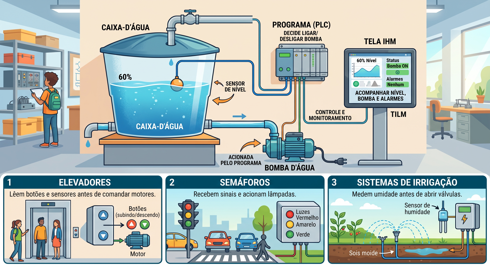

# Do C aos objetos: C++, Python e seus modos de execução

## Objetivos de aprendizagem

- Compilar e executar um programa C++ pelo terminal integrado do VS Code, distinguindo fonte, compilador e executável.
- Explicar por que abstração de dados e POO se tornaram úteis e comparar o fluxo de execução de C++ e Python.
- Completar e validar uma primeira classe pequena em C++ e Python, relacionando-a à `struct` conhecida de C.

**Tempo estimado:** 4h, em dois encontros de 2h.

| Encontro | Foco | Entrega observável |
|---|---|---|
| 1 | ambiente, fork, modos de execução e primeiro objeto | `make test ETAPA=01` verde em C++ e Python |
| 2 | extensão com unidade, medição com `time` e integração | `make test ETAPA=02`, `make run`, CI e pull request |

## Vídeo de contexto


**Duração:** aproximadamente 5 minutos. O vídeo mostra a compilação de C e C++ diretamente no terminal. A narração está em espanhol, mas os comandos `g++` apresentados são os mesmos usados no terminal Ubuntu/WSL do curso. A sequência guiada e a saída esperada estão documentadas abaixo em português.

---

## 1. Antes do cenário: executar os primeiros programas

Na aula de Git e IDE, você preparou o VS Code e o ambiente Ubuntu/WSL. Antes de estudar objetos ou automação, confirme novamente o ciclo mais básico de C++:

```text
escrever e salvar o fonte -> compilar com g++ -> executar o programa -> observar a saída
```

### 1.1 Abrir a pasta no VS Code

No terminal Ubuntu, prepare uma pasta pequena e abra-a no editor:

```bash
mkdir -p ~/curso-poo/capitulo-03
cd ~/curso-poo/capitulo-03
code .
```

No Windows, confirme no canto inferior esquerdo do VS Code que a janela está conectada ao WSL. Depois abra **Terminal > Novo Terminal**. Os comandos seguintes devem ser digitados nesse terminal integrado, e não no PowerShell.

### 1.2 Criar um programa sem POO

Crie `primeiro.cpp`:

```cpp
#include <iostream>

int main() {
    std::cout << "Compilacao concluida\n";
    return 0;
}
```

Este exemplo ainda não possui classe, sensor, CLP ou IHM. Ele existe para isolar uma única aprendizagem: transformar código-fonte em programa executável.

### 1.3 Compilar com `g++`

Salve o arquivo e execute:

```bash
g++ -std=c++17 -Wall -Wextra -pedantic primeiro.cpp -o primeiro
```

Leia o comando antes de continuar:

| Trecho | Ação |
|---|---|
| `g++` | inicia o compilador de C++ |
| `-std=c++17` | seleciona o padrão usado no curso |
| `-Wall -Wextra -pedantic` | habilita diagnósticos importantes |
| `primeiro.cpp` | informa o arquivo-fonte de entrada |
| `-o primeiro` | define o nome do executável produzido |

Se o terminal não mostrar mensagem, isso normalmente significa que a compilação terminou com sucesso. Confirme que um novo arquivo apareceu:

```bash
ls -l primeiro.cpp primeiro
```

### 1.4 Executar e confirmar

```bash
./primeiro
```

Saída esperada:

```text
Compilacao concluida
```

O prefixo `./` indica que o executável está na pasta atual. O VS Code ajudou a editar e abriu o terminal, mas quem traduziu o código foi `g++`; quem está executando agora é o arquivo `primeiro`.

### 1.5 Provocar uma falha útil

Remova o ponto e vírgula desta linha, salve e compile novamente:

```cpp
std::cout << "Compilacao concluida\n"
```

O compilador deve indicar linha e tipo aproximado do erro e não produzir uma nova versão válida do programa. Recoloque `;`, salve, compile e execute outra vez.

!!! warning "Executável antigo"
    Se já existia um executável de uma compilação anterior, ele pode continuar na pasta mesmo depois de uma nova compilação falhar. Não interprete a execução desse binário antigo como sucesso do código atual. Sempre leia o resultado do `g++` antes de executar.

### 1.6 Executar o equivalente em Python

Na mesma pasta, crie `primeiro.py`:

```python
print("Hello, World!")
```

Esse é o exemplo mínimo tradicional: uma instrução chama a função `print` para escrever uma mensagem no terminal. Digite ou copie o código, salve o arquivo e só então execute.

Antes de executar, confirme qual interpretador está disponível no ambiente Ubuntu/WSL:

```bash
python3 --version
```

Depois execute o arquivo pelo terminal integrado:

```bash
python3 primeiro.py
```

Saída esperada:

```text
Hello, World!
```

O VS Code é o editor, a extensão Python oferece recursos como realce e autocompletar, e `python3` é o programa que efetivamente executa o arquivo. A extensão não instala nem substitui o interpretador.

Se o VS Code indicar outro Python na barra de status, use **Ctrl+Shift+P → Python: Select Interpreter** e selecione o Python do ambiente Ubuntu/WSL. Nesta atividade não há bibliotecas externas, portanto ainda não precisamos criar ambiente virtual nem instalar pacotes.

#### Evoluir sem entrar em POO

Agora substitua o conteúdo de `primeiro.py` por este programa completo:

```python
def exibir_mensagem(mensagem: str) -> None:
    print(mensagem)


def main() -> None:
    linguagem = "Python"
    mensagem = f"Hello, World! Executando {linguagem}."
    exibir_mensagem(mensagem)


if __name__ == "__main__":
    main()
```

Execute novamente:

```bash
python3 primeiro.py
```

Saída esperada:

```text
Hello, World! Executando Python.
```

Leia o programa usando conhecimentos já construídos em C:

| Trecho | Papel no programa |
|---|---|
| `def exibir_mensagem(...)` | define uma função com parâmetro |
| `mensagem: str` | documenta que o parâmetro esperado é texto |
| `-> None` | informa que a função não devolve um valor |
| `linguagem = "Python"` | cria uma variável |
| `f"...{linguagem}..."` | monta texto usando o valor da variável |
| `main()` | reúne a sequência principal do programa |
| `if __name__ == "__main__"` | executa `main` quando este arquivo é iniciado diretamente |

As anotações `: str` e `-> None` ajudam pessoas e ferramentas, mas o interpretador não realiza a mesma verificação estática obrigatória que o compilador C++ faz. Essa diferença será observada com exemplos concretos mais adiante.

Arquivo completo para copiar ou baixar: [primeiro.py](./primeiro.py).

### 1.7 Comparar o que apareceu na pasta

```bash
ls -l primeiro.cpp primeiro primeiro.py
```

| Arquivo | Papel | Como foi usado |
|---|---|---|
| `primeiro.cpp` | código-fonte C++ | entrada do `g++` |
| `primeiro` | executável produzido | iniciado com `./primeiro` |
| `primeiro.py` | código-fonte Python | entregue ao interpretador com `python3 primeiro.py` |

Essa observação concreta será retomada mais adiante para explicar por que “compilada” e “interpretada” são descrições úteis, mas simplificadas.

### Checkpoint operacional

- [ ] estou no terminal Ubuntu/WSL integrado ao VS Code;
- [ ] consigo identificar `primeiro.cpp` como fonte e `primeiro` como executável;
- [ ] consigo explicar o papel de `g++` e de `-o`;
- [ ] consigo identificar o interpretador selecionado e executar `primeiro.py`;
- [ ] executo o `Hello, World!` mínimo e depois a versão organizada em funções;
- [ ] consigo corrigir um erro indicado pelo compilador.

### Guias de apoio, com funções diferentes

| Guia | Use agora para | Deixe para depois |
|---|---|---|
| [Insper — compilar e executar códigos C++](https://insper.github.io/supercomp/teoria/aula01/compilar-executar-C%2B%2B/) | revisar os comandos de compilação e execução por sistema operacional | configurações que não correspondam ao ambiente usado pela turma |
| [VS Code — C++ com GCC no Linux](https://code.visualstudio.com/docs/cpp/config-linux) | conferir pré-requisitos, criar a pasta com `code .`, salvar o fonte e reconhecer `g++` como compilador | `tasks.json`, `launch.json`, GDB, breakpoints e personalização do depurador |
| [VS Code — introdução ao Python](https://code.visualstudio.com/docs/python/python-tutorial) | distinguir editor, extensão e interpretador; selecionar o Python e executar um arquivo | ambientes virtuais, pacotes, debugger e aplicações com bibliotecas externas |

O guia oficial do VS Code mostra que a extensão C/C++ não substitui o compilador instalado: o editor aciona `/usr/bin/g++` e apresenta a saída no terminal integrado. Nesta aula, digitaremos o comando manualmente para que cada parte permaneça visível. A automação por botão e a depuração serão introduzidas quando resolverem um problema concreto.

### 1.8 Consultar a linguagem também faz parte da programação

Esta página apresenta o problema, explica os conceitos de POO e define o resultado esperado. Ela **não é um catálogo completo da sintaxe**. Para escrever, compreender e corrigir os programas da Parte 1, você deverá consultar materiais externos sempre que encontrar uma construção que ainda não conhece.

Use as fontes em duas camadas:

| Linguagem | Para aprender ou revisar rapidamente | Para confirmar detalhes técnicos |
|---|---|---|
| C++ | [Curso de C++ da W3Schools](https://www.w3schools.com/cpp/default.asp) | [Referência de C++ no cppreference](https://en.cppreference.com/w/cpp) |
| Python | [Curso de Python da W3Schools](https://www.w3schools.com/python/default.asp) | [Tutorial oficial do Python](https://docs.python.org/pt-br/3/tutorial/) e [Referência oficial da linguagem](https://docs.python.org/pt-br/3/reference/) |

O W3Schools é adequado para uma primeira explicação, exemplos curtos e experimentação. As referências técnicas devem ser usadas quando houver dúvida sobre comportamento, tipos, parâmetros ou regras da linguagem. Em C++, a especificação normativa é publicada como padrão ISO; para a consulta cotidiana do curso, usaremos o `cppreference`, que organiza essas regras por recurso e versão da linguagem.

!!! important "Procedimento esperado durante a Parte 1"
    Quando o roteiro solicitar uma construção ainda desconhecida — por exemplo, classe, construtor, `std::vector`, lista, arquivo ou exceção — consulte primeiro a seção correspondente do curso W3Schools da linguagem. Depois confirme detalhes na referência técnica, adapte o exemplo ao código da atividade e execute os testes. Consultar documentação não é desvio da atividade: é parte do trabalho de programar.

Somente depois desse checkpoint usaremos o mesmo ciclo para construir o primeiro objeto.

---

## 2. De onde partimos? Um código incompleto em um fork

A partir daqui, o exemplo deixa de ser um arquivo isolado. Você receberá um repositório-base com código incompleto, testes e validação automática. O texto desta página explica como completar a primeira etapa; a segunda será uma extensão feita por você.

### 2.1 Preparar o repositório da atividade

1. Acesse [rafaelrezo/poo-primeiros-objetos](https://github.com/rafaelrezo/poo-primeiros-objetos).
2. Selecione **Fork** e crie a cópia na sua conta.
3. No seu fork, abra **Actions** e habilite os workflows, se o GitHub solicitar.
4. Copie a URL do seu fork e execute, substituindo `SEU_USUARIO`:

```bash
cd ~/curso-poo
git clone https://github.com/SEU_USUARIO/poo-primeiros-objetos.git
cd poo-primeiros-objetos
git remote -v
```

Você deve ver somente `origin`, apontando para o seu fork. Não configure `upstream`: a entrega será integrada na `main` do próprio fork e não será enviada ao repositório-base. Confirme também que o terminal está dentro da cópia clonada:

```bash
pwd
ls
```

Entre os itens listados devem aparecer `Makefile`, `include`, `src` e `tests`. Não volte à pasta avulsa usada no `Hello, World!`: todos os comandos a partir deste ponto serão executados dentro de `poo-primeiros-objetos`.

Confirme as duas ferramentas usadas pela automação da prática:

```bash
make --version
/usr/bin/time --version
```

Os dois comandos devem exibir informações de versão. Se algum deles não existir no Ubuntu/WSL, instale os pacotes antes de continuar:

```bash
sudo apt update
sudo apt install make time
```

!!! warning "Não altere a validação"
    Nesta atividade, edite apenas os arquivos indicados em cada etapa. Não modifique `tests/`, `Makefile` nem `.github/workflows/validacao.yml` para fazer a validação passar.

### 2.2 Recuperar o ponto de partida em C

Na revisão de C, uma leitura podia ser representada por uma `struct` e modificada por funções externas:

```c
typedef struct {
    char tag[16];
    double valor;
} SensorNivel;

void atualizar_sensor(SensorNivel *sensor, double valor);
```

Esse modelo funciona. O problema aparece quando o programa cresce: quais funções pertencem ao sensor? Quem pode alterar `valor`? Como impedir um nível de `-30%`?

### 2.3 Antes dos nomes técnicos: uma situação conhecida

Imagine uma caixa-d'água com três elementos:

1. um **sensor** mede o nível;
2. um programa decide ligar ou desligar uma **bomba**;
3. uma tela permite que uma pessoa acompanhe nível, bomba e alarmes.

Mesmo quem nunca entrou em uma indústria já conhece sistemas parecidos: elevadores leem botões e sensores antes de comandar motores; semáforos recebem sinais e acionam lâmpadas; sistemas de irrigação medem umidade antes de abrir válvulas.



*Leia a figura da esquerda para a direita: o sensor observa o mundo físico; o controlador executa a decisão automática; a bomba atua no processo; e a tela permite acompanhamento humano. A figura usa `PLC`, sigla em inglês equivalente a `CLP`.*

### 2.4 Onde entram CLP e SCADA?

Na indústria, essas responsabilidades frequentemente recebem nomes específicos:

| Termo | Significado inicial | Papel no exemplo |
|---|---|---|
| **CLP** | Controlador Lógico Programável; em inglês, **PLC** | computador industrial que lê entradas, executa repetidamente uma lógica e atualiza saídas |
| **IHM** | Interface Homem-Máquina; em inglês, **HMI** | tela pela qual o operador visualiza dados e interage com uma máquina ou processo |
| **SCADA** | *Supervisory Control and Data Acquisition* | sistema mais amplo de supervisão que pode reunir IHMs, comunicação, histórico, tendências e alarmes |
| **telemetria** | dados de medição enviados de um componente para outro | leitura de nível, unidade, horário e estado produzidos pelo controlador |

Um CLP real é construído para operar máquinas e processos industriais com requisitos próprios de hardware, tempo, comunicação, confiabilidade e segurança. Um SCADA real integra equipamentos, comunicação, histórico, alarmes e interfaces de operação.

Neste curso construiremos apenas **representações didáticas** dessas duas responsabilidades:

```text
controlador virtual simplificado em C++ -> telemetria -> supervisório didático em Python
```

- O programa C++ simulará a leitura de sensores e uma decisão local de controle.
- O programa Python receberá os dados e os apresentará ao estudante.
- Nenhum dos dois deve ser confundido com equipamento ou software industrial pronto para uso real.

Agora os nomes têm uma função na narrativa: eles indicam onde cada pequeno projeto poderá chegar. Nesta aula, porém, construiremos somente o primeiro `SensorNivel`.

---

## 3. Observar os dois modos de execução no repositório

O `Hello, World!` mostrou o ciclo básico em arquivos avulsos. Agora repetiremos a observação usando **os arquivos que já estão no seu fork**. Continue no diretório `poo-primeiros-objetos`; não crie `sensor.cpp` nem `sensor.py`.

### 3.1 Localizar fonte, contrato e programa principal

O primeiro artefato está dividido em arquivos com papéis diferentes:

| Arquivo do fork | Papel nesta etapa |
|---|---|
| `include/sensor_nivel.hpp` | declara a classe e seu contrato público |
| `src/sensor_nivel.cpp` | implementa o construtor e o método em C++ |
| `src/main.cpp` | cria o objeto C++ e exibe seu resumo |
| `src/sensor_nivel.py` | define a classe equivalente em Python |
| `src/main.py` | cria o objeto Python e exibe seu resumo |
| `Makefile` | reúne os comandos de compilação, execução e teste |

Confirme os arquivos antes de executar:

```bash
ls include src
```

### 3.2 Experimento A — compilar o C++ do fork

Execute:

```bash
make clean
make build
```

O `Makefile` cria a pasta `build` e chama este comando por você:

```bash
g++ -std=c++17 -Wall -Wextra -Werror -pedantic -Iinclude \
    src/main.cpp src/sensor_nivel.cpp -o build/sensor
```

`make` não é o compilador: ele lê as regras do `Makefile` e aciona `g++`. A opção `-Werror` transforma os avisos habilitados em erros, evitando integrar código com diagnósticos ignorados.

Portanto, sim: `src/main.cpp` e `src/sensor_nivel.cpp` são efetivamente compilados. O arquivo `.hpp` declara o contrato compartilhado, é encontrado em `include` por causa de `-Iinclude` e participa da compilação quando incluído pelos fontes. O resultado é o executável `build/sensor`. Confirme e execute:

```bash
ls -l build/sensor
./build/sensor
```

Saída inicial:

```text
TODO C++
```

O compilador aceitou a estrutura do programa e produziu o executável. O `TODO` mostra outro problema: compilar não garante que o comportamento solicitado já tenha sido implementado.

### 3.3 Experimento B — executar o Python do fork

Agora execute o programa Python que está no mesmo repositório:

```bash
PYTHONPATH=src python3 src/main.py
```

Saída inicial:

```text
TODO Python
```

`PYTHONPATH=src` informa onde o Python deve procurar `sensor_nivel.py`. Diferentemente do fluxo C++, o aluno não executa antes um comando para produzir um arquivo como `build/sensor`: `python3` recebe diretamente o programa que deve executar.

### 3.4 Confirmar o problema com um teste

As duas versões executam, mas ainda devolvem respostas incorretas. Torne essa diferença observável:

```bash
make test ETAPA=01
```

O teste deve falhar. Em C++, a primeira mensagem pode indicar que `sensor.tag == "LT-101"` não foi atendido. Isso é esperado no código inicial: a estrutura compila, mas o contrato funcional ainda está vermelho.

| Aspecto observado | C++ neste fork | Python neste fork |
|---|---|---|
| Arquivos-fonte usados | `src/main.cpp` e `src/sensor_nivel.cpp` | `src/main.py` e `src/sensor_nivel.py` |
| Comando de execução | `./build/sensor` | `PYTHONPATH=src python3 src/main.py` |
| Artefato separado | `build/sensor` | não solicitado neste fluxo |
| Verificação de tipos | predominantemente antes da execução | predominantemente durante a execução |
| Próxima ação | corrigir, recompilar e testar | corrigir, executar e testar |

Agora existe uma sequência causal clara: o fork fornece a estrutura, a compilação confirma que ela é válida, a saída `TODO` revela a implementação incompleta e o teste define o comportamento que precisa ser construído.

---

## 4. Interpretar o que observamos

C++ começou em 1979 como *C with Classes*. O objetivo não era apenas criar outra sintaxe, mas combinar programação de sistemas eficiente com abstração de dados e programação orientada a objetos. O nome C++ passou a ser usado em 1983.

Python começou no fim de 1989 como sucessor da linguagem ABC e teve sua primeira versão pública em 1991. A linguagem favoreceu legibilidade, extensibilidade e ciclos curtos de experimentação.

Compiladores e interpretadores não “criaram” a POO sozinhos. Novos problemas de organização e manutenção motivaram linguagens com classes, encapsulamento e polimorfismo; suas implementações tornaram esses recursos executáveis.

### 4.1 O conceito estável

Um objeto reúne **estado**, **comportamento** e uma **responsabilidade**. A sintaxe usada para isso varia entre C++ e Python.

### 4.2 O que muda no fluxo de execução?

O experimento anterior permite comparar o fluxo usado no curso sem transformar essa comparação em uma regra absoluta:

| Aspecto | C++ no fork | Python no fork |
|---|---|---|
| Preparação explícita | `g++` produz `build/sensor` | não solicitamos executável separado |
| Início do programa | o sistema carrega o executável | o sistema inicia `python3`, que carrega o fonte |
| Verificação de tipos | predominantemente antes da execução | predominantemente durante a execução |
| Após alterar o fonte | recompilar e executar | executar novamente pelo interpretador |

Nesta aula, a diferença importante é operacional: em C++, o aluno compila e depois executa o arquivo produzido; em Python, usa `python3` para executar o fonte. Não precisamos estudar agora os detalhes internos do Python. Na atividade prática, o comando `time` permitirá observar o tempo desses dois caminhos neste pequeno programa.

---

## 5. Etapa 01 — completar o primeiro objeto

Não corrija diretamente a `main`. Crie uma branch curta a partir do código inicial para isolar o incremento:

```bash
git switch -c pratica/01-primeiros-objetos
```

Antes de editar, leia como os arquivos C++ se conectam. O cabeçalho já declara o estado e os comportamentos disponíveis:

```cpp
class SensorNivel {
public:
    std::string tag;
    double valor;

    SensorNivel(std::string tagInicial, double valorInicial);
    std::string resumo() const;
};
```

E `src/main.cpp` já usa esse contrato:

```cpp
int main() {
    const SensorNivel sensor{"LT-101", 42.5};
    std::cout << sensor.resumo() << '\n';
    return 0;
}
```

O objeto `sensor` possui **estado** (`tag` e `valor`), oferece **comportamento** (`resumo`) e tem a responsabilidade de representar uma leitura de nível. O uso já está pronto; falta implementar corretamente o que foi declarado.

Abra `src/sensor_nivel.cpp` e `src/sensor_nivel.py`. Localize os marcadores `TODO` e altere somente esses dois arquivos nesta etapa:

- `src/sensor_nivel.cpp`;
- `src/sensor_nivel.py`.

### 5.1 Completar a implementação em C++

A classe já está declarada no cabeçalho. Antes de completar o código, observe esta declaração:

```cpp
SensorNivel(std::string tagInicial, double valorInicial);
```

Ela declara o **construtor** de `SensorNivel`. Um construtor é executado automaticamente quando um objeto é criado. Nesta etapa, sua função é fazer o objeto nascer com `tag` e `valor` recebidos pelo programa:

```cpp
const SensorNivel sensor{"LT-101", 42.5};
```

Nesse comando, `"LT-101"` será recebido por `tagInicial` e `42.5` será recebido por `valorInicial`. O construtor não possui tipo de retorno e tem o mesmo nome da classe.

Depois da construção, o método `resumo()` usa o estado armazenado para produzir texto. Portanto, a responsabilidade desta implementação é:

```text
construtor: receber dados -> inicializar o estado do objeto
resumo(): ler o estado -> devolver uma representação em texto
```

Se a sintaxe ainda for nova, consulte [Classes em C++](https://www.w3schools.com/cpp/cpp_classes.asp) e [Construtores em C++](https://www.w3schools.com/cpp/cpp_constructors.asp). Volte ao código do fork e substitua as duas implementações marcadas com `TODO` por:

```cpp
SensorNivel::SensorNivel(std::string tagInicial, double valorInicial)
    : tag(tagInicial), valor(valorInicial) {
}

std::string SensorNivel::resumo() const {
    return tag + ": " + formatarValor(valor);
}
```

O trecho após `:` é a **lista de inicialização** do construtor. Ela transfere os valores recebidos para o estado do objeto. `resumo()` é um comportamento do sensor e usa a função auxiliar já fornecida para formatar o número.

O bloco com `std::ostringstream`, a função `formatarValor` e o `namespace` anônimo são infraestrutura fornecida. Nesta aula, você precisa reconhecer que `formatarValor(valor)` devolve o número como texto; o estudo detalhado desses recursos não faz parte da etapa 01.

### 5.2 Compilar e executar antes do teste

```bash
make build
make run
```

Neste momento, a primeira linha deve estar correta e a segunda ainda deve exibir `TODO Python`:

```text
LT-101: 42.5
TODO Python
```

Por enquanto, os atributos continuam públicos. Isso é intencional: primeiro observamos classe, objeto e método; no próximo capítulo aparecerá um problema que exigirá encapsulamento.

---

## 6. Espelhar o mesmo conceito em Python

Agora aplique a mesma responsabilidade a `src/sensor_nivel.py`. Consulte [Classes e objetos em Python](https://www.w3schools.com/python/python_classes.asp) ou a seção [Classes do tutorial oficial](https://docs.python.org/pt-br/3/tutorial/classes.html) quando precisar revisar `class`, `__init__` ou `self`:

```python
class SensorNivel:
    def __init__(self, tag: str, valor: float):
        self.tag = tag
        self.valor = valor

    def resumo(self) -> str:
        return f"{self.tag}: {self.valor:g}"
```

O formato `:g` evita zeros decimais desnecessários e mantém `42.5` como `42.5`. A criação e a impressão do objeto já estão em `src/main.py`; não é necessário duplicá-las.

| Conceito | C++ | Python |
|---|---|---|
| Definir classe | `class SensorNivel` | `class SensorNivel` |
| Construir objeto | `SensorNivel sensor{...}` | `SensorNivel(...)` |
| Objeto atual | implícito; acesso com membros | `self` explícito |
| Método que não altera estado | declarado com `const` | expresso pela intenção e pelos testes |

Execute a validação da etapa:

```bash
make test ETAPA=01
```

Ao final, procure estas evidências:

```text
OK etapa 01 C++: objeto construído e resumo confirmado
OK
```

Se o teste falhar, leia primeiro a linguagem e a comparação indicada. Corrija o código; não corrija o teste. Depois registre e envie o incremento:

```bash
git add src/sensor_nivel.cpp src/sensor_nivel.py
git commit -m "Completa primeiros objetos em C++ e Python"
git push -u origin pratica/01-primeiros-objetos
```

Abra **Actions → Validação do capítulo 03** no seu fork. O workflow executa o mesmo `make test ETAPA=01`. Só abra o pull request quando a execução estiver verde.

---

## 7. Atividade prática — ampliar e comparar o programa

### Objetivo da atividade

O sensor da etapa 01 resume apenas `tag` e `valor`; a unidade da grandeza ainda não faz parte do objeto. Isso impede distinguir claramente uma leitura de nível em `%` de uma pressão em `bar`.

Nesta atividade, você deverá:

1. estender os objetos C++ e Python para receber uma unidade;
2. preservar o comportamento que já passou na etapa 01;
3. validar as duas linguagens localmente e na CI;
4. medir o tempo de execução dos dois programas e interpretar o resultado com cautela.

Ao final, o artefato representará dois elementos da estação de bombeamento:

| Objeto | Tag | Valor | Unidade | Resumo esperado |
|---|---|---:|---|---|
| sensor de nível | `LT-101` | `42.5` | `%` | `LT-101: 42.5 %` |
| sensor de pressão | `PT-201` | `2.7` | `bar` | `PT-201: 2.7 bar` |

### 7.1 Preparar a branch da prática

Depois que a etapa 01 estiver integrada à sua `main`, atualize-a e crie a próxima branch:

```bash
git switch main
git pull origin main
git switch -c pratica/02-extensao-unidade
```

Confirme que a branch foi criada a partir da implementação que já passou na etapa 01:

```bash
git branch --show-current
make test ETAPA=01
```

O primeiro comando deve mostrar `pratica/02-extensao-unidade`, e o teste antigo deve continuar verde antes da nova alteração.

### 7.2 Implementar a extensão

Nesta etapa você alterará cinco arquivos. Siga os passos na ordem indicada e salve cada arquivo antes de executar os comandos.

#### Passo A — ampliar o contrato C++

Abra `include/sensor_nivel.hpp`. A classe precisa guardar `unidade` e aceitar estas duas construções:

```cpp
SensorNivel sensorSemUnidade{"LT-101", 42.5};
SensorNivel sensorComUnidade{"LT-101", 42.5, "%"};
```

Complete os `TODO` e adapte o resultado no cabeçalho:

```cpp
class SensorNivel {
public:
    std::string tag;
    double valor;
    std::string /* TODO: novo atributo */;

    SensorNivel(
        std::string tagInicial,
        double valorInicial,
        std::string unidadeInicial = /* TODO: valor padrão */
    );

    std::string resumo() const;
};
```

Consulte [parâmetros com valor padrão em C++](https://www.w3schools.com/cpp/cpp_function_default.asp). Antes de continuar, explique por que o valor padrão mantém válida a construção com dois argumentos.

#### Passo B — implementar o contrato em C++

Abra `src/sensor_nivel.cpp`. Preserve `formatarValor` e complete:

```cpp
SensorNivel::SensorNivel(
    std::string tagInicial,
    double valorInicial,
    std::string unidadeInicial
)
    : tag(/* TODO */),
      valor(/* TODO */),
      unidade(/* TODO */) {
}

std::string SensorNivel::resumo() const {
    // TODO: sem unidade, devolver "LT-101: 42.5".
    // TODO: com unidade, devolver "LT-101: 42.5 %".
}
```

Para verificar uma string vazia, consulte [`std::string::empty`](https://en.cppreference.com/w/cpp/string/basic_string/empty). A função `formatarValor` continua responsável apenas por converter o número em texto.

#### Passo C — implementar o mesmo contrato em Python

Abra `src/sensor_nivel.py` e complete:

```python
class SensorNivel:
    def __init__(
        self,
        tag: str,
        valor: float,
        unidade: str = # TODO: valor padrão
    ):
        self.tag = tag
        self.valor = valor
        self.unidade = # TODO: guardar o parâmetro

    def resumo(self) -> str:
        # TODO: sem unidade, devolver "LT-101: 42.5".
        # TODO: com unidade, devolver "LT-101: 42.5 %".
```

Consulte [argumentos padrão no tutorial oficial do Python](https://docs.python.org/pt-br/3/tutorial/controlflow.html#default-argument-values). Registre qual ideia permanece igual em C++ e Python, apesar da diferença de sintaxe.

#### Passo D — tornar a extensão observável

Nos arquivos `src/main.cpp` e `src/main.py`, crie os mesmos dois objetos:

| Variável | Construção C++ | Construção Python |
|---|---|---|
| `nivel` | `SensorNivel nivel{"LT-101", 42.5, "%"};` | `nivel = SensorNivel("LT-101", 42.5, "%")` |
| `pressao` | `SensorNivel pressao{"PT-201", 2.7, "bar"};` | `pressao = SensorNivel("PT-201", 2.7, "bar")` |

Faça cada `main` exibir `nivel.resumo()` e `pressao.resumo()`. Use a criação e a exibição do objeto existente como referência; preserve os includes, imports e a estrutura de `main`.

Antes de executar, anote as duas linhas que cada linguagem deverá produzir. Depois confirme que salvou estes cinco arquivos:

```text
include/sensor_nivel.hpp
src/sensor_nivel.cpp
src/sensor_nivel.py
src/main.cpp
src/main.py
```

### 7.3 Validar localmente

No terminal aberto na raiz de `poo-primeiros-objetos`, limpe os artefatos anteriores, compile e execute:

```bash
make clean
make build
make run
```

Saída esperada de `make run`:

```text
LT-101: 42.5 %
PT-201: 2.7 bar
LT-101: 42.5 %
PT-201: 2.7 bar
```

As duas primeiras linhas são produzidas pelo C++; as duas últimas, pelo Python. Se essa saída estiver correta, execute o contrato completo:

```bash
make test ETAPA=02
```

A etapa `02` executa os testes `01` e `02`. Assim, uma solução nova não pode apagar o comportamento que já estava correto.

Antes de continuar, confirme:

- os testes C++ das etapas 01 e 02 exibem `OK`;
- os testes Python das etapas 01 e 02 exibem `OK`;
- nenhuma alteração foi feita em `tests/`, `Makefile` ou `.github/`.

### 7.4 Medir o tempo de execução com `time`

Com os testes verdes, compile novamente para garantir que o executável corresponde ao código atual:

```bash
make clean
make build
```

Meça primeiro a execução do programa já compilado:

```bash
time ./build/sensor
```

Depois meça a inicialização do interpretador e a execução do programa Python:

```bash
time env PYTHONPATH=src python3 src/main.py
```

O terminal normalmente apresenta três medidas:

| Medida | Significado inicial |
|---|---|
| `real` | tempo decorrido percebido do início ao fim |
| `user` | tempo de CPU usado pelo programa em espaço de usuário |
| `sys` | tempo de CPU gasto em operações do sistema |

Execute cada comando pelo menos uma vez para compreender o que está sendo medido. O comando final da atividade repetirá cada medição três vezes e registrará os valores automaticamente.

!!! warning "O que esta medição permite concluir"
    Este experimento compara **a inicialização e a execução destes dois programas pequenos neste computador**. No caso de Python, a inicialização do interpretador faz parte da medida; no caso de C++, o executável já estava compilado. O resultado não prova que uma linguagem será sempre mais rápida que a outra. Uma comparação de desempenho rigorosa exigiria implementações equivalentes, uma carga de trabalho significativa, várias repetições e controle do ambiente.

### 7.5 Gerar a evidência para o pull request

O comando final executa novamente os testes, mede cada programa três vezes e solicita sete respostas. Execute no terminal da raiz do repositório:

```bash
make evidencia
```

O terminal apresentará uma pergunta por vez. Digite a resposta com suas palavras e pressione **Enter**. As sete respostas formam o questionário consolidado da atividade:

1. quais são o estado, o comportamento e a responsabilidade de `SensorNivel`;
2. qual é o papel de `.hpp`, `.cpp` e `main.cpp` no programa C++;
3. o que o construtor faz e como o valor padrão preserva chamadas com dois argumentos;
4. qual ideia é comum aos valores padrão de C++ e Python;
5. por que `make test ETAPA=02` também repete os testes da etapa 01;
6. qual diferença foi observada entre executar C++ e Python e o que `time` não prova;
7. por que o modelo ainda aceita `-30%` e qual conceito será necessário para impedir isso.

Se algum teste falhar, o arquivo não será criado. Corrija o código e execute `make evidencia` novamente. Quando tudo estiver correto, a mensagem final será:

```text
4/4 Evidência gerada em evidencia.md
Revise o arquivo antes de fazer commit e anexar à entrega no fork.
```

Abra o arquivo gerado:

```bash
code evidencia.md
```

Ele deve conter:

- branch e commit-base identificados antes da geração;
- confirmação de `make test ETAPA=02`;
- três tempos de C++ e três tempos de Python;
- as sete respostas escritas pelo aluno.

Revise texto e valores. O arquivo `evidencia.md` deve ser commitado na branch e apresentado no pull request do próprio fork.

### 7.6 Enviar a branch e validar na CI

Registre somente depois de obter testes locais verdes:

```bash
git add include/sensor_nivel.hpp src/sensor_nivel.cpp src/sensor_nivel.py \
    src/main.cpp src/main.py evidencia.md AI_LOG.md
git commit -m "Adiciona unidade sem quebrar o contrato inicial"
git push -u origin pratica/02-extensao-unidade
```

Confirme a execução verde em **Actions** e abra o pull request da branch para a `main` do próprio fork. Não abra PR contra `rafaelrezo/poo-primeiros-objetos`. Na descrição, inclua:

- o comando local executado e o resultado;
- o link da execução da CI;
- uma explicação curta de como o valor padrão preservou as chamadas com dois argumentos;
- o arquivo `evidencia.md` com medições e respostas;
- o registro em `AI_LOG.md`, caso tenha usado um agente de IA.

O teste compara comportamento observável, não apenas a presença da palavra `class`.

### 7.7 Erros comuns

| Sintoma | Verificação |
|---|---|
| `undefined reference` em C++ | todos os arquivos necessários foram enviados ao `g++`? |
| `no matching function` em C++ | a declaração possui três parâmetros, com valor padrão no terceiro, e a implementação possui a mesma assinatura? |
| `SyntaxError` em Python | indentação e dois-pontos estão corretos? |
| saídas diferentes | espaços, unidade e casas decimais seguem o contrato? |
| etapa 02 passa, mas etapa 01 falha | a extensão preservou a construção antiga com dois argumentos? |
| `make evidencia` informa que não há terminal interativo | execute o comando diretamente no terminal do VS Code, não dentro da CI |
| `/usr/bin/time` não foi encontrado | no Ubuntu/WSL, instale o pacote `time` conforme orientação do professor |

### 7.8 Limite atual e ligação com a próxima aula

A estação de bombeamento agora possui representações para nível e pressão, mas ainda é possível criar `SensorNivel{"LT-101", -30.0, "%"}`. Esse defeito observável encerra a prática e apresenta o problema do próximo capítulo: como encapsulamento e invariantes podem impedir que um objeto aceite um estado inválido?

---

## Perguntas de revisão rápida

1. Qual problema de organização uma classe começa a resolver em relação a uma `struct` com funções espalhadas?
2. Qual é a diferença observável entre executar o programa C++ e o programa Python nesta atividade, e o que a medição com `time` não permite concluir?
3. Que comportamento ainda permite criar um sensor inválido?

## Evidências de conclusão

- [ ] o fork possui somente `origin`, apontando para a conta do estudante;
- [ ] `make test ETAPA=01` passou antes da primeira integração;
- [ ] `make test ETAPA=02` repetiu as duas etapas sem regressão;
- [ ] as duas branches produziram execuções verdes no GitHub Actions;
- [ ] `make evidencia` gerou `evidencia.md`, revisado e incluído na PR do fork;
- [ ] o pull request explica a equivalência conceitual entre C++ e Python;
- [ ] o uso de IA, quando ocorreu, foi registrado em `AI_LOG.md`.

## Fontes de referência

- [Insper — compilar e executar códigos C++](https://insper.github.io/supercomp/teoria/aula01/compilar-executar-C%2B%2B/)
- [VS Code — C++ com GCC](https://code.visualstudio.com/docs/cpp/config-linux)
- [VS Code — introdução ao Python](https://code.visualstudio.com/docs/python/python-tutorial)
- [Rockwell Automation — o que é um controlador lógico programável](https://www.rockwellautomation.com/en-us/products/hardware/programmable-controllers.html.html)
- [Schneider Electric — introdução a sistemas SCADA](https://blog.se.com/industry/machine-and-process-management/2018/12/11/an-introduction-to-scada-systems/)
- [Standard C++ — história e motivação](https://isocpp.org/wiki/faq/big-picture)
- [cppreference — fases de tradução](https://en.cppreference.com/w/cpp/language/translation_phases)
- [Python Docs — história](https://docs.python.org/pt-br/3/license.html)
- [W3Schools — C++ Classes](https://www.w3schools.com/cpp/cpp_classes.asp)
- [W3Schools — Python Classes](https://www.w3schools.com/python/python_classes.asp)
- [W3Schools — curso completo de C++](https://www.w3schools.com/cpp/default.asp)
- [W3Schools — curso completo de Python](https://www.w3schools.com/python/default.asp)
- [cppreference — referência da linguagem C++](https://en.cppreference.com/w/cpp)
- [Python Docs — tutorial oficial](https://docs.python.org/pt-br/3/tutorial/)
- [Python Docs — referência oficial da linguagem](https://docs.python.org/pt-br/3/reference/)
