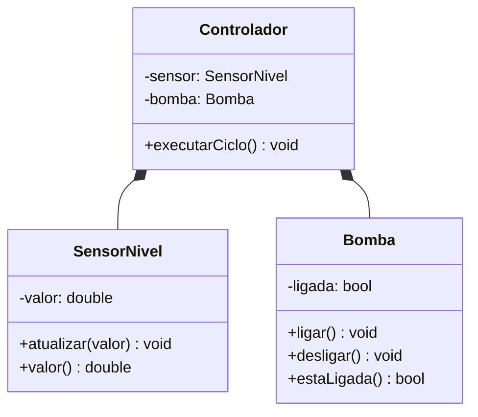

# Objetos que colaboram: responsabilidades, composição e UML mínimo

## Objetivos de aprendizagem

- Distribuir responsabilidades entre sensor, bomba e controlador.
- Diferenciar associação e composição e preferir composição quando o domínio pede relação “tem um”.
- Representar e testar uma colaboração pequena em C++ e Python.

**Tempo estimado:** 4h, em dois encontros de 2h.

## Vídeo da aula


---

## 1. Qual problema apareceu?

O sensor válido mede uma variável, mas não deve decidir sozinho quando ligar uma bomba. Se todas as decisões forem colocadas em `SensorNivel`, ele passará a medir, controlar, registrar e apresentar dados.

Separaremos três responsabilidades:

| Objeto | Responsabilidade |
|---|---|
| `SensorNivel` | preservar e oferecer a leitura |
| `Bomba` | preservar e alterar seu estado de acionamento |
| `Controlador` | aplicar uma regra usando sensor e bomba |

---

## 2. Composição antes de herança

O controlador **tem um** sensor e **tem uma** bomba. Isso sugere composição, não herança.



O diamante preenchido comunica que, neste modelo didático, sensor e bomba são partes estruturais do controlador.

---

## 3. Aplicação curta em C++

```cpp
class Bomba {
private:
    bool ligada_{false};

public:
    void ligar() { ligada_ = true; }
    void desligar() { ligada_ = false; }
    bool estaLigada() const { return ligada_; }
};

class Controlador {
private:
    SensorNivel sensor_;
    Bomba bomba_;

public:
    Controlador(SensorNivel sensor, Bomba bomba)
        : sensor_(sensor), bomba_(bomba) {}

    void executarCiclo() {
        if (sensor_.valor() < 30.0) {
            bomba_.ligar();
        } else if (sensor_.valor() > 70.0) {
            bomba_.desligar();
        }
    }

    const Bomba& bomba() const { return bomba_; }
};
```

Observe que `Controlador` não é um tipo de `SensorNivel`. Ele colabora com o sensor.

---

## 4. Ponte C++ -> Python

```python
class Bomba:
    def __init__(self) -> None:
        self._ligada = False

    def ligar(self) -> None:
        self._ligada = True

    def desligar(self) -> None:
        self._ligada = False

    @property
    def ligada(self) -> bool:
        return self._ligada


class Controlador:
    def __init__(self, sensor: SensorNivel, bomba: Bomba):
        self._sensor = sensor
        self._bomba = bomba

    def executar_ciclo(self) -> None:
        if self._sensor.valor < 30.0:
            self._bomba.ligar()
        elif self._sensor.valor > 70.0:
            self._bomba.desligar()
```

O conceito comum é a colaboração. C++ expressa propriedade e tempo de vida com regras mais explícitas; Python mantém referências aos objetos.

---

## 5. Como confirmar?

| Leitura | Estado inicial | Resultado esperado |
|---:|---|---|
| `20%` | desligada | liga |
| `50%` | desligada | permanece desligada |
| `80%` | ligada | desliga |

O intervalo entre `30%` e `70%` evita ficar alternando a bomba em torno de um único limite. O nome dessa estratégia será retomado na Parte 2; agora o foco é responsabilidade e composição.

---

## 6. Prática profissional

1. Crie `cap05-controlador-composto` a partir do capítulo anterior.
2. Adicione `Bomba` sem alterar `SensorNivel`.
3. Escreva os três testes da tabela.
4. Adicione `Controlador` e faça os testes passarem.
5. Atualize o diagrama Mermaid no mesmo PR.
6. Explique por que a relação não é herança.

### Erros comuns

- concentrar sensor, bomba e regra em uma classe “Deus”;
- usar herança apenas para reaproveitar linhas de código;
- expor a bomba inteira quando apenas uma consulta seria suficiente;
- desenhar UML que não corresponde ao código entregue.

---

## 7. Mini-caso prático

O controlador já coordena objetos, mas possui apenas um tipo fixo de sensor. Quando sensores de nível, pressão e vazão precisarem obedecer ao mesmo ciclo, surgirá a necessidade de um contrato comum — assunto do próximo capítulo.

---

## Perguntas de revisão rápida

1. Por que `Controlador` deve compor uma bomba em vez de herdar dela?
2. Qual responsabilidade permanece com o sensor?
3. Que evidência confirma que o diagrama e o código representam o mesmo modelo?

## Fontes de referência

- [C++ Core Guidelines — interfaces de classes](https://isocpp.github.io/CppCoreGuidelines/CppCoreGuidelines#S-class)
- [Python Docs — classes](https://docs.python.org/3/tutorial/classes.html)
- [Mermaid — class diagrams](https://mermaid.js.org/syntax/classDiagram.html)
- [W3Schools — C++ Classes](https://www.w3schools.com/cpp/cpp_classes.asp)
