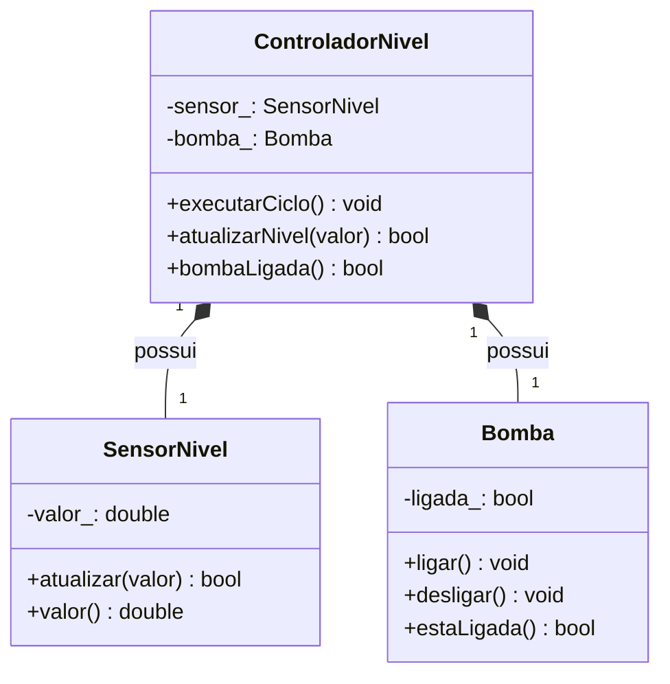

# Composição e responsabilidades: objetos que colaboram

## Objetivos de aprendizagem

- Distribuir uma regra de controle entre objetos com responsabilidades pequenas e explícitas.
- Distinguir dependência, associação e composição pela semântica e pelo tempo de vida.
- Transformar um diagrama UML em código C++ e Python e verificar a correspondência.

**Tempo estimado:** 4h, em dois encontros de 2h.

## Vídeo da aula


O vídeo público **Relacionamento entre Classes**, do Curso em Vídeo, apresenta em português como objetos colaboram. Durante a exibição, procure a relação **“tem um”**. Depois pergunte: quem cria, mantém e destrói cada parte? A linguagem usada no exemplo é secundária; nesta aula, o mesmo modelo será implementado em C++ e Python.

---

## 1. De onde partimos?

Na aula 04, `SensorNivel` passou a proteger a invariante `0 <= valor <= 100`:

```cpp
class SensorNivel {
    double valor_;
public:
    explicit SensorNivel(double valorInicial) : valor_(valorInicial) {}
    bool atualizar(double novoValor) {
        if (novoValor < 0.0 || novoValor > 100.0) return false;
        valor_ = novoValor;
        return true;
    }
    double valor() const { return valor_; }
};
```

Ele sabe validar e informar uma leitura, mas não deve decidir sozinho quando ligar uma bomba.

| Tempo | Bloco | Evidência |
|---:|---|---|
| 25 min | problema e responsabilidades | quadro de responsabilidades |
| 35 min | UML mínimo e composição | primeiro diagrama |
| 45 min | demonstração guiada | C++ compilável em arquivo temporário |
| 15 min | teste | três cenários confirmados |
| 25 min | ponte Python | modelo equivalente |
| 55 min | atividade do capítulo | repositório, UML, código e testes |
| 25 min | Git e CI | PR com evidências |

---

## 2. Qual problema apareceu?

Uma classe que mede, decide, aciona, exibe e salva possui muitos motivos para mudar. Separe primeiro as responsabilidades:

| Classe | Responsabilidade | Colabora com |
|---|---|---|
| `SensorNivel` | fornecer nível válido | `ControladorNivel` |
| `Bomba` | ligar, desligar e informar estado | `ControladorNivel` |
| `ControladorNivel` | decidir usando os limites | sensor e bomba |

Este é apenas um **quadro de responsabilidades em linguagem natural**. Ele ajuda a decidir o papel de cada objeto antes de desenhar ou programar; não é uma notação UML. Se uma responsabilidade não cabe em uma frase curta, provavelmente ainda há ideias misturadas.

---

## 3. Qual ideia resolve? Composição representada em UML

Um controlador **tem um** sensor e **tem uma** bomba. Ele não **é um** sensor nem **é uma** bomba.

### 3.1 UML mínimo para ler o modelo

A **UML** (*Unified Modeling Language*, ou Linguagem de Modelagem Unificada) fornece símbolos para representar visualmente elementos e relações de um sistema. Nesta aula usaremos apenas um de seus diagramas: o **diagrama de classes**.

O diagrama não é o programa e não substitui o código. Ele registra decisões do modelo antes da implementação e permite conferir, depois, se o código representa essas decisões.

Para esta prática, bastam quatro elementos:

| Elemento visual | Como ler | Exemplo no código |
|---|---|---|
| retângulo com nome | uma classe do modelo | `class Bomba` |
| compartimento de atributos | estado mantido pela classe | `ligada_: bool` |
| compartimento de operações | serviços oferecidos pela classe | `ligar()` |
| linha entre classes | existe uma relação entre elas | controlador relacionado à bomba |

Os sinais de visibilidade usados no diagrama são:

| Símbolo UML | Visibilidade | Tradução nesta aula |
|---|---|---|
| `+` | pública | operação que o código cliente pode chamar |
| `-` | privada | detalhe interno protegido pela classe |
| `#` | protegida | acessível pela classe e por derivadas; será retomado na aula 06 |

Esses símbolos descrevem o **modelo**. A sintaxe concreta muda entre C++ e Python, mas a responsabilidade representada deve permanecer reconhecível.

### 3.2 Como a UML representa composição

Uma linha simples informa apenas que duas classes estão associadas. A **composição** é uma relação todo–parte mais forte e usa um **losango preenchido no lado do todo**.

No modelo desta aula:

- `ControladorNivel` é o **todo**;
- `SensorNivel` e `Bomba` são as **partes**;
- o controlador possui e controla o ciclo de vida dessas partes;
- cada controlador possui exatamente um sensor e uma bomba.

Os números junto às extremidades são a **multiplicidade**. O valor `1` significa “exatamente uma instância”.



Leia o desenho em quatro passagens:

1. identifique as três classes;
2. separe estado privado (`-`) de operações públicas (`+`);
3. localize o losango preenchido no lado de `ControladorNivel`, o todo;
4. leia as multiplicidades: um controlador possui um sensor e uma bomba.

!!! note
    Em alguns textos, “agregação” é usada de modo amplo para relações todo–parte. Nesta aula, **composição** significa propriedade forte: as partes são membros do controlador e compartilham seu ciclo de vida. Uma relação com objetos independentes seria modelada como associação ou agregação compartilhada.

### 3.3 Escolher a relação adequada

| Técnica/Padrão | Melhor uso | Esforço | Entregável | Limitação |
|---|---|---:|---|---|
| dependência | colaboração durante uma operação | baixo | parâmetro/local | relação temporária |
| associação | vidas independentes | médio | referência não proprietária | propriedade deve ser esclarecida |
| composição | parte pertence ao todo | médio | membro com mesmo ciclo de vida | montagem menos flexível |
| herança | relação substituível “é um” | alto | hierarquia de tipos | inadequada para simples reúso |

Recomendação: comece por composição quando o domínio disser “tem um”. A herança será isolada na aula 06.

---

## 4. Demonstração guiada: controlador de enchimento

Esta é uma **prática rápida de fixação**, feita durante a explicação. Copie o exemplo para um arquivo temporário chamado `controlador.cpp`, compile, altere um limite e observe o resultado. **Não copie este arquivo para o repositório do capítulo e não o entregue.** A atividade versionada começa na seção 6 e possui estrutura própria.

### 4.1 Contrato observável

| Leitura | Estado anterior | Estado esperado |
|---:|---|---|
| `20%` | desligada | ligada |
| `50%` | ligada | ligada |
| `80%` | ligada | desligada |

Entre `30%` e `70%`, preserve o estado. Os dois limites evitam comutação repetida próxima a um ponto único.

### 4.2 UML → C++

O bloco abaixo é o programa completo. Ele pode ser copiado integralmente para `controlador.cpp`: contém as três classes do diagrama e a função `main()` que demonstra a colaboração.

```cpp
#include <iostream>

class SensorNivel {
private:
    double valor_;

public:
    explicit SensorNivel(double valorInicial) : valor_(valorInicial) {}

    bool atualizar(double novoValor) {
        if (novoValor < 0.0 || novoValor > 100.0) {
            return false;
        }
        valor_ = novoValor;
        return true;
    }

    double valor() const {
        return valor_;
    }
};

class Bomba {
private:
    bool ligada_{false};

public:
    void ligar() {
        ligada_ = true;
    }

    void desligar() {
        ligada_ = false;
    }

    bool estaLigada() const {
        return ligada_;
    }
};

class ControladorNivel {
private:
    SensorNivel sensor_;
    Bomba bomba_;

public:
    explicit ControladorNivel(double nivel) : sensor_(nivel) {}

    bool atualizarNivel(double valor) {
        return sensor_.atualizar(valor);
    }

    void executarCiclo() {
        if (sensor_.valor() < 30.0) {
            bomba_.ligar();
        } else if (sensor_.valor() > 70.0) {
            bomba_.desligar();
        }
    }

    bool bombaLigada() const {
        return bomba_.estaLigada();
    }
};

int main() {
    ControladorNivel controlador{50.0};

    const bool aceitou = controlador.atualizarNivel(20.0);
    controlador.executarCiclo();

    std::cout << std::boolalpha;
    std::cout << "Leitura aceita: " << aceitou << '\n';
    std::cout << "Bomba ligada: " << controlador.bombaLigada() << '\n';
    return 0;
}
```

```bash
g++ -std=c++17 -Wall -Wextra -Wpedantic controlador.cpp -o controlador
./controlador
```

Saída esperada:

```text
Leitura aceita: true
Bomba ligada: true
```

Na primeira leitura, localize:

1. `SensorNivel`, que valida e preserva a leitura;
2. `Bomba`, que preserva seu estado de acionamento;
3. os membros `sensor_` e `bomba_`, que materializam a composição;
4. `ControladorNivel`, que delega e coordena sem duplicar os estados;
5. `main()`, que conversa apenas com a interface pública do controlador.

### 4.3 Como confirmar

Para transformar a demonstração em um teste rápido, mantenha as três classes do programa anterior, substitua apenas sua função `main()` pela versão abaixo e acrescente `#include <cassert>` no topo do arquivo:

```cpp
int main() {
    ControladorNivel c{50.0};
    c.atualizarNivel(20.0); c.executarCiclo();
    assert(c.bombaLigada());
    c.atualizarNivel(50.0); c.executarCiclo();
    assert(c.bombaLigada());
    c.atualizarNivel(80.0); c.executarCiclo();
    assert(!c.bombaLigada());
}
```

O teste usa apenas a interface pública. Verifique imediatamente:

- cada classe UML existe no código;
- cada `-` corresponde a membro privado;
- o losango preenchido está no lado de quem contém as partes;
- o teste observa comportamento, não a representação.

---

## 5. Ponte C++ → Python

A composição é o mesmo conceito nas duas linguagens: um objeto cria ou recebe outros objetos e coordena suas responsabilidades. Em Python, porém, os atributos guardam **referências para objetos**, e a linguagem não impõe `private` como C++.

Primeiro, leia e execute o programa inteiro. Não é necessário compreender cada detalhe sintático na primeira leitura. Procure apenas as três classes do UML, onde as partes são construídas e o resultado produzido. Depois retomaremos o mesmo código em blocos menores.

### 5.1 Programa Python completo

Crie `controlador.py`:

```python
class SensorNivel:
    def __init__(self, valor_inicial: float) -> None:
        if not 0.0 <= valor_inicial <= 100.0:
            raise ValueError("nível inicial fora da faixa 0..100")
        self._valor = valor_inicial

    def atualizar(self, novo_valor: float) -> bool:
        if not 0.0 <= novo_valor <= 100.0:
            return False
        self._valor = novo_valor
        return True

    @property
    def valor(self) -> float:
        return self._valor


class Bomba:
    def __init__(self) -> None:
        self._ligada = False

    def ligar(self) -> None:
        self._ligada = True

    def desligar(self) -> None:
        self._ligada = False

    @property
    def ligada(self) -> bool:
        return self._ligada


class ControladorNivel:
    def __init__(self, nivel: float) -> None:
        self._sensor = SensorNivel(nivel)
        self._bomba = Bomba()

    def atualizar_nivel(self, novo_valor: float) -> bool:
        return self._sensor.atualizar(novo_valor)

    def executar_ciclo(self) -> None:
        if self._sensor.valor < 30.0:
            self._bomba.ligar()
        elif self._sensor.valor > 70.0:
            self._bomba.desligar()

    @property
    def bomba_ligada(self) -> bool:
        return self._bomba.ligada


if __name__ == "__main__":
    controlador = ControladorNivel(50.0)

    aceitou = controlador.atualizar_nivel(20.0)
    controlador.executar_ciclo()

    print(f"Leitura aceita: {aceitou}")
    print(f"Bomba ligada: {controlador.bomba_ligada}")
```

Execute:

```bash
python3 controlador.py
```

Saída esperada:

```text
Leitura aceita: True
Bomba ligada: True
```

Na primeira leitura, confirme apenas:

1. existem três classes, como no diagrama UML;
2. `ControladorNivel` cria `SensorNivel` e `Bomba` em `__init__`;
3. o código externo conversa somente com o controlador;
4. a execução termina com uma leitura aceita e a bomba ligada.

Agora que o programa completo e seu resultado estão visíveis, vamos explicar suas partes.

### 5.2 Estado interno por convenção

```python
class Bomba:
    def __init__(self) -> None:
        self._ligada = False
```

`__init__` é executado quando o objeto é criado. `self` representa o objeto atual, de modo semelhante ao ponteiro `this` de C++. A atribuição cria o atributo `_ligada` nesse objeto.

O sublinhado inicial comunica: “este atributo é um detalhe interno”. Diferentemente de `private` em C++, isso é uma **convenção**, não uma proibição do interpretador. Código externo até consegue escrever `bomba._ligada`, mas estaria violando a interface planejada.

### 5.3 O que é `@property`?

Queremos permitir leitura do estado sem permitir que qualquer trecho o altere diretamente. Uma primeira possibilidade seria criar um método comum:

```python
def esta_ligada(self) -> bool:
    return self._ligada
```

O cliente faria a consulta com parênteses:

```python
if bomba.esta_ligada():
    print("bomba ligada")
```

Python também oferece o decorador `@property`. Um **decorador** modifica a forma como uma função é disponibilizada. Nesse caso, ele transforma um método de consulta em uma propriedade de leitura:

```python
@property
def ligada(self) -> bool:
    return self._ligada
```

Agora o cliente consulta sem parênteses:

```python
if bomba.ligada:
    print("bomba ligada")
```

Embora a chamada pareça acessar um atributo, Python executa o método `ligada()` internamente. Como não declaramos `@ligada.setter`, esta propriedade não oferece escrita pública:

```python
print(bomba.ligada)  # consulta permitida
bomba.ligada = True  # AttributeError: não há setter
```

| Forma | Uso pelo cliente | Pode validar/calcular? | Escrita pública? |
|---|---|---|---|
| atributo público | `bomba.ligada` | não automaticamente | sim |
| método de consulta | `bomba.esta_ligada()` | sim | não |
| `@property` sem setter | `bomba.ligada` | sim | não |

Nesta aula usaremos `@property` para consultas simples de estado. Operações que mudam o objeto continuam sendo métodos com verbos, como `ligar()` e `desligar()`.

### 5.4 A parte que representa o acionamento

```python
class Bomba:
    def __init__(self) -> None:
        self._ligada = False

    def ligar(self) -> None:
        self._ligada = True

    def desligar(self) -> None:
        self._ligada = False

    @property
    def ligada(self) -> bool:
        return self._ligada
```

`Bomba` sabe alterar e informar seu estado, mas não recebe nível e não conhece os limites `30` e `70`. A responsabilidade de **acionar** permanece separada da responsabilidade de **decidir**.

### 5.5 A parte que fornece uma leitura válida

```python
class SensorNivel:
    def __init__(self, valor_inicial: float) -> None:
        if not 0.0 <= valor_inicial <= 100.0:
            raise ValueError("nível inicial fora da faixa 0..100")
        self._valor = valor_inicial

    def atualizar(self, novo_valor: float) -> bool:
        if not 0.0 <= novo_valor <= 100.0:
            return False
        self._valor = novo_valor
        return True

    @property
    def valor(self) -> float:
        return self._valor
```

O sensor oferece duas formas diferentes de interação:

- `atualizar()` é uma operação: recebe uma tentativa de mudança, valida e retorna sucesso ou falha;
- `valor` é uma propriedade: permite consultar o último valor aceito sem alterá-lo.

O construtor lança `ValueError` quando nem sequer é possível criar um objeto válido. Já `atualizar()` retorna `False` para rejeitar uma mudança durante a vida de um objeto que continua válido.

### 5.6 O objeto todo cria e coordena as partes

```python
class ControladorNivel:
    def __init__(self, nivel: float) -> None:
        self._sensor = SensorNivel(nivel)
        self._bomba = Bomba()

    def atualizar_nivel(self, novo_valor: float) -> bool:
        return self._sensor.atualizar(novo_valor)

    def executar_ciclo(self) -> None:
        if self._sensor.valor < 30.0:
            self._bomba.ligar()
        elif self._sensor.valor > 70.0:
            self._bomba.desligar()

    @property
    def bomba_ligada(self) -> bool:
        return self._bomba.ligada
```

Estas linhas materializam a composição do UML:

```python
self._sensor = SensorNivel(nivel)
self._bomba = Bomba()
```

O controlador cria as partes e guarda referências para elas. `atualizar_nivel()` realiza **delegação**: recebe a solicitação e a encaminha ao sensor, que é quem conhece a validação. O controlador não copia a regra do sensor.

### 5.7 Retomar o ponto de entrada e o fluxo observável

O programa completo já contém este bloco ao final:

```python
if __name__ == "__main__":
    controlador = ControladorNivel(50.0)

    aceitou = controlador.atualizar_nivel(20.0)
    controlador.executar_ciclo()

    print(f"Leitura aceita: {aceitou}")
    print(f"Bomba ligada: {controlador.bomba_ligada}")
```

`if __name__ == "__main__"` faz o bloco executar somente quando o arquivo é iniciado diretamente, e não quando suas classes são importadas por um teste. Ele cumpre papel semelhante ao ponto de entrada `main()` do exemplo C++.

```bash
python3 controlador.py
```

Saída:

```text
Leitura aceita: True
Bomba ligada: True
```

Fluxo da execução:

1. o controlador cria sensor em `50%` e bomba desligada;
2. delega `20%` ao sensor;
3. o sensor aceita e guarda a leitura;
4. o controlador consulta `self._sensor.valor` pela propriedade;
5. solicita que a bomba ligue;
6. o cliente consulta `controlador.bomba_ligada`, também por propriedade.

### 5.8 Teste equivalente em Python

```python
import unittest


class TestControladorNivel(unittest.TestCase):
    def test_liga_preserva_e_desliga(self) -> None:
        controlador = ControladorNivel(50.0)

        self.assertTrue(controlador.atualizar_nivel(20.0))
        controlador.executar_ciclo()
        self.assertTrue(controlador.bomba_ligada)

        self.assertTrue(controlador.atualizar_nivel(50.0))
        controlador.executar_ciclo()
        self.assertTrue(controlador.bomba_ligada)

        self.assertTrue(controlador.atualizar_nivel(80.0))
        controlador.executar_ciclo()
        self.assertFalse(controlador.bomba_ligada)

    def test_rejeita_leitura_invalida(self) -> None:
        controlador = ControladorNivel(50.0)

        self.assertFalse(controlador.atualizar_nivel(120.0))
        controlador.executar_ciclo()
        self.assertFalse(controlador.bomba_ligada)


if __name__ == "__main__":
    unittest.main()
```

O primeiro teste confirma as três regiões da regra. O segundo confirma que uma tentativa inválida não corrompe o sensor nem provoca acionamento indevido.

### 5.9 Comparação C++ → Python

| Conceito | C++ | Python |
|---|---|---|
| objeto atual | `this` implícito | parâmetro explícito `self` |
| construir partes | membros/lista de inicialização | objetos criados em `__init__` |
| parte do objeto | membro por valor | atributo guarda referência |
| privacidade | `private` pelo compilador | `_nome` por convenção |
| consulta sem escrita | método `const` | `@property` sem setter |
| delegação | `sensor_.atualizar(v)` | `self._sensor.atualizar(v)` |
| relação UML | composição | composição |

A UML não muda: o controlador continua sendo o todo, enquanto sensor e bomba são as partes. O mecanismo da linguagem muda, mas as responsabilidades e relações permanecem.

!!! warning
    Não exponha sensor e bomba apenas para facilitar testes. Ofereça operações que expressem o que o cliente precisa fazer ou consultar. Composição não é somente “colocar um objeto dentro de outro”; ela também preserva fronteiras de responsabilidade.

---

## 6. Atividade prática do capítulo: estação meteorológica

Esta é a atividade que deve ser versionada e entregue. Acesse o repositório-base público [`rafaelrezo/poo-composicao-responsabilidades`](https://github.com/rafaelrezo/poo-composicao-responsabilidades), faça fork para sua conta e clone o seu fork. Ele é independente do repositório do capítulo 04: não copie arquivos nem continue uma branch anterior.

O starter do capítulo 05 já contém `SensorTemperatura` implementado e validado, pois encapsulamento é conhecimento prévio. Também contém esqueletos compiláveis de `AlarmeTermico` e `EstacaoMeteorologica`, mensagens `TODO` e testes inicialmente falhando. O trabalho do estudante é completar a colaboração sem alterar o sensor.

### 6.1 O que já existe no repositório-base

| Artefato | Estado inicial | O estudante altera? |
|---|---|---|
| `SensorTemperatura` em C++ e Python | completo e testado | não |
| `AlarmeTermico` em C++ e Python | compila, comportamento incompleto | sim, checkpoint 01 |
| `EstacaoMeteorologica` em C++ e Python | compila, colaboração incompleta | sim, checkpoint 02 |
| `docs/diagrama.md` | diagrama parcial | sim, checkpoint 02 |
| `tests/`, `Makefile`, `.github/` | contrato de validação | não |

### 6.2 O que implementar

### Requisitos

1. O sensor aceita `-50..80 °C`.
2. O alarme liga acima de `45 °C` e desliga abaixo de `40 °C`.
3. A estação coordena leitura e alarme.
4. Teste `39`, `42`, `46`, além das fronteiras `40` e `45 °C`.

### 6.3 Checkpoints cumulativos

#### Checkpoint 01 — comportamento do alarme

Implemente `AlarmeTermico` nas duas linguagens:

- inicia desligado;
- liga somente quando a temperatura fica acima de `45 °C`;
- desliga somente quando fica abaixo de `40 °C`;
- entre `40` e `45 °C`, preserva o estado anterior.

Em Python, edite `src/alarme_termico.py`: mantenha `_ligado` como estado interno, implemente a decisão em `avaliar()` e preserve `ligado` como `@property` somente de leitura. Não crie um setter nem altere `_ligado` diretamente nos testes.

Valide:

```bash
make test ETAPA=01
```

Faça um commit após a validação:

```bash
git add include src
git commit -m "implementa transicoes do alarme termico"
```

#### Checkpoint 02 — composição e UML

Complete `EstacaoMeteorologica` para:

- possuir `SensorTemperatura` e `AlarmeTermico` como partes;
- encaminhar a nova leitura ao sensor;
- preservar o valor anterior quando a leitura for inválida;
- avaliar o alarme somente depois de uma leitura aceita;
- oferecer consultas públicas para temperatura e estado do alarme.

Em Python, edite `src/estacao_meteorologica.py`. `registrar_temperatura()` deve delegar primeiro ao sensor. Se `atualizar()` retornar `False`, retorne imediatamente sem avaliar o alarme. Se retornar `True`, passe a leitura aceita ao alarme e confirme a operação. As propriedades `temperatura` e `alarme_ligado` devem consultar as partes, sem duplicar seus estados na estação.

Depois complete `docs/diagrama.md` com o losango preenchido no lado da estação, multiplicidade `1` nas duas partes e interfaces coerentes com o código.

Valide todas as etapas:

```bash
make test ETAPA=02
```

O comando repete o checkpoint 01, testa a colaboração em C++ e Python e compara a saída dos programas.

### 6.4 Sequência de trabalho

1. Faça fork de `rafaelrezo/poo-composicao-responsabilidades` e clone o seu fork.
2. Execute `make build`, `make run` e observe os marcadores `TODO`.
3. Execute `git remote -v` e confirme que existe somente `origin`, apontando para seu fork.
4. Crie a branch `pratica/02-compor-estacao`.
5. Complete e valide o checkpoint 01 em C++ e Python.
6. Complete o diagrama antes de implementar a estação.
7. Implemente o checkpoint 02 e execute a validação cumulativa.
8. Compare UML e código, faça push e confira a CI.

O diagrama é parcial, não uma solução pronta: as classes estão posicionadas, mas relações, multiplicidades e operações que faltam devem ser decididas pelo estudante.

### Critérios de aceite

- sensor não conhece o alarme;
- alarme não conhece os limites de temperatura;
- estação contém as partes e aplica a regra;
- UML e código mostram as mesmas relações;
- testes cobrem caso comum, fronteiras e erro.

---

## 7. Entrega e validação profissional

```bash
git switch -c pratica/02-compor-estacao
make test ETAPA=02
git add .
git commit -m "compoe estacao meteorologica e alarme"
git push -u origin pratica/02-compor-estacao
```

A CI repete `make test ETAPA=02`. Abra um pull request de `pratica/02-compor-estacao` para a `main` do próprio fork. Não configure `upstream` e não abra PR contra `rafaelrezo/poo-composicao-responsabilidades`. Integre somente após validação local e remota. No PR inclua:

- saída de `make test ETAPA=02`;
- link da execução verde em **Actions**;
- diagrama Mermaid final;
- explicação de por que a estação compõe as duas partes;
- lista de arquivos alterados e dois commits intencionais;
- rastreabilidade do uso de IA em `AI_LOG.md`.

| Sintoma | Causa provável | Ação |
|---|---|---|
| UML mostra herança | confundiu “usa” com “é um” | leia a relação em voz alta |
| teste acessa atributo privado | interface insuficiente | ofereça consulta sem escrita |
| uma classe decide tudo | responsabilidades misturadas | refaça o quadro de responsabilidades |
| estado oscila | um único limiar | use limites distintos |

---

## 8. Mini-caso e próxima aula

O controlador já coordena partes concretas. Agora sensores de nível, pressão e temperatura repetem identificação e apresentação. Na aula 06, investigaremos quando a relação **“é um tipo de”** permite organizar a parte comum com herança. Ainda não entra polimorfismo: primeiro construiremos corretamente a hierarquia.

---

## Perguntas de revisão rápida

1. Por que `ControladorNivel` compõe uma bomba em vez de herdar dela?
2. Como a UML ajuda a detectar uma responsabilidade na classe errada?
3. O que distingue composição de associação quanto ao tempo de vida?

## Fontes de referência

- [C++ Core Guidelines — interfaces](https://isocpp.github.io/CppCoreGuidelines/CppCoreGuidelines#S-class)
- [C++ Core Guidelines — composição](https://isocpp.github.io/CppCoreGuidelines/CppCoreGuidelines#Rh-composition)
- [Python Docs — classes](https://docs.python.org/3/tutorial/classes.html)
- [Mermaid — diagrama de classes](https://mermaid.js.org/syntax/classDiagram.html)
