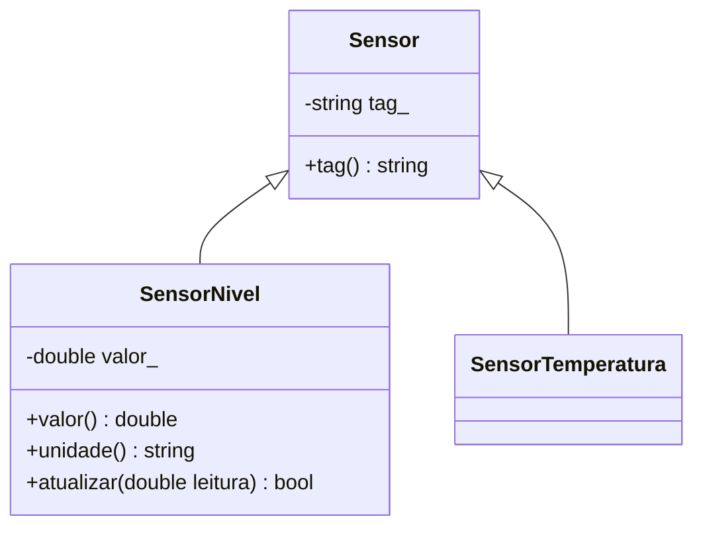

# Herança e especialização: uma base comum para sensores

## Objetivos de aprendizagem

- Distinguir generalização de composição e inicializar a parte comum de uma especialização.
- Preservar identidade e invariantes em sensores de nível e temperatura, em C++ e Python.
- Entregar uma hierarquia verificável em um novo fork, sem modificar as atividades já concluídas.

**Tempo estimado:** 2h de estudo e prática. O vídeo é preparação prévia; confira a distribuição entre sala e prática no [roteiro da trilha](../../index.md).

## Vídeo de contexto


Retome o vídeo de herança já utilizado no curso. Registre um exemplo de “é um” e um de “tem um”; só o primeiro justifica a especialização.

---

## 1. Mini-caso prático: especializar sem perder as regras

Na seção 06, objetos colaboraram por composição. Agora nível e temperatura precisam compartilhar a identificação, mas cada um mantém sua faixa: `0..100%` e `-40..125 C`. Uma bomba continua sendo colaboradora do controlador; não vira subclasse de sensor.

Esta seção inaugura um **novo recorte executável**. A demonstração de controlador da seção 06 e o starter de estação meteorológica não possuem os mesmos arquivos. Preserve seus forks anteriores; não procure neles uma etapa de herança que não foi distribuída.

Também vamos completar uma regra importante: proteger atualizações não basta se o construtor aceitar dados inválidos. O novo starter traz a validação de tag na classe-base e de faixa nos sensores, incluindo NaN/infinito. A prática exige encaminhar a tag recebida ao construtor da base, substituindo o marcador `PENDENTE`, e preservar essas validações. Isso completa a proteção sem alterar as seções já ministradas.

| Objeto | Estado inicial | Atualização aceita |
|---|---|---|
| `SensorNivel("LT-101")` | 50% | número finito em 0..100 |
| `SensorTemperatura("TT-201")` | 25 C | número finito em -40..125 |

---

## 2. Prepare o novo fork

Faça fork de [rafaelrezo/poo-fundamentos-estacao](https://github.com/rafaelrezo/poo-fundamentos-estacao). Substitua `SEU_USUARIO`:

```bash
git clone https://github.com/SEU_USUARIO/poo-fundamentos-estacao.git
cd poo-fundamentos-estacao
git remote -v
git switch -c pratica/07-heranca
make run
make test ETAPA=07
```

Use g++ com C++17, GNU Make e Python 3.10+. Mantenha apenas `origin` apontando para seu fork, sem `upstream`. A baseline compila; cada linguagem mostra `PENDENTE: 50 %` e `PENDENTE: 25 C`. O teste falha pedindo a identificação correta na classe-base.

Edite apenas `include/sensores.hpp` e `src/sensores.py` nesta etapa. Os outros módulos compiláveis serão completados nas seções posteriores.

---

## 3. Qual parte é realmente comum?

Generalização extrai uma característica comum; especialização acrescenta ou particulariza responsabilidades. A base guarda a tag uma única vez. Cada derivada guarda sua leitura e conhece sua faixa.



O triângulo aponta para `Sensor`. **Esta base ainda não é abstrata:** ela não declara operação virtual pura. Seu construtor protegido em C++ limita a criação direta pelo cliente, mas não a torna abstrata. Em Python usamos uma base comum, sem `ABC` neste estágio. A abstração formal será estudada depois.

### 3.1 Como representar a herança em UML

Leia a seta de baixo para cima: **SensorNivel é uma especialização de Sensor**. Em UML, essa relação chama-se **generalização**. A linha é contínua e o triângulo vazio aponta para a classe mais geral, `Sensor`. Não use losango nessa ligação: ele representaria uma relação todo–parte.

| Conceito no programa | Representação no diagrama | Como conferir |
|---|---|---|
| Classe-base `Sensor` | retângulo na ponta do triângulo | guarda a identificação compartilhada |
| Derivada `SensorNivel` | retângulo na outra extremidade | declara a base na definição da classe |
| Generalização/especialização | linha contínua com triângulo vazio | leia “SensorNivel é um Sensor” |
| Estado privado `tag_` | atributo com `-` | pertence à base; não é duplicado na derivada |
| Operação pública `tag()` | operação com `+` | pode ser usada pelo cliente das derivadas |
| Construtor protegido | visibilidade `#`, caso seja exibido | restringe acesso, mas não torna a classe abstrata |

O diagrama é uma vista resumida: omite construtores e parte das operações da temperatura para destacar a relação. Não é necessário repetir na derivada todas as operações herdadas.

**Aplique em `docs/diagrama.md`:** complete a caixa de `SensorTemperatura` com leitura, unidade e atualização, mantenha as duas setas apontando para `Sensor` e explique onde fica a tag. Não acrescente multiplicidades nas setas de herança; elas serão usadas nas associações.

**O que isso prepara?** A seta mostra a hierarquia, mas não prova que uma chamada C++ pelo tipo-base executa um método da derivada. Na seção 08, veremos o método virtual, a operação abstrata e o cliente dependente da base. A aula 12 reunirá essas notações na modelagem de um cenário completo.

**Checkpoint:** explique qual dado deve sair da derivada quando é centralizado na base. Duplicar `tag_` em cada filha esconde o benefício e pode gerar identificações inconsistentes.

---

## 4. Incremento guiado em C++: base, derivada e main

Leia o `main`: o nível usa a tag herdada e sua própria leitura. Depois localize `Sensor(tag)` no construtor da derivada: ele inicializa a parte-base antes do corpo da derivada. Na delegação da seção 05, o destino era outro construtor da mesma classe; aqui é o construtor da base.

O programa independente mostra somente o incremento de nível. [Baixe `exemplo_01_heranca.cpp`](exemplo_01_heranca.cpp) ou salve o bloco completo com esse nome.

```cpp
#include <iostream>
#include <cmath>
#include <stdexcept>
#include <string>
#include <utility>
class Sensor {
    std::string tag_;
protected:
    explicit Sensor(std::string tag) : tag_(std::move(tag)) {
        if (tag_.empty()) throw std::invalid_argument("tag vazia");
    }
public:
    const std::string& tag() const { return tag_; }
};
class SensorNivel : public Sensor {
    double valor_;
public:
    explicit SensorNivel(std::string tag, double valor = 50)
        : Sensor(tag), valor_(valor) {
        if (!std::isfinite(valor) || valor < 0 || valor > 100)
            throw std::invalid_argument("nivel fora da faixa");
    }
    double valor() const { return valor_; }
    std::string unidade() const { return "%"; }
    bool atualizar(double valor) {
        if (!std::isfinite(valor) || valor < 0 || valor > 100) return false;
        valor_ = valor;
        return true;
    }
};

int main() {
    SensorNivel nivel{"LT-101", 50};
    std::cout << nivel.tag() << ": " << nivel.valor() << ' ' << nivel.unidade() << '\n';
    nivel.atualizar(20);
    std::cout << nivel.tag() << ": " << nivel.valor() << ' ' << nivel.unidade() << '\n';
}
```

```bash
g++ -std=c++17 -Wall -Wextra -Werror -pedantic exemplo_01_heranca.cpp -o exemplo_01_heranca
./exemplo_01_heranca
```

Saída esperada:

```text
LT-101: 50 %
LT-101: 20 %
```

**Aplique no fork:** em `include/sensores.hpp`, encaminhe a tag ao construtor da base e complete a atualização de nível, conforme a classe completa acima. Preserve a base e a temperatura do starter. Construção inválida lança a exceção fornecida; atualização inválida retorna falso e preserva o estado.

---

## 5. Ponte C++ → Python: a mesma hierarquia executável

`super().__init__(tag)` inicializa a identificação pela base. A leitura continua na especialização. [Baixe `exemplo_02_heranca.py`](exemplo_02_heranca.py) ou salve o programa completo:

```python
from math import isfinite

class Sensor:
    def __init__(self, tag: str):
        if not tag:
            raise ValueError("tag vazia")
        self._tag = tag
    @property
    def tag(self):
        return self._tag

class SensorNivel(Sensor):
    def __init__(self, tag: str, valor: float = 50):
        super().__init__(tag)
        if not isfinite(valor) or not 0 <= valor <= 100:
            raise ValueError("nivel fora da faixa")
        self._valor = valor
    def valor(self):
        return self._valor
    def unidade(self):
        return "%"
    def atualizar(self, valor):
        if not isfinite(valor) or not 0 <= valor <= 100:
            return False
        self._valor = valor
        return True


def main():
    nivel = SensorNivel("LT-101", 50)
    print(f"{nivel.tag}: {nivel.valor()} {nivel.unidade()}")
    nivel.atualizar(20)
    print(f"{nivel.tag}: {nivel.valor()} {nivel.unidade()}")


if __name__ == "__main__":
    main()
```

```bash
python3 exemplo_02_heranca.py
```

A saída deve ser idêntica à do C++. No fork, adapte `SensorNivel` em `src/sensores.py`; preserve as outras classes. `private` e `protected` em C++ restringem acesso; o prefixo `_` em Python é uma convenção. Nas duas linguagens, respeite a API e as invariantes.

Execute `make run`: nível deve mostrar `LT-101`; temperatura permanece pendente até a extensão. Os programas demonstrativos não substituem o starter inteiro nem seus clientes.

---

## 6. Prática de adaptação e diagnóstico

Agora complete `SensorTemperatura` nas duas linguagens. Reutilize a inicialização da base e adapte a faixa, sem copiar a regra de nível sem pensar. Preveja as respostas para `-40`, `125`, `-41`, `126`, NaN e infinito.

| Caso | Resultado |
|---|---|
| atualizar para cada fronteira válida | verdadeiro, nova leitura |
| atualizar fora da faixa após uma leitura válida | falso, última leitura preservada |
| construir com tag vazia | erro da validação da base |
| construir com leitura inválida | erro da validação da especialização |

`make test ETAPA=07` deve terminar com `OK C++ etapa 07` e `OK Python etapa 07`. Se a tag ainda for `PENDENTE`, confira o inicializador; se uma rejeição apagar a leitura, valide antes de atribuir.

Não use herança apenas porque há código semelhante. Compare:

| Técnica/Padrão | Melhor uso | Esforço | Entregável | Limitação |
|---|---|---|---|---|
| Herança | especialização de um tipo | médio | base e derivadas coerentes | semelhança de atributos não prova substituição |
| Composição | um objeto coordena partes | médio | colaboradores com responsabilidades próprias | exige definir pertencimento e vida das partes |

Para sensores que especializam a identificação comum, a hierarquia faz sentido. Para controlador e bomba, preserve composição. O código desta seção ainda consulta tipos concretos; o despacho dinâmico é a próxima necessidade.

## 7. Validação e entrega

```bash
make test ETAPA=07
git add include/sensores.hpp src/sensores.py docs/decisoes.md docs/diagrama.md AI_LOG.md
git commit -m "conclui heranca com contratos cumulativos"
git push -u origin pratica/07-heranca
```

Faça um commit do incremento guiado e outro da extensão quando ambos forem verificáveis. Abra PR da branch para a `main` **do próprio fork**; confira a execução de `make test ETAPA=07` na CI correspondente ao commit. Integre após testes verdes e revisão. Não abra PR contra o repositório-base.

- [ ] O comando local repete e preserva as etapas anteriores deste starter.
- [ ] A extensão foi adaptada e os casos de fronteira foram explicados.
- [ ] `docs/decisoes.md` relaciona conceito, implementação e evidência.
- [ ] O diagrama corresponde ao estado atual do código.
- [ ] O PR inclui saída local e link da CI do commit.
- [ ] `AI_LOG.md` registra pedido, aceites/rejeições e justificativa, ou declara ausência de IA.

Na main, a CI verifica apenas a baseline executável do starter. A entrega precisa da evidência funcional da branch/PR. Testes visíveis não comprovam entendimento: o docente revisa o diff e, em avaliação, exige defesa oral curta.

Na [seção 08 — Polimorfismo](../07_polimorfismo/index.md), um cliente consultará diferentes sensores pelo mesmo contrato. Essa seção usa seu starter específico; guarde este fork para retomá-lo na seção 09.

## Perguntas de revisão rápida

1. Por que o controlador não deve herdar de sensor, embora o utilize?
2. Qual a diferença entre inicializar a base e delegar para outro construtor da mesma classe?
3. Por que um construtor protegido não torna a classe abstrata? Como confirmar no código atual?

## Fontes de referência

- [C++ — classes derivadas](https://eel.is/c++draft/class.derived)
- [C++ — inicialização da base](https://eel.is/c++draft/class.base.init)
- [Python — herança](https://docs.python.org/3/tutorial/classes.html#inheritance)
