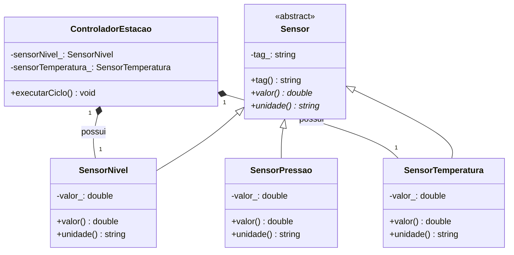

# Herança e especialização: ampliando os sensores do controlador

## Objetivos de aprendizagem

- Distinguir herança (“é um”) de composição (“tem um”) no mesmo domínio.
- Especializar um sensor sem duplicar sua identificação e contrato básico.
- Representar e implementar a decisão em UML, C++ e Python, com testes cumulativos.

**Tempo estimado:** 4h, em dois encontros de 2h.

## Vídeo de contexto


Durante o vídeo, anote exemplos de relação “é um” e “tem um”. A pergunta-guia é: a nova classe pode ser usada onde o tipo geral é esperado sem mudar o cliente?

---

## 1. De onde partimos? O controlador da aula 05

Na aula anterior, `ControladorNivel` **tem um** `SensorNivel` e **tem uma** `Bomba`. Essa composição continua sendo a arquitetura do sistema. Agora a estação precisa medir também temperatura e pressão, mantendo o controlador responsável pelo ciclo de vida dos sensores.

O problema observável é a duplicação: cada sensor teria tag, leitura e validação escritos de novo. A herança será usada somente para extrair o que todos os sensores realmente compartilham.

---

## 2. Composição e herança no mesmo diagrama

Leia o diagrama em duas direções:

- o losango preenchido (`*--`) significa composição: `ControladorEstacao` possui sensores;
- a seta com triângulo aberto (`<|--`) significa herança: `SensorNivel` **é um** `Sensor`;
- a herança não substitui a composição: o controlador continua sendo o objeto que reúne as partes.



!!! warning
    Reutilizar código não é critério suficiente para herdar. Se o objeto não puder ser tratado como o tipo-base, prefira composição. Nesta etapa, não há ainda coleção nem despacho dinâmico; esses assuntos ficam para a aula 07.

---

## 3. A ideia em C++: uma base pequena

```cpp
#include <string>

class Sensor {
    std::string tag_;
protected:
    explicit Sensor(std::string tag) : tag_(std::move(tag)) {}
public:
    const std::string& tag() const { return tag_; }
};

class SensorNivel : public Sensor {
    double valor_;
public:
    SensorNivel(std::string tag, double valor)
        : Sensor(std::move(tag)), valor_(valor) {}
    double valor() const { return valor_; }
    const char* unidade() const { return "%"; }
};

class SensorTemperatura : public Sensor {
    double valor_;
public:
    SensorTemperatura(std::string tag, double valor)
        : Sensor(std::move(tag)), valor_(valor) {}
    double valor() const { return valor_; }
    const char* unidade() const { return "C"; }
};
```

`public Sensor` expressa a relação “é um”. O construtor protegido garante que a base não seja criada isoladamente e centraliza a tag. Ainda chamamos cada tipo concreto diretamente; o despacho por uma referência `Sensor&` será introduzido na próxima aula.

### Checkpoint rápido

1. Qual parte do diagrama prova composição?
2. Por que `SensorTemperatura` pode receber a tag pelo construtor da base?
3. Que mudança no domínio faria a herança deixar de ser adequada?

---

## 4. Ponte C++ → Python

```python
from abc import ABC

class Sensor(ABC):
    def __init__(self, tag: str) -> None:
        self._tag = tag

    @property
    def tag(self) -> str:
        return self._tag


class SensorNivel(Sensor):
    def __init__(self, tag: str, valor: float) -> None:
        super().__init__(tag)
        self.valor = valor

    @property
    def unidade(self) -> str:
        return "%"
```

Python explicita a base entre parênteses e chama `super().__init__`. A ideia do modelo é a mesma; detalhes como `virtual`, `override` e destrutor virtual serão necessários quando houver polimorfismo dinâmico em C++.

---

## 5. Prática cumulativa: novos sensores na estação

Continue o repositório-base da aula 05 (faça fork, clone e mantenha apenas `origin`). Crie a branch `cap06-heranca-sensores`.

1. Preserve `ControladorNivel`, `SensorNivel` e `Bomba` funcionando; seus testes anteriores não podem regredir.
2. Extraia a classe `Sensor` com a tag comum e faça `SensorNivel` herdar dela.
3. Adicione `SensorTemperatura` (faixa `-40..125 °C`) e `SensorPressao` (faixa `0..10 bar`). Valores inválidos devem ser rejeitados sem alterar o último valor válido.
4. Atualize o controlador para **compor** um sensor de temperatura e um de pressão, sem fazer o controlador herdar de sensor.
5. Desenhe o UML equivalente e implemente a mesma extensão em Python.

Valide cada incremento com o mesmo contrato local:

```bash
make test ETAPA=06
git add .
git commit -m "especializa sensores da estação"
git push -u origin cap06-heranca-sensores
```

A CI deve executar `make test ETAPA=06` em todo push da branch. No pull request para a `main` do seu próprio fork, inclua o diagrama, saída dos testes, decisões técnicas e a trilha de uso de IA (pedido, aceites/rejeições e justificativas). Não abra PR contra o repositório-base.

### Critérios de aceite

- o controlador mantém composição explícita com os sensores;
- cada sensor deriva da base somente por relação “é um” válida;
- limites e unidades são testados em casos comuns, fronteiras e erros;
- testes da aula 05 continuam passando;
- UML, C++ e Python apresentam as mesmas relações.

---

## 6. Mini-caso e próxima necessidade

Uma estação agora reúne sensores de naturezas diferentes, mas o controlador ainda conhece cada classe concreta. Na próxima aula, um painel receberá qualquer `Sensor` por um contrato comum e exibirá cada resumo sem `if` por tipo: esse é o polimorfismo.

## Perguntas de revisão rápida

1. Onde o diagrama mostra composição e onde mostra herança?
2. Qual invariante pertence à base `Sensor` e quais pertencem às classes especializadas?
3. Por que a atividade exige preservar os testes da aula 05?

## Fontes de referência

- [cppreference — herança](https://en.cppreference.com/w/cpp/language/derived_class)
- [C++ Core Guidelines — hierarquias](https://isocpp.github.io/CppCoreGuidelines/CppCoreGuidelines#S-class)
- [Python Docs — herança](https://docs.python.org/3/tutorial/classes.html#inheritance)
- [Mermaid — diagrama de classes](https://mermaid.js.org/syntax/classDiagram.html)
