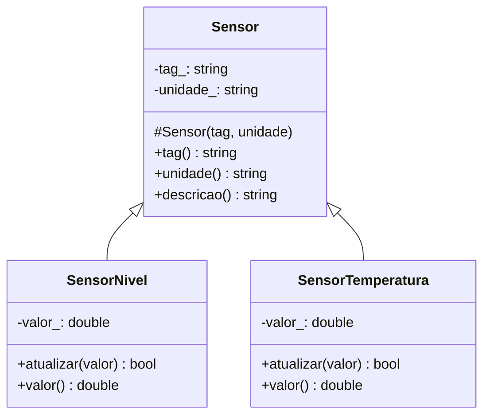

# Herança: especialização e contrato comum

## Objetivos de aprendizagem

- Reconhecer uma relação “é um tipo de” e distingui-la de “tem um”.
- Extrair estado e comportamento realmente comuns sem criar hierarquia artificial.
- Representar generalização em UML e implementar especializações em C++ e Python.

**Tempo estimado:** 4h, em dois encontros de 2h.

## Vídeo da aula


O vídeo público **Herança (Parte 1)**, do Curso em Vídeo, introduz em português generalização e especialização. A linguagem usada na demonstração é secundária; observe o conceito visual e depois acompanhe sua implementação em C++ e Python nesta aula. Herança será estudada como ferramenta de **modelagem de tipos**, não como atalho para copiar menos código. Polimorfismo dinâmico fica para a aula 07.

---

## 1. De onde partimos?

Na aula 05: `ControladorNivel tem um SensorNivel e tem uma Bomba`. Isso é composição. Agora dois sensores repetem identificação:

```cpp
class SensorNivel {
    std::string tag_;
    std::string unidade_{"%"};
    double valor_;
};

class SensorTemperatura {
    std::string tag_;
    std::string unidade_{"C"};
    double valor_;
};
```

Os sensores não são partes um do outro. Ambos são tipos específicos de sensor.

---

## 2. Qual problema apareceu?

Copiar identificação produz regras divergentes e correções repetidas. Antes de escolher herança, aplique o teste verbal:

| Frase | Resultado | Candidata |
|---|---|---|
| controlador **tem um** sensor | faz sentido | composição |
| sensor de nível **é um tipo de** sensor | faz sentido | herança |
| bomba **é um tipo de** controlador | não faz sentido | nenhuma herança |

O teste é um filtro. A confirmação mais forte é a substituição: tudo que a base promete precisa continuar verdadeiro na derivada. Essa regra será observada por chamadas à base na aula 07.

---

## 3. Qual ideia resolve? Generalização e especialização



O triângulo vazio aponta para a classe mais geral. Leia: `SensorNivel` **é um** `Sensor`.

### O que sobe para a base?

Pergunte se todos os derivados precisam da informação, se a regra significa o mesmo para todos e se a base preserva sua própria invariante. `tag` e `unidade` passam pelo teste. A faixa válida não: nível usa `0..100`, temperatura usa `-50..80`.

---

## 4. UML → C++ em dois incrementos

### 4.1 Classe-base

```cpp
#include <string>
#include <utility>

class Sensor {
    std::string tag_;
    std::string unidade_;
protected:
    Sensor(std::string tag, std::string unidade)
        : tag_(std::move(tag)), unidade_(std::move(unidade)) {}
public:
    const std::string& tag() const { return tag_; }
    const std::string& unidade() const { return unidade_; }
    std::string descricao() const { return tag_ + " [" + unidade_ + "]"; }
};
```

`protected` no construtor permite que derivadas inicializem a base, mas impede criar um sensor genérico na `main`. Os atributos continuam privados: a derivada usa a interface em vez de romper a base.

### 4.2 Especialização

```cpp
class SensorNivel : public Sensor {
    double valor_;
public:
    SensorNivel(std::string tag, double valorInicial)
        : Sensor(std::move(tag), "%"), valor_(valorInicial) {}

    bool atualizar(double valor) {
        if (valor < 0.0 || valor > 100.0) return false;
        valor_ = valor;
        return true;
    }
    double valor() const { return valor_; }
};
```

Ordem observável de construção: parte-base, membros da derivada, corpo do construtor. `public Sensor` mantém pública a interface pública da base.

### 4.3 Como confirmar

```cpp
#include <cassert>

int main() {
    SensorNivel nivel{"LT-101", 42.0};
    assert(nivel.tag() == "LT-101");       // herdado
    assert(nivel.unidade() == "%");        // herdado
    assert(nivel.valor() == 42.0);          // específico
    assert(!nivel.atualizar(120.0));
    assert(nivel.valor() == 42.0);
}
```

```bash
g++ -std=c++17 -Wall -Wextra -Wpedantic sensores.cpp -o sensores
./sensores
```

Saída esperada: nenhuma. Um `assert` interromperia a execução se o contrato falhasse.

---

## 5. Miniprojeto 1 guiado: família de sensores

Complete `SensorTemperatura` sem alterar `Sensor`.

| Classe | Unidade | Faixa válida | Comportamento herdado |
|---|---|---|---|
| `SensorNivel` | `%` | `0..100` | tag, unidade, descrição |
| `SensorTemperatura` | `C` | `-50..80` | tag, unidade, descrição |

### Passos cumulativos

1. Acrescente a classe ao UML.
2. Faça compilar antes da validação.
3. Adicione testes `-50`, `80`, `-51` e `81`.
4. Implemente o necessário.
5. Repita os testes de `SensorNivel` para detectar regressão.

| Erro | Observação | Correção conceitual |
|---|---|---|
| base não construída | erro de compilação | toda parte-base precisa ser inicializada |
| derivada acessa `tag_` | privado inacessível | use `tag()` |
| faixa está em `Sensor` | base conhece regra específica | valide na derivada |
| UML sem generalização | desenho diverge | use `Base <|-- Derivada` |

---

## 6. Ponte C++ → Python

```python
class Sensor:
    def __init__(self, tag: str, unidade: str) -> None:
        self._tag = tag
        self._unidade = unidade

    @property
    def tag(self) -> str:
        return self._tag

    def descricao(self) -> str:
        return f"{self._tag} [{self._unidade}]"


class SensorNivel(Sensor):
    def __init__(self, tag: str, valor: float) -> None:
        super().__init__(tag, "%")
        self._valor = valor

    def atualizar(self, valor: float) -> bool:
        if not 0.0 <= valor <= 100.0:
            return False
        self._valor = valor
        return True
```

| Conceito | C++ | Python |
|---|---|---|
| derivação | `class D : public B` | `class D(B)` |
| construir base | lista `B(...)` | `super().__init__(...)` |
| privacidade | compilador | convenção `_` |
| UML | triângulo para a base | mesmo símbolo |

Fixe o conceito comum: a derivada contém uma parte-base inicializada antes do estado específico.

---

## 7. Quando não usar herança

| Técnica/Padrão | Melhor uso | Esforço | Entregável | Limitação |
|---|---|---:|---|---|
| classe independente | conceito sem relação de tipo | baixo | implementação isolada | repetição pode ser legítima |
| composição | relação “tem um” | médio | objeto com partes | não cria substituição |
| herança pública | relação “é um” e contrato preservado | médio/alto | família de tipos | acopla base e derivadas |
| função auxiliar | cálculo comum sem identidade | baixo | função reutilizável | não modela entidade |

`Controlador` compõe sensores; `SensorNivel` herda de `Sensor`; conversão de unidade pode permanecer função.

---

## 8. Miniprojeto 2: equipamentos industriais

Modele `Equipamento` e as especializações `Motor` e `Valvula`.

- `Equipamento`: código e setor consultáveis;
- `Motor`: rotação `0..3600 RPM`;
- `Valvula`: abertura `0..100%`;
- cada derivada preserva sua invariante;
- UML vem antes do código e é revisado após os testes.

Decisão obrigatória: `ligado` deve subir para `Equipamento`? Escreva o contrato e verifique se desligado significa a mesma coisa para todos. Essa decisão evita mera cópia do exemplo.

Evidências: testes comuns, fronteiras e rejeições; diff do UML; justificativa do que ficou na base.

---

## 9. Prática profissional

```bash
git switch -c cap06-heranca
make test ETAPA=06
git add .
git commit -m "modela familia de sensores por heranca"
git push -u origin cap06-heranca
```

A CI repete `make test ETAPA=06`. O PR inclui UML, validações, decisão de modelagem e rastreabilidade de IA. Na defesa oral, explique a direção do triângulo e a ordem base→derivada.

---

## 10. Limite atual

Ainda usamos diretamente `SensorNivel` ou `SensorTemperatura`. Herança organizou a família, mas o cliente não opera por `Sensor`. Na aula 07 perguntaremos: **como uma chamada pelo tipo-base executa respostas diferentes conforme o objeto concreto?** Só então entram `virtual`, `override`, classe abstrata e despacho dinâmico.

---

## Perguntas de revisão rápida

1. Que evidência justifica dizer que `SensorNivel` é um `Sensor`?
2. Por que a faixa não foi colocada na base?
3. Para onde aponta o triângulo vazio no UML?

## Fontes de referência

- [cppreference — classes derivadas](https://en.cppreference.com/w/cpp/language/derived_class.html)
- [C++ Core Guidelines — hierarquias](https://isocpp.github.io/CppCoreGuidelines/CppCoreGuidelines#S-class)
- [Python Docs — herança](https://docs.python.org/3/tutorial/classes.html#inheritance)
- [Mermaid — diagrama de classes](https://mermaid.js.org/syntax/classDiagram.html)
