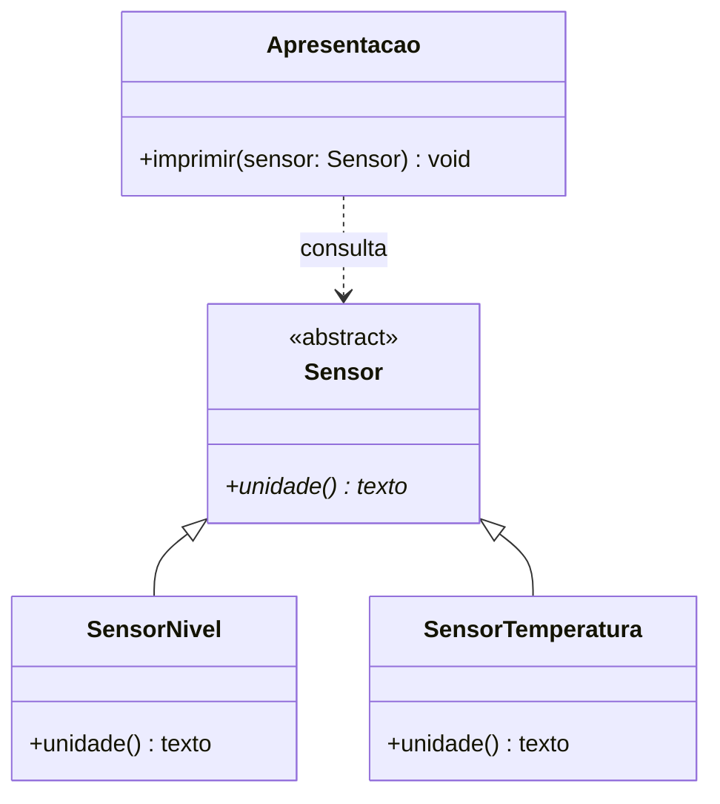
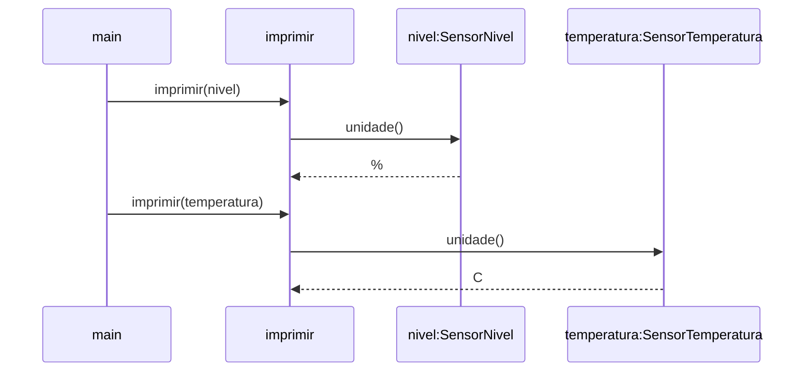

# Polimorfismo e contratos: a mesma pergunta, respostas diferentes

## Objetivos de aprendizagem

- Explicar por que uma chamada pelo tipo-base pode executar o comportamento do objeto concreto.
- Distinguir herança, sobrescrita e despacho dinâmico, relacionando C++ e Python.
- Reconhecer o contrato de um sensor e aplicá-lo em um painel com implementações diferentes.

**Tempo estimado:** 4h de estudo e prática: aproximadamente 2h de exposição dialogada e 2h para a atividade guiada da seção 8, distribuíveis entre sala e trabalho orientado conforme o [planejamento da turma](../../index.md). A exposição não exige configurar ferramentas ou abrir um repositório.

## Vídeo de contexto


UNIVESP — Herança e Polimorfismo, Parte I. Material complementar para retomar a relação entre classe-base e especializações.

---

## 1. Herdar o tipo não resolve toda chamada

Na aula anterior, nível e temperatura passaram a ser especializações de sensor. O programa pode reconhecer ambos pelo tipo mais geral, `Sensor`. Mas cada um ainda precisa responder de sua própria maneira: a unidade do nível é `%`; a da temperatura é `C`.

A mesma função de apresentação deveria servir para os dois sensores.

- **Tipo comum:** `Sensor` representa o que a função precisa conhecer.
- **Comportamento específico:** cada especialização responde com sua unidade.
- **Criação:** o `main` escolhe quais objetos concretos construir.
- **Consulta:** a apresentação usa as operações do objeto recebido.

A dificuldade aparece quando o C++ precisa decidir **qual implementação de `unidade()` chamar**. Vamos acompanhar essa decisão primeiro com um único sensor. Os programas são completos; cada versão destaca apenas a mudança necessária para o próximo passo.

## 2. O mesmo objeto, dois caminhos de chamada

No programa abaixo, as duas chamadas usam o mesmo objeto `nivel`. A primeira está diretamente no `main`; a segunda passa pela função `imprimir`, cujo parâmetro é uma referência à base.

```cpp
#include <iostream>

class Sensor {
public:
    const char* unidade() const { return "generica"; }
};

class SensorNivel : public Sensor {
public:
    const char* unidade() const { return "%"; }
};

void imprimir(const Sensor& sensor) {
    std::cout << sensor.unidade() << '\n';
}

int main() {
    SensorNivel nivel;
    std::cout << nivel.unidade() << '\n';
    imprimir(nivel);
}
```

Resultado:

```text
%
generica
```

**Leitura das duas linhas:**

- **Chamada direta:** usa `SensorNivel::unidade()` e mostra `%`.
- **Chamada pela base:** o parâmetro é `Sensor&`; o método não virtual usa `Sensor::unidade()` e mostra `generica`.
- **Mesmo objeto:** não houve cópia nem mudança de classe.
- **Limitação observada:** herdar o tipo não basta para obter despacho dinâmico nessa chamada.

## 3. Virtual: deixar a chamada acompanhar o objeto

A função de apresentação e o `main` continuam iguais. Agora a operação da base é `virtual`, e a derivada declara `override` para o compilador conferir sua correspondência.

```cpp
#include <iostream>

class Sensor {
public:
    virtual ~Sensor() = default;
    virtual const char* unidade() const { return "generica"; }
};

class SensorNivel : public Sensor {
public:
    const char* unidade() const override { return "%"; }
};

void imprimir(const Sensor& sensor) {
    std::cout << sensor.unidade() << '\n';
}

int main() {
    SensorNivel nivel;
    std::cout << nivel.unidade() << '\n';
    imprimir(nivel);
}
```

Resultado:

```text
%
%
```

A referência continua declarada como `Sensor&`, mas a chamada virtual alcança o comportamento de `SensorNivel`. Essa seleção durante a chamada é o **despacho dinâmico**.

**Conceitos-chave da chamada:**

- **Tipo estático:** o parâmetro é declarado como referência a `Sensor`.
- **Tipo dinâmico:** o objeto alcançado é um `SensorNivel`.
- **Sobrescrita:** a derivada fornece uma implementação da operação virtual.
- **Despacho dinâmico:** a chamada pela base seleciona a implementação do objeto recebido.

- **`virtual`:** permite o despacho dinâmico pela base.
- **`override`:** pede ao compilador que confira a correspondência da sobrescrita.
- **`const` ao final:** mantém a consulta sem modificar o objeto por esse método.
- **Erro detectável:** retirar o `const` da derivada quebra a correspondência; com `override`, o compilador rejeita a declaração.

O destrutor virtual prepara a destruição correta de derivados pela base. Ele não é responsável pelo resultado da consulta; aqui todos os objetos são locais. A regra de seleção das chamadas é definida nas [funções virtuais do C++](https://eel.is/c++draft/class.virtual).

## 4. Uma segunda implementação, sem uma segunda função de impressão

Com o mecanismo estabelecido, acrescentamos temperatura. A função `imprimir` permanece idêntica. Cada especialização fornece sua unidade.

A resposta `generica` deixa de ter utilidade: todo sensor concreto precisa definir uma unidade.

- **Operação virtual pura:** `= 0` exige uma implementação concreta na hierarquia.
- **Base abstrata:** descreve a operação comum e não pode ser instanciada diretamente.
- **Classe concreta:** fornece as operações necessárias para criar seus objetos.
- **Cliente estável:** `imprimir` continua usando a mesma chamada.

```cpp
#include <iostream>

class Sensor {
public:
    virtual ~Sensor() = default;
    virtual const char* unidade() const = 0;
};

class SensorNivel : public Sensor {
public:
    const char* unidade() const override { return "%"; }
};

class SensorTemperatura : public Sensor {
public:
    const char* unidade() const override { return "C"; }
};

void imprimir(const Sensor& sensor) {
    std::cout << sensor.unidade() << '\n';
}

int main() {
    SensorNivel nivel;
    SensorTemperatura temperatura;
    imprimir(nivel);
    imprimir(temperatura);
}
```

Resultado:

```text
%
C
```

**Distribuição de responsabilidades:**

- **`main`:** conhece os tipos concretos e cria os objetos.
- **`imprimir`:** conhece a operação comum, sem selecionar classes.
- **Nova especialização:** participa da mesma chamada ao cumprir o contrato.

`const char*` representa aqui o texto literal da unidade; seu gerenciamento não é o foco do exemplo. As operações da prática usam `std::string`, já fornecida no projeto.

### 4.1 Polimorfismo e sobrecarga: qual é a diferença?

- **Sobrecarga:** mesmo nome, **parâmetros diferentes**. O compilador escolhe a assinatura compatível com a chamada; não exige herança.
- **Polimorfismo dinâmico:** mesma operação virtual, **objetos concretos diferentes**. A chamada pela base alcança a implementação do objeto recebido.
- **Sobrescrita:** a derivada implementa a operação virtual da base; `override` permite conferir essa correspondência no C++.

Este programa independente mostra apenas **sobrecarga**. [Arquivo completo](exemplo_12_sobrecarga.cpp).

```cpp
#include <iostream>

void imprimir(int valor) {
    std::cout << "inteiro: " << valor << '\n';
}

void imprimir(double valor) {
    std::cout << "real: " << valor << '\n';
}

int main() {
    imprimir(15);
    imprimir(15.5);
}
```

Saída: `inteiro: 15` e `real: 15.5`. Há duas funções; a escolha ocorre na compilação pelos tipos dos argumentos.

**Compare com o programa dos sensores acima:** existe uma única função `imprimir(const Sensor&)`. Dentro dela, `sensor.unidade()` usa despacho dinâmico: nível responde `%`, temperatura responde `C`.

**Para lembrar:** sobrecarga escolhe **qual assinatura chamar**; despacho dinâmico escolhe **qual implementação da operação virtual executar**. Alguns materiais chamam sobrecarga de *polimorfismo estático*; nesta aula, “polimorfismo” se refere ao mecanismo dinâmico de subtipos.


## 5. Um contrato diz mais que o nome do método

Até aqui, a operação apenas devolvia uma unidade. Quando um sensor também recebe leituras, duas classes podem oferecer os mesmos métodos e ainda assim se comportar de maneiras incompatíveis.

Imagine que o cliente recebeu a promessa: uma atualização inválida será rejeitada e manterá a última leitura aceita. Ele pode continuar apresentando essa leitura após uma rejeição. Uma implementação que devolve falso, mas apaga o valor antigo, quebra a promessa.

Este recorte completo mostra somente a regra de atualização de nível, já conhecida. A hierarquia fica fora da figura por um momento para observarmos o comportamento que qualquer implementação deverá respeitar.

```cpp
#include <cmath>
#include <iostream>

class SensorNivel {
    double valor_ = 50;
public:
    double valor() const { return valor_; }

    bool atualizar(double leitura) {
        if (!std::isfinite(leitura) || leitura < 0 || leitura > 100) return false;
        valor_ = leitura;
        return true;
    }
};

int main() {
    SensorNivel nivel;
    const bool aceita = nivel.atualizar(15);
    std::cout << std::boolalpha << aceita << " | " << nivel.valor() << '\n';
    const bool segundaAceita = nivel.atualizar(120);
    std::cout << segundaAceita << " | " << nivel.valor() << '\n';
}
```

Resultado:

```text
true | 15
false | 15
```

O pedido de 15 foi aceito. O pedido de 120 foi rejeitado, e a leitura continuou 15. Esse último resultado é parte do contrato, mesmo sem aparecer no nome `atualizar`.

| Operação | O que o cliente pode esperar |
|---|---|
| Consultar valor e unidade | obter a última leitura válida e sua unidade, sem alterar estado |
| Atualizar com valor permitido | receber verdadeiro e encontrar o novo valor armazenado |
| Atualizar com valor inválido | receber falso e continuar encontrando o valor anterior |
| Consultar alerta | obter uma decisão conforme a regra do sensor, sem modificar a leitura |

**Garantias para a substituição:**

- **Faixas específicas:** nível e temperatura podem aceitar intervalos diferentes.
- **Aceitação:** cada implementação respeita a faixa que declara.
- **Rejeição:** o retorno falso preserva o último estado válido.
- **Substituição coerente:** o cliente continua podendo confiar nessas promessas.
- **Limite da assinatura:** declarar os mesmos métodos não comprova o comportamento.

## 6. Python: preservar a ideia, mudar o mecanismo da linguagem

Voltamos à mesma pergunta sobre a unidade. O exemplo Python corresponde ao programa da seção 4: duas implementações, um contrato e a função comum. Não é necessário introduzir outro cenário.

`ABC` vem do módulo padrão `abc` e permite declarar `Sensor` como **classe-base abstrata**. `@abstractmethod` marca `unidade()` como uma operação que uma subclasse concreta precisa implementar. Por isso `SensorNivel()` e `SensorTemperatura()` podem ser criados, mas `Sensor()` — ou uma subclasse que não implemente `unidade()` — provoca `TypeError` na instanciação. O `raise NotImplementedError` é apenas o corpo de reserva do método; sozinho, ele **não** torna a classe abstrata. Leia a [documentação oficial do módulo `abc`](https://docs.python.org/3/library/abc.html) para mais detalhes.

Comece a leitura por `main`: dois objetos concretos entram na mesma função `imprimir`, e cada chamada a `sensor.unidade()` chega à implementação do objeto recebido.

Programa completo: [exemplo_11_despacho_python.py](exemplo_11_despacho_python.py).

```python
from abc import ABC, abstractmethod  # Ferramentas para declarar uma classe abstrata.


class Sensor(ABC):  # Base comum; nao criaremos Sensor diretamente.
    @abstractmethod  # Obriga cada classe concreta a implementar unidade().
    def unidade(self):
        raise NotImplementedError  # Corpo de reserva; as derivadas abaixo o substituem.


class SensorNivel(Sensor):
    def unidade(self):
        return "%"


class SensorTemperatura(Sensor):
    def unidade(self):
        return "C"


def imprimir(sensor: Sensor):  # O cliente conhece o contrato, nao a classe concreta.
    print(sensor.unidade())  # A implementacao vem do objeto recebido.


def main():
    nivel = SensorNivel()
    temperatura = SensorTemperatura()
    imprimir(nivel)  # Chama SensorNivel.unidade().
    imprimir(temperatura)  # Chama SensorTemperatura.unidade().


if __name__ == "__main__":
    main()
```

Execute `python3 exemplo_11_despacho_python.py`.

Resultado:

```text
%
C
```

**O mesmo conceito em Python:**

- **Despacho:** Python encontra o método no objeto recebido; não usa `virtual`.
- **`ABC` e `@abstractmethod`:** tornam verificável, na instanciação, a obrigação de implementar `unidade()` nas subclasses concretas.
- **Anotação `sensor: Sensor`:** comunica a intenção, sem verificar o tipo em execução.
- **Contrato comportamental:** a abstração não comprova que a unidade devolvida está correta.

As regras observáveis continuam dependendo da implementação e de sua verificação. [Python — classes abstratas](https://docs.python.org/3/library/abc.html).

## 7. Representar e distinguir os conceitos

O diagrama de classes representa a estrutura do exemplo das unidades. O triângulo vazio aponta para a base; a dependência do cliente aponta para o tipo que ele precisa conhecer.



**Chaves de leitura da UML:**

- **Triângulo vazio:** aponta da especialização para a classe-base.
- **Dependência tracejada:** o cliente conhece o tipo `Sensor`.
- **Operação abstrata:** o asterisco é a sintaxe Mermaid; nas derivadas, a operação é concreta.
- **`Apresentacao`:** nomeia a responsabilidade da função livre; não exige uma classe adicional no código.
- **Polimorfismo:** não possui uma seta própria; aparece na combinação de tipos, contrato e chamadas.

A sequência abaixo mostra quais objetos respondem às chamadas.



| Técnica/Padrão | Melhor uso | Esforço | Entregável | Limitação |
|---|---|---|---|---|
| Herança | representar especialização de um tipo | médio | base e derivadas | não garante despacho dinâmico em toda chamada C++ |
| Sobrecarga | oferecer assinaturas diferentes | baixo a médio | alternativas de chamada | não é o mecanismo virtual estudado aqui |
| Polimorfismo por interface comum | consultar implementações substituíveis | médio | cliente dependente do contrato | assinaturas não provam comportamento |

Para apresentar sensores variados, a interface comum permite manter o cliente estável. Para oferecer diferentes formas de criação, o problema é de construtores e sobrecarga. A abstração formal e a colaboração entre objetos serão aprofundadas no capítulo 09; UML 12 reúne as relações em um cenário completo.

## 8. Prática guiada: um painel para a estação

Nesta atividade, os conceitos anteriores se encontram **em um único exemplo**: um painel que consulta sensores e mostra leitura, unidade e alerta. O mesmo programa evolui em dois incrementos: nível/temperatura primeiro; pressão depois, para comprovar que o cliente permanece estável.

### 8.1 Preparação e primeiro resultado

Use o [repositório-base público de Polimorfismo e Contratos](https://github.com/rafaelrezo/poo-polimorfismo-contratos). Faça fork e clone o próprio fork. Requisitos: GNU Make, g++ com C++17 e Python 3.10 ou superior, sem pacotes extras. Substitua `SEU_USUARIO`:

```bash
git clone https://github.com/SEU_USUARIO/poo-polimorfismo-contratos.git
cd poo-polimorfismo-contratos
git remote -v
git switch -c pratica/01-painel
make run
```

Mantenha apenas `origin` apontando ao próprio fork; não configure `upstream`. O starter retoma sensores com tag e validação, mas é separado do fork de Herança 07. Guarde aquele fork para o capítulo 09.

Cada linguagem mostra inicialmente:

```text
LT-101: PENDENTE
TT-201: PENDENTE
PT-301: PENDENTE
```

O programa executa, mas o painel e algumas operações estão incompletos. A mensagem serve para localizar o comportamento a implementar.

### 8.2 Ler o contrato antes de completar o painel

| Sensor | Inicial | Faixa válida inclusiva | Unidade | Alerta |
|---|---:|---|---|---|
| Nível | 50 | 0..100 | % | leitura < 20 |
| Temperatura | 25 | -40..125 | C | leitura > 45 |
| Pressão | 1 | 0..10 | bar | leitura > 8 |

**Contrato que o professor deve destacar:**

- **Identificação:** o chamador fornece uma tag não vazia.
- **Validação:** fora da faixa, NaN ou infinito retorna falso e preserva a leitura.
- **Consulta:** não altera o estado do sensor.
- **Alerta:** é decidido pela implementação concreta.
- **Painel:** formata `TAG: VALOR UNIDADE | ESTADO`, com uma casa decimal e `OK` ou `ALERTA`, sem selecionar classes.
- **Escopo:** limites didáticos; tipos não numéricos em Python ficam fora desta atividade.

### 8.3 Primeiro incremento: o mesmo cliente recebe nível e temperatura

O código completo de referência deste incremento reúne classe-base, as duas especializações, a função de painel e o main. Ele retoma os pequenos exemplos da exposição e acrescenta o estado validado e a apresentação exigidos pelo contrato:

- [Programa completo C++: painel com nível e temperatura](exemplo_03_painel.cpp).
- [Programa completo Python: o mesmo painel](exemplo_04_painel.py).

Esses arquivos são referências para a atividade; no fork, mantenha a organização já fornecida. Leia cada programa começando pelo main, siga a chamada do painel e localize a regra que responde.

| Arquivo do fork | Alteração guiada | Como observar |
|---|---|---|
| `include/sensores.hpp` | completar alerta de nível e temperatura | comparar a leitura com 20 e 45, respectivamente |
| `src/sensores.py` | implementar as mesmas regras | respostas iguais às do C++ |
| `src/painel.cpp` | adaptar `linhaPainel` do programa completo | consultar somente o contrato Sensor |
| `src/painel.py` | adaptar `linha_painel` do programa completo | apresentar as mesmas linhas |
| `src/main.cpp` e `src/main.py` | observar os clientes fornecidos | ambos atualizam nível e temperatura para 15 |

`ostringstream`, `fixed` e `setprecision(1)` no C++ apenas montam a saída; não decidem alerta. No Python, a interpolação com `.1f` desempenha esse papel. A formatação aparece agora porque o painel precisa entregar uma linha definida pelo contrato.

```bash
make run
make test ETAPA=01
```

As duas primeiras linhas de cada implementação devem ser:

```text
LT-101: 15.0 % | ALERTA
TT-201: 15.0 C | OK
```

A etapa 01 verifica o painel, fronteiras e rejeições, inclusive com um sensor de teste desconhecido do cliente. Pressão continua reservada ao incremento seguinte. Se apenas uma linguagem estiver concluída, o teste da outra ainda falha.

Registre uma explicação curta: por que 15 provoca alerta em um tipo e não no outro? Faça commit e push:

```bash
git add include/sensores.hpp src/sensores.py src/painel.cpp src/painel.py AI_LOG.md
git commit -m "implementa painel polimorfico em C++ e Python"
git push -u origin pratica/01-painel
```

Abra PR da branch para a `main` do próprio fork. Confira a CI do commit e integre quando os testes das duas linguagens estiverem verdes.

### 8.4 Segundo incremento do mesmo painel: uma nova implementação

A pressão entra para verificar a promessa central: o painel não precisa mudar quando recebe outra implementação válida.

```bash
git switch main
git pull --ff-only origin main
git switch -c pratica/02-pressao
```

Complete atualização e alerta de `SensorPressao` em C++ e Python, adaptando as validações já vistas: aceite somente valores finitos entre 0 e 10 e alerte acima de 8. Mantenha as funções do painel sem alteração.

**Casos para acompanhar durante a prática:**

- **Ordem das operações:** validar antes de guardar.
- **Pressão 8,5:** aceita e ativa o alerta.
- **Tentativa seguinte de 11:** retorna falso, preserva 8,5 e mantém o alerta.
- **Pressão 8:** aceita, sem alerta; a condição é estritamente maior que 8.

Esses casos distinguem a assinatura correta do contrato realmente cumprido.

```bash
make test ETAPA=02
make run
```

A etapa 02 repete os testes anteriores e acrescenta pressão. Saída final de cada linguagem:

```text
LT-101: 15.0 % | ALERTA
TT-201: 15.0 C | OK
PT-301: 8.5 bar | ALERTA
```

Atualize `docs/diagrama.md`: represente a base abstrata, as três especializações e a dependência do painel pelo contrato. A base deste starter 08 é abstrata; a base com tag do starter 07 não era. O diagrama deve corresponder aos arquivos deste exercício.

```bash
git add include/sensores.hpp src/sensores.py docs/diagrama.md AI_LOG.md
git commit -m "integra pressao preservando contrato e painel"
git push -u origin pratica/02-pressao
```

Abra PR para a main do próprio fork e integre após revisão e CI verde. Não envie PR ao repositório-base. Os dois incrementos pertencem ao mesmo exemplo e mantêm testes cumulativos.

### 8.5 Diagnóstico e evidências

| Resultado observado | O que conferir |
|---|---|
| Chamada usa a resposta da base | declaração virtual e assinatura da sobrescrita |
| Erro em override | nome, parâmetros e const correspondentes ao contrato |
| Leitura muda após rejeição | validação deve ocorrer antes da atribuição |
| Pressão 8 provoca alerta | condição é estritamente maior que 8 |
| Uma linguagem passa e a outra falha | mesmo incremento precisa existir nas duas |
| CI rejeita branch | usar os nomes exatos dos dois incrementos |

Cada PR inclui saída local, link da CI do commit e explicação da alteração. `AI_LOG.md` registra pedidos, aceites/rejeições e justificativa, ou declara ausência de IA. Na main, o workflow verifica apenas o baseline executável; a evidência funcional está na branch/PR. Testes visíveis precisam ser acompanhados de inspeção do diff e, em avaliação, defesa oral curta.

A conclusão da prática é observável: três implementações atendem ao mesmo cliente, as rejeições preservam estado e a extensão não acrescentou seleção de classes ao painel.

## Perguntas de revisão rápida

1. Por que o mesmo objeto imprime uma unidade diferente ao passar por uma referência à base no primeiro programa? O que virtual muda?
2. Como acrescentar uma implementação pode preservar a função de apresentação? Que parte do código ainda conhece os tipos concretos?
3. Por que retornar falso depois de apagar a última leitura viola o contrato, mesmo com todos os métodos declarados?

## Fontes de referência

- [C++ — funções virtuais](https://eel.is/c++draft/class.virtual).
- [C++ — classes abstratas](https://eel.is/c++draft/class.abstract).
- [C++ Core Guidelines — classes e hierarquias](https://isocpp.github.io/CppCoreGuidelines/CppCoreGuidelines#S-class).
- [Python — classes abstratas](https://docs.python.org/3/library/abc.html).
- [Python — herança](https://docs.python.org/3/tutorial/classes.html#inheritance).
- [Liskov e Wing — A Behavioral Notion of Subtyping](https://www.cs.cmu.edu/~wing/publications/LiskovWing94.pdf).
- [GitHub — pull requests a partir de forks](https://docs.github.com/en/pull-requests/how-tos/create-pull-requests/creating-a-pull-request-from-a-fork).
