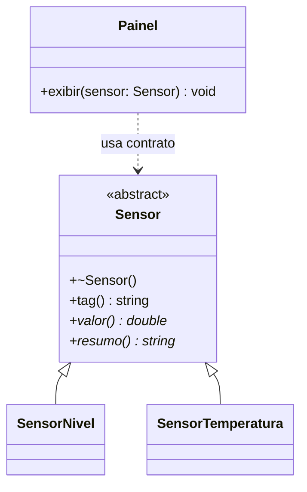

# Polimorfismo: um contrato, respostas diferentes

## Objetivos de aprendizagem

- Explicar polimorfismo dinâmico como substituição por uma interface comum.
- Usar `virtual`, função virtual pura, destrutor virtual e `override` em C++.
- Conectar o contrato UML ao despacho em C++ e ao equivalente em Python.

**Tempo estimado:** 4h, em dois encontros de 2h.

## Vídeo da aula


Procure a diferença entre **sobrescrita** e **chamada polimórfica**. Métodos com o mesmo nome não bastam: o ganho aparece quando o cliente conhece apenas o contrato.

---

## 1. De onde partimos?

Na aula 06 criamos `Sensor`, `SensorNivel` e `SensorTemperatura`, mas o cliente ainda depende dos concretos:

```cpp
void mostrarNivel(const SensorNivel& sensor);
void mostrarTemperatura(const SensorTemperatura& sensor);
```

Adicionar `SensorPressao` exigiria outra função. A hierarquia existe, porém o cliente não usa o contrato comum.

---

## 2. Qual problema apareceu?

Uma solução frágil identifica manualmente o tipo:

```cpp
if (tipo == "nivel") { /* formata nível */ }
else if (tipo == "temperatura") { /* formata temperatura */ }
```

Cada novo sensor amplia o `if`. Queremos que o cliente chame `resumo()` pelo contrato `Sensor` e que o objeto concreto escolha a resposta.

---

## 3. Qual ideia resolve? Substituição e despacho

Polimorfismo dinâmico combina contrato comum, implementações diferentes e chamada por referência ou ponteiro para a base.



`<<abstract>>` indica tipo incompleto. O asterisco é a legenda local para operação abstrata.

| Termo | Pergunta | Momento |
|---|---|---|
| sobrecarga | qual assinatura? | compilação |
| sobrescrita | qual operação foi redefinida? | definição |
| despacho dinâmico | qual implementação real? | execução |
| polimorfismo | tipos diferentes cabem no mesmo contrato? | projeto/execução |

---

## 4. Experimento: uma mudança por vez

### Sem `virtual`

```cpp
#include <iostream>

class Sensor { public: const char* tipo() const { return "generico"; } };
class SensorNivel : public Sensor {
public: const char* tipo() const { return "nivel"; }
};
void imprimir(const Sensor& sensor) { std::cout << sensor.tipo() << '\n'; }
int main() { SensorNivel sensor; imprimir(sensor); }
```

Saída: `generico`. O parâmetro é `Sensor&` e não há despacho dinâmico.

Altere somente as assinaturas:

```cpp
virtual const char* tipo() const { return "generico"; }
// na derivada:
const char* tipo() const override { return "nivel"; }
```

Nova saída: `nivel`. `virtual` ativa o despacho; `override` pede ao compilador que confira a sobrescrita.

---

## 5. Contrato abstrato em C++

```cpp
#include <string>
#include <utility>

class Sensor {
    std::string tag_;
protected:
    explicit Sensor(std::string tag) : tag_(std::move(tag)) {}
public:
    virtual ~Sensor() = default;
    const std::string& tag() const { return tag_; }
    virtual double valor() const = 0;
    virtual std::string tipo() const = 0;
    virtual std::string resumo() const = 0;
};
```

- `virtual ... = 0` declara função virtual pura;
- uma classe com função pura é abstrata;
- o destrutor virtual permite destruir corretamente pela base;
- `tag()` permanece comum porque não varia.

```cpp
class SensorNivel : public Sensor {
    double valor_;
public:
    SensorNivel(std::string tag, double valor)
        : Sensor(std::move(tag)), valor_(valor) {}
    double valor() const override { return valor_; }
    std::string tipo() const override { return "nivel"; }
    std::string resumo() const override {
        return tag() + ": " + std::to_string(valor_) + "%";
    }
};

class SensorTemperatura : public Sensor {
    double valor_;
public:
    SensorTemperatura(std::string tag, double valor)
        : Sensor(std::move(tag)), valor_(valor) {}
    double valor() const override { return valor_; }
    std::string tipo() const override { return "temperatura"; }
    std::string resumo() const override {
        return tag() + ": " + std::to_string(valor_) + " C";
    }
};
```

### Onde ocorre o polimorfismo

```cpp
#include <iostream>

void exibirNoPainel(const Sensor& sensor) {
    std::cout << sensor.resumo() << '\n';
}

int main() {
    SensorNivel nivel{"LT-101", 42.0};
    SensorTemperatura temperatura{"TT-201", 27.5};
    exibirNoPainel(nivel);
    exibirNoPainel(temperatura);
}
```

Uma função e um tipo de parâmetro executam duas implementações. Esse é o ponto central da defesa oral.

---

## 6. Miniprojeto 1 guiado: painel polimórfico

```cpp
#include <cassert>

void verificarContrato(const Sensor& sensor,
                       const std::string& tipoEsperado) {
    assert(sensor.tipo() == tipoEsperado);
    assert(!sensor.resumo().empty());
}

int main() {
    SensorNivel nivel{"LT-101", 42.0};
    SensorTemperatura temperatura{"TT-201", 27.5};
    verificarContrato(nivel, "nivel");
    verificarContrato(temperatura, "temperatura");
}
```

O teste não pergunta qual é a classe concreta. Ele verifica a promessa do contrato.

### Checkpoint UML ↔ código

- `<<abstract>>` corresponde a operação pura?
- operações abstratas têm `override` nas derivadas?
- `Painel` depende de `Sensor`, não dos concretos?
- o teste recebe `const Sensor&`?

---

## 7. Ponte C++ → Python

```python
from abc import ABC, abstractmethod

class Sensor(ABC):
    def __init__(self, tag: str) -> None:
        self._tag = tag

    @property
    def tag(self) -> str:
        return self._tag

    @abstractmethod
    def resumo(self) -> str:
        raise NotImplementedError


class SensorNivel(Sensor):
    def __init__(self, tag: str, valor: float) -> None:
        super().__init__(tag)
        self._valor = valor

    def resumo(self) -> str:
        return f"{self.tag}: {self._valor}%"


def exibir_no_painel(sensor: Sensor) -> None:
    print(sensor.resumo())
```

Python despacha métodos dinamicamente por padrão. A `ABC` mantém a promessa explícita e aproxima o diagrama das duas linguagens.

| Conceito | C++ | Python |
|---|---|---|
| abstrata | `virtual ... = 0` | `@abstractmethod` |
| sobrescrita | `override` verificado | testes/verificador opcional |
| despacho | referência/ponteiro da base | dinâmico por padrão |
| destruição | base precisa `virtual` | gerenciamento automático |

---

## 8. Miniprojeto 2: atuadores da linha de envase

Crie `AtuadorLinha` e duas implementações:

- `MotorEsteira`: referência percentual vira `0..1800 RPM`;
- `ValvulaDosagem`: referência vira abertura `0..100%`.

Contrato comum: `aplicarReferencia(percentual)` e `resumo()`.

### Progressão

1. Desenhe base abstrata e derivações em UML.
2. Escreva teste que recebe `AtuadorLinha&` e aplica `50%`.
3. Observe a falha enquanto o contrato estiver incompleto.
4. Implemente motor e preserve o teste.
5. Implemente válvula sem alterar a função cliente.
6. Espelhe em Python.

### Critérios de aceite

- cliente não usa `if`, `switch`, cast nem tipo concreto;
- `50%` produz `900 RPM` e abertura `50%`;
- valores fora de `0..100` são rejeitados sem corromper estado;
- UML, código e testes expressam o mesmo contrato.

Ainda não use `vector` nem `unique_ptr`: um objeto por chamada mantém o foco no despacho. Coleções entram na próxima aula.

---

## 9. Prática profissional

```bash
git switch -c cap07-polimorfismo
make test ETAPA=07
git add .
git commit -m "aplica contrato polimorfico aos atuadores"
git push -u origin cap07-polimorfismo
```

A CI repete `make test ETAPA=07`. No PR inclua UML, resultados, rastreabilidade de IA e responda: “qual linha demonstra que o cliente desconhece o tipo concreto?”

| Sintoma | Causa | Correção |
|---|---|---|
| executa método da base | faltou `virtual` | torne a operação virtual |
| `override` gera erro | assinatura diverge | compare parâmetros e `const` |
| base é instanciável | operação não é pura | confira `= 0` |
| cliente testa tipo | contrato insuficiente | leve a operação à interface |

---

## 10. Mini-caso e próxima necessidade

O painel processa um sensor por vez sem conhecer seu tipo. Agora ele precisa cadastrar quantidade variável de sensores. Essa limitação prepara coleções dinâmicas, ponteiros inteligentes e responsabilidade sobre tempo de vida.

---

## Perguntas de revisão rápida

1. Em qual linha ocorre a chamada polimórfica e por quê?
2. Qual a diferença entre `virtual` e `override`?
3. Por que a base polimórfica precisa de destrutor virtual?

## Fontes de referência

- [cppreference — funções virtuais](https://en.cppreference.com/w/cpp/language/virtual)
- [cppreference — `override`](https://en.cppreference.com/w/cpp/language/override)
- [C++ Core Guidelines — hierarquias](https://isocpp.github.io/CppCoreGuidelines/CppCoreGuidelines#S-class)
- [Python Docs — classes base abstratas](https://docs.python.org/3/library/abc.html)
- [Mermaid — diagrama de classes](https://mermaid.js.org/syntax/classDiagram.html)
