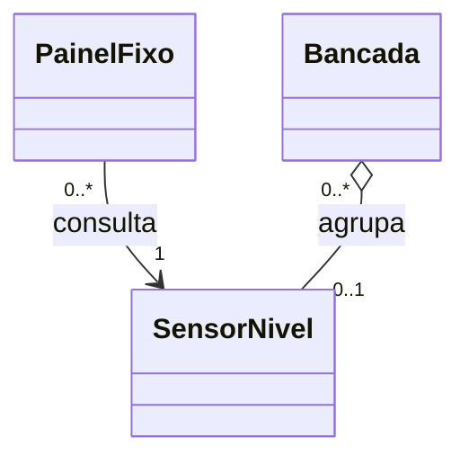
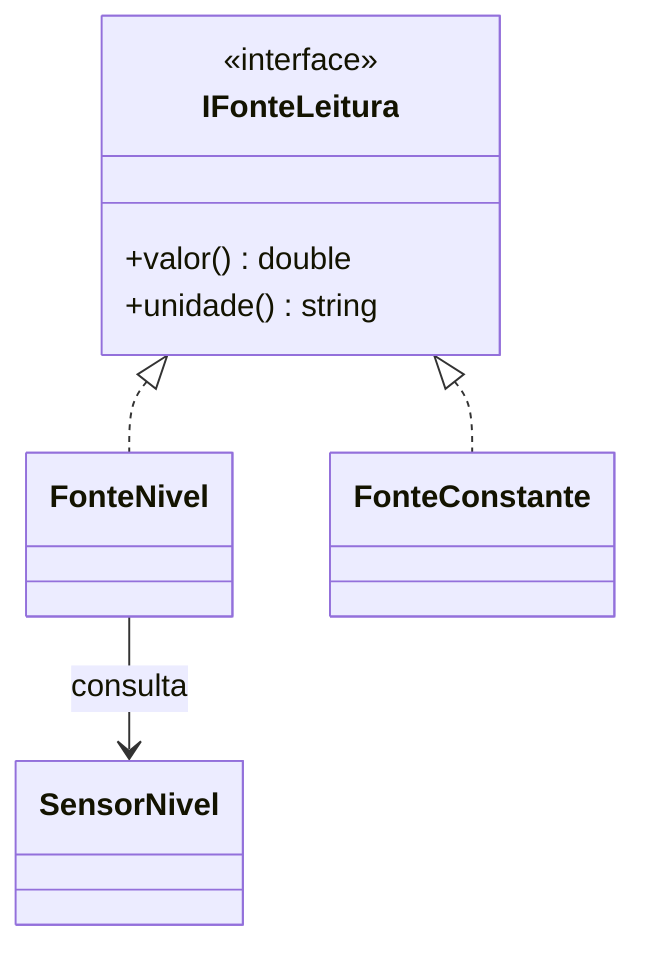

# 09. Objetos colaborando e contratos

## Objetivos de aprendizagem

- Distinguir associação, dependência, agregação e composição pelo vínculo e pelo ciclo de vida.
- Definir uma interface pequena e consultar implementações distintas em C++ e Python.
- Validar vínculos e substituição com dois incrementos cumulativos no próprio fork.

**Tempo estimado:** 4h de estudo e prática, em incrementos sucessivos; a união não reduz a carga. Confira o [planejamento da turma](../../index.md).

## Vídeo de contexto


Curso em Vídeo — Relacionamento entre Classes. Retome a colaboração entre objetos e procure quem mantém o vínculo; nesta aula os sensores existem antes dos painéis.

---

**Percurso da aula:** primeiro, dois painéis compartilham um sensor; depois, uma interface permite consultar fontes diferentes. A associação explica quem conhece quem; a abstração define o que o cliente pode pedir.

| Incremento | Branch existente | Validação |
|---|---|---|
| A — colaboração concreta | `pratica/09-associacoes` | `make test ETAPA=09` |
| B — interface e fontes | `pratica/10-interfaces` | `make test ETAPA=10` |

Os números de `ETAPA` identificam contratos já publicados, não capítulos. Integre o incremento A antes de abrir a branch B.

## 1. Mini-caso prático: dois painéis, uma leitura

Na composição da seção 06, o controlador criava suas partes. Agora dois operadores precisam consultar o **mesmo sensor** em painéis diferentes. Fechar um painel não deve remover o sensor do sistema; trocar o sensor de um painel não deve afetar o outro.

Se cada painel copiar a leitura ao nascer, a tela fica desatualizada. Precisamos manter um vínculo com o objeto que conhece o estado atual.

**Preveja:** nível começa em 10; depois muda para 20. Os dois painéis devem mostrar 20. Esse resultado distingue associação de uma cópia antiga do valor.

---

## 2. Retome o artefato e abra a branch

Use o próprio fork de [rafaelrezo/poo-fundamentos-estacao](https://github.com/rafaelrezo/poo-fundamentos-estacao), com **a etapa 07 deste starter** concluída e integrada. O clone deve ter somente `origin`, apontando para o fork. Não copie arquivos dos repositórios das seções 01–06.

```bash
git switch main
git pull --ff-only origin main
git remote -v
git switch -c pratica/09-associacoes
make test ETAPA=09
```

O comando repete os contratos anteriores e inicialmente falha no comportamento ainda pendente desta seção. Leia a primeira mensagem; não altere testes ou automação para obter aprovação. Complete os incrementos abaixo e repita o mesmo comando.

---

## 3. Conceito → necessidade → implementação



O primeiro vínculo é uma associação navegável: cada painel conhece um sensor; o mesmo sensor pode ter vários painéis. Na bancada lógica desta atividade existe apenas uma vaga; o mesmo sensor pode ser referenciado por mais de um desses agrupamentos. O losango vazio representa um agrupamento com regra explícita: liberar a vaga não destrói o sensor. Não se trata ainda de uma coleção 1:N, que será implementada na seção 11.

| Técnica/Padrão | Melhor uso | Esforço | Entregável | Limitação |
|---|---|---|---|---|
| Dependência | uso por uma operação | baixo | parâmetro ou variável local | não informa por si só vínculo persistente |
| Associação | colaboração mantida entre chamadas | médio | referência ao colaborador | posse precisa ser explicitada |
| Agregação compartilhada | agrupamento com partes independentes | médio | regra de agrupamento documentada | semântica UML pouco restritiva; associação pode bastar |
| Composição | responsabilidade exclusiva pelas partes | médio | todo e partes com ciclo de vida definido | não se deduz apenas da frase “tem um” |

Escolha associação para os painéis; composição continua adequada às partes internas criadas pelo controlador anterior. A dependência `consultarAgora(sensor)` usa o parâmetro sem guardá-lo. Dependência pode significar outras necessidades entre elementos, não apenas uso temporário.

---

## 4. Incremento guiado: os dois painéis e o sensor no mesmo programa

Comece pelo `main`: o sensor nasce antes dos painéis, ambos o consultam e uma atualização aparece nos dois. Ao final do bloco interno, os painéis deixam de existir; a consulta ao sensor continua funcionando.

O exemplo independente recorta o sensor para leitura, unidade e validação. No starter, a tag e a herança da etapa 07 continuam: não substitua `sensores.hpp` nem `sensores.py` pelo recorte. Adapte apenas o comportamento do painel nos arquivos de relações.

### 4.1 C++: o painel guarda um endereço

Salve como `exemplo_01_associacao.cpp` ou [baixe o programa completo](exemplo_01_associacao.cpp).

```cpp
#include <cmath>
#include <iostream>
#include <stdexcept>
#include <string>

class SensorNivel {
    double valor_;
public:
    explicit SensorNivel(double valor) : valor_(valor) {
        if (!std::isfinite(valor) || valor < 0 || valor > 100) {
            throw std::invalid_argument("nivel fora da faixa");
        }
    }
    double valor() const { return valor_; }
    std::string unidade() const { return "%"; }
    bool atualizar(double valor) {
        if (!std::isfinite(valor) || valor < 0 || valor > 100) return false;
        valor_ = valor;
        return true;
    }
};

class PainelFixo {
    const SensorNivel* sensor_;
public:
    explicit PainelFixo(const SensorNivel& sensor) : sensor_(&sensor) {}
    double leitura() const { return sensor_->valor(); }
};

double consultarAgora(const SensorNivel& sensor) {
    return sensor.valor();
}

int main() {
    SensorNivel sensor{10};
    {
        PainelFixo p{sensor};
        PainelFixo q{sensor};
        std::cout << "Antes: " << p.leitura() << ' ' << q.leitura() << '\n';
        sensor.atualizar(20);
        std::cout << "Depois: " << p.leitura() << ' ' << q.leitura() << '\n';
    } // os paineis terminam aqui; o sensor continua vivo
    std::cout << "Sem paineis: " << consultarAgora(sensor) << '\n';
}
```

```bash
g++ -std=c++17 -Wall -Wextra -Werror -pedantic exemplo_01_associacao.cpp -o exemplo_01_associacao
./exemplo_01_associacao
```

Saída esperada:

```text
Antes: 10 10
Depois: 20 20
Sem paineis: 20
```

**Localize o vínculo:** `sensor_` guarda o endereço do sensor recebido no construtor. `&sensor` obtém esse endereço; `sensor_->valor()` consulta o objeto apontado. `const` impede modificá-lo por esse caminho, mas o `main` ainda pode atualizá-lo diretamente.

O ponteiro não é proprietário: o painel não executa `delete`. O chamador deve manter o sensor vivo durante todas as consultas. `consultarAgora` mostra uma dependência por operação: recebe o objeto, consulta e não guarda um vínculo para chamadas futuras.

### 4.2 Python: o painel guarda uma referência

O cenário é o mesmo. A função `observar_paineis` delimita o uso dos painéis; o `main` mantém sua própria referência ao sensor.

Salve como `exemplo_02_associacao.py` ou [baixe o programa completo](exemplo_02_associacao.py).

```python
from math import isfinite


class SensorNivel:
    def __init__(self, valor):
        if not isfinite(valor) or not 0 <= valor <= 100:
            raise ValueError("nivel fora da faixa")
        self._valor = valor

    def valor(self):
        return self._valor

    def unidade(self):
        return "%"

    def atualizar(self, valor):
        if not isfinite(valor) or not 0 <= valor <= 100:
            return False
        self._valor = valor
        return True


class PainelFixo:
    def __init__(self, sensor):
        self._sensor = sensor

    def leitura(self):
        return self._sensor.valor()


def consultar_agora(sensor):
    return sensor.valor()


def observar_paineis(sensor):
    p = PainelFixo(sensor)
    q = PainelFixo(sensor)
    print(f"Antes: {p.leitura()} {q.leitura()}")
    sensor.atualizar(20)
    print(f"Depois: {p.leitura()} {q.leitura()}")


def main():
    sensor = SensorNivel(10)
    observar_paineis(sensor)
    print(f"Sem paineis: {consultar_agora(sensor)}")


if __name__ == "__main__":
    main()
```

```bash
python3 exemplo_02_associacao.py
```

Saída esperada:

```text
Antes: 10 10
Depois: 20 20
Sem paineis: 20
```

Python guarda uma referência ao objeto em `self._sensor`. Encerrar `observar_paineis` não apaga o sensor referenciado pelo `main`. Isso não é uma garantia geral de destruição imediata como a saída de escopo dos objetos locais C++.

**Aplique no fork:** em `include/relacoes.hpp` e `src/relacoes.py`, complete `PainelFixo.leitura` com a consulta ao associado mostrada nos programas. Preserve `conectar` e `Bancada` para a extensão. A dependência `consultarAgora`/`consultar_agora` já é fornecida pelo starter.

**Confirme:** execute os exemplos; os painéis devem mudar juntos de 10 para 20. No fork, `make test ETAPA=09` ainda pode apontar falha na troca de vínculo ou na bancada: são as próximas tarefas, não motivo para enfraquecer os testes.

---

## 5. Prática de adaptação: trocar e liberar vínculos

Complete `conectar` para trocar somente o sensor daquele painel. Depois complete `Bancada.receber`, preservando a identidade do objeto recebido. `liberar` já remove o vínculo.

| Ação | Resultado esperado |
|---|---|
| p e q ligados a A, A muda | ambos mostram o novo valor |
| p passa a consultar B | q continua ligado a A |
| painéis saem do escopo | sensores externos continuam utilizáveis |
| bancada recebe A | referência/endereço é o de A |
| bancada é liberada | vaga vazia, A permanece válido |

Em Python, `grupo.sensor is sensor` compara identidade. Em C++, `grupo.sensor() == &sensor` compara os endereços desses objetos vivos. A igualdade lógica será uma decisão distinta na seção 11.

---

## 6. Checkpoint e erros comuns

`make test ETAPA=09` repete 07 e verifica os vínculos em ambas as linguagens. A saída final inclui `OK C++ etapa 09` e `OK Python etapa 09`.

Se só aparece a leitura antiga, o painel guardou uma cópia do valor. Se trocar um painel altera o outro, confira se você mudou o sensor compartilhado em vez da referência do painel. Se há acesso inválido em C++, desenhe os tempos de vida e mantenha os sensores externos vivos durante as consultas.

No diagrama, explique os dois lados de cada multiplicidade. Não desenhe composição para um sensor que pode existir sem o painel. O modelo documenta uma regra de domínio; não é uma tradução automática de todo atributo com ponteiro.

## 7. Validação e entrega

```bash
make test ETAPA=09
git add include/relacoes.hpp src/relacoes.py docs/decisoes.md docs/diagrama.md AI_LOG.md
git commit -m "conclui associacoes com contratos cumulativos"
git push -u origin pratica/09-associacoes
```

Faça um commit do incremento guiado e outro da extensão quando ambos forem verificáveis. Abra PR da branch para a `main` **do próprio fork**; confira a execução de `make test ETAPA=09` na CI correspondente ao commit. Integre após testes verdes e revisão. Não abra PR contra o repositório-base.


Na main, a CI verifica apenas a baseline executável do starter. A entrega precisa da evidência funcional da branch/PR. Testes visíveis não comprovam entendimento: o docente revisa o diff e, em avaliação, exige defesa oral curta.

Continue no segundo incremento desta mesma aula depois de integrar o primeiro checkpoint.

---

## 8. Mini-caso prático: operar sem o sensor físico

O painel da seção 09 conhece `SensorNivel`. Para preparar uma demonstração, a equipe precisa consultar também uma fonte constante. Um valor simulado não precisa herdar a identidade do sensor instalado. O cliente só precisa **consultar valor e unidade**.

Antes do código, registre em `docs/decisoes.md` duas operações necessárias e duas que não devem fazer parte desse contrato. Atualizar hardware, salvar banco e formatar tela não são responsabilidades da fonte de leitura.

O contrato desta atividade exige `valor()` e `unidade()`, sem alteração de estado. A infraestrutura fornece essas assinaturas para os testes; o aluno decide como torná-las abstratas e como cada implementação as cumpre.

---

## 9. Retome o artefato e abra a branch

Use o próprio fork de [rafaelrezo/poo-fundamentos-estacao](https://github.com/rafaelrezo/poo-fundamentos-estacao), com **a etapa 09** concluída e integrada. O clone deve ter somente `origin`, apontando para o fork. Não copie arquivos dos repositórios das seções 01–06.

```bash
git switch main
git pull --ff-only origin main
git remote -v
git switch -c pratica/10-interfaces
make test ETAPA=10
```

O comando repete os contratos anteriores e inicialmente falha no comportamento ainda pendente desta seção. Leia a primeira mensagem; não altere testes ou automação para obter aprovação. Complete os incrementos abaixo e repita o mesmo comando.

---

## 10. Interface, base abstrata e classe concreta

| Técnica/Padrão | Melhor uso | Esforço | Entregável | Limitação |
|---|---|---|---|---|
| Base concreta com estado | compartilhar representação comum | médio | hierarquia como a seção 07 | compartilhamento pode criar dependência desnecessária |
| Classe abstrata | impedir objetos sem comportamento completo | médio | operações abstratas e possível código comum | não é sinônimo de interface mínima |
| Interface como contrato | permitir implementações independentes | médio | operações necessárias ao cliente | assinaturas não provam regras comportamentais |
| Contrato estrutural Python | aceitar objetos por operações disponíveis | médio | `Protocol`/anotações e verificação apropriada | anotações não validam objetos em execução sozinhas |

Em C++ não há palavra-chave `interface`: representaremos essa intenção por uma classe abstrata sem estado de domínio. Em Python, a atividade usa `ABC` e `@abstractmethod`. `Protocol` será uma alternativa no projeto, não requisito para executar esta prática.



O triângulo tracejado representa realização do contrato na visão conceitual. No C++, sua implementação usa herança pública da classe abstrata. `FonteNivel` também se associa ao sensor já existente; não copia sua leitura.

---

## 11. Incremento guiado: do objeto real ao contrato do cliente

**Caminho a acompanhar:** o `main` cria um sensor, `FonteNivel` guarda sua referência e o cliente recebe somente `IFonteLeitura`. A fonte adapta um objeto já existente às duas operações exigidas pelo cliente; ela não armazena uma cópia antiga da leitura.

Os programas abaixo são independentes. O sensor está reduzido ao comportamento usado neste experimento. No fork, preserve sua classe com tag e herança; as mudanças desta aula ficam em `fontes.hpp` e `fontes.py`.

### 11.1 C++: interface, implementação e chamada

Salve como `exemplo_01_interface.cpp` ou [baixe o programa completo](../10_abstracao_interfaces/exemplo_01_interface.cpp).

```cpp
#include <cmath>
#include <iostream>
#include <stdexcept>
#include <string>

class SensorNivel {
    double valor_;
public:
    explicit SensorNivel(double valor) : valor_(valor) {
        if (!std::isfinite(valor) || valor < 0 || valor > 100) {
            throw std::invalid_argument("nivel fora da faixa");
        }
    }
    double valor() const { return valor_; }
    std::string unidade() const { return "%"; }
    bool atualizar(double valor) {
        if (!std::isfinite(valor) || valor < 0 || valor > 100) return false;
        valor_ = valor;
        return true;
    }
};

class IFonteLeitura {
public:
    virtual ~IFonteLeitura() = default;
    virtual double valor() const = 0;
    virtual std::string unidade() const = 0;
};

class FonteNivel : public IFonteLeitura {
    const SensorNivel& sensor_;
public:
    explicit FonteNivel(const SensorNivel& sensor) : sensor_(sensor) {}
    double valor() const override { return sensor_.valor(); }
    std::string unidade() const override { return sensor_.unidade(); }
};

double lerFonte(const IFonteLeitura& fonte) {
    return fonte.valor();
}

int main() {
    SensorNivel sensor{10};
    FonteNivel fonte{sensor};
    std::cout << lerFonte(fonte) << ' ' << fonte.unidade() << '\n';
    sensor.atualizar(20);
    std::cout << lerFonte(fonte) << ' ' << fonte.unidade() << '\n';
    // IFonteLeitura incompleta; // experimento: tente instanciar o contrato
}
```

```bash
g++ -std=c++17 -Wall -Wextra -Werror -pedantic exemplo_01_interface.cpp -o exemplo_01_interface
./exemplo_01_interface
```

Saída esperada:

```text
10 %
20 %
```

`IFonteLeitura` diz quais operações o cliente pode pedir. `= 0` deixa a implementação a cargo das classes concretas; `FonteNivel` cumpre as duas operações com `override`. A realização do contrato usa herança pública, e a colaboração com o sensor usa uma referência.

`lerFonte` recebe `const IFonteLeitura&`: consulta o objeto original sem copiá-lo. O método concreto executado pertence à fonte recebida. O destrutor virtual já prepara o uso posterior de coleções com destruição pelo tipo-base.

**Experimento:** descomente a tentativa de criar `IFonteLeitura` no `main`. O programa deixa de compilar porque o contrato é abstrato. Comente novamente; em seguida, retire apenas `const` do método `valor` de `FonteNivel`, mantendo `override`. O compilador aponta que a assinatura não corresponde à operação da interface. Restaure antes de continuar.

### 11.2 Python: contrato abstrato e delegação ao sensor

Salve como `exemplo_02_interface.py` ou [baixe o programa completo](../10_abstracao_interfaces/exemplo_02_interface.py).

```python
from abc import ABC, abstractmethod
from math import isfinite


class SensorNivel:
    def __init__(self, valor):
        if not isfinite(valor) or not 0 <= valor <= 100:
            raise ValueError("nivel fora da faixa")
        self._valor = valor

    def valor(self):
        return self._valor

    def unidade(self):
        return "%"

    def atualizar(self, valor):
        if not isfinite(valor) or not 0 <= valor <= 100:
            return False
        self._valor = valor
        return True


class IFonteLeitura(ABC):
    @abstractmethod
    def valor(self):
        raise NotImplementedError

    @abstractmethod
    def unidade(self):
        raise NotImplementedError


class FonteNivel(IFonteLeitura):
    def __init__(self, sensor):
        self._sensor = sensor

    def valor(self):
        return self._sensor.valor()

    def unidade(self):
        return self._sensor.unidade()


def ler_fonte(fonte: IFonteLeitura):
    return fonte.valor()


def main():
    sensor = SensorNivel(10)
    fonte = FonteNivel(sensor)
    print(f"{ler_fonte(fonte)} {fonte.unidade()}")
    sensor.atualizar(20)
    print(f"{ler_fonte(fonte)} {fonte.unidade()}")
    # IFonteLeitura()  # experimento: tente instanciar o contrato


if __name__ == "__main__":
    main()
```

```bash
python3 exemplo_02_interface.py
```

Saída esperada:

```text
10 %
20 %
```

A anotação de `ler_fonte` comunica o contrato, mas não valida tipos nem provoca o despacho por si só. Python encontra o método no objeto recebido. `@abstractmethod` marca as operações obrigatórias; `raise NotImplementedError` é um corpo válido que denuncia uma execução indevida, não um trecho omitido.

**Experimento:** descomente `IFonteLeitura()` no `main`. A execução termina com `TypeError`, pois as operações abstratas não foram concretizadas. Herdar de `ABC`, sozinho, não impediria a criação. Restaure o comentário depois de observar a falha.

**Aplique no fork:** torne abstratas as duas operações de `IFonteLeitura`, complete `FonteNivel` por delegação e adapte o cliente `lerFonte`/`ler_fonte` mostrado inteiro nos programas. Preserve a classe de sensor e as assinaturas existentes. Os testes completos ainda exigem a segunda implementação, tarefa seguinte.

---

## 12. Prática de adaptação: segunda implementação, mesmo cliente

Complete `FonteConstante` nos arquivos de fontes: cada consulta deve devolver o valor ou a unidade recebido pelo construtor. Ela cumpre a interface sem precisar herdar a identificação de um sensor instalado ou criar um sensor artificial.

Adapte o `main` demonstrativo para criar a fonte constante de 35% e chamar o mesmo cliente que já recebe `FonteNivel`. Mantenha as consultas anteriores: elas devem continuar mostrando 10% e 20%; a consulta adicional deve mostrar 35%. Não altere `lerFonte`/`ler_fonte` para reconhecer classes.

A suíte acrescenta uma terceira fonte desconhecida do cliente. O teste confirma substituição: qualquer implementação que cumpra o contrato deve poder ser consultada. Uma decisão por nome de classe, cast ou `isinstance` impediria esse objetivo.

---

## 13. Checkpoint: o que a abstração promete?

`make test ETAPA=10` repete 07 e 09; verifica abstração, duas fontes, atualização do sensor associado e uma implementação adicional. A saída termina com `OK C++ etapa 10` e `OK Python etapa 10`.

O contrato não promete persistência nem aquisição física. Ele promete consulta coerente de valor/unidade, sem modificar o estado. Uma implementação que sempre retorna zero mesmo quando a fonte mudou viola essa promessa, embora compile.

Se C++ acusar erro em `override`, compare parâmetros e `const`. Se Python ainda instanciar a interface, confira os decoradores. Se a fonte real não acompanhar atualizações, verifique se guardou referência ao sensor ou apenas uma leitura antiga.

## 14. Validação e entrega

```bash
make test ETAPA=10
git add include/fontes.hpp src/fontes.py docs/decisoes.md docs/diagrama.md AI_LOG.md
git commit -m "conclui interfaces com contratos cumulativos"
git push -u origin pratica/10-interfaces
```

Faça um commit do incremento guiado e outro da extensão quando ambos forem verificáveis. Abra PR da branch para a `main` **do próprio fork**; confira a execução de `make test ETAPA=10` na CI correspondente ao commit. Integre após testes verdes e revisão. Não abra PR contra o repositório-base.

- [ ] O comando local repete e preserva as etapas anteriores deste starter.
- [ ] A extensão foi adaptada e os casos de fronteira foram explicados.
- [ ] `docs/decisoes.md` relaciona conceito, implementação e evidência.
- [ ] O diagrama corresponde ao estado atual do código.
- [ ] O PR inclui saída local e link da CI do commit.
- [ ] `AI_LOG.md` registra pedido, aceites/rejeições e justificativa, ou declara ausência de IA.

Na main, a CI verifica apenas a baseline executável do starter. A entrega precisa da evidência funcional da branch/PR. Testes visíveis não comprovam entendimento: o docente revisa o diff e, em avaliação, exige defesa oral curta.

Na [seção 10](../11_excecoes/index.md), uma operação de aquisição poderá falhar. A consulta abstrata continuará pequena; a fronteira de recuperação será uma responsabilidade separada.

## Perguntas de revisão rápida

1. Como demonstrar que dois painéis consultam o mesmo objeto sem copiar sua leitura?
2. O que muda quando o cliente conhece IFonteLeitura em vez de SensorNivel?
3. Quais regras de vínculo e comportamento dependem de testes além da declaração da interface?

## Fontes de referência

- [UML — especificação](https://www.omg.org/spec/UML/2.5.1/About-UML)
- [C++ Core Guidelines — posse e recursos](https://isocpp.github.io/CppCoreGuidelines/CppCoreGuidelines#S-resource)
- [Python — objetos e referências](https://docs.python.org/3/reference/datamodel.html)
- [C++ — classes abstratas](https://eel.is/c++draft/class.abstract)
- [Python — ABC](https://docs.python.org/3/library/abc.html)
- [Python — protocolos](https://docs.python.org/3/library/typing.html#typing.Protocol)
