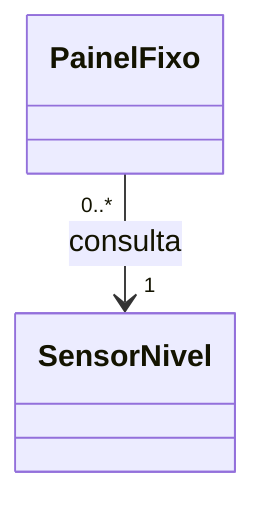

# Objetos colaborando: compartilhar o sensor e consultar um contrato

## Objetivos de aprendizagem

- Explicar a diferença entre copiar uma leitura e manter um vínculo com o sensor.
- Distinguir colaboração, posse e tempo de vida dos objetos.
- Usar um contrato pequeno para consultar fontes diferentes em C++ e Python.

**Tempo estimado:** 2h de exposição dialogada e demonstrações. A aplicação dos capítulos 09 e 10 será uma única atividade ao final do capítulo 10; esta aula não exige entrega própria. O vídeo é complementar, dentro do tempo de estudo do bloco.

## Vídeo de contexto


Curso em Vídeo — Relacionamento entre Classes. Observe quem mantém o vínculo e se os objetos precisam nascer e terminar juntos.

---

## 1. O sensor mudou; por que o painel continua mostrando 10?

No capítulo 08, uma função consultava sensores pelo mesmo contrato. Agora o operador precisa de um painel que continue ligado a um sensor entre duas chamadas. Comecemos com uma única leitura de nível.

**Preveja:** o sensor nasce com 10 e recebe 20. O que o painel mostrará se guardar apenas o número recebido na construção?

Neste recorte, as entradas são valores válidos definidos no `main`; a validação de faixa já estudada fica fora da demonstração. O sensor do starter continua validando suas entradas. Cada programa abaixo é independente e mostra uma versão completa do mesmo problema.

Programa independente: [exemplo_03_copia.cpp](exemplo_03_copia.cpp). Salve em uma pasta de demonstrações.

```cpp
#include <iostream>

class SensorNivel {
    double valor_;
public:
    explicit SensorNivel(double valor) : valor_(valor) {}
    double valor() const { return valor_; }
    void atualizar(double valor) { valor_ = valor; }
};

class PainelFixo {
    double leitura_;
public:
    explicit PainelFixo(const SensorNivel& sensor) : leitura_(sensor.valor()) {}
    double leitura() const { return leitura_; }
};

int main() {
    SensorNivel sensor{10};
    PainelFixo painel{sensor};
    sensor.atualizar(20);
    std::cout << "Sensor: " << sensor.valor() << '\n';
    std::cout << "Painel: " << painel.leitura() << '\n';
}
```

Execute:

```bash
g++ -std=c++17 -Wall -Wextra -Werror -pedantic exemplo_03_copia.cpp -o exemplo_03_copia
./exemplo_03_copia
```

Resultado:

```text
Sensor: 20
Painel: 10
```

O sensor está correto. O painel guardou uma fotografia antiga em `leitura_`. Essa cópia é útil para um registro histórico, mas não atende ao pedido de acompanhar o estado atual.

## 2. Guardar o vínculo em vez da fotografia

O `main` permanece igual. Precisamos mudar **o que o painel guarda**, **como recebe essa informação** e **o que faz quando alguém pede a leitura**. São três alterações conectadas:

| Ponto do programa | Versão com cópia | Versão com vínculo | Efeito |
|---|---|---|---|
| Atributo de `PainelFixo` | `double leitura_;` | `const SensorNivel* sensor_;` | guarda o endereço de um sensor, em vez de um número antigo |
| Inicialização do atributo | `leitura_(sensor.valor())` | `sensor_(&sensor)` | guarda onde está o objeto recebido, em vez de consultar seu valor uma única vez |
| Corpo de `leitura()` | `return leitura_;` | `return sensor_->valor();` | consulta o sensor toda vez que o método é chamado |

**Acompanhe essas três linhas no programa completo.** O parâmetro `const SensorNivel& sensor` já era uma referência nas duas versões: recebê-lo por referência, sozinho, não fazia o painel manter o vínculo. A diferença está no atributo que conserva a informação depois do construtor.

Programa independente: [exemplo_04_vinculo.cpp](exemplo_04_vinculo.cpp). Salve em uma pasta de demonstrações.

```cpp
#include <iostream>

class SensorNivel {
    double valor_;
public:
    explicit SensorNivel(double valor) : valor_(valor) {}
    double valor() const { return valor_; }
    void atualizar(double valor) { valor_ = valor; }
};

class PainelFixo {
    const SensorNivel* sensor_; // 1. Guarda o endereco, nao uma copia da leitura.
public:
    explicit PainelFixo(const SensorNivel& sensor) : sensor_(&sensor) {} // 2. Mantem o vinculo.
    double leitura() const { return sensor_->valor(); } // 3. Consulta o estado atual.
};

int main() {
    SensorNivel sensor{10};
    PainelFixo painel{sensor};
    sensor.atualizar(20);
    std::cout << "Sensor: " << sensor.valor() << '\n';
    std::cout << "Painel: " << painel.leitura() << '\n';
}
```

Execute:

```bash
g++ -std=c++17 -Wall -Wextra -Werror -pedantic exemplo_04_vinculo.cpp -o exemplo_04_vinculo
./exemplo_04_vinculo
```

Resultado:

```text
Sensor: 20
Painel: 20
```

### 2.1 Da construção até a consulta

1. `SensorNivel sensor{10}` cria o objeto no `main`.
2. `PainelFixo painel{sensor}` passa esse mesmo objeto ao construtor. O `&` no **tipo do parâmetro** (`const SensorNivel&`) indica uma referência: não há cópia do sensor.
3. `sensor_(&sensor)` inicializa o atributo do painel. Aqui, o `&` na **expressão** obtém o endereço do objeto recebido. Esse endereço continua guardado depois que o construtor termina.
4. `sensor.atualizar(20)` altera o valor dentro do sensor original.
5. `painel.leitura()` usa `sensor_->valor()` para seguir o endereço guardado e consultar o objeto, que agora contém 20.

`->` acessa um membro do objeto apontado. Neste caso, `sensor_->valor()` equivale a `(*sensor_).valor()`. O painel conhece o sensor: há uma **associação**. `const` impede alterar o sensor por esse caminho, embora o `main` ainda possa atualizá-lo.

A atualização não envia uma mensagem ao painel e não sincroniza duas cópias. Existe um único estado no sensor; o painel busca esse estado quando `leitura()` é chamado.

O ponteiro não é proprietário. O painel não apaga o sensor, e o chamador precisa mantê-lo vivo enquanto houver consultas. A associação explica acesso; a política de posse explica quem controla o tempo de vida.

**Confirme pela leitura:** qual linha passa a buscar o valor atual? Por que a atualização no `main` aparece no painel sem chamar um método de atualização do painel?

## 3. Dois painéis podem compartilhar o mesmo sensor

Um segundo operador precisa observar a mesma instalação. Para compartilhar o sensor, construímos **dois objetos `PainelFixo` diferentes passando o mesmo objeto `a` aos dois construtores**:

- `PainelFixo p{a}` faz o atributo `sensor_` de `p` guardar `&a`.
- `PainelFixo q{a}` faz o atributo `sensor_` de `q` também guardar `&a`.

Os painéis possuem atributos separados, mas os dois endereços apontam para o mesmo sensor. O compartilhamento nasce dessas duas construções; não existe uma palavra-chave especial que o ative.

Depois, adicionamos `conectar`: esse método atribui outro endereço ao atributo do painel que recebeu a chamada. Acompanhe construção, atualização e troca no programa.

Programa independente: [exemplo_05_troca.cpp](exemplo_05_troca.cpp). Salve em uma pasta de demonstrações.

```cpp
#include <iostream>

class SensorNivel {
    double valor_;
public:
    explicit SensorNivel(double valor) : valor_(valor) {}
    double valor() const { return valor_; }
    void atualizar(double valor) { valor_ = valor; }
};

class PainelFixo {
    const SensorNivel* sensor_;
public:
    explicit PainelFixo(const SensorNivel& sensor) : sensor_(&sensor) {}
    double leitura() const { return sensor_->valor(); }
    void conectar(const SensorNivel& sensor) { sensor_ = &sensor; }
};

int main() {
    SensorNivel a{10};
    SensorNivel b{70};
    {
        PainelFixo p{a}; // p.sensor_ guarda &a.
        PainelFixo q{a}; // q.sensor_ tambem guarda &a.
        a.atualizar(20);
        std::cout << "Compartilhado: " << p.leitura() << ' ' << q.leitura() << '\n';
        p.conectar(b); // Apenas p.sensor_ passa a guardar &b.
        std::cout << "Apos troca: " << p.leitura() << ' ' << q.leitura() << '\n';
    }
    std::cout << "Sem paineis: " << a.valor() << ' ' << b.valor() << '\n';
}
```

Execute:

```bash
g++ -std=c++17 -Wall -Wextra -Werror -pedantic exemplo_05_troca.cpp -o exemplo_05_troca
./exemplo_05_troca
```

Resultado:

```text
Compartilhado: 20 20
Apos troca: 70 20
Sem paineis: 20 70
```

### 3.1 O estado dos vínculos em cada passo

A tabela usa `&a` e `&b` para representar os endereços dos objetos; não é necessário conhecer seus números na memória.

| Após executar | `sensor_` de `p` | `sensor_` de `q` | Valor em A | Valor em B | Resultado das consultas `p` / `q` |
|---|---|---|---:|---:|---|
| `PainelFixo p{a};` e `PainelFixo q{a};` | `&a` | `&a` | 10 | 70 | 10 / 10 |
| `a.atualizar(20);` | `&a` | `&a` | 20 | 70 | 20 / 20 |
| `p.conectar(b);` | `&b` | `&a` | 20 | 70 | 70 / 20 |

**Por que a troca não afeta `q`?** A chamada é feita em `p`. Dentro de `conectar`, `sensor_ = &sensor` altera o atributo desse objeto — isto é, `p.sensor_`, que só pode ser acessado internamente pela classe. O atributo de `q` continua contendo `&a`.

**Por que A continua valendo 20?** `conectar` troca um endereço no painel; não chama `atualizar` e não atribui um novo valor ao sensor. Ao consultar novamente, `p.leitura()` chega a B e `q.leitura()` chega a A.

```text
Antes da troca:                Depois de p.conectar(b):
p.sensor_ ──┐                 p.sensor_ ──────────> b: 70
            ├──> a: 20        q.sensor_ ──────────> a: 20
q.sensor_ ──┘
```

Esse desenho mostra **instâncias e seus vínculos neste momento**. Ao terminar o bloco interno, `p` e `q` deixam de existir. A última linha da saída ainda consulta A e B, porque os sensores pertencem ao escopo externo do `main`.



Cada painel consulta um sensor; um sensor pode ser consultado por vários painéis. O capítulo 12 retomará como justificar essas quantidades. Aqui basta relacionar o desenho aos dois objetos `p` e `q` que acabamos de executar.

## 4. E quando o sensor físico não está disponível para a demonstração?

A equipe precisa testar a apresentação com uma fonte constante. Fazer essa fonte herdar toda a identidade e validação de um sensor instalado acrescentaria obrigações desnecessárias. O cliente só precisa de `valor()` e `unidade()`.

### 4.1 Definir o contrato a partir do que o cliente precisa

O cliente será a função `mostrar`: sua responsabilidade é apresentar **um valor acompanhado de sua unidade**. Antes de escrever uma interface, definimos o que ela pode pedir às fontes:

| Operação exigida | Resposta neste exemplo C++ | Regra de comportamento |
|---|---|---|
| `valor()` | um `double` | devolver a leitura fornecida, sem alterar o estado durante a consulta |
| `unidade()` | um `const char*` apontando para um texto válido | informar a unidade correspondente ao valor, sem alterar o estado |

Esse acordo é o **contrato**. Ele inclui as operações, as respostas e as regras que as implementações devem respeitar. Atualizar sensores ou desenhar uma tela não entra nele: `mostrar` só precisa consultar.

Agora expressamos a parte das operações em uma classe chamada `IFonteLeitura`. O prefixo `I` é apenas uma convenção de nome; C++ não possui uma palavra-chave `interface`.

### 4.2 Distribuir os papéis antes de acompanhar o código

| Elemento | Papel no exemplo | Como participa |
|---|---|---|
| `IFonteLeitura` | declarar as operações exigidas | declara `valor()` e `unidade()` como virtuais puras |
| `FonteNivel` | cumprir o contrato usando um sensor existente | guarda uma referência ao sensor e delega a leitura a ele |
| `FonteConstante` | cumprir o mesmo contrato com um valor de demonstração | devolve 42,5 e `%` |
| `mostrar` | usar o contrato | recebe `const IFonteLeitura&` e chama as duas operações |
| `main` | construir e conectar os objetos | cria as duas fontes e escolhe qual passar a `mostrar` |

**Transição em relação ao painel:** `PainelFixo` recebia especificamente `SensorNivel` e mantinha esse vínculo entre chamadas. Agora a função `mostrar` recebe uma fonte apenas durante a chamada e depende de `IFonteLeitura`. `FonteNivel` mantém o vínculo com o sensor. Assim, a apresentação pode usar também uma fonte que não contém um sensor instalado.

No programa completo, acompanhe primeiro a declaração do contrato, depois as duas implementações e, por último, as chamadas do `main`.

Programa independente: [exemplo_06_fontes.cpp](exemplo_06_fontes.cpp). Salve em uma pasta de demonstrações.

```cpp
#include <iostream>

class SensorNivel {
    double valor_;
public:
    explicit SensorNivel(double valor) : valor_(valor) {}
    double valor() const { return valor_; }
    void atualizar(double valor) { valor_ = valor; }
};

// Contrato: as duas operacoes que a apresentacao pode pedir.
class IFonteLeitura {
public:
    virtual ~IFonteLeitura() = default;
    virtual double valor() const = 0;
    virtual const char* unidade() const = 0;
};

// Implementacao que consulta um sensor externo.
class FonteNivel : public IFonteLeitura {
    const SensorNivel& sensor_;
public:
    explicit FonteNivel(const SensorNivel& sensor) : sensor_(sensor) {}
    double valor() const override { return sensor_.valor(); }
    const char* unidade() const override { return "%"; }
};

// Outra implementacao do mesmo contrato, sem sensor instalado.
class FonteConstante : public IFonteLeitura {
public:
    double valor() const override { return 42.5; }
    const char* unidade() const override { return "%"; }
};

// Cliente: recebe o contrato e consulta o objeto concreto.
void mostrar(const IFonteLeitura& fonte) {
    std::cout << fonte.valor() << ' ' << fonte.unidade() << '\n';
}

int main() {
    SensorNivel sensor{10};
    FonteNivel real{sensor};
    FonteConstante simulada;
    mostrar(real);
    mostrar(simulada);
    sensor.atualizar(20);
    mostrar(real);
}
```

Execute:

```bash
g++ -std=c++17 -Wall -Wextra -Werror -pedantic exemplo_06_fontes.cpp -o exemplo_06_fontes
./exemplo_06_fontes
```

Resultado:

```text
10 %
42.5 %
20 %
```

### 4.3 Onde o contrato é declarado e onde ele é cumprido

A linha `virtual double valor() const = 0;` concentra quatro informações:

| Parte da declaração | Significado |
|---|---|
| `double valor()` | a operação se chama `valor`, não recebe argumentos e devolve um número |
| `const` após os parênteses | permite consultar um objeto constante e restringe alterações diretas de seus membros comuns por esse método |
| `virtual` | uma chamada pela referência à base pode executar a implementação do objeto concreto |
| `= 0` | declara a operação virtual pura; a classe permanece abstrata enquanto não houver implementação de todas as operações puras |

`virtual const char* unidade() const = 0;` aplica a mesma regra à consulta de unidade. Nos dois exemplos, o retorno é o literal `"%"`, cujo texto permanece válido durante a execução.

Em `FonteNivel : public IFonteLeitura`, a classe assume o tipo-base do contrato. Os métodos com `override` fornecem as operações exigidas; o compilador verifica se correspondem às declarações virtuais da base. `FonteConstante` faz o mesmo, com outros corpos de método.

O destrutor `virtual ~IFonteLeitura() = default` permite destruição correta pelo tipo-base quando houver posse polimórfica. Ele cuida do ciclo de vida; as duas operações de consulta são o contrato usado por `mostrar`.

### 4.4 Seguir cada chamada até a saída

| Chamada no `main` | Objeto recebido por `mostrar` | Execução de `fonte.valor()` | Execução de `fonte.unidade()` | Linha impressa |
|---|---|---|---|---|
| `mostrar(real)` | objeto `FonteNivel` | `FonteNivel::valor()` consulta `sensor_.valor()`, que vale 10 | `FonteNivel::unidade()` devolve `%` | `10 %` |
| `mostrar(simulada)` | objeto `FonteConstante` | `FonteConstante::valor()` devolve 42,5 | `FonteConstante::unidade()` devolve `%` | `42.5 %` |
| `sensor.atualizar(20);` e `mostrar(real)` | o mesmo objeto `FonteNivel` | consulta novamente o mesmo sensor, agora com 20 | devolve `%` | `20 %` |

`const IFonteLeitura& fonte` é uma referência ao objeto concreto recebido; não cria uma cópia da interface. O corpo de `mostrar` permanece igual porque só pede operações declaradas no contrato. O despacho virtual escolhe os corpos de método correspondentes a `real` ou `simulada`.

**Observe outra mudança de representação:** no painel, `sensor_` era um ponteiro, acessado com `->`, para permitir trocar o sensor. Em `FonteNivel`, `sensor_` é uma referência, inicializada por `sensor_(sensor)` e acessada com `.`. Nesta fonte, o vínculo é definido na construção e não pode ser religado a outro objeto. Em ambos os casos, o sensor continua externo e precisa permanecer vivo em C++.

### 4.5 O que a declaração consegue verificar?

- Tentar construir `IFonteLeitura fonte;` não compila: a classe é abstrata.
- Omitir `unidade()` de `FonteConstante` deixa essa classe abstrata; construir `simulada` deixa de compilar.
- Retirar `const` de `FonteNivel::valor()` mantendo `override` provoca erro de correspondência com a operação da base.
- Devolver `"C"` para uma leitura que representa nível em porcentagem pode compilar, mas viola o significado do contrato.

Portanto, **a interface declara operações verificáveis pelo compilador; o contrato também exige regras de comportamento verificadas por leitura e testes**. Aqui, ambas as fontes respeitam a consulta sem alteração de estado e a correspondência entre valor e unidade. O tratamento da aquisição que falha virá no capítulo 10.

## 5. Python: conservar a colaboração, mudar a sintaxe

Vamos manter os mesmos cinco papéis: sensor, contrato, fonte real, fonte constante e apresentação. `ABC` e `@abstractmethod` tornam explícitas as operações obrigatórias. No programa abaixo, localize a correspondência com o C++:

- `class IFonteLeitura(ABC)` declara a base abstrata do contrato.
- `@abstractmethod` marca `valor` e `unidade` como operações que uma classe concreta precisa implementar.
- `FonteNivel(IFonteLeitura)` e `FonteConstante(IFonteLeitura)` implementam as duas operações.
- `mostrar(fonte)` pede somente `fonte.valor()` e `fonte.unidade()`.

O atributo `self._sensor` guarda a referência recebida na construção da fonte real. Quando o `main` modifica o sensor, a consulta seguinte chega ao mesmo objeto atualizado.

Programa independente: [exemplo_07_fontes.py](exemplo_07_fontes.py). Salve em uma pasta de demonstrações.

```python
from abc import ABC, abstractmethod


class SensorNivel:
    def __init__(self, valor):
        self._valor = valor

    def valor(self):
        return self._valor

    def atualizar(self, valor):
        self._valor = valor


class IFonteLeitura(ABC):
    @abstractmethod
    def valor(self):
        raise NotImplementedError

    @abstractmethod
    def unidade(self):
        raise NotImplementedError


class FonteNivel(IFonteLeitura):
    def __init__(self, sensor):
        self._sensor = sensor

    def valor(self):
        return self._sensor.valor()

    def unidade(self):
        return "%"


class FonteConstante(IFonteLeitura):
    def valor(self):
        return 42.5

    def unidade(self):
        return "%"


def mostrar(fonte):
    print(f"{fonte.valor()} {fonte.unidade()}")


def main():
    sensor = SensorNivel(10)
    real = FonteNivel(sensor)
    simulada = FonteConstante()
    mostrar(real)
    mostrar(simulada)
    sensor.atualizar(20)
    mostrar(real)


if __name__ == "__main__":
    main()
```

Execute:

```bash
python3 exemplo_07_fontes.py
```

Resultado:

```text
10 %
42.5 %
20 %
```

`self._sensor` mantém uma referência. Enquanto essa referência existir, o objeto continua alcançável. Isso difere do ponteiro C++ sem posse, que não prolonga a vida do sensor. Nenhum desses detalhes determina sozinho a relação de domínio.

### 5.1 Como o contrato aparece durante a execução

`mostrar(real)` chama `FonteNivel.valor`, que chama `self._sensor.valor()`. Já `mostrar(simulada)` chama `FonteConstante.valor`. Depois de `sensor.atualizar(20)`, o caminho de `real` chega ao valor 20, exatamente como na tabela do C++.

`raise NotImplementedError` é o corpo da operação abstrata nesta base. As classes concretas fornecem seus próprios métodos; no fluxo demonstrado, elas não executam esse corpo da base. O que marca a obrigação de implementação para `ABC` é `@abstractmethod`.

Se uma derivada deixar `unidade` abstrato, tentar instanciá-la provoca `TypeError`. Entretanto, `ABC` não confere automaticamente se todos os parâmetros, tipos de retorno e significados estão corretos como uma verificação completa de contrato. Retornar uma unidade incompatível ainda exige inspeção ou teste para ser detectado.

Em Python, `mostrar` também pode receber um objeto sem essa herança explícita se ele oferecer as operações esperadas. Neste exemplo, usamos a base abstrata para deixar a intenção visível. O contrato continua sendo o acordo sobre **o que se pode pedir e o que a resposta significa**.

## 6. Escolher a relação pela responsabilidade

Compare as alternativas depois de observar os programas:

| Técnica/Padrão | Melhor uso | Esforço | Entregável | Limitação |
|---|---|---|---|---|
| Dependência de uso | consultar um objeto recebido por uma operação | baixo | função como `mostrar` | não representa por si só um vínculo guardado |
| Associação | manter acesso ao sensor entre chamadas | médio | painel ligado ao objeto | posse e validade precisam ser explicadas |
| Agregação compartilhada | documentar um agrupamento com partes independentes | médio | regra de agrupamento | o losango vazio tem semântica pouco restritiva |
| Composição | assumir responsabilidade exclusiva por uma parte | médio | todo com partes e ciclo de vida definido | não se deduz apenas de um atributo |
| Interface | consultar implementações diferentes pelo mesmo contrato | médio | cliente e fontes substituíveis | assinaturas não comprovam todas as regras |

Para a estação, use associação entre painel e sensor; uma configuração criada exclusivamente pelo painel pode ser composição. Prefira associação simples quando o agrupamento não tiver outra regra relevante. Generalização, vista no 07, continua expressando especialização, não qualquer forma de colaboração.

**O próximo problema:** até aqui toda fonte respondeu. No [capítulo 10](../11_excecoes/index.md), a aquisição poderá falhar. Vamos acompanhar o fluxo antes de aplicar colaboração e exceções na prática integrada A.

## Perguntas de revisão rápida

1. Por que copiar a leitura pode ser correto para um histórico e inadequado para um painel atual?
2. Ao trocar o sensor de `p`, por que `q` continua consultando A? Quem mantém A vivo em C++?
3. Que operações o cliente exige da fonte, e quais responsabilidades devem permanecer fora desse contrato?

## Fontes de referência

- [C++ Core Guidelines — classes e hierarquias](https://isocpp.github.io/CppCoreGuidelines/CppCoreGuidelines#S-class).
- [C++ Core Guidelines — ponteiro sem posse](https://isocpp.github.io/CppCoreGuidelines/CppCoreGuidelines#Rr-ptr).
- [Python — classes e referências](https://docs.python.org/3/tutorial/classes.html).
- [Python — classes abstratas](https://docs.python.org/3/library/abc.html).
- [OMG — UML 2.5.1](https://www.omg.org/spec/UML/2.5.1/About-UML).
