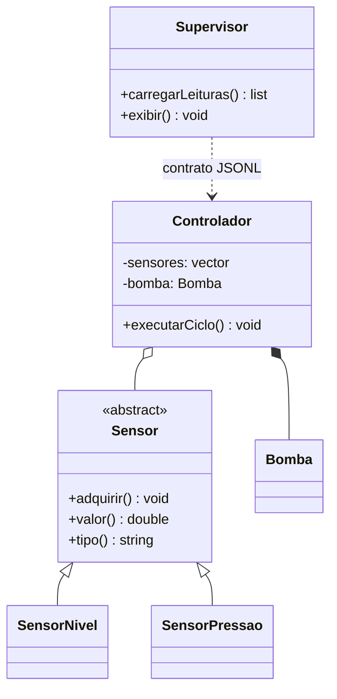

# Falhas controladas e consolidação da Parte 1

## Objetivos de aprendizagem

- Distinguir falha operacional, entrada inválida, violação de contrato e defeito de programação.
- Lançar e capturar exceções na fronteira em que existe uma decisão útil.
- Consolidar controlador C++, contrato JSONL e supervisório Python em uma entrega verificável.

**Tempo estimado:** 4h, em dois encontros de 2h, mais checkpoint opcional.

## Vídeo da aula


---

## 1. Qual problema apareceu?

Uma única leitura inválida ou linha JSON quebrada encerra o lote inteiro. Em um sistema com vários sensores, perder todas as leituras por causa de um dispositivo não é uma reação útil.

Antes da sintaxe, classifique o evento:

| Situação | Significado | Resposta inicial |
|---|---|---|
| nível fora da faixa física | operação não cumpre contrato | lançar exceção e marcar falha |
| `status = "falha"` | evento operacional válido | transportar e apresentar |
| JSON truncado | entrada não pode ser interpretada | rejeitar linha e registrar motivo |
| índice inválido criado pelo programa | provável defeito | corrigir o código; não esconder |

---

## 2. Experimento C++: sem `catch`

```cpp
SensorNivel sensor{"LT-101", 50.0};
sensor.atualizar(-10.0);
std::cout << "ciclo concluído\n";
```

Quando `atualizar` lança `std::out_of_range` e ninguém captura, o programa termina. Observe primeiro essa falha; depois acrescente uma reação.

---

## 3. Capturar onde existe decisão útil

```cpp
for (const auto& sensor : sensores) {
    try {
        sensor->adquirir();
        gravarTelemetria(*sensor, "operando");
    } catch (const std::out_of_range& erro) {
        gravarFalha(sensor->tipo(), erro.what());
    }
}
```

O `try` fica dentro do ciclo porque a decisão útil é registrar a falha daquele sensor e continuar com os demais.

### Regras de bolso

- lance no ponto que detecta a violação;
- capture no ponto que pode recuperar, traduzir ou encerrar com contexto;
- capture por referência `const`;
- prefira tipos específicos antes de `std::exception`;
- não use `catch (...)` apenas para ignorar o problema.

RAII faz com que arquivos, vetores e `unique_ptr` liberem recursos durante a saída por exceção. Isso conecta tratamento de erros à memória segura do capítulo 07.

---

## 4. Ponte C++ -> Python

```python
import json


def processar_linhas(linhas: list[str]) -> tuple[list[dict], list[dict]]:
    validas = []
    invalidas = []

    for numero, linha in enumerate(linhas, start=1):
        try:
            leitura = json.loads(linha)
            if not isinstance(leitura.get("valor"), (int, float)):
                raise ValueError("campo valor deve ser numérico")
            validas.append(leitura)
        except json.JSONDecodeError as erro:
            invalidas.append({"linha": numero, "erro": erro.msg})
        except (TypeError, ValueError) as erro:
            invalidas.append({"linha": numero, "erro": str(erro)})

    return validas, invalidas
```

Uma leitura com `status = "falha"` pode ser JSON e telemetria válidos. Ela não deve ser confundida com JSON malformado.

---

## 5. Arquitetura consolidada



O diagrama não deve listar detalhes de bibliotecas. Ele comunica responsabilidades, composição, generalização e dependência pelo contrato.

---

## 6. Checkpoint integrado

### Entrega mínima

- controlador C++ com pelo menos dois tipos de sensor;
- coleção `vector<unique_ptr<Sensor>>`;
- regra simples de bomba por composição;
- arquivo JSONL com timestamp UTC e status;
- consumidor Python que separa linhas válidas e inválidas;
- apresentação CLI obrigatória e Streamlit opcional;
- testes cumulativos locais e no GitHub Actions;
- diagrama Mermaid correspondente ao código;
- PR com evidências e `AI_LOG.md`, quando aplicável.

### Fluxo de trabalho

```text
issue -> cap09-pipeline-resiliente -> commits pequenos -> push -> CI -> PR -> revisão -> integração
```

### Casos mínimos de autograding

1. coleção vazia;
2. dois tipos de sensor;
3. valor em cada fronteira permitida;
4. leitura fora da faixa sem interromper os demais sensores;
5. JSONL com uma linha truncada;
6. regressão dos contratos dos capítulos anteriores.

---

## 7. O que isso prepara?

A Parte 1 termina com building blocks funcionais. A Parte 2 não reensinará classes, listas ou exceções. Ela perguntará como organizar algoritmos de controle substituíveis, alarmes, banco de dados, comunicação, testes de integração, qualidade e CI.

Não há ainda um CLP real nem um SCADA industrial. Há um modelo verificável sobre o qual decisões arquiteturais mais avançadas podem ser praticadas com segurança.

---

## 8. Mini-caso prático

Durante um ciclo, `LT-101` produz uma leitura válida, `PT-201` viola sua faixa e uma linha antiga do arquivo está truncada. O resultado esperado é:

- a leitura válida aparece no supervisor;
- a falha do sensor vira telemetria com contexto;
- a linha truncada entra no relatório de entradas inválidas;
- o lote termina e o CI confirma os três comportamentos.

---

## Perguntas de revisão rápida

1. Por que uma telemetria com `status = falha` não é necessariamente uma entrada inválida?
2. Por que o `catch` do controlador fica dentro do ciclo de sensores?
3. Quais building blocks da Parte 1 serão reutilizados na Parte 2?

## Fontes de referência

- [cppreference — exceptions](https://en.cppreference.com/w/cpp/language/exceptions)
- [C++ Core Guidelines — error handling](https://isocpp.github.io/CppCoreGuidelines/CppCoreGuidelines#S-errors)
- [Python Docs — exceptions](https://docs.python.org/3/tutorial/errors.html)
- [Python Docs — built-in exceptions](https://docs.python.org/3/library/exceptions.html)
- [GitHub Docs — building and testing C++](https://docs.github.com/en/actions/use-cases-and-examples/building-and-testing/building-and-testing-cpp)
- [GitHub Docs — building and testing Python](https://docs.github.com/en/actions/use-cases-and-examples/building-and-testing/building-and-testing-python)
