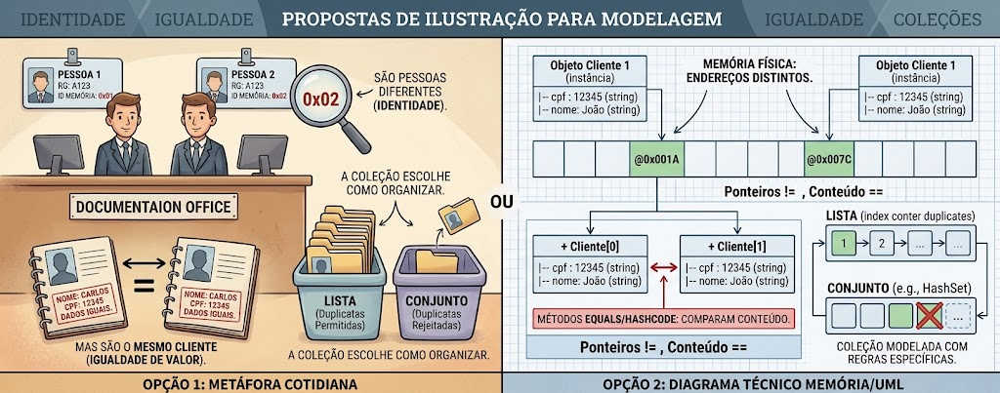
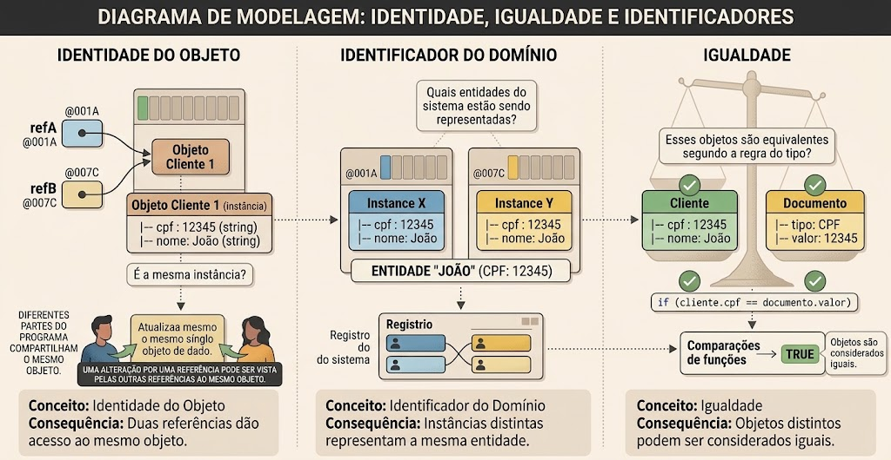
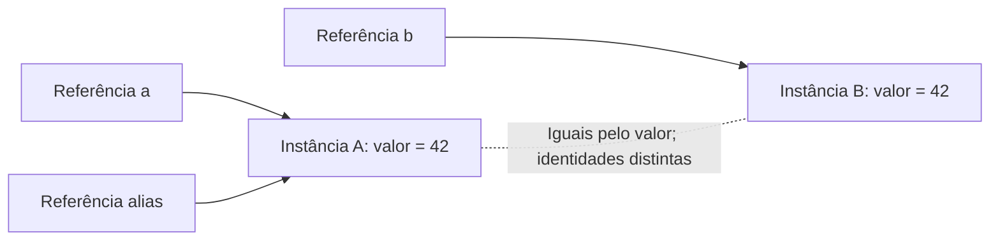
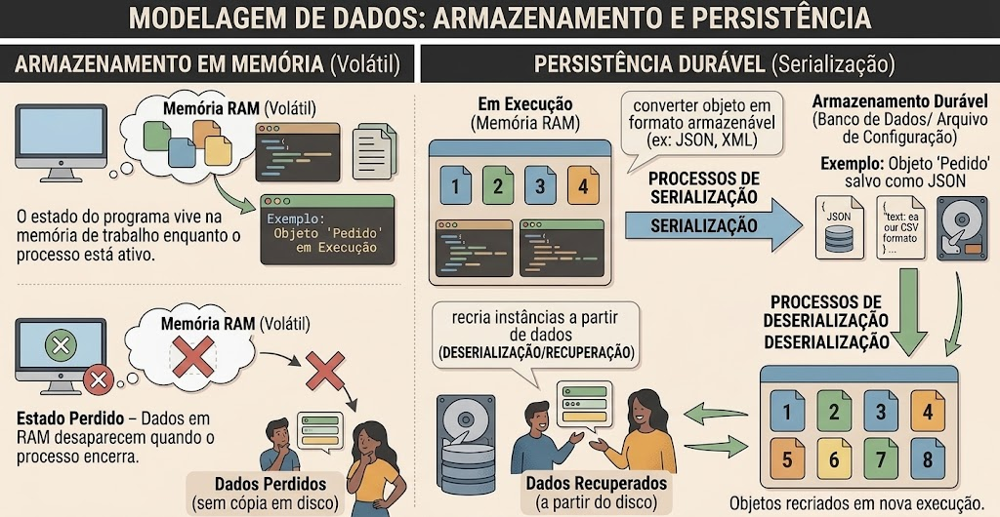
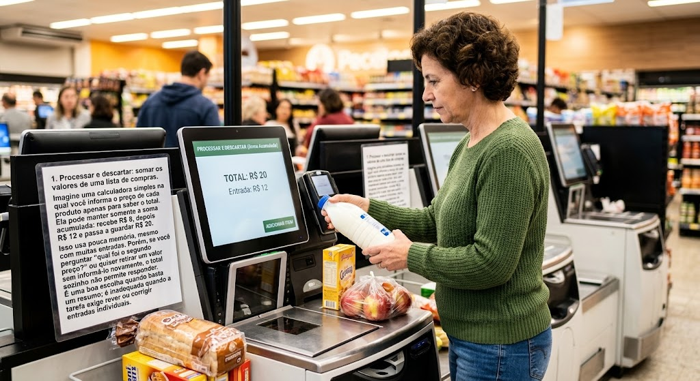
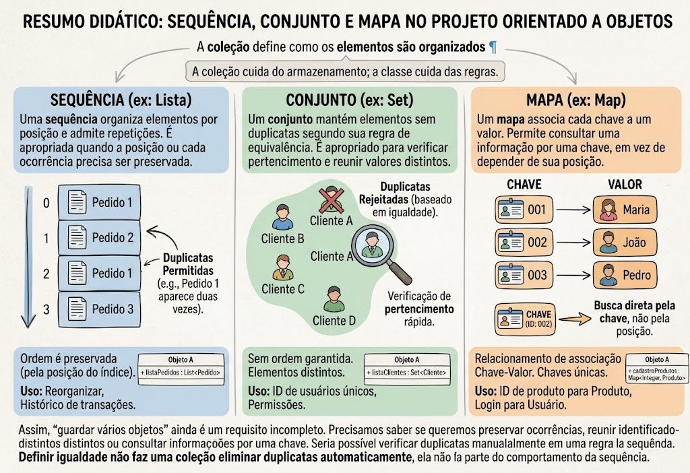
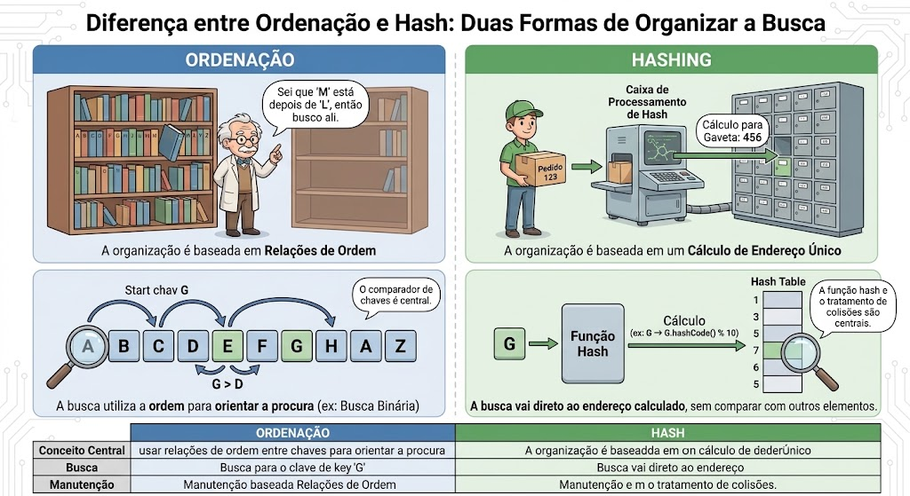
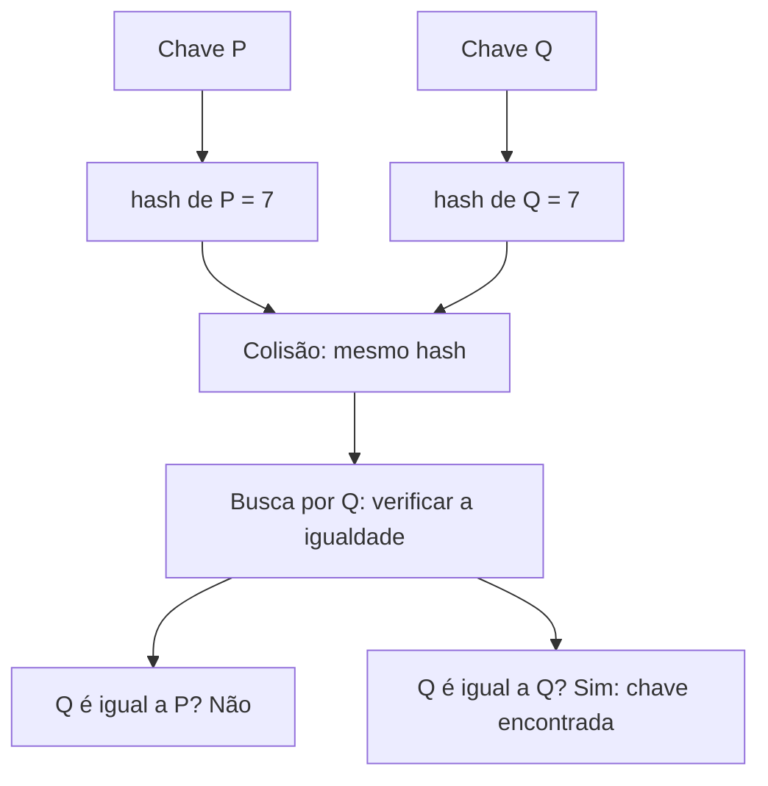

# Identidade, igualdade e coleções: quando um cadastro é repetido?

## Objetivos de aprendizagem

- Distinguir identidade de instância e igualdade definida pelo domínio.
- Relacionar chaves estáveis, comparação e escolha de coleção.
- Implementar e justificar inserção, busca, remoção e consulta de histórico em C++ e Python.

**Tempo estimado:** 2h em sala (aproximadamente 80 min de fundamentos e demonstrações, 40 min para iniciar a prática) e cerca de 80 min de conclusão orientada. A prática independente da seção 8 totaliza 2h, com C++ e Python. O capítulo 12 fica dedicado à modelagem. O vídeo é complementar dentro desse planejamento.

## Vídeo de contexto


Vídeo de apoio à comparação de objetos. Durante a leitura, distinga “mesma instância” de “mesmo valor”.

---

## 1. Por que identidade, igualdade e coleções fazem parte da modelagem?

- **Modelagem:** definir como reconhecer, comparar e organizar objetos.
- **Responsabilidades:** cada tipo reúne os dados, as operações e as regras que lhe cabem.

Até aqui, estudamos como classes definem estado e comportamento e como objetos colaboram por meio de operações. Quando um programa passa a trabalhar com vários objetos, surge outro problema: **como reconhecer, comparar e organizar esses objetos de acordo com seu significado?**

Criar duas instâncias da mesma classe não informa se elas representam coisas diferentes no mundo real. Copiar os dados de um objeto também não transforma a cópia no objeto original. E reunir objetos em uma coleção não determina, por si só, se repetições são permitidas. Essas decisões precisam fazer parte do modelo.

Elas aparecem em sistemas de cadastro, editores de documentos, aplicações comerciais e simulações. Um mesmo registro pode ser carregado duas vezes, produzindo objetos distintos; duas partes do programa podem compartilhar uma única instância; uma coleção pode precisar conservar ocorrências repetidas ou reconhecer apenas valores distintos. Confundir essas situações pode gerar duplicatas, atualizações no objeto errado e buscas inconsistentes.

### Visão ilustrada: objetos distintos, informações equivalentes

- **Representação:** instâncias distintas podem representar a mesma entidade.
- **Organização:** a coleção determina como tratar ocorrências e duplicatas.

[](ilustracao-identidade-igualdade-colecoes.jpeg)

*Identidade, igualdade e coleções: uma metáfora cotidiana e uma representação conceitual em memória. Clique na figura para ampliar.*

Leia as fichas como representações de uma informação: duas fichas podem corresponder ao mesmo cliente, assim como duas instâncias podem representar a mesma entidade. Isso não significa que duas pessoas diferentes se tornem a mesma pessoa por terem dados iguais. No painel de memória, os endereços distintos indicam instâncias distintas; a igualdade depende da regra definida pelo tipo.

A lista admite repetições; o conjunto mantém elementos distintos segundo sua regra de equivalência. Os termos `equals`, `hashCode` e `HashSet` da ilustração remetem à nomenclatura de Java. Nas próximas seções, estudaremos esses fundamentos e seus mecanismos em C++ e Python. A igualdade compara valores segundo uma regra; o hash auxilia a busca e, sozinho, não comprova igualdade.

### Estado, identidade e significado

- **Estado:** dados do objeto em determinado momento.
- **Identidade:** distingue uma instância das demais.
- **Igualdade:** equivalência segundo o significado e a regra do tipo.

O **estado** reúne os dados de um objeto em determinado momento. A **identidade** permite distinguir aquela instância das demais durante sua existência. Uma mudança de estado não cria, necessariamente, outro objeto: ele pode continuar sendo a mesma instância com dados diferentes.

A **igualdade** responde a outra pergunta: quais objetos devem ser considerados equivalentes para uma determinada finalidade? Essa resposta depende do significado do tipo. Comparar todos os atributos, comparar apenas alguns ou reconhecer uma entidade por seu identificador são escolhas de modelagem, com consequências diferentes.

### Entidades e objetos de valor

- **Entidade:** sua continuidade importa, mesmo quando seus atributos mudam.
- **Objeto de valor:** sua comparação depende dos valores que representa.
- **Tipo próprio:** concentra significado, validação e operações relacionadas.

Uma **entidade do domínio** representa algo cuja continuidade importa ao longo do tempo. Alguns atributos podem mudar sem que ela deixe de ser a mesma entidade. Um identificador de domínio permite reconhecê-la inclusive quando o programa cria novas instâncias para representá-la.

Um **objeto de valor** representa uma informação cujo significado é determinado pelos valores que contém. Duas instâncias com valores equivalentes podem ser usadas como representações da mesma informação, mesmo tendo identidades diferentes. Essa distinção orienta a regra de comparação; não exige uma sintaxe especial ou uma hierarquia de herança.

Nem toda informação precisa de uma classe própria. Criar um tipo se torna útil quando há significado e regras a concentrar: quais valores são válidos, como compará-los e quais operações fazem sentido. Isso reúne decisões que, de outra forma, ficariam repetidas nos clientes da classe.

### As decisões que vamos estudar

- **Reconhecer e organizar:** identidade, igualdade e escolha da coleção.
- **Preservar regras:** contratos, encapsulamento e estabilidade das chaves.

Primeiro, distinguiremos identidade de igualdade. Depois, veremos como sequências, conjuntos e mapas organizam objetos. Por fim, conectaremos a escolha da coleção ao encapsulamento, ao contrato de operações e à estabilidade das chaves. Os programas em C++ e Python demonstrarão essas ideias no domínio de monitoramento já utilizado no curso.

---

## 2. Mesmo objeto e mesmo valor são perguntas diferentes

- **Instância:** objeto concreto; **identificador:** informação que reconhece uma entidade.
- **Comparação:** ser a mesma instância e representar valores iguais são perguntas diferentes.

[](ilustracao-identidade-identificador-igualdade.jpeg)

*Três perguntas diferentes: é a mesma instância, representa a mesma entidade ou é equivalente segundo uma regra? Clique na figura para ampliar.*

**Orientação de leitura:** no painel esquerdo, as setas representam acesso ao mesmo objeto; nesse caso, os endereços de destino devem coincidir, apesar dos rótulos diferentes mostrados na imagem. No painel direito, comparar o CPF de um cliente com o valor de um documento verifica a correspondência dessas informações; isso não torna automaticamente os objetos `Cliente` e `Documento` iguais. A igualdade entre objetos depende do contrato definido pelos tipos.

Em POO, diferentes partes do programa podem compartilhar um objeto ou construir objetos separados para representar a mesma informação. Essas situações exigem duas perguntas: “estamos acessando o mesmo objeto?” e “os objetos representam valores equivalentes?”. A identidade responde à primeira; a igualdade definida pelo tipo responde à segunda.

Uma **instância** é um objeto concreto criado a partir de uma classe. Um **identificador do domínio** é um valor usado pelo sistema para reconhecer uma entidade dentro de um contexto. Instância é o objeto; identificador é uma informação que ele pode representar ou carregar.

| Conceito | Pergunta | Consequência |
|---|---|---|
| Identidade do objeto | É exatamente a mesma instância? | Duas referências podem dar acesso ao mesmo objeto. |
| Identificador do domínio | Qual entidade do sistema está sendo representada? | Instâncias distintas podem representar a mesma entidade. |
| Igualdade | Esses objetos são equivalentes segundo a regra do tipo? | Objetos distintos podem ser considerados iguais. |

Uma referência permite acessar um objeto que já existe. Criar outro nome para esse objeto não cria uma segunda instância. Construir outro objeto com os mesmos dados cria uma instância distinta. Quando o objeto é mutável, essa diferença é observável: uma alteração por uma referência pode ser vista pelas outras referências ao mesmo objeto. Já a igualdade de valores não significa que os objetos compartilhem estado.

### Esquema: referências, instâncias e valores

- **Compartilhamento:** duas referências podem alcançar o mesmo objeto.
- **Equivalência:** objetos separados podem ter valores iguais sem compartilhar estado.

As caixas maiores representam objetos distintos; as setas contínuas indicam referências. Neste esquema, a regra de igualdade compara o campo `valor`.



**Leitura da figura:** `a` e `alias` dão acesso a uma única instância. `b` dá acesso a outra. A linha pontilhada expressa igualdade de valores, não compartilhamento de memória. O número 42 é um dado do objeto, não seu endereço.

### A igualdade precisa expressar uma regra coerente

- **Critério:** escolher os atributos relevantes para o significado do tipo.
- **Equivalência:** preservar reflexividade, simetria e transitividade.
- **Operadores:** `operator==` e `__eq__` expressam a regra na linguagem.

A classe deve concentrar o conhecimento necessário para comparar seus valores. Caso cada cliente examine os atributos e invente sua própria regra, uma parte do sistema poderá reconhecer uma duplicata enquanto outra a aceitará. Oferecer uma operação de igualdade mantém a decisão junto dos dados cujo significado ela conhece.

Ao definir igualdade, escolhemos quais informações são relevantes para a comparação. Um objeto de valor pode exigir a comparação de todos os seus componentes significativos. Uma entidade pode ser reconhecida por um identificador estável, mesmo quando outros atributos diferem. Não existe uma lista universal de atributos a comparar: a escolha precisa expressar o significado do tipo.

Para funcionar como uma relação de equivalência, a igualdade deve respeitar três propriedades:

- **Reflexividade:** um objeto é igual a si mesmo.
- **Simetria:** se `a` é igual a `b`, então `b` é igual a `a`.
- **Transitividade:** se `a` é igual a `b` e `b` é igual a `c`, então `a` é igual a `c`.

Essas propriedades tornam coerentes as decisões de pertencimento e de duplicata. A regra também deve especificar como trata diferenças de representação, como maiúsculas e espaços em valores textuais. Padronizar valores é uma decisão que precisa ser aplicada de modo consistente.

**Sobrecarga de operadores** permite atribuir a um operador da linguagem um comportamento para um tipo definido pelo programador. Em C++, `operator==` expressa a comparação de igualdade; em Python, `__eq__` participa dessa comparação. Esses recursos permitem usar `==` com significado definido pela classe.

---

## 3. Armazenar dados em memória: necessidade, custos e coleções

- **Retenção:** decidir quais dados manter, por quanto tempo e para quais consultas.
- **Trade-off:** acesso posterior exige memória e trabalho de organização.
- **Durabilidade:** coleções em memória precisam de gravação explícita para recuperação após o processo.

### Por que manter dados depois de recebê-los?

- **Reutilização:** consultar, comparar e reorganizar dados já recebidos.
- **Coleção:** organiza vários elementos; sequência é uma de suas formas.

Um programa pode receber dados sucessivamente, por entrada do usuário, leitura de um arquivo ou comunicação com outro sistema. Se guardar apenas o dado mais recente, poderá perder o acesso aos anteriores. Isso basta para algumas tarefas, mas não permite, por exemplo, rever o histórico, comparar ocorrências ou reorganizar os dados para uma consulta posterior.

Manter vários dados em memória permite que operações futuras reutilizem o que já foi obtido. Uma **coleção** organiza esses elementos e oferece operações para inseri-los, percorrê-los, consultá-los e, conforme a estrutura, removê-los. Ela representa um conjunto de informações que o programa precisa manter acessível durante parte de sua execução.

“Coleção” é o termo geral; **sequência** é uma das formas de coleção. Nem toda coleção organiza seus elementos por posição, como veremos ao distinguir sequências, conjuntos e mapas.

### Armazenamento em memória e persistência durável

- **Memória de trabalho:** mantém o estado durante a execução.
- **Serialização e gravação:** representar os dados e registrá-los em armazenamento persistente.
- **Recuperação:** reconstruir dados e novas instâncias em outra execução.

Neste capítulo, manter dados em memória significa conservá-los no estado do programa enquanto forem necessários e seus objetos permanecerem vivos. Isso não garante recuperá-los após o processo terminar. A memória de trabalho é temporária: encerrar ou perder o processo elimina esse estado acessível, salvo se houver um mecanismo separado de recuperação.

**Persistência durável** significa registrar os dados em armazenamento que permita recuperá-los depois, como um arquivo ou banco de dados. Para salvar objetos, precisamos representar suas informações em um formato armazenável; esse processo é chamado de **serialização**. Na recuperação, reconstruímos os dados e, quando necessário, novas instâncias. Mesmo que representem as mesmas entidades, elas não são as instâncias da execução anterior.

[](ilustracao-armazenamento-persistencia.jpg)

*Armazenamento em memória e persistência durável: guardar, serializar, gravar e recuperar dados. Clique na figura para ampliar.*

**Leitura da figura:** a coleção organiza o estado de trabalho; a gravação estabelece a possibilidade de recuperação posterior. Alterar a coleção não atualiza automaticamente um arquivo ou banco. Serializar produz uma representação dos dados; é a gravação dessa representação em armazenamento persistente que permite recuperá-los depois. A desserialização reconstrói os dados e pode criar novas instâncias, sem preservar a identidade dos objetos da execução anterior.

### O trade-off: acesso posterior exige recursos e decisões

- **Benefício:** reutilizar dados sem obtê-los ou calculá-los novamente.
- **Custo:** memória dos elementos e da estrutura, além das operações de manutenção.
- **Estratégias:** descartar, reter tudo, limitar uma janela ou salvar e carregar sob demanda.

Guardar dados evita obtê-los ou calculá-los novamente e permite novas consultas. Em contrapartida, consome memória tanto pelos elementos quanto pela estrutura que os organiza. Também exige trabalho para inserir, buscar, remover e manter essa organização. Quanto mais informação retida, maior pode ser esse custo.

O termo **trade-off** descreve essa troca: ganhamos uma possibilidade, como consultar o passado, e assumimos um custo, como ocupar mais memória. Para perceber a diferença, pense em tarefas de um aplicativo de compras: somar valores, editar o carrinho, rever produtos recentes e consultar pedidos antigos. Cada tarefa precisa conservar informações diferentes.

[](ilustracao-trade-off-compras.jpeg)

*Uma compra como contexto para decidir o que guardar: manter apenas o total ou também os dados de cada item. Clique na figura para ampliar.*

**1. Processar e descartar: somar os valores de uma lista de compras.** Imagine uma calculadora simples na qual você informa o preço de cada produto apenas para saber o total. Ela pode manter somente a soma acumulada: recebe R$ 8, depois R$ 12 e passa a guardar R$ 20. Isso usa pouca memória, mesmo com muitas entradas. Porém, se você perguntar “qual foi o segundo preço?” ou quiser retirar um valor sem informá-lo novamente, o total sozinho não permite responder. É uma boa escolha quando basta um resumo; é inadequada quando a tarefa exige rever ou corrigir entradas individuais.

**2. Manter todos os elementos: editar o carrinho antes de comprar.** Para remover um produto, mudar sua quantidade ou ordenar os itens por preço, o aplicativo precisa ter acesso a cada item do carrinho. Guardar a coleção completa em memória facilita essas operações. É uma boa escolha para um conjunto de tamanho administrável, consultado e alterado com frequência. Torna-se custosa se a mesma estratégia for aplicada a todo o histórico de compras de todos os usuários. E manter o carrinho em memória, por si só, não permite recuperá-lo depois de fechar o aplicativo.

**3. Manter uma janela limitada: mostrar os últimos dez produtos consultados.** A cada novo produto, o aplicativo o inclui na lista de recentes; ao ultrapassar dez, retira o mais antigo. A quantidade de entradas fica controlada e atende à pergunta “o que vi por último?”. Em contrapartida, o décimo primeiro produto mais antigo deixa de estar nessa coleção. É uma boa escolha para navegação recente; é inadequada como único registro de todas as consultas. O limite controla a quantidade de itens, mas o consumo em bytes ainda depende do tamanho de cada um.

**4. Salvar e carregar sob demanda: consultar pedidos de anos anteriores.** O aplicativo grava os pedidos em armazenamento persistente e carrega apenas os necessários à consulta, por exemplo, os vinte pedidos de uma página. Assim, o histórico pode sobreviver ao encerramento e não precisa caber inteiro na memória do aplicativo. O custo é implementar gravação, leitura e tratamento de falhas; abrir outra página pode exigir novo acesso ao armazenamento. É uma boa escolha para históricos duráveis e extensos. Para uma soma temporária de poucos valores, essa infraestrutura acrescentaria trabalho sem atender a uma necessidade real.

A comparação abaixo resume **quando cada escolha ajuda e quando atrapalha**:

| Técnica/Padrão | Melhor uso | Esforço | Entregável | Limitação |
|---|---|---|---|---|
| Processar e descartar | obter apenas o total dos preços informados | manter a soma acumulada | total com pouca memória retida | não permite rever cada preço ou corrigir uma entrada sem informação adicional |
| Manter todos os elementos | editar e reordenar um carrinho de tamanho administrável | guardar itens e controlar o crescimento | carrinho completo disponível para alteração | consumo cresce com os itens; memória sozinha não recupera o carrinho após encerrar |
| Manter uma janela limitada | mostrar os últimos dez produtos consultados | incluir o novo e remover o mais antigo ao atingir o limite | lista de recentes com quantidade controlada | não atende à consulta de todo o histórico |
| Salvar e carregar sob demanda | consultar pedidos antigos, uma página por vez | implementar gravação, consulta e tratamento de falhas | histórico durável com uma parte em memória | novas consultas podem exigir leitura; há custo de sincronização com o estado em memória |

**Escolha pelo uso:** pergunte primeiro “o usuário precisará rever cada dado?”, depois “quanto precisa ficar acessível agora?” e “isso deve continuar disponível quando o programa for reaberto?”. O total simples pode ser acumulado; o carrinho precisa de seus itens; os recentes admitem um limite; os pedidos antigos exigem recuperação durável.

As estratégias podem ser combinadas no mesmo aplicativo. Um carrinho pode ficar completo em memória durante a edição e também ser salvo para a próxima visita. Os pedidos podem ficar no banco enquanto apenas uma página permanece em memória. **Retenção em memória e durabilidade são decisões relacionadas, mas independentes.**

Em POO, essa decisão faz parte da responsabilidade da classe que gerencia os dados. Seu contrato deve esclarecer limites, remoção e eventual gravação. A coleção fornece as operações de armazenamento; ela não decide sozinha o tempo de retenção nem a durabilidade exigida pelo sistema.

### O que a coleção guarda: objetos ou referências?

- **C++ por valor:** `vector<Objeto>` contém objetos cujo tempo de vida gerencia.
- **Python por referência:** uma lista mantém acesso aos objetos sem copiá-los automaticamente.
- **Posse e compartilhamento:** remover uma entrada nem sempre destrói o objeto referenciado.

O tempo de vida dos elementos também precisa ser compreendido. Em C++, um `std::vector<Objeto>` contém objetos por valor: remover um elemento destrói o objeto armazenado naquela posição, e destruir o vetor destrói os objetos que ele contém. Uma coleção de ponteiros tem outro contrato de posse; sua política depende do tipo de ponteiro utilizado.

Em Python, uma lista mantém referências fortes aos objetos. Adicionar o mesmo objeto duas vezes não cria duas cópias independentes. Remover uma entrada elimina aquela referência da lista, mas o objeto continua acessível se outras referências o alcançam. Portanto, remover da coleção e destruir o objeto não são necessariamente o mesmo acontecimento.

Essa diferença retoma identidade e igualdade: precisamos saber se estamos preservando valores independentes ou compartilhando objetos. Compartilhar evita certas cópias, mas, para objetos mutáveis, exige considerar que uma alteração pode ser observada por vários clientes.

### A coleção define como os elementos são organizados

- **Sequência:** posições e ocorrências, com repetições permitidas.
- **Conjunto:** pertencimento e elementos distintos.
- **Mapa:** associação de uma chave a um valor.

Um objeto frequentemente precisa se relacionar com uma quantidade variável de outros objetos. Criar um atributo numerado para cada elemento fixaria uma quantidade e repetiria operações. Uma coleção representa essa multiplicidade, permitindo inserir e percorrer elementos sem criar um atributo para cada um.

Coleções são recursos gerais de programação. No projeto orientado a objetos, elas ajudam uma classe a organizar os objetos com os quais trabalha. A coleção cuida do armazenamento; a classe que a utiliza continua responsável pelas regras do domínio, como aceitar ou recusar um cadastro.

A escolha da organização depende de quais perguntas o sistema precisa responder:

[](ilustracao-sequencia-conjunto-mapa.jpeg)

*Três formas de organizar elementos conforme a consulta necessária. Clique na figura para ampliar.*

A indicação “sem ordem garantida” da figura se aplica a conjuntos sem ordenação, como o `set` de Python. O `std::set` de C++ mantém a ordem definida por seu comparador. O custo da busca também depende da implementação; a característica comum dos conjuntos é reunir elementos distintos.

- Uma **sequência** organiza elementos por posição e admite repetições. É apropriada quando a posição ou cada ocorrência precisa ser preservada.
- Um **conjunto** mantém elementos sem duplicatas segundo sua regra de equivalência. É apropriado para verificar pertencimento e reunir valores distintos.
- Um **mapa** associa cada chave a um valor. Permite consultar uma informação por uma chave, em vez de depender de sua posição.

Assim, “guardar vários objetos” ainda é um requisito incompleto. Precisamos saber se queremos preservar ocorrências, reunir identificadores distintos ou consultar informações por uma chave. Seria possível verificar duplicatas manualmente em uma sequência, mas essa regra teria de ser implementada; ela não faz parte do comportamento da sequência.

**Definir igualdade não faz uma coleção eliminar duplicatas automaticamente.** A estrutura escolhida precisa usar essa regra em operações que imponham unicidade.

No mapa, a unicidade se aplica às chaves: chaves distintas podem estar associadas a valores iguais.

| Técnica/Padrão | Melhor uso | Esforço | Entregável | Limitação |
|---|---|---|---|---|
| Sequência: `vector` / `list` | histórico e percurso na ordem dos elementos | baixo | registros com repetição | não impõe unicidade |
| Conjunto: `set` | saber se um identificador pertence ao grupo | médio | chaves sem duplicatas | não associa sozinho um dado adicional à chave |
| Mapa: `map` / `dict` | consultar um item pela identificação | médio | associações por chave | a política de duplicata precisa ser escolhida |

Na tabela, `vector` e `map` são os tipos de C++; `list` e `dict` são os tipos de Python. Nas duas linguagens, `set` representa um conjunto, embora use mecanismos diferentes para reconhecer chaves equivalentes.

A escolha parte da operação necessária: preservar ocorrências, verificar pertencimento ou recuperar um valor por uma chave. A multiplicidade “muitos” não determina sozinha a estrutura de armazenamento.

### A organização física também tem custos

- **Arranjos:** crescimento e alterações no meio podem exigir transferência de elementos.
- **Encadeamento:** ligações entre nós consomem memória e precisam ser percorridas.
- **Escolha:** considerar volume, buscas, percursos e frequência de alterações.

Sequência, conjunto e mapa descrevem formas de uso; sua implementação determina custos específicos. Um arranjo de tamanho fixo reserva um número definido de posições. Um arranjo dinâmico, como o armazenamento de elementos de `std::vector`, permite crescer, mas pode precisar alocar outra região e transferir elementos. Inserir ou remover no meio também pode exigir deslocamentos.

Estruturas encadeadas ligam nós separados por referências ou ponteiros. Elas usam memória adicional para essas ligações e exigem percorrê-las para alcançar posições; tendo a posição apropriada, certas inserções e remoções evitam deslocar os demais elementos. Estruturas ordenadas e tabelas de hash mantêm organização adicional para orientar buscas por chave, com custos de memória e manutenção próprios.

Por isso, não existe uma coleção universalmente mais rápida. A decisão depende do volume de dados e das operações predominantes: percorrer tudo, acessar por posição, buscar por chave ou inserir e remover frequentemente. Na seção 5 veremos os fundamentos de ordenação e hash; na seção 7, os exemplos aplicarão essas escolhas a uma sequência e a um catálogo em memória.

---

## 4. Encapsulamento, invariantes e contratos

- **Coerência:** operações devem preservar as regras do estado.
- **Interface:** clientes dependem do comportamento prometido pela classe.

### Encapsular é controlar as mudanças de estado

- **Encapsulamento:** controlar o acesso e as alterações dos dados internos.
- **Invariante:** condição de validade que as operações devem preservar.
- **Política:** decidir como agir em situações permitidas pela invariante, como uma duplicata.

O estado de um objeto precisa permanecer coerente quando suas operações são chamadas. Por isso, encapsulamento envolve definir uma interface de operações e controlar como elas alteram os dados internos. Tornar um atributo privado ajuda a restringir o acesso, mas são as operações que efetivamente preservam as regras.

Uma **invariante** é uma condição que caracteriza um estado válido do objeto e deve ser preservada por suas operações. Em uma coleção organizada por chaves únicas, por exemplo, manter no máximo uma entrada por chave pode ser uma invariante. Essa condição ainda permite diferentes políticas para uma tentativa de duplicata: recusar a operação ou substituir o valor existente.

### O contrato define o resultado e o efeito de cada operação

- **Contrato:** condições de uso, resultado e efeito sobre o estado.
- **Ausência e repetição:** resultados que precisam de comportamento explícito.
- **Acoplamento:** reduzir a dependência dos clientes em relação ao armazenamento interno.

Um **contrato** descreve as condições de uso de uma operação, seu resultado e seu efeito no estado. Além do caminho de sucesso, deve esclarecer situações como repetição e ausência. Encontrar um elemento e não encontrá-lo são resultados distintos; a ausência não deve ser confundida com um valor válido.

Centralizar essas decisões na classe evita que cada cliente implemente sua própria política. Isso reduz o **acoplamento**, isto é, a dependência dos clientes em relação aos detalhes internos. A implementação pode mudar desde que preserve os comportamentos prometidos pela interface.

---

## 5. Busca por chaves: ordenação, hash e estabilidade

- **Localização:** organizar chaves para orientar as buscas.
- **Coerência:** comparação, hash e estabilidade precisam respeitar o significado da chave.

### Objetos colaboram por operações com significado definido

- **Protocolo:** operações e regras exigidas para usar o objeto como chave.
- **Responsabilidades:** o tipo compara, a coleção organiza e a classe de domínio aplica a política.

Uma classe de domínio também precisa colaborar com as coleções da linguagem. A coleção sabe organizar e localizar elementos, mas precisa de operações que expressem como comparar as chaves. A responsabilidade se divide: o tipo da chave define suas comparações, a coleção utiliza essas operações e a classe de domínio decide o que fazer diante de uma duplicata.

Um mapa ordenado precisa de uma regra de ordenação das chaves. Em Python, o dicionário exige hash e igualdade coerentes. Esses requisitos formam um **protocolo**: um conjunto de operações e regras que o objeto deve cumprir para participar dessa colaboração. Cumprir esse protocolo não exige, por si só, herdar de uma classe base comum.

Para entender como objetos de tipos próprios podem participar desse protocolo, precisamos relacionar hash, igualdade e estabilidade do estado.

### Duas formas de organizar a busca

- **Ordenação:** usar relações de ordem entre chaves para orientar a procura.
- **Hash:** calcular um número que orienta onde procurar a chave.

Uma coleção pode procurar um elemento comparando-o com os demais, um a um. Estruturas associativas organizam as chaves para orientar a busca sem exigir esse percurso completo em toda consulta. Duas estratégias comuns são ordenação e hash.

[](ilustracao-ordenacao-hash.jpeg)

*Ordenação e hash: duas estratégias para orientar a localização de uma chave. Clique na figura para ampliar.*

**Orientação de leitura:** a metáfora das gavetas indica uma posição candidata, não um “endereço único” garantido. Chaves diferentes podem colidir, e a busca por hash pode precisar comparar chaves para encontrar a correta. No painel de ordenação, a sequência desenhada contém um A fora de ordem; uma busca binária exige que toda a sequência esteja ordenada pelo comparador. Use a figura para comparar as estratégias, não como um passo a passo desses algoritmos.

Na **ordenação**, uma regra estabelece quais chaves vêm antes de outras. A estrutura usa essa relação para orientar a procura. Duas chaves são equivalentes para essa organização quando nenhuma vem antes da outra. O comparador precisa ser coerente: uma chave não vem antes de si mesma, e as relações de ordem e de equivalência devem ser transitivas. A comparação textual usada adiante fornece essa coerência.

No **hash**, uma função calcula um número que orienta onde procurar a chave. O tipo da chave precisa oferecer uma regra de hash compatível com sua igualdade. A estrutura cuida da organização interna; quem define o tipo continua responsável pelo significado dessas operações.

### Hash orienta a busca; igualdade reconhece a chave

- **Regra:** chaves iguais precisam ter o mesmo hash.
- **Colisão:** chaves diferentes podem ter hashes iguais.
- **Limite:** o hash não comprova igualdade nem substitui um identificador persistente.

**Hash** é um número calculado a partir da chave para orientar sua localização no dicionário. Chaves diferentes podem produzir o mesmo número; isso é uma **colisão**. Por isso o hash não substitui a comparação de igualdade.

A regra fundamental é: **objetos iguais precisam ter o mesmo hash**. Se duas instâncias são equivalentes pela regra do tipo, precisam orientar a busca de forma coerente até a mesma entrada. O inverso não vale: hashes iguais não provam que as chaves são iguais. O hash auxilia a organização da coleção; não deve ser usado como identificador persistente de uma entidade.

### Esquema: uma colisão não significa igualdade

- **Mesmo hash:** ainda pode haver mais de uma chave candidata.
- **Igualdade:** distingue a chave procurada das demais.

Considere uma função hipotética que produz o número 7 para duas chaves diferentes, P e Q. Esses números são ilustrativos; não representam os hashes reais de C++ ou Python.



**Leitura da figura:** o hash orienta a localização de candidatos; a igualdade permite reconhecer a chave procurada. A figura mostra a lógica conceitual, sem representar a organização física ou a sequência exata de consultas de uma implementação.

### Por que a chave precisa permanecer estável?

- **Estabilidade:** preservar os campos usados na igualdade e no hash enquanto a chave estiver armazenada.
- **Imutabilidade:** impedir mudanças de estado facilita essa garantia para objetos de valor.

Se um objeto for usado como chave e depois tiver alterados os campos que determinam sua igualdade e seu hash, o critério de localização poderá mudar. A organização feita na inserção deixa de corresponder ao valor atual da chave, comprometendo as buscas. Os dados que determinam igualdade e hash devem permanecer estáveis enquanto a chave estiver no dicionário.

**Imutabilidade** significa que o estado de um objeto não muda depois de sua criação. Essa propriedade facilita o uso de objetos de valor como chaves, porque impede mudanças nos dados usados para localizá-los. Não é necessário tornar todo objeto do sistema imutável: a exigência aqui é preservar os dados que determinam a igualdade e o hash das chaves armazenadas.

---

## 6. Genericidade: reutilizar operações com diferentes tipos

- **Parâmetro de tipo:** variar o tipo dos itens com que a estrutura trabalha.
- **Reutilização:** preservar operações comuns sem duplicar a classe.

**Genericidade** permite definir uma estrutura ou operação usando um parâmetro de tipo. No projeto orientado a objetos, isso possibilita reutilizar uma classe quando sua responsabilidade permanece a mesma, mas o tipo de dado com que trabalha varia.

O ganho é separar o algoritmo do tipo concreto dos itens: quando as operações dependem apenas de armazenar e recuperar valores, podemos reutilizá-las sem duplicar a classe. Isso exige identificar quais decisões são comuns e quais realmente dependem do tipo.

---

## 7. Aplicação: da comparação ao catálogo

- **Problema:** manter informações acessíveis para consultas durante a execução.
- **Decisões:** reconhecer equivalência, escolher a coleção e proteger suas regras.
- **Contexto:** cada tag identifica um sensor dentro da estação; a leitura pode variar.

Retomamos os fundamentos em duas necessidades distintas: guardar ocorrências e consultar uma medição por identificador. Os programas são independentes e completos. O armazenamento é em memória; persistência durável exigiria gravação e recuperação, como discutido na seção 3.

### 7.1. Comparar identidade e igualdade

- **Fundamento — seções 1 e 2:** identidade da instância e igualdade de valor são relações diferentes.
- **Decisão:** `IdSensor` é um objeto de valor; recusa tag vazia e compara o texto exato.
- **Observe:** `a` e `b` são distintos; `alias` compartilha a instância de `a`.

Antes de organizar os objetos, precisamos reconhecer quando representam o mesmo identificador. Em C++, compare endereços para verificar identidade e use `==` para aplicar a igualdade definida pela classe. Neste modelo, `LT-101` e `lt-101` são diferentes.

**O que é `operator==`?** É uma função com um nome especial de C++ que define o comportamento de `==` para objetos da classe. Esse recurso se chama **sobrecarga de operador**. Assim como um método `comparar` poderia devolver verdadeiro ou falso, esse método permite escrever a comparação como `a == b`.

O C++ já sabe comparar números, mas não pode escolher por nós quais dados tornam dois `IdSensor` iguais. Neste exemplo em C++17, precisamos fornecer essa operação para comparar os objetos com `==`. Nossa decisão é comparar suas tags.

Programa independente: [exemplo_05_igualdade.cpp](exemplo_05_igualdade.cpp).

```cpp
#include <iostream>
#include <stdexcept>
#include <string>

class IdSensor {
    std::string valor_;
public:
    explicit IdSensor(std::string valor) : valor_(valor) {
        // Um identificador válido precisa conter uma tag.
        if (valor.empty()) {
            throw std::invalid_argument("tag vazia");
        }
    }
    const std::string& valor() const { return valor_; }
    // Define o significado de == entre dois objetos IdSensor.
    // Em a == b, este método é chamado em a e recebe b como outro.
    bool operator==(const IdSensor& outro) const {
        // valor_ pertence a a; outro.valor_ pertence a b.
        // Aqui, == compara duas strings, não chama novamente este método.
        return valor_ == outro.valor_;
    }
};

int main() {
    IdSensor a{"LT-101"};
    IdSensor b{"LT-101"};  // Outra instância, com o mesmo valor de identificação.
    const IdSensor& alias = a;  // Referência a a: não cria uma cópia.
    std::cout << std::boolalpha;
    // & obtém o endereço; comparar endereços verifica a identidade aqui.
    std::cout << "Alias: " << (&alias == &a) << '\n';
    std::cout << "Mesma instancia: " << (&a == &b) << '\n';
    // Neste exemplo, a == b equivale à chamada a.operator==(b).
    std::cout << "Mesmo identificador: " << (a == b) << '\n';
}
```

**Como ler `bool operator==(const IdSensor& outro) const`:**

| Parte | Significado |
|---|---|
| `bool` | A função devolve `true` ou `false`. |
| `operator==` | Nome especial da função que implementa a comparação `==`. |
| `const IdSensor& outro` | Recebe o objeto à direita por referência, sem copiá-lo e sem modificá-lo por essa referência. |
| `const` depois dos parênteses | O método não altera o estado comum do objeto à esquerda; aqui, sua tag. |
| `valor_ == outro.valor_` | Compara a tag do objeto que recebeu a chamada com a tag de `outro`. |

Portanto, **`a == b` compara as tags pela nossa função; `&a == &b` compara endereços pelo operador de ponteiros da linguagem**. A sobrecarga não muda os endereços nem transforma dois objetos em uma única instância. Ela também não altera o significado de `==` para números ou outros tipos.

Execute:

```bash
g++ -std=c++17 -Wall -Wextra -Werror -pedantic exemplo_05_igualdade.cpp -o exemplo_05_igualdade
./exemplo_05_igualdade
```

Resultado:

```text
Alias: true
Mesma instancia: false
Mesmo identificador: true
```

**A saída confirma:** `alias` e `a` acessam a mesma instância; `a` e `b` são instâncias diferentes, mas identificadores iguais.

#### A mesma comparação em Python

- **`is`:** verifica identidade.
- **`==`:** usa a regra de `__eq__`.

Programa independente: [exemplo_06_igualdade.py](exemplo_06_igualdade.py).

```python
class IdSensor:
    def __init__(self, valor):
        if not valor:
            raise ValueError("tag vazia")
        self._valor = valor

    # == consulta esta regra de igualdade, baseada no valor da tag.
    def __eq__(self, outro):
        if not isinstance(outro, IdSensor):
            # Deixa o Python tratar a comparação com um tipo não contemplado.
            return NotImplemented
        return self._valor == outro._valor


def main():
    a = IdSensor("LT-101")
    b = IdSensor("LT-101")  # Nova instância, com a mesma tag.
    alias = a  # Outro nome para o mesmo objeto; não há cópia.
    # is verifica identidade; == consulta a igualdade definida pela classe.
    print(f"Alias: {alias is a}")
    print(f"Mesma instancia: {a is b}")
    print(f"Mesmo identificador: {a == b}")


if __name__ == "__main__":
    main()
```

Execute:

```bash
python3 exemplo_06_igualdade.py
```

Resultado:

```text
Alias: True
Mesma instancia: False
Mesmo identificador: True
```

**A saída confirma:** a mesma distinção do C++. `NotImplemented` indica comparação não definida para outro tipo; não é uma exceção lançada.

### 7.2. Guardar ocorrências em uma sequência

- **Fundamento — seção 3:** reter todos os elementos permite rever cada ocorrência, com custo de memória.
- **Decisão:** usar uma sequência para manter a ordem e as repetições.
- **Observe:** o `vector` contém objetos por valor; `operator==` não elimina duplicatas.

Como no carrinho de compras, precisamos acessar cada entrada depois de recebê-la. Aqui guardamos três ocorrências de identificadores. Descartá-las após a leitura impediria exibir essa sequência novamente.

Programa independente: [exemplo_07_sequencia.cpp](exemplo_07_sequencia.cpp).

```cpp
#include <iostream>
#include <stdexcept>
#include <string>
#include <vector>

class IdSensor {
    std::string valor_;
public:
    explicit IdSensor(std::string valor) : valor_(valor) {
        // Um identificador válido precisa conter uma tag.
        if (valor.empty()) {
            throw std::invalid_argument("tag vazia");
        }
    }
    const std::string& valor() const { return valor_; }
    // Igualdade de domínio: compara a tag, não o endereço dos objetos.
    bool operator==(const IdSensor& outro) const {
        return valor_ == outro.valor_;
    }
};

int main() {
    // A sequência conserva as três entradas, inclusive a tag repetida.
    std::vector<IdSensor> ids{
        IdSensor{"LT-101"},
        IdSensor{"LT-101"},
        IdSensor{"LT-102"}
    };
    std::cout << "Quantidade: " << ids.size() << '\n';
    // const auto& permite ler cada elemento sem copiá-lo nem modificá-lo.
    for (const auto& id : ids) {
        std::cout << id.valor() << '\n';
    }
}
```

Execute:

```bash
g++ -std=c++17 -Wall -Wextra -Werror -pedantic exemplo_07_sequencia.cpp -o exemplo_07_sequencia
./exemplo_07_sequencia
```

Resultado:

```text
Quantidade: 3
LT-101
LT-101
LT-102
```

**A saída confirma:** as três ocorrências continuam acessíveis, inclusive a repetida. Se as entradas crescessem sem limite, a memória também cresceria. Para conservar apenas as mais recentes, precisaríamos da política de janela da seção 3.

Agora muda a consulta: queremos recuperar uma medição pela tag. Um conjunto informaria pertencimento; o mapa permite associar a tag à medição.

### 7.3. Cadastrar por chave em C++

- **Fundamentos — seções 3 e 4:** associação por chave e operações que preservam uma invariante.
- **Decisão:** `Catalogo` mantém no máximo uma medição por tag e recusa duplicatas.
- **Busca — seção 5:** o mapa usa ordenação para localizar a chave; ausência resulta em `nullptr`.

O mapa privado associa `IdSensor` a `Medicao`. O cliente usa `inserir` e `buscar`, preservando o encapsulamento. Recusar uma duplicata é a política deste catálogo; atualizar uma leitura exigiria outra operação. Ausência é diferente de uma leitura zero.

O `map` reconhece chaves equivalentes por `operator<`: nenhuma vem antes da outra. Esse é o mecanismo de ordenação da seção 5; `operator==` não decide duplicatas no mapa.

Programa independente: [exemplo_08_catalogo_medicoes.cpp](exemplo_08_catalogo_medicoes.cpp).

```cpp
#include <iostream>
#include <map>
#include <stdexcept>
#include <string>

class IdSensor {
    std::string valor_;
public:
    explicit IdSensor(std::string valor) : valor_(valor) {
        // Um identificador válido precisa conter uma tag.
        if (valor.empty()) {
            throw std::invalid_argument("tag vazia");
        }
    }
    const std::string& valor() const { return valor_; }
    // O map usa esta ordem textual para localizar e distinguir as chaves.
    bool operator<(const IdSensor& outro) const {
        return valor_ < outro.valor_;
    }
    // Igualdade de domínio: compara a tag, não o endereço dos objetos.
    bool operator==(const IdSensor& outro) const {
        return valor_ == outro.valor_;
    }
};

struct Medicao {
    double valor;
    std::string unidade;
};

class Catalogo {
    // Cada chave identifica uma medição; a leitura não faz parte da chave.
    std::map<IdSensor, Medicao> itens_;
public:
    bool inserir(const IdSensor& id, const Medicao& item) {
        // emplace preserva o registro existente quando a chave se repete.
        const auto resultado = itens_.emplace(id, item);
        return resultado.second;  // true apenas quando uma nova entrada foi criada.
    }
    const Medicao* buscar(const IdSensor& id) const {
        auto it = itens_.find(id);
        // end() sinaliza ausência; não podemos acessar um item nessa posição.
        if (it == itens_.end()) {
            return nullptr;
        }
        // second é a medição; retornamos seu endereço, sem transferir posse.
        return &it->second;
    }
    std::size_t quantidade() const { return itens_.size(); }
};

int main() {
    Catalogo catalogo;
    std::cout << std::boolalpha;
    std::cout << "Primeira: " << catalogo.inserir(IdSensor{"LT-101"}, {12, "%"}) << '\n';
    // A mesma tag com outra leitura continua sendo uma duplicata.
    std::cout << "Duplicada: " << catalogo.inserir(IdSensor{"LT-101"}, {99, "%"}) << '\n';
    // Uma nova instância de IdSensor localiza a entrada pela tag.
    const auto* item = catalogo.buscar(IdSensor{"LT-101"});
    // Só acessamos a medição depois de confirmar que o ponteiro não é nulo.
    if (item != nullptr) {
        std::cout << "Preservada: " << item->valor << ' ' << item->unidade << '\n';
    }
    std::cout << "Ausente: " << (catalogo.buscar(IdSensor{"LT-999"}) == nullptr) << '\n';
    std::cout << "Quantidade: " << catalogo.quantidade() << '\n';
}
```

Execute:

```bash
g++ -std=c++17 -Wall -Wextra -Werror -pedantic exemplo_08_catalogo_medicoes.cpp -o exemplo_08_catalogo_medicoes
./exemplo_08_catalogo_medicoes
```

Resultado:

```text
Primeira: true
Duplicada: false
Preservada: 12 %
Ausente: true
Quantidade: 1
```

**A saída confirma o contrato:** inserir 99% para a mesma tag não altera o estado anterior: permanecem 12% e uma entrada. A busca por `LT-999` sinaliza ausência sem criar um registro.

#### De onde vem `second`?

- **`std::pair`:** tipo da biblioteca padrão que reúne dois valores, acessíveis por `first` e `second`.
- **`resultado.second`:** informa se a inserção ocorreu.
- **`it->second`:** acessa a medição de uma entrada do mapa.

**`second` não é um atributo de `Catalogo`.** Ele pertence a um par usado pela biblioteca padrão. Neste trecho do programa acima:

```cpp
const auto resultado = itens_.emplace(id, item);
return resultado.second;
```

`emplace` tenta inserir a associação entre `id` e `item`. Se uma chave equivalente já existe, preserva a medição anterior. Seu retorno é um `std::pair`: `first` indica a entrada inserida ou já existente, por meio de um iterador; `second` contém `true` se houve inserção e `false` caso contrário. O `auto` permite que o compilador deduza esse tipo para `resultado`.

Já cada entrada armazenada no mapa é **outro par**, formado pela chave e pelo valor:

| Expressão | Par acessado | Significado de `first` | Significado de `second` |
|---|---|---|---|
| `resultado.second` | Retorno de `emplace` | Iterador para a entrada | `bool`: a inserção ocorreu? |
| `it->second` | Entrada do mapa indicada por `it` | Chave `IdSensor` | Valor `Medicao` |

Em `return &it->second;`, `->` acessa o componente da entrada indicada pelo iterador e `&` obtém o endereço da medição. Assim, a busca devolve um ponteiro para o valor armazenado.

`find` retorna `end()` quando não encontra a chave; por isso verificamos esse caso antes de acessar `it->second`. O ponteiro devolvido permite leitura sem transferir posse; não o use depois de remover o item ou destruir o catálogo.

### 7.4. Manter o mesmo contrato em Python

- **Fundamento — seção 5:** hash orienta a busca, igualdade reconhece a chave e estabilidade mantém a busca coerente.
- **Decisão:** `dataclass(frozen=True)` gera igualdade e hash pela tag e impede sua reatribuição usual.
- **Contrato — seção 4:** `in` permite recusar duplicatas; `get` sinaliza ausência com `None`.

Trocamos o mecanismo de ordenação pelo de hash, preservando as operações do catálogo. A classe da seção 7.1 definia igualdade, mas não hash, e não podia ser chave de `dict`. Esta versão atende ao protocolo; `__post_init__` mantém a validação da tag.

**O que significa `@dataclass(frozen=True)`?** O `@` aplica um **decorador** à classe. `dataclass`, da biblioteca padrão, usa campos anotados como `valor: str` para gerar métodos repetitivos. A classe continua podendo ter métodos próprios.

| Recurso | Efeito neste exemplo |
|---|---|
| `@dataclass` | Gera `__init__`, `__repr__` (representação textual) e `__eq__` pelos campos. |
| `frozen=True` | Impede atribuições usuais aos campos depois da construção. Tentar mudar a tag gera `FrozenInstanceError`. |
| Igualdade padrão + `frozen=True` | Gera `__hash__`; como a tag é uma string, a instância pode ser chave de dicionário. |
| `__post_init__` | Executa a validação própria após o `__init__` gerado. |

**Utilidade prática:** construir `IdSensor("LT-101")` inicializa a tag sem escrever `__init__`. A comparação e o hash usam essa tag, e sua reatribuição fica bloqueada, preservando a estabilidade exigida na seção 5. Em `Medicao`, a mesma opção mantém cada leitura como um registro sem alterações usuais.

`frozen=True` não congela profundamente objetos internos: um campo que contivesse uma lista ainda permitiria alterações nessa lista. Também não valida os tipos anotados. Neste exemplo, os campos são valores imutáveis. Veja a [documentação de dataclasses](https://docs.python.org/3/library/dataclasses.html).

Programa independente: [exemplo_09_catalogo_medicoes.py](exemplo_09_catalogo_medicoes.py).

```python
from dataclasses import dataclass


# Gera igualdade e hash pela tag; frozen impede sua reatribuição usual.
@dataclass(frozen=True)
class IdSensor:
    valor: str

    # Executado após o __init__ gerado pelo decorador.
    def __post_init__(self):
        if not self.valor:
            raise ValueError("tag vazia")


@dataclass(frozen=True)
class Medicao:
    valor: float
    unidade: str


class Catalogo:
    def __init__(self):
        # Chaves: IdSensor. Valores: objetos Medicao.
        self._itens = {}

    def inserir(self, id_sensor, item):
        # in consulta as chaves usando hash e igualdade.
        if id_sensor in self._itens:
            return False  # Preserva a medição cadastrada anteriormente.
        self._itens[id_sensor] = item
        return True

    def buscar(self, id_sensor):
        # get comunica ausência com None, sem criar uma entrada.
        return self._itens.get(id_sensor)

    def quantidade(self):
        return len(self._itens)


def main():
    catalogo = Catalogo()
    print(f"Primeira: {catalogo.inserir(IdSensor('LT-101'), Medicao(12, '%'))}")
    # Outra leitura não torna a mesma tag uma nova chave.
    print(f"Duplicada: {catalogo.inserir(IdSensor('LT-101'), Medicao(99, '%'))}")
    # A busca aceita outra instância que represente a mesma tag.
    item = catalogo.buscar(IdSensor("LT-101"))
    # Confirme a presença antes de acessar os campos da medição.
    if item is not None:
        print(f"Preservada: {item.valor} {item.unidade}")
    print(f"Ausente: {catalogo.buscar(IdSensor('LT-999')) is None}")
    print(f"Quantidade: {catalogo.quantidade()}")


if __name__ == "__main__":
    main()
```

Execute:

```bash
python3 exemplo_09_catalogo_medicoes.py
```

Resultado:

```text
Primeira: True
Duplicada: False
Preservada: 12 %
Ausente: True
Quantidade: 1
```

**A saída confirma:** outra instância com a mesma tag encontra o cadastro existente. Hash e igualdade cooperam para recusar a duplicata e recuperar a primeira medição. As saídas demonstram o contrato, sem expor o hash numérico ou simular uma colisão.

O contrato prevê itens `Medicao`, sem validar o tipo na execução: não insira `None`, reservado para indicar ausência. O Python guarda referências aos registros; removê-los do dicionário não elimina referências externas. O `dict` percorre entradas pela ordem de inserção, enquanto `map` usa a ordem do comparador.

### 7.5. Continuidade: variar o tipo e modelar relações

- **Fundamento — seção 6:** variar o tipo do item, preservando a chave e as operações.
- **Próximo passo:** praticar código na seção 8; modelar relações no capítulo 12.

Os exemplos de aprofundamento — [C++](exemplo_03_catalogo.cpp) e [Python](exemplo_04_catalogo.py) — usam textos no lugar de medições. O starter fornece a estrutura genérica; a prática não exige construir uma biblioteca. Em C++, os tipos são verificados na compilação; as anotações de Python não impõem essa verificação na execução.

Na seção 8, vamos praticar esses contratos em um repositório independente. O [capítulo 12](../../modelagem_analise_codigo/index.md) retoma o cenário para explicar relações e multiplicidades, sem exigir nova implementação do catálogo.

## 8. Prática independente — catálogo e histórico em memória

- **Fundamentos:** identidade e igualdade, coleção adequada, contrato, hash e tempo de vida.
- **Implementação:** quatro métodos em C++ e Python, em dois incrementos cumulativos.
- **Evidências:** previsões, testes locais/remotos e explicação de uma alternativa rejeitada.

Use o [repositório-base público `poo-identidade-colecoes`](https://github.com/rafaelrezo/poo-identidade-colecoes) e siga o [guia da prática no GitHub Pages](https://rafaelrezo.github.io/poo-identidade-colecoes/). A atividade não depende dos arquivos dos capítulos anteriores nem de uma entrega no capítulo 12.

### 8.1. Problema e recorte

- **Catálogo:** outra instância da mesma tag deve encontrar a entrada existente.
- **Histórico:** duas leituras iguais continuam sendo duas ocorrências.
- **Retenção:** consultar as últimas leituras não descarta as anteriores nem grava dados em disco.

A implementação começa compilando e executando, mas marca as funções pendentes. Identificação, comparação, hash, genericidade, registro de leituras e infraestrutura de testes estão fornecidos. Você implementa `inserir`, `buscar`, `remover` e `ultimas`. O [contrato completo](https://github.com/rafaelrezo/poo-identidade-colecoes/blob/main/docs/contrato.md) define as fronteiras.

| Incremento | Trabalho em C++ e Python | Branch | Validação |
|---|---|---|---|
| 01 — guiado | inserir sem sobrescrever e buscar sem criar entrada | `pratica/01-catalogo` | `make test ETAPA=01` |
| 02 — extensão | remover cadastros e consultar as últimas leituras sem alterar o histórico | `pratica/02-historico` | `make test ETAPA=02` |

Reserve aproximadamente 15 min para previsão/preparo, 35 min para o incremento guiado, 45 min para a extensão e 25 min para testes, justificativas e revisão. Faça uma PR por incremento e integre a primeira antes de iniciar a segunda.

### 8.2. Começar pelo próprio fork

- **Remoto:** somente `origin`, apontando para seu fork.
- **Observação:** prever resultados antes de editar.

Faça fork do repositório-base e substitua `SEU_USUARIO`:

```bash
git clone https://github.com/SEU_USUARIO/poo-identidade-colecoes.git
cd poo-identidade-colecoes
git remote -v
git switch -c pratica/01-catalogo
make run
make test ETAPA=01
```

A demonstração deve exibir identidade diferente, igualdade verdadeira e `PENDENTE 01`/`PENDENTE 02`. O teste falha intencionalmente na primeira inserção. Siga o guia para completar `include/colecoes.hpp` e `src/colecoes.py`, retomando os programas das seções 7.3 e 7.4. Depois da inserção, o próximo diagnóstico pede busca; depois de ambos, a etapa 01 deve passar.

### 8.3. Adaptar e justificar

- **Fronteiras:** vazio, limite zero, limite maior que o histórico e remoção repetida.
- **Autonomia:** escolher o algoritmo da extensão sem receber sua solução pronta.

Após integrar a etapa 01 no próprio fork, atualize a main e crie `pratica/02-historico`. Complete a remoção e `ultimas` nos arquivos indicados pelo guia. Para `[12%, 12%, 15%]`, `ultimas(2)` retorna `[12%, 15%]` e o histórico continua com três ocorrências. A etapa 02 repete os testes da primeira para detectar regressões.

Registre em `docs/decisoes.md` sua previsão, resultado e justificativa para estas decisões:

1. Por que igualdade de tags não implica identidade de instâncias, e por que a leitura não participa da chave?
2. Quando seria melhor atualizar uma duplicata em vez de recusá-la? Qual requisito mudaria?
3. Por que consultar as últimas dez leituras não limita a memória? O que seria perdido ao manter somente dez?
4. O que permanece quando uma entrada é removida: histórico, referência Python e ponteiro C++? Explique as diferenças.

### 8.4. Entregar com evidências

- **Processo:** commits pequenos, push e PR para a main do próprio fork.
- **Revisão:** testes verdes, inspeção do diff e explicação técnica.

A cada incremento, registre código, decisões e `AI_LOG.md`, execute o teste da etapa e envie a branch. A CI usa o mesmo comando em pushes e PRs das branches previstas. Não abra PR contra o repositório do docente e não configure `upstream`. O guia contém os comandos de commit, push e integração.

- [ ] Etapas 01 e 02 aprovadas em C++ e Python.
- [ ] Cada PR contém saída local e link da CI do commit revisado.
- [ ] Decisões incluem uma alternativa rejeitada e seu impacto.
- [ ] Uso ou ausência de IA registrado, com aceites/rejeições justificados.
- [ ] O aluno consegue explicar seu código; em avaliação, realiza defesa oral curta.

Na main, a CI verifica apenas a base fornecida (`ETAPA=00`); isso não aprova a atividade. A evidência funcional é a CI das branches/PRs. Testes e workflows são visíveis: sua aprovação precisa ser acompanhada de revisão do diff e das justificativas.

---

## Perguntas de revisão rápida

1. Qual é a diferença entre identidade da instância, identificador do domínio e igualdade? Explique primeiro os conceitos e depois aplique-os a dois objetos `IdSensor`.
2. Qual responsabilidade pertence à coleção e qual pertence a `Catalogo`? Por que definir igualdade não impede repetições em um vetor?
3. Como encapsulamento e estabilidade da chave ajudam a preservar o contrato? Explique o resultado de inserir uma duplicata e de buscar uma tag ausente nas duas linguagens.

## Fontes de referência

- [Python — identidade, igualdade e hash](https://docs.python.org/3/reference/datamodel.html#object.__hash__).
- [Python — dataclasses](https://docs.python.org/3/library/dataclasses.html).
- [Python — estruturas de dados](https://docs.python.org/3/tutorial/datastructures.html).
- [C++ — map](https://en.cppreference.com/w/cpp/container/map).
- [C++ — map::emplace](https://en.cppreference.com/w/cpp/container/map/emplace).
- [C++ Core Guidelines — gerenciamento de recursos](https://isocpp.github.io/CppCoreGuidelines/CppCoreGuidelines#S-resource).
