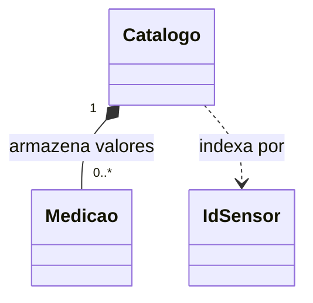

# 11. Identidade, igualdade e coleções de objetos

## Objetivos de aprendizagem

- Distinguir identidade, igualdade, ordenação e hash na definição de chaves estáveis.
- Escolher sequência, conjunto ou mapa e implementar um catálogo genérico.
- Verificar duplicatas, ausência, remoção e consulta polimórfica em C++ e Python.

**Tempo estimado:** 6h de estudo e prática, em incrementos sucessivos; a união não reduz a carga. Confira o [planejamento da turma](../../index.md).

## Vídeo de contexto


Curso em Vídeo — Dicionários. Use o trecho inicial sobre chaves como contexto: nesta aula investigaremos quando dois objetos podem representar a mesma chave; as operações de coleções serão praticadas no segundo incremento desta mesma aula.

---

**Percurso da aula:** o cadastro duplicado motiva a comparação de identificadores; esses mesmos identificadores tornam-se as chaves do catálogo. Depois ampliamos a coleção para outro tipo de valor e retomamos fontes polimórficas.

| Incremento | Branch existente | Validação |
|---|---|---|
| A — identidade e chaves | `pratica/12-igualdade` | `make test ETAPA=12` |
| B — catálogo e iteração | `pratica/13-colecoes` | `make test ETAPA=13` |

Os IDs técnicos dos testes permanecem estáveis. Integre A antes de iniciar B; uma unidade de 6h pode exigir mais de um encontro e prática orientada.

## 1. Mini-caso prático: cadastro duplicado

Dois formulários informam `LT-101`. Cada formulário constrói um `IdSensor` diferente. Se o cadastro usar apenas a identidade das instâncias, poderá registrar duas vezes o mesmo identificador.

A regra desta atividade é explícita: identificadores são iguais quando contêm **a mesma tag exata**. `LT-101` e `lt-101` continuam distintos. O valor momentâneo da leitura não participa da identidade do equipamento.

O sensor é uma entidade com estado mutável; `IdSensor` é um pequeno objeto de valor usado para identificá-lo. Não imponha “todos os atributos iguais” como regra universal para qualquer classe.

---

## 2. Retome o artefato e abra a branch

Use o próprio fork de [rafaelrezo/poo-fundamentos-estacao](https://github.com/rafaelrezo/poo-fundamentos-estacao), com **a etapa 11** concluída e integrada. O clone deve ter somente `origin`, apontando para o fork. Não copie arquivos dos repositórios das seções 01–06.

```bash
git switch main
git pull --ff-only origin main
git remote -v
git switch -c pratica/12-igualdade
make test ETAPA=12
```

O comando repete os contratos anteriores e inicialmente falha no comportamento ainda pendente desta seção. Leia a primeira mensagem; não altere testes ou automação para obter aprovação. Complete os incrementos abaixo e repita o mesmo comando.

---

## 3. Identidade não é igualdade

Dois objetos podem representar a mesma tag sem ocupar a mesma instância. `alias` é outro nome para o primeiro objeto; `b` é um segundo objeto. Preveja os quatro resultados no main antes de acompanhar a comparação na classe.

## 4. Incremento guiado: classe, comparação e cliente completos

[Baixe `exemplo_01_identidade.cpp`](exemplo_01_identidade.cpp) ou salve o programa completo:

```cpp
#include <functional>
#include <iostream>
#include <stdexcept>
#include <string>

class IdSensor {
    std::string valor_;
public:
    explicit IdSensor(std::string valor) : valor_(valor) {
        if (valor.empty()) throw std::invalid_argument("tag vazia");
    }
    const std::string& valor() const { return valor_; }
    bool operator==(const IdSensor& outro) const { return valor_ == outro.valor_; }
};

struct HashIdSensor {
    std::size_t operator()(const IdSensor& id) const {
        return std::hash<std::string>{}(id.valor());
    }
};

int main() {
    IdSensor a{"LT-101"};
    IdSensor b{"LT-101"};
    const IdSensor& alias = a;
    std::cout << std::boolalpha;
    std::cout << "Alias: " << (&alias == &a) << '\n';
    std::cout << "Mesma instancia: " << (&a == &b) << '\n';
    std::cout << "Mesmo valor: " << (a == b) << '\n';
    std::cout << "Mesmo hash: " << (HashIdSensor{}(a) == HashIdSensor{}(b)) << '\n';
}
```

```bash
g++ -std=c++17 -Wall -Wextra -Werror -pedantic exemplo_01_identidade.cpp -o exemplo
./exemplo
```

Saída esperada:

```text
Alias: true
Mesma instancia: false
Mesmo valor: true
Mesmo hash: true
```

[Baixe `exemplo_02_identidade.py`](exemplo_02_identidade.py) ou salve o programa completo:

```python
from dataclasses import dataclass


@dataclass(frozen=True, eq=False)
class IdSensor:
    valor: str

    def __post_init__(self):
        if not self.valor:
            raise ValueError("tag vazia")

    def __eq__(self, outro):
        if not isinstance(outro, IdSensor):
            return NotImplemented
        return self.valor == outro.valor

    def __hash__(self):
        return hash(self.valor)


def main():
    a = IdSensor("LT-101")
    b = IdSensor("LT-101")
    alias = a
    print(f"Alias: {alias is a}")
    print(f"Mesma instancia: {a is b}")
    print(f"Mesmo valor: {a == b}")
    print(f"Mesmo hash: {hash(a) == hash(b)}")


if __name__ == "__main__":
    main()
```

```bash
python3 exemplo_02_identidade.py
```

Saída esperada:

```text
Alias: True
Mesma instancia: False
Mesmo valor: True
Mesmo hash: True
```

O endereço C++ e `is` Python verificam identidade; `==` pede a igualdade definida para o valor. `NotImplemented` deixa Python continuar o protocolo de comparação com outro tipo; não é a exceção `NotImplementedError`.

O hash usa a mesma tag que a igualdade, mas a coincidência de hashes não prova igualdade: colisões são possíveis. Não use hash como identificador persistente. O conteúdo da chave deve permanecer estável; a leitura do sensor continua fora da chave.

**Aplique no fork:** complete apenas a igualdade em `identidade.hpp` e `identidade.py`, preservando a inicialização e o hash fornecidos. A ordenação existente no esqueleto ainda precisa ser implementada no próximo passo. A API C++ mantém o valor privado; `frozen=True` bloqueia atribuições usuais no objeto Python.

---

## 5. Prática de adaptação: ordenação e hash

Complete `operator<` e `__lt__` usando ordem lexicográfica da tag. A ordem atende a operações diferentes da igualdade: permite, por exemplo, listar identificadores em sequência estável. Para duas tags iguais, nenhuma deve ser menor que a outra.

O hash mostrado nos programas completos já é fornecido no starter e deriva da tag usada na igualdade.

Objetos iguais precisam ter o mesmo hash. O inverso não vale: hashes iguais podem ser colisões; a coleção ainda verifica igualdade. Não compare hashes para decidir se sensores são iguais e não grave esses números como identificadores persistentes. O valor numérico de hash pode variar entre execuções/implementações.

Mudar campos usados no hash enquanto a chave está em uma coleção pode comprometer a busca. Por isso usamos um identificador estável, separado da leitura mutável. Em Python, definir `__eq__` sem uma política apropriada de hash pode tornar a classe não utilizável como chave; não adicione um hash baseado em endereço a uma igualdade baseada no conteúdo.

---

## 6. Checkpoint e escolha de comparação

| Técnica/Padrão | Melhor uso | Esforço | Entregável | Limitação |
|---|---|---|---|---|
| Identidade | saber se referências apontam à mesma instância | baixo | `is` ou comparação de endereços | instâncias distintas podem representar valores iguais |
| Igualdade lógica | comparar significado no domínio | médio | `operator==` / `__eq__` | exige uma política explícita |
| Ordenação | apresentar ou indexar valores ordenados | médio | comparação consistente | não substitui igualdade nem hash |
| Hash + igualdade | localizar chaves em contêiner por hash | médio | chave estável e deduplicação | colisões existem; hash não é ID persistente |

`make test ETAPA=12` repete os testes anteriores. O novo contrato usa duas instâncias de `LT-101` e uma de `LT-102`; o conjunto deve ficar com **dois** elementos. Também verifica ordem, comparação com outro tipo em Python e rejeição de identificador vazio.

Se aparecem três entradas, confira igualdade/hash. Se identificadores diferentes desaparecem em um conjunto ordenado C++, revise `<`: `std::set` usa equivalência pela comparação, não o hash. Para cadastro, compare as tags; para verificar compartilhamento entre painéis, compare identidade.

## 7. Validação e entrega

```bash
make test ETAPA=12
git add include/identidade.hpp src/identidade.py docs/decisoes.md docs/diagrama.md AI_LOG.md
git commit -m "conclui igualdade com contratos cumulativos"
git push -u origin pratica/12-igualdade
```

Faça um commit do incremento guiado e outro da extensão quando ambos forem verificáveis. Abra PR da branch para a `main` **do próprio fork**; confira a execução de `make test ETAPA=12` na CI correspondente ao commit. Integre após testes verdes e revisão. Não abra PR contra o repositório-base.


Na main, a CI verifica apenas a baseline executável do starter. A entrega precisa da evidência funcional da branch/PR. Testes visíveis não comprovam entendimento: o docente revisa o diff e, em avaliação, exige defesa oral curta.

Continue no segundo incremento desta mesma aula depois de integrar o primeiro checkpoint.

---

## 8. Mini-caso prático: uma estação com várias medições

Até aqui consultamos objetos individuais. Agora a estação recebe medições de vários identificadores e precisa rejeitar cadastros duplicados, consultar por tag, remover registros e listar as chaves existentes.

Uma relação `0..*` no diagrama permite o catálogo vazio. Ela não determina sozinha a implementação. Precisamos decidir se a aplicação exige posição, unicidade ou acesso por chave.



O catálogo C++ armazena valores; o Python guarda referências a `Medicao`, declarada imutável no esqueleto. A composição aqui representa registros internos do catálogo, não propriedade sobre o equipamento físico.

---

## 9. Retome o artefato e abra a branch

Use o próprio fork de [rafaelrezo/poo-fundamentos-estacao](https://github.com/rafaelrezo/poo-fundamentos-estacao), com **a etapa 12** concluída e integrada. O clone deve ter somente `origin`, apontando para o fork. Não copie arquivos dos repositórios das seções 01–06.

```bash
git switch main
git pull --ff-only origin main
git remote -v
git switch -c pratica/13-colecoes
make test ETAPA=13
```

O comando repete os contratos anteriores e inicialmente falha no comportamento ainda pendente desta seção. Leia a primeira mensagem; não altere testes ou automação para obter aprovação. Complete os incrementos abaixo e repita o mesmo comando.

---

## 10. Escolher a coleção pelo problema

| Técnica/Padrão | Melhor uso | Esforço | Entregável | Limitação |
|---|---|---|---|---|
| Sequência: `vector` / `list` | ordem e iteração por elementos | baixo | histórico ou lista de fontes | admite duplicatas e não resolve busca por ID sozinha |
| Conjunto: `set` / `unordered_set` / Python `set` | pertencimento e unicidade | médio | identificadores sem repetição | critério de equivalência precisa ser correto |
| Mapa: `map` / `unordered_map` / Python `dict` | chave associada a um valor | médio | catálogo consultável por ID | é preciso definir política de duplicata e ausência |

Em C++, `set`/`map` usam comparação e mantêm ordenação; as variantes `unordered` usam hash e igualdade. Python `dict` usa chaves com hash e preserva a ordem de inserção; isso não equivale à ordenação por chave de `std::map`. Não baseie o contrato comum numa ordem que as duas estruturas não prometem da mesma maneira.

**Experimento curto Python:** crie `list`, `set` e `dict` com as mesmas três tags, sendo duas repetidas. Compare a quantidade e justifique qual estrutura preserva repetição. Depois conecte o resultado à política de igualdade implementada no primeiro incremento.

---

## 11. Incremento guiado: a chave passa a indexar objetos

Use primeiro textos curtos para observar inserção e busca, sem introduzir outra estrutura de dados de domínio. A ordenação da chave C++ já foi concluída no checkpoint A; o mapa usa essa ordem. Python usa igualdade e hash. O segundo cadastro da mesma tag deve ser rejeitado sem substituir o primeiro.

[Baixe `exemplo_03_catalogo.cpp`](exemplo_03_catalogo.cpp) ou salve o programa completo:

```cpp
#include <map>
#include <iostream>
#include <stdexcept>
#include <string>

class IdSensor {
    std::string valor_;
public:
    explicit IdSensor(std::string valor) : valor_(valor) {
        if (valor.empty()) throw std::invalid_argument("tag vazia");
    }
    const std::string& valor() const { return valor_; }
    bool operator<(const IdSensor& outro) const { return valor_ < outro.valor_; }
    bool operator==(const IdSensor& outro) const { return valor_ == outro.valor_; }
};

template<typename T>
class Catalogo {
    std::map<IdSensor, T> itens_;
public:
    bool inserir(const IdSensor& id, const T& item) {
        return itens_.emplace(id, item).second;
    }
    const T* buscar(const IdSensor& id) const {
        auto it = itens_.find(id);
        return it == itens_.end() ? nullptr : &it->second;
    }
};

int main() {
    Catalogo<std::string> catalogo;
    const bool primeira = catalogo.inserir(IdSensor{"LT-101"}, "Bancada A");
    const bool repetida = catalogo.inserir(IdSensor{"LT-101"}, "Bancada B");
    const auto* nome = catalogo.buscar(IdSensor{"LT-101"});
    std::cout << std::boolalpha << primeira << ' ' << repetida << '\n';
    if (nome) std::cout << *nome << '\n';
}
```

```bash
g++ -std=c++17 -Wall -Wextra -Werror -pedantic exemplo_03_catalogo.cpp -o exemplo
./exemplo
```

Saída esperada:

```text
true false
Bancada A
```

[Baixe `exemplo_04_catalogo.py`](exemplo_04_catalogo.py) ou salve o programa completo:

```python
from typing import Generic, TypeVar
from dataclasses import dataclass


@dataclass(frozen=True, eq=False)
class IdSensor:
    valor: str

    def __post_init__(self):
        if not self.valor:
            raise ValueError("tag vazia")

    def __eq__(self, outro):
        if not isinstance(outro, IdSensor):
            return NotImplemented
        return self.valor == outro.valor

    def __hash__(self):
        return hash(self.valor)


T = TypeVar("T")


class Catalogo(Generic[T]):
    def __init__(self):
        self._itens: dict[IdSensor, T] = {}

    def inserir(self, id, item):
        if id in self._itens:
            return False
        self._itens[id] = item
        return True

    def buscar(self, id):
        return self._itens.get(id)


def main():
    catalogo = Catalogo[str]()
    primeira = catalogo.inserir(IdSensor("LT-101"), "Bancada A")
    repetida = catalogo.inserir(IdSensor("LT-101"), "Bancada B")
    nome = catalogo.buscar(IdSensor("LT-101"))
    print(primeira, repetida)
    if nome is not None:
        print(nome)


if __name__ == "__main__":
    main()
```

```bash
python3 exemplo_04_catalogo.py
```

Saída esperada:

```text
True False
Bancada A
```

`T` permite reutilizar o catálogo para outro tipo de item. Adapte inserção e busca nos arquivos de coleções do fork; a chave `IdSensor` já existe, portanto não a redefina. Em seguida instancie com `Medicao`, preservando as mesmas operações. Remoção e listagem permanecem como extensão.

`emplace` informa se houve inserção; `find` devolve um iterador e `end` indica ausência. O ponteiro C++ não transfere posse: não o use depois da remoção do item ou destruição do catálogo. Em Python, `None` representa ausência; itens `None` não fazem parte do contrato desta atividade. Anotações não validam tipos automaticamente em execução.

---

## 12. Prática de adaptação: remover e listar

Complete `remover`, devolvendo verdadeiro somente quando havia um item para remover. Em C++, consulte `map::erase`; em Python, confira presença antes de `del`. Complete `ids()` produzindo o conjunto de chaves.

| Operação | Resultado exigido |
|---|---|
| buscar/remover no vazio | ausência/falso |
| inserir duas tags diferentes | quantidade dois |
| inserir novamente uma tag equivalente | falso, sem substituir a medição original |
| remover uma tag existente | verdadeiro, quantidade diminui |
| remover novamente | falso |
| listar identificadores | cada chave aparece uma vez |

O catálogo tem relação 1:N com seus registros. Uma coleção vazia é um estado válido; caso o domínio exigisse pelo menos um elemento, seria preciso impor essa invariante por uma API apropriada.

---

## 13. Coleção polimórfica e posse segura

O último incremento utiliza a interface da seção 09:

Neste último experimento, use as classes de fontes já concluídas no fork. Salve o cliente completo abaixo como `cliente_fontes.cpp` na raiz do fork. O include é o arquivo `include/fontes.hpp` da aula09, com a interface e as duas implementações; não é uma biblioteca externa.

```cpp
#include "fontes.hpp"
#include <iostream>
#include <memory>
#include <vector>

int main() {
    std::vector<std::unique_ptr<IFonteLeitura>> fontes;
    fontes.push_back(std::make_unique<FonteConstante>(12, "%"));
    fontes.push_back(std::make_unique<FonteConstante>(8, "%"));
    double total = 0;
    for (const auto& fonte : fontes) total += fonte->valor();
    std::cout << total << " %\n";
}
```

```bash
g++ -std=c++17 -Wall -Wextra -Werror -pedantic -Iinclude cliente_fontes.cpp -o cliente_fontes
./cliente_fontes
```

Saída: `20 %`. Aqui o programa é um cliente completo do projeto; os exemplos anteriores são independentes.


Cada `unique_ptr` é proprietário exclusivo de uma fonte; o vetor gerencia esses proprietários. O destrutor virtual da interface permite destruir corretamente cada implementação. `vector<IFonteLeitura>` não serve porque a interface é abstrata; copiar uma base concreta por valor também poderia descartar a parte derivada.

Complete `somarPercentuais` percorrendo por referência, consultando cada `fonte->valor()` e acumulando num total inicialmente zero. Não copie `unique_ptr` e não use `new`/`delete` manuais. As fontes desta simulação são não nulas e todas usam `%`.

Em Python, complete `somar_percentuais` percorrendo uma `list` de fontes e chamando `fonte.valor()`. A lista guarda referências; a mesma regra de consulta pela abstração permanece.

Essa soma é um experimento de iteração em valores da mesma unidade, não uma regra universal de supervisão: não some nível, temperatura e pressão como se fossem a mesma grandeza.

`make test ETAPA=13` verifica catálogo vazio, duplicatas, remoção, dois tipos para o genérico e coleção polimórfica com zero, uma e duas fontes. A etapa também repete todos os contratos anteriores. Erro de cópia de `unique_ptr` pede revisão do `const auto&`; chave ausente não deve virar um acesso inválido.

## 14. Validação e entrega

```bash
make test ETAPA=13
git add include/colecoes.hpp src/colecoes.py docs/decisoes.md docs/diagrama.md AI_LOG.md
git commit -m "conclui colecoes com contratos cumulativos"
git push -u origin pratica/13-colecoes
```

Faça um commit do incremento guiado e outro da extensão quando ambos forem verificáveis. Abra PR da branch para a `main` **do próprio fork**; confira a execução de `make test ETAPA=13` na CI correspondente ao commit. Integre após testes verdes e revisão. Não abra PR contra o repositório-base.

- [ ] O comando local repete e preserva as etapas anteriores deste starter.
- [ ] A extensão foi adaptada e os casos de fronteira foram explicados.
- [ ] `docs/decisoes.md` relaciona conceito, implementação e evidência.
- [ ] O diagrama corresponde ao estado atual do código.
- [ ] O PR inclui saída local e link da CI do commit.
- [ ] `AI_LOG.md` registra pedido, aceites/rejeições e justificativa, ou declara ausência de IA.

Na main, a CI verifica apenas a baseline executável do starter. A entrega precisa da evidência funcional da branch/PR. Testes visíveis não comprovam entendimento: o docente revisa o diff e, em avaliação, exige defesa oral curta.

Agora conclua a Parte 1 no [capítulo 12 — UML](../../modelagem_analise_codigo/index.md), representando o sistema até a etapa técnica13. Princípios e testes autorais abrirão a Parte 2 após essa oficina.

## Perguntas de revisão rápida

1. Como duas instâncias iguais como valor podem ocupar uma única chave do catálogo?
2. Quando uma coleção usa ordenação e quando usa igualdade e hash?
3. O que distingue o parâmetro de tipo do catálogo do despacho virtual na coleção de fontes?

## Fontes de referência

- [Python — identidade, igualdade e hash](https://docs.python.org/3/reference/datamodel.html#object.__hash__)
- [Python — dataclasses](https://docs.python.org/3/library/dataclasses.html)
- [C++ — requisitos de hash](https://eel.is/c++draft/hash.requirements)
- [C++ — contêineres](https://eel.is/c++draft/containers)
- [C++ — templates](https://eel.is/c++draft/temp)
- [Python — estruturas de dados](https://docs.python.org/3/tutorial/datastructures.html)
- [Python — tipos genéricos](https://docs.python.org/3/library/typing.html#generics)
