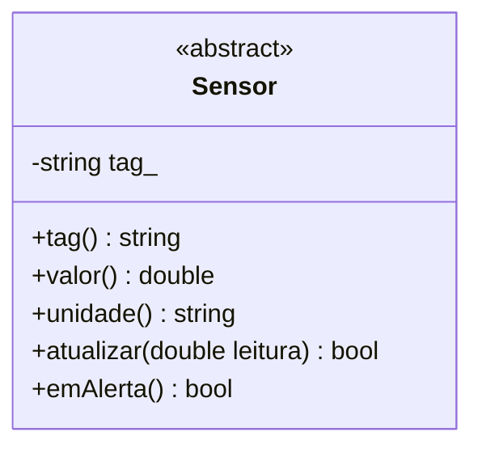
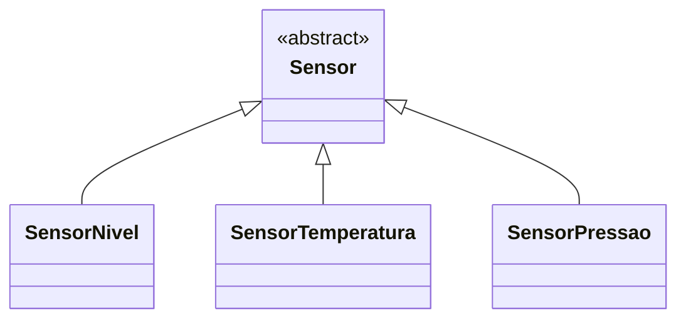
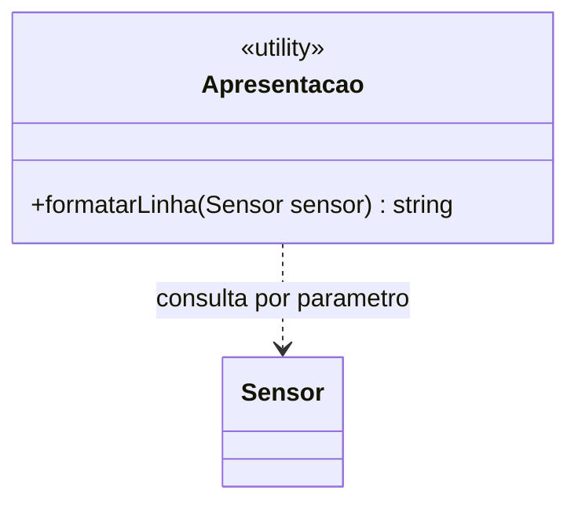
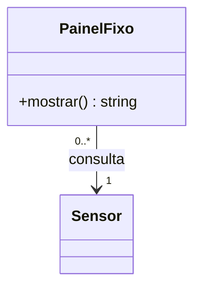
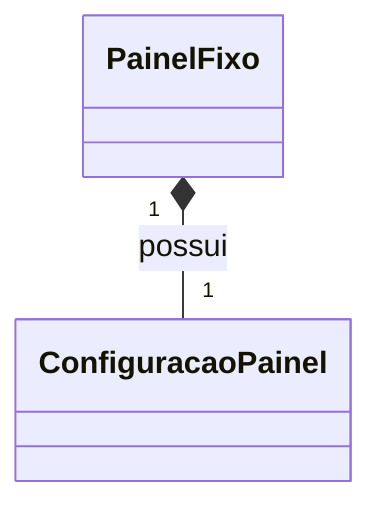
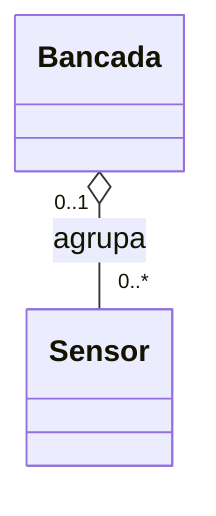
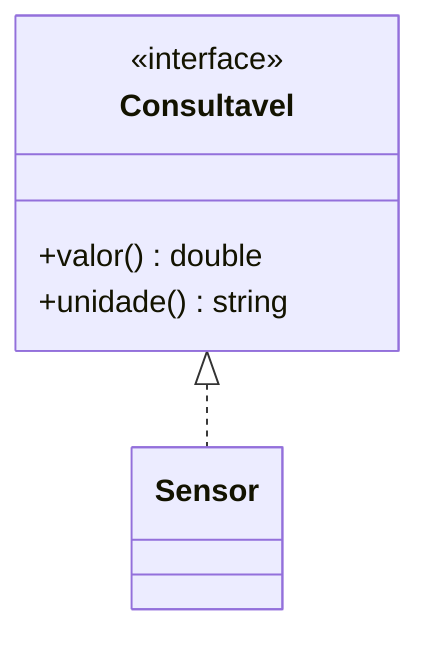

# 12. UML e modelagem de cenários: do requisito ao diagrama de classes

## Objetivos de aprendizagem

- Extrair classes, responsabilidades e regras de um cenário de engenharia.
- Ler e representar visibilidade, abstração, relações e multiplicidades em UML.
- Confrontar o modelo com C++ e Python e defender uma extensão em um pull request.

**Tempo estimado:** 4h de estudo e prática, distribuíveis entre sala e trabalho entre encontros. Esta seção encerra a Parte 1 após Identidade, Igualdade e Coleções (capítulo 11). Princípios de projeto e testes autorais serão a abertura da Parte 2. O vídeo é preparação prévia.

## Vídeo da aula


[Tutorial de Diagramas de Classes UML](https://www.youtube.com/watch?v=rDidOn6KN9k), em português, já utilizado no material de modelagem do curso. Durante o vídeo, desenhe um exemplo de herança e um de associação; depois explique para onde aponta cada símbolo.

---

## 1. Mini-caso prático: explicar a estação antes de ampliá-la

Na seção 08, um painel consultou sensores de nível, temperatura e pressão pelo contrato `Sensor`. O programa funciona, mas outra equipe precisa entender quem guarda a leitura, quem decide o alerta e quem apenas apresenta o resultado. Ler todos os arquivos antes de discutir uma mudança torna a revisão demorada.

Vamos produzir um modelo que responda a essas perguntas e usá-lo para analisar este pedido:

> A estação consulta sensores de nível, temperatura e pressão. Cada sensor possui identificação e mantém a última leitura válida. Uma atualização inválida preserva essa leitura. O painel apresenta o valor, a unidade e o alerta usando o contrato comum. Para a próxima versão, um operador poderá manter um painel ligado a um sensor instalado; trocar o painel não deve remover o sensor do cadastro.

Esta retomada usa o recorte polimórfico da seção 08 para aprender a ler notações. Na prática final, o modelo atual será o do fork cumulativo das seções 07 e 09–11: nele `Sensor` é uma base sem operações abstratas, e `IFonteLeitura` é a interface elaborada na seção 09. Não misture as duas versões no mesmo diagrama.

**Primeira ação:** destaque responsabilidades no texto. “Sensor” sugere uma classe; “última leitura” sugere estado; “apresentar” sugere uma operação. Nem todo substantivo vira classe: `unidade` pode continuar sendo um valor textual.

| Encontro | Atividades | Tempo |
|---|---|---:|
| 1 | cenário e responsabilidades; classes; herança e dependência; associação e multiplicidade; revisão do desenho | 15 + 20 + 30 + 35 + 20 min |
| 2 | retomada; composição, agregação e realização; ponte com código; extensão autônoma; PR e defesa | 10 + 25 + 20 + 40 + 25 min |

**Checkpoint inicial:** em dupla, explique por que o painel não deve guardar as regras de alerta. Isso recupera o polimorfismo e prepara a distribuição de responsabilidades.

---

## 2. Do texto para responsabilidades e classes

UML é uma linguagem de modelagem. Nesta aula, usamos o **diagrama de classes** para representar estrutura: tipos, operações e relações. Um diagrama de sequência responderia à ordem das mensagens; um diagrama de objetos mostraria instâncias em um instante. O foco aqui é construir e ler o modelo estrutural necessário ao curso.

Comece com uma tabela de responsabilidades, antes das setas:

| Candidato | Responsabilidade | Estado ou operação relevante | Decisão |
|---|---|---|---|
| `Sensor` | definir a interface comum e a identificação | tag e consultas abstratas | classe abstrata já existente |
| `SensorNivel` | validar nível e avaliar seu alerta | leitura, atualização, alerta | especialização existente |
| `SensorTemperatura` | validar temperatura e avaliar seu alerta | leitura, atualização, alerta | especialização existente |
| `SensorPressao` | validar pressão e avaliar seu alerta | leitura, atualização, alerta | especialização existente |
| função de apresentação | formatar o resultado do sensor recebido | consulta por parâmetro | função existente; não inventar uma classe no retrato do código |
| `PainelFixo` | manter vínculo com um sensor e apresentar suas consultas | referência ao sensor | proposta da próxima versão |

**Aplique agora:** registre essa tabela em seu rascunho de leitura da seção 08. Na prática final, produza `docs/diagrama.md` no fork cumulativo. Separe o **modelo atual**, conferido no código, do **modelo proposto**, ainda sem implementação. Essa distinção permite revisar uma ideia sem afirmar que ela já funciona.

**Como confirmar:** cada responsabilidade deve ter uma frase do requisito como justificativa. “Controlador herda de sensor porque lê o sensor” não passa: ler não significa ser um sensor.

---

## 3. Como ler a caixa de uma classe

Uma classe possui compartimentos para nome, atributos e operações. Na escrita UML usual, um atributo é `nome: Tipo` e uma operação é `nome(parâmetro: Tipo): Retorno`. Mermaid usa uma sintaxe textual própria para renderizar esse desenho.



O marcador indica que `Sensor` é abstrata. No código da aula 08, `tag()` é concreta e as quatro operações seguintes são abstratas; o diagrama resumido omite detalhes do construtor e destrutor. Em UML, nomes em itálico podem indicar elementos abstratos. Sempre explique a convenção adotada quando a ferramenta usar um marcador textual.

| Sinal | Visibilidade UML | Correspondência no curso |
|---|---|---|
| `+` | pública | operação oferecida ao cliente |
| `-` | privada | estado encapsulado |
| `#` | protegida | acesso previsto para subclasses |
| `~` | pacote | conhecer a notação; não equivale automaticamente a um recurso C++/Python |

`LT-101` é uma identificação de **objeto**, não o nome de uma classe. `SensorNivel` descreve o tipo de vários objetos possíveis. Também não confunda uma operação com seu algoritmo: o desenho informa a assinatura; a regra “nível menor que 20 dispara alerta” precisa de uma nota ou de um contrato escrito.

**Aplique agora:** acrescente `SensorNivel`, sua leitura privada e as operações relevantes. Anote a regra de atualização: valor fora de `0..100` é rejeitado sem alterar o estado.

**Como confirmar:** o leitor consegue diferenciar “consultar a leitura” de “alterar a leitura”? A visibilidade impede que o diagrama proponha acesso público direto ao estado? Isso prepara as relações entre as caixas.

---

## 4. Herança e dependência: desenhar o que já funciona

### 4.1 Generalização: “é um tipo de”



A linha é contínua e o triângulo vazio aponta para a classe **mais geral**, `Sensor`. Leia: “SensorPressao é um Sensor”. A base fica na ponta do triângulo independentemente de estar acima, abaixo ou ao lado no desenho.

A relação exige compatibilidade com o contrato: uma especialização que apaga a leitura ao rejeitar uma atualização não respeita o comportamento esperado. A seta, sozinha, não prova substituição correta.

### 4.2 Dependência: “precisa desse tipo para realizar algo”

A apresentação da aula 08 recebe um sensor por parâmetro e consulta suas operações; não mantém esse vínculo como estado. Isso é uma dependência de uso. Dependência também pode representar outros motivos pelos quais mudar um elemento afeta outro; não significa necessariamente “duração curta”.



A seta tracejada vai do **cliente** ao **elemento utilizado**. Aqui `Apresentacao` é um agrupamento visual da função, não uma classe já implementada; registre essa convenção no modelo atual.

**Checkpoint:** o painel depende de `Sensor` ou de cada especialização? Desenhe a dependência do contrato comum e explique por que incluir `SensorPressao` não exigiu editar o cliente. Agora podemos modelar um vínculo que permanece entre chamadas.

---

## 5. Associação e multiplicidade: quem conhece quem e quantos?

O pedido da próxima versão diz que `PainelFixo` mantém um sensor associado. Essa referência persistente motiva uma **associação**, representada por linha contínua. Uma seta aberta de navegabilidade informa que o painel consegue alcançar o sensor; uma linha sem setas não permite concluir automaticamente que o código navega nos dois sentidos.



Leia cada extremidade a partir de **um objeto da outra ponta**:

- para **um PainelFixo**, existe exatamente **um Sensor**, pois `1` está junto a `Sensor`;
- para **um Sensor**, podem existir **zero ou vários PainelFixo**, pois `0..*` está junto a `PainelFixo`.

O enunciado exige o primeiro limite; o segundo é uma **hipótese de projeto**: permitir vários painéis para o mesmo sensor. Registre-a e peça que o colega tente contradizê-la com um requisito.

| Multiplicidade | Leitura | Pergunta de validação |
|---|---|---|
| `1` | exatamente um | pode faltar? |
| `0..1` | nenhum ou um | como representar ausência? |
| `0..*` ou `*` | zero ou mais | o caso vazio é permitido? |
| `1..*` | um ou mais | quem garante o mínimo? |
| `2..4` | entre dois e quatro | onde o limite será validado? |

Multiplicidades descrevem instâncias permitidas; não são colocadas nas setas de generalização. Uma associação obrigatória exige uma decisão de construção/validação. Uma relação “muitos” retoma as coleções estudadas na seção 11, mas não escolhe automaticamente `vector`, `list` ou uma estratégia de posse.

**Aplique agora:** desenhe dois painéis ligados ao mesmo sensor em um rascunho de objetos. Depois tente desenhar um painel sem sensor. O primeiro caso satisfaz o modelo; o segundo o viola. Se a manutenção precisar permitir painel desconectado, altere conscientemente `1` para `0..1` e documente a mudança de regra.

---

## 6. Todo e parte: composição e agregação

Ter um atributo com outro objeto não determina, sozinho, a relação UML. Pergunte quem é responsável pela parte e se ela pode pertencer simultaneamente a outro todo.

### 6.1 Composição: posse exclusiva no modelo

Para esta simulação, suponha que cada painel crie sua própria configuração de exibição e seja responsável por sua existência. A configuração não é compartilhada entre painéis.



O losango **preenchido fica no todo**, `PainelFixo`. Na composição, uma parte pertence a no máximo um todo composto por vez; a destruição do todo envolve as partes que ainda lhe pertencem. O modelo pode admitir remover ou transferir uma parte antes disso, se houver regras explícitas.

Essa relação trata de objetos do software: encerrar o cadastro de uma estação não destrói fisicamente sensores. Não use a palavra “possui” do enunciado como prova suficiente de composição.

### 6.2 Agregação compartilhada: agrupamento explicitado



O losango **vazio fica no todo**, `Bancada`. Neste exemplo, o sensor pode estar sem bancada ou em uma bancada, e continua cadastrado quando ela é removida. A agregação compartilhada da UML tem semântica pouco restritiva; as regras específicas precisam ser documentadas. Associação simples costuma comunicar esse vínculo com menos ambiguidade.

**Aplique agora:** explique por que `PainelFixo *-- Sensor` contraria o requisito de trocar o painel sem remover o sensor. Corrija para associação. Depois justifique por que a configuração pode ser composição sob as hipóteses deste exemplo.

**Como confirmar:** apagar o painel deve afetar sua configuração própria; o cadastro do sensor deve continuar existindo. Nenhum losango deve aparecer sem uma regra sobre pertencimento e ciclo de vida.

---

## 7. Realização e guia de decisão das relações

Se a equipe definir uma interface `Consultavel` contendo apenas operações exigidas, uma classe que a implementa pode ser modelada por **realização**:



A linha é tracejada e o triângulo vazio aponta para a **interface**. Generalização especializa um tipo; realização indica cumprimento de uma especificação. A base `Sensor` da aula 08 também mantém estado e oferece comportamento concreto: seu desenho com as derivadas continua usando generalização. Não troque todas as setas de herança por realização só porque há métodos abstratos.

| Técnica/Padrão | Melhor uso | Esforço | Entregável | Limitação |
|---|---|---|---|---|
| Generalização `Base <\|-- Derivada` | especialização substituível | médio: conferir contrato | hierarquia justificada | semelhança de atributos não basta |
| Realização `Interface <\|.. Classe` | implementação de especificação | médio: explicitar operações | interface e realizador | desenho não prova comportamento |
| Associação `A --> B` | vínculo estrutural navegável de A para B | baixo: definir papéis e quantidades | relação com multiplicidades | não define posse |
| Agregação `Todo o-- Parte` | agrupamento com significado documentado | médio: esclarecer regras | todo e partes | semântica compartilhada pouco restritiva |
| Composição `Todo *-- Parte` | responsabilidade exclusiva pelas partes | médio: explicar ciclo de vida | todo com losango preenchido | exige mais que um atributo |
| Dependência `Cliente ..> Fornecedor` | uso de outro elemento | baixo: identificar motivo | cliente e elemento utilizado | não expressa vínculo estrutural por si só |

**Decisão por cenário:** especialização de sensor usa generalização; painel que recebe sensor só na chamada usa dependência; painel que mantém referência usa associação; configuração exclusiva pode usar composição. Prefira associação a agregação quando não houver uma regra adicional clara para comunicar.

---

## 8. Ponte C++ → Python: conferir o significado no código

Os recortes abaixo ilustram a proposta `PainelFixo`. São material de leitura: a prática desta aula entrega modelagem sobre o programa existente, sem implementar a extensão.

```cpp
class PainelFixo {
    const Sensor& sensor_;  // associação: não possui o sensor
public:
    explicit PainelFixo(const Sensor& sensor) : sensor_(sensor) {}
    double leitura() const { return sensor_.valor(); }
};
```

```python
class PainelFixo:
    def __init__(self, sensor: Sensor):
        self._sensor = sensor  # associação ao mesmo objeto

    def leitura(self):
        return self._sensor.valor()
```

O conceito comum é manter acesso a **um sensor existente**. Em C++, o sensor precisa viver mais tempo que o painel que o referencia. Em Python, a referência mantém o objeto alcançável; isso não transforma automaticamente a associação em composição UML. A anotação `Sensor` não impede, por si só, receber `None`: cumprir a multiplicidade continua sendo responsabilidade da implementação.

Compare também a generalização existente: `class SensorNivel : public Sensor` em C++ e `class SensorNivel(Sensor)` em Python. Ambas representam especialização. Já `private` restringe acesso em C++; o prefixo `_` em Python comunica uma convenção de uso interno.

**Checkpoint:** localize nos arquivos reais da aula 08 uma operação abstrata, uma sobrescrita e a função que consulta o sensor. Registre arquivo e nome da operação na tabela de rastreabilidade. Não atribua ao programa a classe `PainelFixo`, que ainda é proposta.

---

## 9. Prática cumulativa: diagrama do sistema testado

### 9.1 Retome o fork certo

Use seu fork de [rafaelrezo/poo-fundamentos-estacao](https://github.com/rafaelrezo/poo-fundamentos-estacao), com as etapas técnicas até 13 integradas (capítulo 11 concluído). O repositório da seção 08 serviu à prática de polimorfismo e permanece separado.

```bash
git switch main
git pull --ff-only origin main
git remote -v
make test ETAPA=13
git switch -c pratica/12-uml
```

O remoto único deve ser `origin`, apontando para o fork. Se seu fork foi criado antes desta reorganização, execute `curl -fsSL https://raw.githubusercontent.com/rafaelrezo/poo-fundamentos-estacao/main/.github/workflows/testes.yml -o .github/workflows/testes.yml` para obter o workflow atualizado; confira o diff e inclua esse arquivo no commit da entrega. Forks novos já o incluem. O comando atualiza somente o workflow público, sem substituir implementações nem adicionar remoto. A branch está prevista no workflow atualizado e executa `make test ETAPA=13` após cada push. Não há nova operação de código nesta seção: a revisão precisa preservar o sistema funcional e os testes fornecidos.

### 9.2 Modelo implementado: do código para o desenho

Atualize `docs/diagrama.md` em duas vistas legíveis, sem colocar todas as classes numa única figura:

1. **Tipos e colaboração:** `Sensor`, `SensorNivel`, `SensorTemperatura`, `PainelFixo`, `Bancada`, `IFonteLeitura`, `FonteNivel` e `FonteConstante`.
2. **Falhas e registros:** `FalhaLeitura`, `FalhaCalibracao`, `IdSensor`, `Medicao` e `Catalogo<T>`. `ControladorConsulta` e `PoliticaAlarme` pertencem à próxima parte; não os inclua como incrementos concluídos nesta vista.

No modelo implementado, identifique a base concreta, a interface abstrata, as realizações, associações, agregação documentada, composição e multiplicidade do catálogo. Marque o proprietário quando isso for relevante. Não transforme funções livres como `lerFonte` em classes supostamente presentes no código.

Para cada vista, registre três correspondências entre elemento visual e arquivo/operação, além de uma regra comportamental que o desenho não demonstra sozinho. Exemplo: a seta da fonte para a interface não prova que suas consultas preservam estado.

Renderize o Mermaid no GitHub ou no [Mermaid Live Editor](https://mermaid.live/). Faça um commit do modelo atual e execute `make test ETAPA=13` antes de seguir.

### 9.3 Modelo proposto: decidir uma extensão

Uma nova solicitação da mesma estação diz:

> Um técnico pode acompanhar vários sensores. Um sensor pode não ter técnico, ou ter apenas um responsável por vez. Trocar o técnico não remove sensores. Cada cadastro de sensor mantém uma configuração de calibração exclusiva, removida junto com esse cadastro. O painel continua consultando uma abstração.

Crie uma seção separada **Modelo proposto — manutenção**, sem afirmar que esses tipos já foram implementados. Escolha nomes e operações mínimas, justifique cada relação e explicite as multiplicidades nas duas pontas.

Confira os estados: sensor sem técnico permitido; dois responsáveis simultâneos proibidos; técnico com dois sensores permitido; troca de responsável preserva o sensor; compartilhamento de uma configuração exclusiva proibido. Explique ainda como relacionar o cadastro à entidade física sem confundir remoção do registro com destruição do equipamento.

Registre uma dúvida de requisito e a hipótese adotada. A extensão exige decisão do aluno; não há diagrama pronto para copiar. Sua implementação pode tornar-se um incremento do projeto da Parte 2.

### 9.4 Revisão e entrega

```bash
make test ETAPA=13
git add docs/diagrama.md docs/decisoes.md AI_LOG.md .github/workflows/testes.yml
git commit -m "modela manutencao e justifica relacoes UML"
git push -u origin pratica/12-uml
```

Abra PR para a `main` **do próprio fork**. Inclua as figuras renderizadas, o resultado local e a CI do commit. O revisor deve ler cada relação, confrontar as multiplicidades com os estados permitidos e comparar o modelo implementado ao código. Integre após revisão e testes verdes.

- [ ] As duas versões, implementada e proposta, estão identificadas.
- [ ] Base e interface correspondem às declarações reais.
- [ ] Cada losango possui justificativa de pertencimento e ciclo de vida.
- [ ] A relação 1:N corresponde às operações do catálogo.
- [ ] O desenho não atribui ao código classes que só existem na proposta.
- [ ] O PR inclui decisões técnicas e rastreabilidade de IA.

Em avaliação, faça defesa oral curta de uma relação, uma multiplicidade e uma alternativa rejeitada. O teste confirma regressões; a correção semântica do diagrama exige revisão humana.

---

## 10. Diagnóstico e fechamento da Parte 1

| Sintoma | O que verificar | Correção |
|---|---|---|
| triângulo aponta para a derivada | direção da generalização | apontar para a classe geral |
| losango aparece na parte | quem é o todo | reposicionar o losango |
| todo vínculo é composição | regra de posse | usar associação quando houver apenas referência |
| `*` foi lido como “pelo menos um” | mínimo permitido | usar `1..*` se zero for proibido |
| desenho exige classe ausente do código | modelo atual versus proposta | separar as duas visões |
| diagrama não renderiza | bloco e sintaxe | usar cerca `mermaid` e testar trecho mínimo |
| CI rejeita branch UML | branch ou fork incorretos | usar `pratica/12-uml` no fork cumulativo |

Ao terminar a Parte 1, o aluno deve conseguir sair de um cenário, distribuir responsabilidades, reconhecer oportunidades de composição e especialização, preservar contratos polimórficos e explicar o modelo com UML.

A Parte 1 termina com objetos colaborando, interfaces, falhas controladas, identidade e igualdade, coleções e validação pelos testes fornecidos. A [Parte 2 começa por Princípios de Projeto e Testes de Objetos](../parte-2-projeto/00-principios-testes/index.md). Depois, a arquitetura e a integração aplicam essa base a JSON, padrões, persistência e comunicação.

## Perguntas de revisão rápida

1. Um painel recebe um sensor somente por parâmetro; outro guarda uma referência. Como representar e justificar cada relação? O que muda ao trocar o painel?
2. Em `PainelFixo "0..*" --> "1" Sensor`, quantos sensores cada painel consulta e quantos painéis podem consultar um sensor? Qual mudança permite painel desconectado?
3. Por que `SensorNivel` pode especializar `Sensor`, mas um controlador que consulta sensores não deve herdar deles? Que evidência comportamental sustenta a primeira relação?

## Fontes de referência

- [OMG — UML 2.5.1](https://www.omg.org/spec/UML/2.5.1/About-UML): especificação de classes, associações, generalização e agregação.
- [Mermaid — diagramas de classes](https://mermaid.js.org/syntax/classDiagram.html): sintaxe de relações, visibilidade e multiplicidade.
- [GitHub Docs — criação de diagramas](https://docs.github.com/en/get-started/writing-on-github/working-with-advanced-formatting/creating-diagrams): renderização de Mermaid em Markdown.
- [GitHub Docs — sintaxe de workflows](https://docs.github.com/en/actions/reference/workflows-and-actions/workflow-syntax): gatilhos de branches e permissões.
- [C++ Core Guidelines — classes e hierarquias](https://isocpp.github.io/CppCoreGuidelines/CppCoreGuidelines#S-class): interface, invariantes e hierarquias.
- [Python Docs — classes](https://docs.python.org/3/tutorial/classes.html): referências, convenções de acesso e herança.
