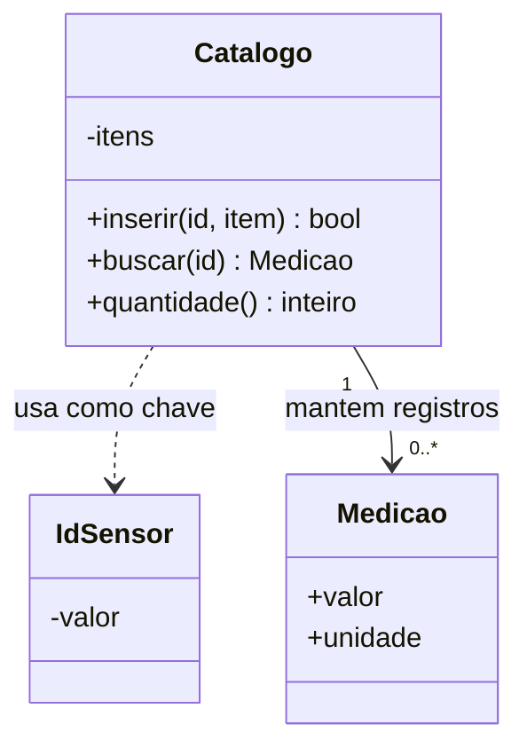
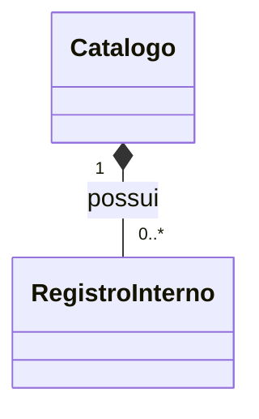
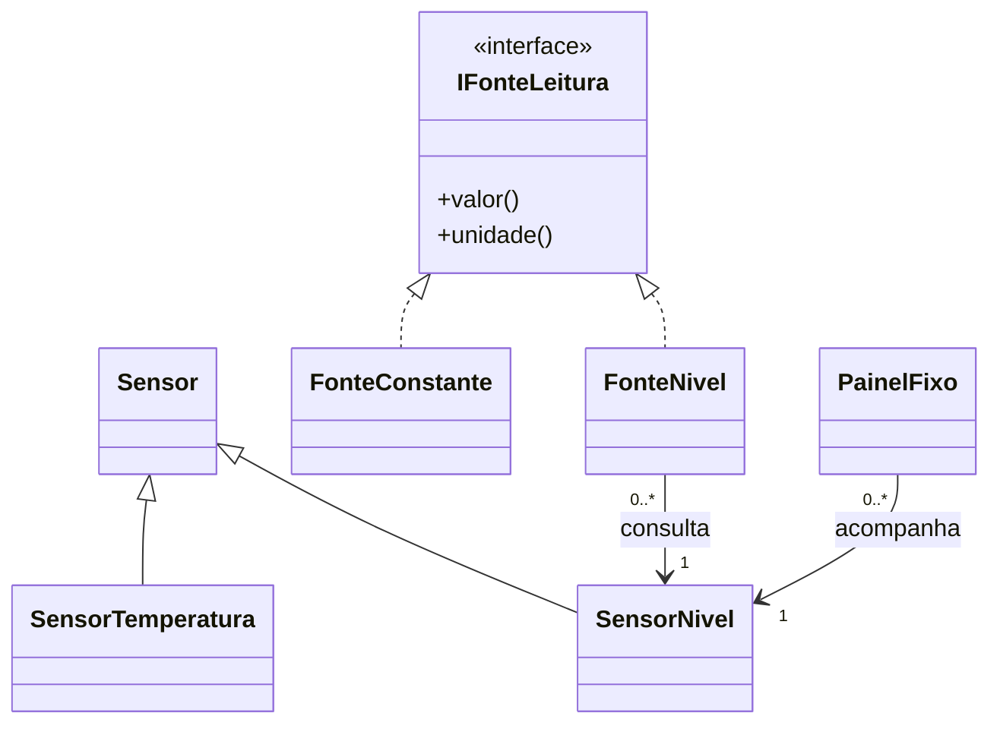

# UML e modelagem: explicar o catálogo antes de alterá-lo

## Objetivos de aprendizagem

- Extrair responsabilidades e regras do cenário já implementado.
- Relacionar classes, vínculos e multiplicidades ao código C++ e Python.
- Completar um catálogo e justificar seu modelo na prática integrada dos capítulos 11 e 12.

**Tempo estimado:** 2h em sala, com aproximadamente 60 min de modelagem dialogada e 60 min para a prática B; até 2h de trabalho orientado para conclusão, preparação e revisão. Esta é a segunda atividade integrada do bloco 09–12 e encerra a Parte 1.

## Vídeo da aula


Tutorial de Diagramas de Classes UML. Use o vídeo como apoio dentro do tempo de estudo: procure como a notação comunica uma decisão de modelagem.

---

## 1. Outra equipe precisa entender o cadastro

A estação consulta fontes, trata falhas e cadastra medições. Vamos continuar com o sistema dos capítulos 09–11. O pedido é:

> Um catálogo registra medições por identificadores estáveis. Uma tag duplicada não substitui a medição anterior. O catálogo pode estar vazio. O operador precisa remover um registro sem alterar o sensor instalado. Os painéis continuam consultando sensores externos.

Antes de desenhar, separe o que já funciona da mudança solicitada. Inserção e busca foram demonstradas no 11. Remoção será a extensão da prática B. O modelo deve deixar visível essa diferença.

UML é uma linguagem de modelagem. O diagrama de classes descreve a estrutura; ele ajuda a discutir responsabilidades e relações, mas não comprova, sozinho, a preservação da medição ao rejeitar duplicatas.

## 2. Encontrar responsabilidades antes das setas

| Elemento | Responsabilidade | Evidência no programa |
|---|---|---|
| `IdSensor` | representar uma chave estável | comparação pela tag |
| `Medicao` | representar o valor registrado e sua unidade | registro independente de uma nova consulta |
| `Catalogo` | inserir e localizar registros pela chave | `inserir`, `buscar`, `quantidade` |
| `SensorNivel` | manter o estado atual do sensor | `valor` e, no starter, `atualizar` |
| `PainelFixo` | consultar o sensor associado | vínculo introduzido no 09 |

“Operador” participa do cenário, mas não precisa virar classe se o programa não representa estado ou comportamento dele. “Tag” pode ser um texto dentro de `IdSensor`; nem todo substantivo pede outro objeto.

Comecemos pelo menor desenho que ajuda a ler o catálogo:



A caixa reúne nome, atributos e operações. `+` indica público; `-`, privado no modelo. O retorno de `buscar` foi abreviado: o contrato também admite ausência. Registre essa regra ao lado do diagrama. Em Python, o prefixo `_` expressa convenção de uso interno; não equivale à restrição `private` de C++.

## 3. Conferir o desenho em um programa completo

O catálogo continua específico de `Medicao` neste recorte. O `main` consulta um sensor e registra uma fotografia dessa leitura. Isso é diferente do painel do 09, que consulta o sensor a cada chamada.

### C++: o catálogo armazena o registro por valor

Programa independente: [exemplo_01_modelo.cpp](exemplo_01_modelo.cpp).

```cpp
#include <iostream>
#include <map>
#include <stdexcept>
#include <string>

class IdSensor {
    std::string valor_;
public:
    explicit IdSensor(std::string valor) : valor_(valor) {
        if (valor.empty()) throw std::invalid_argument("tag vazia");
    }
    const std::string& valor() const { return valor_; }
    bool operator<(const IdSensor& outro) const { return valor_ < outro.valor_; }
    bool operator==(const IdSensor& outro) const { return valor_ == outro.valor_; }
};

struct Medicao {
    double valor;
    std::string unidade;
};

class Catalogo {
    std::map<IdSensor, Medicao> itens_;
public:
    bool inserir(const IdSensor& id, const Medicao& item) {
        return itens_.emplace(id, item).second;
    }
    const Medicao* buscar(const IdSensor& id) const {
        auto it = itens_.find(id);
        return it == itens_.end() ? nullptr : &it->second;
    }
    std::size_t quantidade() const { return itens_.size(); }
};

class SensorNivel {
    double valor_;
public:
    explicit SensorNivel(double valor) : valor_(valor) {}
    double valor() const { return valor_; }
};

int main() {
    SensorNivel sensor{12};
    Catalogo catalogo;
    catalogo.inserir(IdSensor{"LT-101"}, {sensor.valor(), "%"});
    std::cout << "Registros: " << catalogo.quantidade() << '\n';
    std::cout << "Sensor: " << sensor.valor() << " %\n";
}
```

Execute:

```bash
g++ -std=c++17 -Wall -Wextra -Werror -pedantic exemplo_01_modelo.cpp -o exemplo_01_modelo
./exemplo_01_modelo
```

Resultado:

```text
Registros: 1
Sensor: 12 %
```

O catálogo recebe o número e a unidade. Ele não guarda uma referência ao sensor. Não há associação `Catalogo --> SensorNivel` só porque o `main` utiliza ambos. A dependência da operação de inserção é com a chave e o registro.

### Python: o catálogo guarda uma referência ao registro imutável

Programa independente: [exemplo_02_modelo.py](exemplo_02_modelo.py).

```python
from dataclasses import dataclass


@dataclass(frozen=True)
class IdSensor:
    valor: str

    def __post_init__(self):
        if not self.valor:
            raise ValueError("tag vazia")


@dataclass(frozen=True)
class Medicao:
    valor: float
    unidade: str


class Catalogo:
    def __init__(self):
        self._itens = {}

    def inserir(self, id, item):
        if id in self._itens:
            return False
        self._itens[id] = item
        return True

    def buscar(self, id):
        return self._itens.get(id)

    def quantidade(self):
        return len(self._itens)


class SensorNivel:
    def __init__(self, valor):
        self._valor = valor

    def valor(self):
        return self._valor


def main():
    sensor = SensorNivel(12)
    catalogo = Catalogo()
    catalogo.inserir(IdSensor("LT-101"), Medicao(sensor.valor(), "%"))
    print(f"Registros: {catalogo.quantidade()}")
    print(f"Sensor: {sensor.valor()} %")


if __name__ == "__main__":
    main()
```

Execute:

```bash
python3 exemplo_02_modelo.py
```

Resultado:

```text
Registros: 1
Sensor: 12 %
```

O significado do cadastro é igual, embora o armazenamento difira: C++ armazena o valor; Python guarda uma referência a `Medicao`. Uma variável externa pode manter outra referência à medição Python. Apagar uma entrada do catálogo não deve ser confundido com destruir o objeto físico ou todas as referências ao registro.

**Confirme:** localize em cada programa a chave, a medição e a construção do catálogo. Qual linha faria a quantidade crescer? Qual regra impede o segundo cadastro da mesma tag?

## 4. Quantos registros e quem é responsável por eles?

Na relação `Catalogo "1" --> "0..*" Medicao`, um catálogo pode ter zero ou vários registros. O limite mínimo zero precisa ser compatível com a construção e a busca no vazio.

A ponta `1` adota a visão de um registro pertencente a um catálogo neste cenário. Ela é uma regra do modelo; o Python apresentado não impede que o chamador compartilhe o mesmo objeto imutável entre catálogos. Se esse compartilhamento fizer parte do requisito, ajuste a multiplicidade junto de `Catalogo` para `0..*` e mantenha uma associação simples.

A implementação por valor C++ permite modelar os registros internos como partes do catálogo. Um modelo com composição exigiria explicitar que se trata dessas partes internas:



`RegistroInterno` aqui é uma **visão conceitual da entrada armazenada**, não uma classe declarada no programa. A parte pode ser removida antes do todo; composição não significa que toda parte deva existir até o fim do catálogo. Não desenhe composição com o sensor físico: o catálogo não controla sua existência.

| Multiplicidade | Pergunta para o requisito |
|---|---|
| `1` | é obrigatório ter exatamente um? |
| `0..1` | a ausência é um estado permitido? |
| `0..*` | vazio e vários são permitidos? |
| `1..*` | quem impede o conjunto vazio? |

**Teste mental:** um catálogo recém-criado é válido? Sim. Uma duplicata aumenta a quantidade? Não. O desenho ajuda a formular as perguntas; os testes e a leitura das operações confirmam as respostas.

## 5. Retomar as relações da estação sem misturar responsabilidades

Os capítulos 07 e 09–11 usam o mesmo starter. Nele `Sensor` guarda a tag e não declara operações abstratas; `IFonteLeitura` é o contrato abstrato. O tipo do capítulo 08 era outro recorte demonstrativo. Nesta aula, mantenha os nomes e as declarações do starter cumulativo.



O triângulo aponta para o tipo geral ou para a especificação. A generalização de `SensorNivel` diz que ele especializa `Sensor`; a realização de `FonteNivel` comunica que ela atende a `IFonteLeitura`. Em C++, a realização é implementada por herança pública da classe abstrata. A associação com o sensor é outra relação: ela fornece o objeto ao qual a fonte delega a consulta.

| Técnica/Padrão | Melhor uso | Esforço | Entregável | Limitação |
|---|---|---|---|---|
| Generalização | especialização compatível com a base | médio | hierarquia justificada | atributos parecidos não bastam |
| Realização | cumprimento de uma especificação | médio | interface e implementações | não demonstra todas as regras do contrato |
| Dependência | uso de um tipo ou operação | baixo | cliente e elemento necessário | não indica vínculo persistente sozinha |
| Associação | acesso estrutural a outro objeto | médio | vínculo com multiplicidades | não estabelece posse |
| Agregação compartilhada | agrupamento com regra adicional explícita | médio | todo e partes independentes | semântica pouco restritiva; associação pode bastar |
| Composição | responsabilidade exclusiva pelas partes | médio | modelo de pertencimento e ciclo de vida | requer distinguir registro interno e objeto externo |

Para o painel, associação expressa a regra observada. Para uma configuração exclusiva criada pelo painel, composição pode ser adequada. Na bancada de uma vaga fornecida pelo starter, remover o vínculo preserva o sensor; não há motivo para transformar isso em composição.

## 6. Decidir uma mudança e prever suas consequências

A remoção deve responder a três situações: catálogo vazio, chave existente e chave já removida. Antes de implementar, registre as respostas e confronte o modelo.

```text
catalogo vazio -> inserir LT-101 -> quantidade 1
quantidade 1 -> remover LT-101 -> quantidade 0
quantidade 0 -> remover LT-101 novamente -> ausencia
sensor externo -> continua com a mesma leitura em todos os passos
```

O diagrama estrutural não explica sozinho essa sequência. Uma pequena tabela de estados e a saída do teste complementam as setas. Separe o modelo atual da operação proposta; depois da implementação, atualize o modelo com a evidência observada.

---

## 7. Prática integrada B — catálogo e modelo do mesmo sistema

Esta é a **única entrega dos capítulos 11 e 12**. Use o fork de fundamentos iniciado no capítulo 07; a prática A agora tem repositório próprio e não é pré-requisito de arquivos para esta entrega. A infraestrutura de identidade, ordenação, hash, genericidade e iteração polimórfica está fornecida. Você implementará inserção, busca e remoção, e explicará o modelo; não haverá uma atividade UML separada.

### 7.1 Retomar e observar a pendência

```bash
git switch main
git pull --ff-only origin main
git remote -v
git switch -c pratica/integrada-b
make test ETAPA=B
```

Somente `origin` deve apontar para seu fork de [poo-fundamentos-estacao](https://github.com/rafaelrezo/poo-fundamentos-estacao). O teste repete os contratos de colaboração e exceções fornecidos neste starter e da comparação fornecida. Não migre o código da prática A. A primeira pendência nova pede a inserção de objetos no catálogo.

### 7.2 Incremento guiado — inserir e buscar

Em `include/colecoes.hpp` e `src/colecoes.py`, complete `inserir` e `buscar` usando os programas da seção 4 e 5 do capítulo 11 como guia. No starter, o tipo do item é genérico (`T`), mas as operações são as mesmas. Preserve `IdSensor`, `quantidade`, `ids` e a infraestrutura fornecida.

Confirme com `make test ETAPA=B`: inserção, duplicata, busca e listagem devem passar; o próximo diagnóstico será a remoção ainda incompleta. Faça o commit do incremento guiado:

```bash
git add include/colecoes.hpp src/colecoes.py
git commit -m "insere e busca sem sobrescrever cadastros repetidos"
```

### 7.3 Extensão — remover e explicar o que permanece

Implemente `remover` com resposta verdadeira apenas quando a chave existia. Consulte as operações de remoção da coleção escolhida. A solução da extensão não está no starter nem nos programas demonstrativos.

| Ação | Resultado exigido |
|---|---|
| buscar ou remover no vazio | ausência ou falso |
| inserir duas tags diferentes | dois registros |
| inserir outra instância de uma tag existente | falso; registro anterior preservado |
| remover uma chave existente | verdadeiro; quantidade diminui |
| remover a mesma chave novamente | falso |
| consultar sensor externo após remover registro | sensor continua válido |

Execute `make test ETAPA=B` até obter `OK pratica integrada B (C++ e Python)`. Os testes de base deste repositório continuam ativos. Não altere os testes nem a CI para obter aprovação.

Em `docs/diagrama.md`, desenhe a vista do catálogo com `IdSensor`, `Medicao` e as operações implementadas. Registre três correspondências entre elemento do desenho e arquivo/operação. Acrescente uma vista pequena de colaboração com `FonteNivel`, `IFonteLeitura` e `SensorNivel`, retomando a prática A sem desenhar todo o projeto.

Justifique as multiplicidades e a escolha entre associação e composição, distinguindo armazenamento C++ e Python. Relacione a remoção à independência do sensor. Registre em `docs/decisoes.md` uma hipótese de domínio e uma alternativa rejeitada. O modelo entregue deve representar o código final; se discutir uma mudança ainda não implementada, identifique-a separadamente como proposta.

### 7.4 Entrega única e passagem para o projeto

```bash
git add include/colecoes.hpp src/colecoes.py docs/diagrama.md docs/decisoes.md AI_LOG.md
git commit -m "remove registros e justifica o modelo do catalogo"
git push -u origin pratica/integrada-b
```

Abra **uma PR da branch para a `main` do próprio fork**, com evidências locais e link da CI do commit. A branch executa o mesmo `make test ETAPA=B` a cada push. Revise o diff e integre somente com a prática completa e testes verdes.

- [ ] Duplicatas e remoções respeitam os resultados previstos.
- [ ] O modelo corresponde às classes e operações presentes.
- [ ] As multiplicidades e a política de posse têm justificativa.
- [ ] A PR reúne código, diagrama renderizado, decisões, validação local e remota.
- [ ] `AI_LOG.md` registra pedidos, aceites/rejeições e justificativas, ou ausência de IA.

A CI verifica comportamento e regressões, não a semântica do diagrama. A revisão deve confrontar desenho, requisito e código; em avaliação, faça uma defesa oral curta de uma relação e de uma decisão de implementação.

A Parte 1 termina com **duas práticas integradas neste bloco**. A [Parte 2 começa por Princípios de Projeto e Testes de Objetos](../parte-2-projeto/00-principios-testes/index.md), usando a mesma base após integrar B. Não é necessário abrir as branches antigas de igualdade, coleções ou UML como entregas adicionais.

## Perguntas de revisão rápida

1. Por que o catálogo pode usar uma chave e uma medição sem manter associação com o sensor físico?
2. Que diferença existe entre multiplicidade permitida no modelo e comportamento comprovado pelos testes?
3. O que permanece após remover um registro em C++ e Python? Que hipótese justificaria composição em cada caso?

## Fontes de referência

- [OMG — UML 2.5.1](https://www.omg.org/spec/UML/2.5.1/About-UML).
- [Mermaid — diagramas de classes](https://mermaid.js.org/syntax/classDiagram.html).
- [Python — classes](https://docs.python.org/3/tutorial/classes.html).
- [C++ — map::erase](https://en.cppreference.com/w/cpp/container/map/erase).
- [Python — tipos de mapeamento](https://docs.python.org/3/library/stdtypes.html#mapping-types-dict).
- [GitHub Docs — criação de diagramas](https://docs.github.com/en/get-started/writing-on-github/working-with-advanced-formatting/creating-diagrams).
