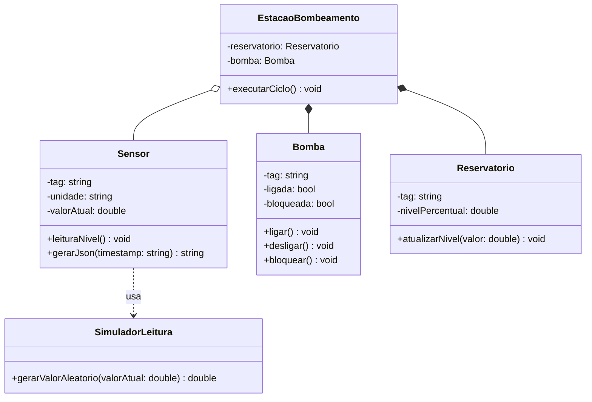

# Aula 1 - Cenário e Modelagem da Estação de Bombeamento

## Objetivos de aprendizagem

- Revisar o cenário da estação de bombeamento e transformar requisitos em classes iniciais.
- Documentar o contrato JSON entre dispositivo C++ e supervisor Python.
- Diferenciar associação, agregação e composição no modelo do projeto.

**Tempo estimado:** 1h30.

## Vídeo da aula


---

## 1. Contextualização do problema

Uma estação de bombeamento move fluido de um reservatório para outro ponto do processo. Em uma planta real, haveria sensores, atuadores, painéis, intertravamentos, alarmes e redes industriais.

Nesta disciplina, o problema será reduzido ao essencial:

- um reservatório com nível simulado;
- uma bomba que pode estar ligada, desligada ou bloqueada;
- sensores que geram leituras;
- um dispositivo C++ que simula a parte local;
- um supervisor Python/Streamlit que mostra os dados para o usuário.

Você não precisa dominar hidráulica, redes industriais ou controle automático para modelar bem os objetos desta etapa. A automação é o contexto; POO é o conteúdo principal.

---

## 2. Separação em duas camadas

O sistema terá duas camadas:

| Camada | Linguagem | Responsabilidade | Não deve fazer |
|---|---|---|---|
| Dispositivo | C++ | simular sensores, bomba e regras locais | desenhar interface gráfica |
| Supervisor | Python/Streamlit | ler JSON, exibir tabela, gráfico e resumo | controlar atributo interno de objetos C++ |

Essa separação reforça uma ideia de engenharia de software: cada parte do sistema deve ter uma responsabilidade clara.

### Fluxo inicial

```text
Dispositivo C++ -> leitura.json -> Supervisor Python/Streamlit
```

Mais tarde, o arquivo será substituído por comunicação TCP. O contrato JSON continuará sendo o acordo entre as camadas.

---

## 3. Contrato JSON da primeira versão

```json
{
  "tag": "LT-101",
  "valor": 58.4,
  "unidade": "%",
  "timestamp": "2026-03-25T10:30:00-03:00",
  "status": "operando"
}
```

### Regras do contrato

- `tag` deve identificar o sensor ou ativo de forma estavel.
- `valor` deve ser numérico.
- `unidade` deve acompanhar o valor.
- `timestamp` deve registrar quando a leitura foi gerada.
- `status` deve ser um texto controlado, como `operando`, `alerta`, `falha` ou `manutencao`.

### Exemplo de leitura ém Python

```python
import json
from pathlib import Path

conteudo = Path("dados/leitura.json").read_text(encoding="utf-8")
leitura = json.loads(conteudo)

print(leitura["tag"], leitura["valor"], leitura["unidade"])
```

---

## 4. Modelagem inicial

As primeiras classes do projeto serão:

| Classe | Responsabilidade | Relacao principal |
|---|---|---|
| `Sensor` | representar uma fonte de leitura | base para sensores específicos |
| `Bomba` | representar atuação de bombeamento | parte da estação |
| `Reservatorio` | guardar informações de nível e limites | associado a sensores |
| `Supervisor` | consumir e apresentar dados | separado do dispositivo |
| `EstacaoBombeamento` | coordenar sensores, bomba e regras | compõe a simulação |

### Diagrama inicial



### Leitura do diagrama

- A estação **compõe** uma bomba e um reservatório no modelo simplificado.
- A estação **agrega** sensores porque pode haver vários sensores conectados.
- O sensor executa a leitura por `leituraNivel()`, mas a geração aleatória fica separada em uma função de simulação.
- `gerarJson(timestamp)` recebe o timestamp pronto para deixar claro que o instante da leitura é calculado no ciclo de aquisição.
- O supervisor não aparece dentro da composição da estação; ele observa dados produzidos por ela.

---

## 5. Exemplo aplicado em C++: sensor contínuo por simulação local

O jeito mais simples de simular um sensor industrial localmente é criar um **simulador de software**:

- o programa C++ gera um valor novo a cada segundo;
- cada leitura é gravada em uma linha de um arquivo `.jsonl`;
- o supervisor Python/Streamlit lê esse arquivo periodicamente;
- nenhum driver, porta serial virtual ou recurso especial do sistema é necessário.

Esse formato se chama **JSON Lines**: cada linha do arquivo é um JSON completo.

```text
dados/leituras.jsonl
```

```cpp
#include <algorithm>
#include <chrono>
#include <ctime>
#include <filesystem>
#include <fstream>
#include <iomanip>
#include <iostream>
#include <random>
#include <sstream>
#include <string>
#include <thread>

using namespace std;
namespace fs = std::filesystem;

/*
    Função externa ao objeto.
    Responsável apenas por gerar o valor aleatório.
*/
double gerarValorAleatorio(double valorAtual) {
    static random_device rd;
    static mt19937 gerador(rd());

    normal_distribution<double> variacao(0.0, 1.8);

    return clamp(
        valorAtual + variacao(gerador),
        0.0,
        100.0
    );
}

string timestampAtual() {
    time_t agora = time(nullptr);
    tm tempoLocal{};

#ifdef _WIN32
    localtime_s(&tempoLocal, &agora);
#else
    localtime_r(&agora, &tempoLocal);
#endif

    ostringstream saida;
    saida << put_time(&tempoLocal, "%Y-%m-%dT%H:%M:%S");
    saida << "-03:00";

    return saida.str();
}

class Sensor {
private:
    string tag;
    string unidade;
    double valorAtual;

public:
    Sensor(string tag, string unidade)
        : tag(tag), unidade(unidade), valorAtual(50.0) {}

    /*
        Método de negócio:
        representa a leitura do sensor.
    */
    void leituraNivel() {
        valorAtual = gerarValorAleatorio(valorAtual);
    }

    string gerarJson(const string& timestamp) const {
        return "{\"tag\":\"" + tag +
               "\",\"valor\":" + to_string(valorAtual) +
               ",\"unidade\":\"" + unidade +
               "\",\"timestamp\":\"" + timestamp +
               "\",\"status\":\"operando\"}";
    }
};

int main() {
    fs::create_directories("dados");

    Sensor nivel("LT-101", "%");

    ofstream arquivo(
        "dados/leituras.jsonl",
        ios::app
    );

    if (!arquivo) {
        cerr << "Não foi possível abrir dados/leituras.jsonl\n";
        return 1;
    }

    for (int ciclo = 0; ciclo < 60; ciclo++) {
        /*
            Agora o objeto executa a leitura,
            mas a geração aleatória fica fora dele.
        */
        nivel.leituraNivel();

        string json = nivel.gerarJson(
            timestampAtual()
        );

        arquivo << json << "\n";
        arquivo.flush();

        cout << json << endl;

        this_thread::sleep_for(
            chrono::seconds(1)
        );
    }

    return 0;
}
```

Para compilar com um compilador C++ configurado no seu ambiente:

```bash
g++ -std=c++17 simulador_sensor.cpp -o simulador_sensor
./simulador_sensor
```

Se estiver usando uma IDE, use o comando de compilação e execução equivalente. O ponto importante é gerar o arquivo `dados/leituras.jsonl` no diretório do projeto.

Para uma simulação sem limite de tempo, troque o `for` por `while (true)`. Durante os primeiros testes, manter 60 ciclos facilita encerrar a execução e conferir o arquivo gerado.

Neste primeiro momento, o JSON pode ser montado manualmente. Mais adiante, você poderá usar uma biblioteca própria para JSON se o projeto crescer.

---

## 6. Exemplo aplicado em Python/Streamlit

```python
import time
from pathlib import Path

import pandas as pd
import streamlit as st

st.title("Estacao de Bombeamento")

caminho = Path("dados/leituras.jsonl")
auto_atualizar = st.sidebar.checkbox("Atualizar automaticamente", value=True)

if caminho.exists():
    df = pd.read_json(caminho, lines=True)
    ultimas = df.tail(30)
    ultima = ultimas.iloc[-1]

    st.metric("Ultima leitura", f"{ultima['valor']:.1f} {ultima['unidade']}")
    st.dataframe(ultimas)
    st.line_chart(ultimas, x="timestamp", y="valor")
else:
    st.warning("Arquivo de leituras ainda não encontrado.")

if auto_atualizar:
    time.sleep(1)
    st.rerun()
```

Execute primeiro o simulador C++ em um terminal. Depois, em outro terminal, execute:

```bash
streamlit run supervisor_python/app.py
```

Esse arranjo se comporta como uma aquisição contínua: o C++ representa o dispositivo local e o Streamlit representa o supervisor.

---

## 7. Exercícios práticos

1. Criar a pasta do projeto com `dispositivo_cpp/`, `supervisor_python/` e `dados/`.
2. Escrever o contrato JSON no `README.md`.
3. Criar uma classe `Sensor` simples em C++ capaz de gerar leituras contínuas em JSON Lines.
4. Criar um app Streamlit que leia o arquivo `leituras.jsonl`, mostre uma tabela e um gráfico.
5. Desenhar o diagrama inicial em Mermaid no `README.md`.

---

## 8. Checklist de entrega

- [ ] O repositório possui `README.md`, `AI_LOG.md` e pastas principais.
- [ ] O contrato JSON inicial está documentado.
- [ ] Existe uma classe `Sensor` em C++.
- [ ] O simulador C++ gera leituras contínuas em `dados/leituras.jsonl`.
- [ ] O supervisor Python consegue ler o histórico JSON Lines.
- [ ] O diagrama inicial mostra pelo menos `Sensor`, `Bomba`, `Reservatorio`, `Supervisor` e `EstacaoBombeamento`.

---

## 9. Perguntas de revisão rápida

1. Qual é a diferença entre a camada de dispositivo e a camada de supervisor?
2. Por que `EstacaoBombeamento` pode compor uma `Bomba`, mas apenas agregar sensores?
3. O que aconteceria se cada equipe inventasse nomes diferentes para os campos do JSON?

---

## 10. Desafios opcionais

- Criar um campo `descricao` para cada sensor sem quebrar o contrato mínimo.
- Adicionar `Reservatorio` ao código C++ com atributo de capacidade nominal.
- Fazer o supervisor mostrar uma mensagem diferente para `operando`, `alerta` e `falha`.

---

## Fontes de referência

- [cppreference - Classes](https://en.cppreference.com/w/cpp/language/classes)
- [Python Docs - json](https://docs.python.org/3/library/json.html)
- [Streamlit Docs - st.dataframe](https://docs.streamlit.io/develop/api-reference/data/st.dataframe)
- [Mermaid - Class diagrams](https://mermaid.js.org/syntax/classDiagram.html)
