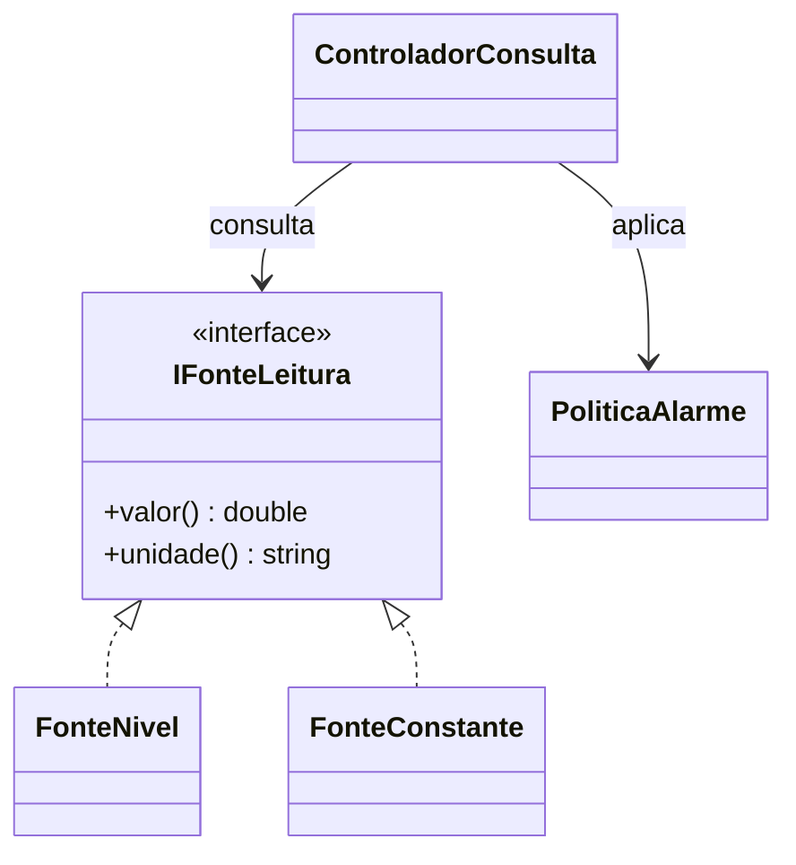

# Arquitetura do projeto: cenário, responsabilidades e contrato

## Objetivos de aprendizagem

- Transformar um cenário de monitoramento em responsabilidades e critérios de aceite.
- Reaproveitar as abstrações da Parte 1 sem misturar domínio e serialização.
- Registrar uma arquitetura inicial verificável em UML e no fork da equipe.

**Tempo estimado:** 2h, incluídas no marco 1 do projeto.

## Vídeo de contexto


---

## 1. De onde partimos?

O fork da [estação de fundamentos](https://github.com/rafaelrezo/poo-fundamentos-estacao) já contém as implementações concluídas até a abertura de Princípios e Testes da Parte 2. `SensorNivel` e `SensorTemperatura` preservam estado válido; `IFonteLeitura` permite substituição; `PoliticaAlarme` decide sobre um valor e `ControladorConsulta` coordena a consulta. Coleções e testes já estão disponíveis.

O problema novo é levar uma leitura do processo C++ até outro processo em Python. Comece por um caminho pequeno e completo: consultar, representar, transportar e apresentar uma leitura.

## 2. Mini-caso prático: estação de monitoramento

A estação consulta nível e temperatura, registra o instante de cada aquisição e apresenta um alarme quando a regra configurada é satisfeita. Uma leitura indisponível deve ser identificada; dados antigos não podem ser apresentados como uma nova aquisição bem-sucedida.

Registre em `docs/decisoes.md` três critérios de aceite: uma leitura chega ao supervisor com unidade correta; uma falha de aquisição é distinguida de uma linha inválida; trocar uma fonte mantém o código cliente dependente da abstração. Acrescente os limites de escopo escolhidos pela equipe.

## 3. Distribuir responsabilidades

| Componente | Responsabilidade | Evidência |
|---|---|---|
| Sensores e fontes | preservar invariantes e oferecer leitura | testes da Parte 1 |
| Controlador e política | coordenar consulta e decidir alarme | testes com fonte substituta |
| Serializador, a implementar | converter um registro em JSON | parsing e validação do contrato |
| Transporte, a implementar | mover registros por arquivo e depois TCP | teste entre processos |
| Supervisor, a implementar | validar entrada e apresentar resultado | teste do consumidor |

Serializar não é responsabilidade de `Sensor`. Em C++, adapte objetos a um registro de telemetria; em Python, valide o registro recebido antes de usá-lo na apresentação.


```mermaid
classDiagram
    class IFonteLeitura {
        <<interface>>
        +valor() double
        +unidade() string
    }
    class FonteNivel
    class FonteConstante
    class ControladorConsulta
    class PoliticaAlarme
    IFonteLeitura <|.. FonteNivel
    IFonteLeitura <|.. FonteConstante
    ControladorConsulta --> IFonteLeitura : consulta
    ControladorConsulta --> PoliticaAlarme : aplica
```

O diagrama registra a colaboração da base existente. Acrescente serializador e supervisor como proposta, marcando o que ainda será implementado. Justifique posse e multiplicidade; a existência de vários objetos, sozinha, não caracteriza agregação.

## 4. Aplicar agora no fork

```bash
git switch main
git pull --ff-only origin main
git switch -c projeto/01-arquitetura
make test-projeto
```

Atualize `docs/diagrama.md` e `docs/decisoes.md`. Para cada requisito, identifique objeto responsável, fronteira entre processos e teste que confirmará o resultado. Não altere o contrato booleano de `SensorNivel.atualizar`: uma proposta rejeitada continua retornando falso e preservando o estado.

## 5. Comparar formas de integração

| Técnica/Padrão | Melhor uso | Esforço | Entregável | Limitação |
|---|---|---|---|---|
| Arquivo JSONL | primeiro caminho completo | baixo | produtor e consumidor reproduzíveis | atualização depende da leitura do arquivo |
| TCP com enquadramento JSONL | comunicação contínua | médio | dois processos conectados | exige lidar com fragmentação e desconexões |

Comece pelo arquivo no marco 2. Passe a TCP no marco 5, preservando os testes do contrato de dados.

## 6. Confirmar e preparar o próximo marco

Execute novamente `make test-projeto`. Nesta etapa documental ele valida a base existente; a revisão humana verifica responsabilidades e correspondência com o código. Faça commit, push para `origin` e PR para a main do próprio fork, com resultado local, link da CI e decisões justificadas. Registre uso de IA e explicação do aluno.

A próxima atividade implementa o [contrato JSONL](02-integracao-json/index.md). O marco 2 termina com [integração resiliente](03-excecoes-consolidacao/index.md), aplicando o tratamento de exceções já estudado.

## Perguntas de revisão rápida

1. Por que o sensor não deve conhecer o formato da tela?
2. Qual relação do diagrama expressa uso de uma abstração?
3. Qual evidência ainda falta quando apenas os testes da Parte 1 estão verdes?

## Fontes de referência

- [C++ Core Guidelines — interfaces](https://isocpp.github.io/CppCoreGuidelines/CppCoreGuidelines#S-interfaces)
- [Python — classes](https://docs.python.org/3/tutorial/classes.html)
- [JSON — RFC 8259](https://www.rfc-editor.org/rfc/rfc8259)
