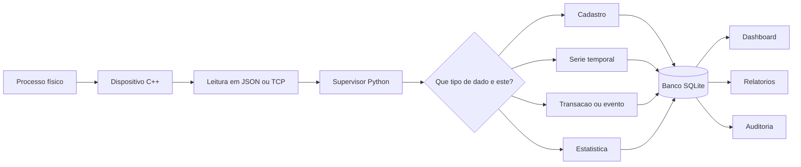
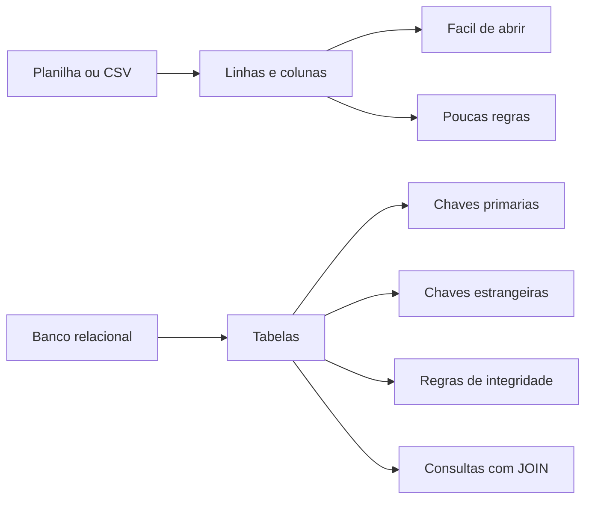
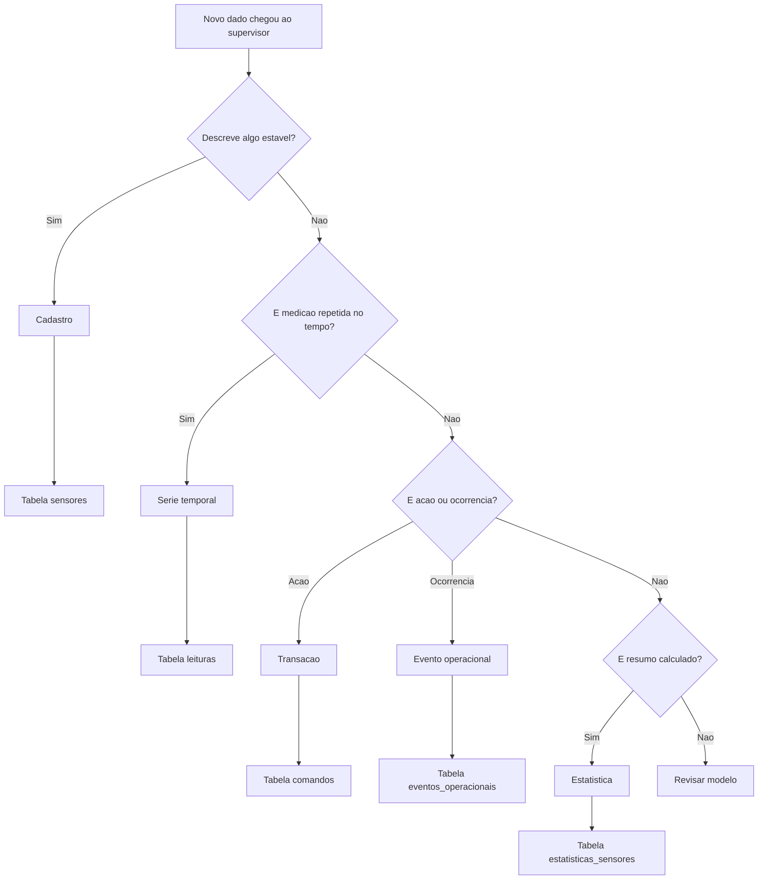
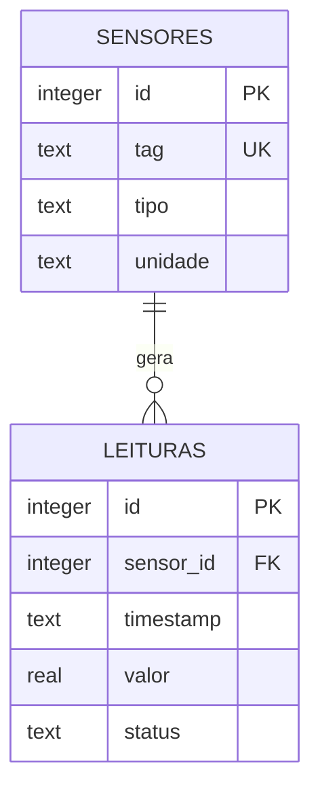
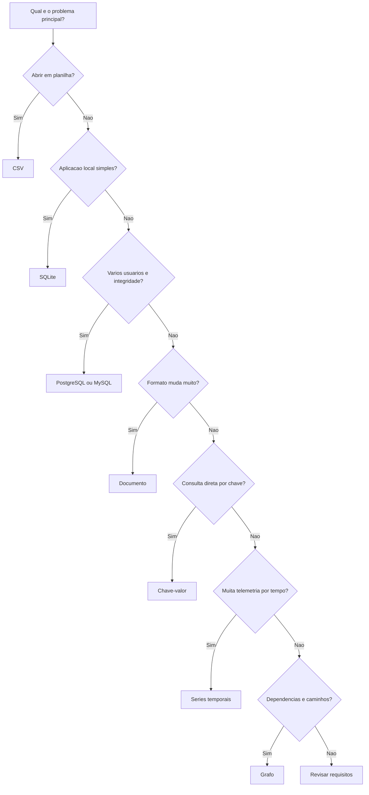
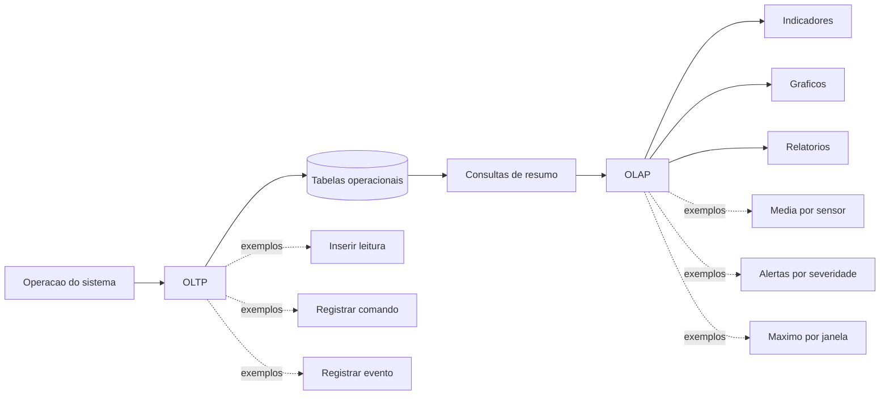
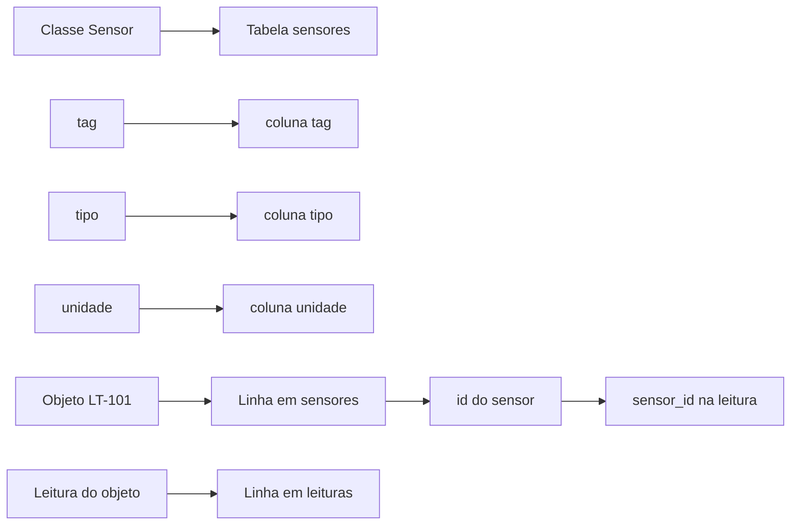
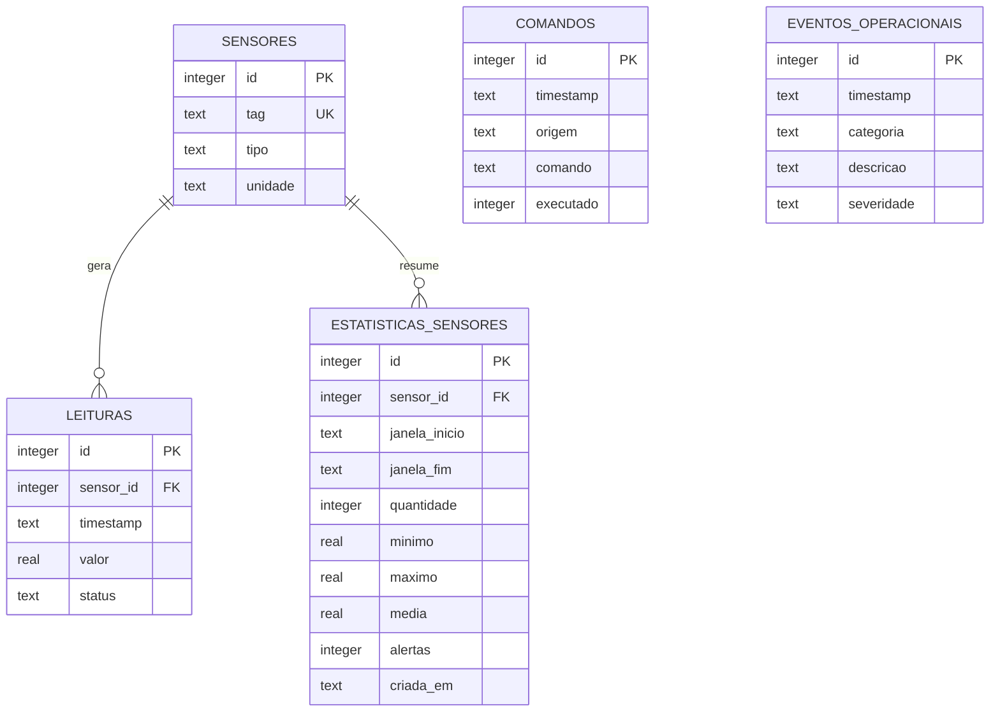
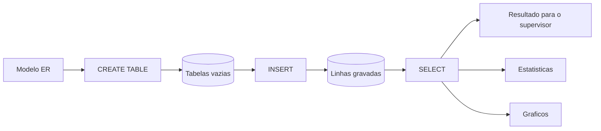

# Bancos de dados no supervisório: histórico, transações e estatísticas

## Objetivos de aprendizagem

- Explicar por que um sistema supervisório precisa de memória operacional.
- Diferenciar cadastro, evento transacional, série temporal e estatística.
- Construir um primeiro modelo relacional com tabelas, chaves primárias, chaves estrangeiras e consultas SQL básicas.

**Tempo estimado:** 3h.

## Vídeo de contexto


---

## 1. O problema: o valor atual não conta a história

Nas aulas anteriores, o sistema já tinha uma divisão clara:

- o **dispositivo C++** representa sensores, regras e objetos próximos do campo;
- o **supervisor Python** recebe dados, valida informações e apresenta o estado da estação;
- JSON, arquivos ou rede funcionam como meios de troca entre as partes.

Isso permite responder:

**"Como a estação está agora?"**

Mas um sistema de engenharia quase nunca para nessa pergunta. Depois de alguns minutos de operação, surgem outras:

- quando o nível ficou baixo pela última vez?
- quantas falhas ocorreram no turno?
- qual sensor mais gerou alerta?
- que comando foi enviado antes de uma parada?
- a pressão média aumentou depois de uma alteração operacional?
- o operador reconheceu o alarme ou ele ficou pendente?

Essas perguntas exigem **histórico**. Banco de dados entra exatamente nesse ponto: ele dá memória ao sistema.

No mini-SCADA da disciplina, o banco fica do lado do supervisor:

```text
Dispositivo C++              Supervisor Python               Banco SQLite
sensores e regras  --->      valida, exibe e decide  --->    histórico e consultas
      JSON/TCP                    Streamlit/API                    .db
```

Leitura prática:

- C++ continua focado na modelagem orientada a objetos do campo;
- Python concentra visualização, validação, importação e consultas;
- SQLite permite praticar banco de dados sem instalar servidor.

A ideia central desta aula é:

**antes de escolher tabelas ou escrever SQL, precisamos entender que tipo de informação o sistema está tentando lembrar.**

### Esquema geral da aula



Leitura do esquema:

- o dispositivo gera ou envia dados;
- o supervisor interpreta e classifica;
- o banco guarda cada informação na estrutura adequada;
- o dashboard consulta o banco, não apenas o último valor recebido.

---

## 2. Vocabulário mínimo de banco de dados

Para começar sem pressupor experiência prévia, use esta leitura:

| Termo | Ideia simples | Exemplo no supervisório |
|---|---|---|
| Banco de dados | conjunto organizado de dados persistentes | arquivo `supervisorio.db` |
| SGBD | software que gerencia o banco | SQLite, PostgreSQL, MySQL |
| Tabela | conjunto de registros do mesmo tipo | `sensores`, `leituras`, `comandos` |
| Linha ou registro | uma ocorrência dentro da tabela | uma leitura de `LT-101` às 10h |
| Coluna ou campo | uma informação de cada registro | `timestamp`, `valor`, `status` |
| Chave primária ou `PK` | identificador único da linha | `sensores.id` |
| Chave única ou `UK` | valor que não pode se repetir | `sensores.tag` |
| Chave estrangeira ou `FK` | referência para uma linha de outra tabela | `leituras.sensor_id` aponta para `sensores.id` |
| SQL | linguagem para criar, inserir e consultar dados | `SELECT`, `INSERT`, `CREATE TABLE` |

Uma planilha ajuda a visualizar a ideia de tabela, mas banco de dados vai além da planilha porque pode impor regras.

Exemplo de planilha simples:

| tag | tipo | unidade |
|---|---|---|
| `LT-101` | `nivel` | `%` |
| `PT-201` | `pressao` | `bar` |

Em banco relacional, podemos dizer:

- `tag` não pode ficar vazia;
- `tag` não pode repetir;
- uma leitura precisa pertencer a um sensor existente;
- consultas podem combinar tabelas diferentes.

Essa última regra é a primeira grande ligação com modelagem: os dados não ficam apenas "guardados"; eles ficam **organizados para preservar relações do domínio**.

### Esquema mental: planilha versus banco



O ponto não é abandonar CSV. O ponto é entender quando CSV deixa de ser suficiente.

---

## 3. Primeiro classifique os dados

Em um supervisório, nem tudo que chega ao sistema tem a mesma natureza. Misturar todos os dados em uma única tabela parece simples no início, mas dificulta consulta, validação e manutenção.

Uma boa pergunta inicial é:

**"Este dado descreve uma coisa, um fato, uma medição ou um resumo?"**

| Natureza do dado | O que representa | Exemplo | Tabela provável |
|---|---|---|---|
| Cadastro | algo relativamente estável do domínio | sensor `LT-101`, tipo `nivel`, unidade `%` | `sensores` |
| Série temporal | medição repetida ao longo do tempo | nível de `LT-101` a cada segundo | `leituras` |
| Transação | fato discreto que aconteceu | operador enviou `ligar_bomba` | `comandos` |
| Evento operacional | ocorrência relevante para rastrear | alarme de nível baixo | `eventos_operacionais` |
| Estatística | resumo calculado a partir do histórico | média, mínimo e máximo de `LT-101` | `estatisticas_sensores` |

### Dados transacionais

Dados transacionais registram **fatos discretos**. Eles normalmente respondem:

- quem fez?
- o que fez?
- quando fez?
- qual foi o resultado?
- qual entidade foi afetada?

Exemplo:

```text
2026-05-26T10:05:00-03:00 | operador | ligar_bomba | executado
```

Esse registro não é uma medição contínua. Ele é uma ocorrência. Por isso, combina com uma tabela como `comandos`.

### Séries temporais

Séries temporais registram **medições repetidas associadas ao tempo**.

Exemplo de pontos de uma série temporal:

| timestamp | tag | valor | unidade | status |
|---|---|---:|---|---|
| `2026-05-26T10:00:00-03:00` | `LT-101` | `42.0` | `%` | `operando` |
| `2026-05-26T10:00:01-03:00` | `LT-101` | `42.3` | `%` | `operando` |
| `2026-05-26T10:00:02-03:00` | `LT-101` | `42.5` | `%` | `operando` |
| `2026-05-26T10:00:03-03:00` | `LT-101` | `85.0` | `%` | `alerta` |

Esse tipo de dado normalmente responde:

- como o valor mudou ao longo do tempo?
- qual foi o mínimo, máximo e média?
- quando saiu da faixa?
- qual tendência aparece no gráfico?

### Comparação direta

| Aspecto | Dado transacional | Série temporal |
|---|---|---|
| Pergunta principal | "O que aconteceu?" | "Como o valor variou?" |
| Exemplo | comando enviado | leitura de sensor |
| Frequência | eventual | repetitiva |
| Consulta comum | contar comandos por resultado | filtrar leituras por intervalo de tempo |
| Cuidado principal | rastreabilidade e integridade | volume, ordenação e agregação |

Essa diferença é importante porque evita uma modelagem confusa. `ligar_bomba` e `LT-101 = 42%` são informações do mesmo sistema, mas não têm a mesma estrutura.

### Fluxo de classificação

Use este esquema antes de criar qualquer tabela:



### Exemplos no mesmo instante operacional

| Situação | Classificação | Tabela |
|---|---|---|
| existe um sensor chamado `LT-101` | cadastro | `sensores` |
| `LT-101` mediu `42%` às 10h | série temporal | `leituras` |
| operador enviou `ligar_bomba` às 10h05 | transação | `comandos` |
| ocorreu alarme de nível baixo | evento operacional | `eventos_operacionais` |
| média de `LT-101` no turno foi `51.3%` | estatística | `estatisticas_sensores` |

---

## 4. Séries temporais em banco relacional

Um erro comum é pensar que série temporal só pode existir em um banco especializado. Bancos de séries temporais ajudam quando há muito volume e alta frequência, mas o **conceito de série temporal** também pode ser modelado em um banco relacional como SQLite, PostgreSQL ou MySQL.

Nesta disciplina, vamos armazenar séries temporais em SQLite para aprender o desenho essencial:

- uma tabela de cadastro identifica o sensor;
- uma tabela de histórico guarda as medições;
- cada medição aponta para o sensor por chave estrangeira;
- consultas usam tempo, sensor e agregações.

### Separação entre cadastro e histórico

O sensor é relativamente estável. A leitura muda a cada medição.

Por isso, não faz sentido guardar tudo como se fosse a mesma coisa.



Leitura:

- `sensores` guarda quem é o sensor;
- `leituras` guarda o que foi medido;
- `sensor_id` liga cada leitura ao sensor correto;
- `timestamp` informa quando a medição aconteceu.

### Modelo ruim: repetir cadastro em toda leitura

Este modelo funciona no início, mas cria repetição e risco de inconsistência:

| timestamp | tag | tipo | unidade | valor | status |
|---|---|---|---|---:|---|
| `10:00:00` | `LT-101` | `nivel` | `%` | `42.0` | `operando` |
| `10:00:01` | `LT-101` | `nivel` | `%` | `42.3` | `operando` |
| `10:00:02` | `LT-101` | `nível` | `%` | `42.5` | `operando` |

Problema:

- `nivel` pode aparecer escrito de formas diferentes;
- mudar a unidade ou corrigir o cadastro exige mexer em muitas linhas;
- a tabela mistura cadastro com histórico.

### Modelo melhor: separar sensor e leitura

Tabela `sensores`:

| id | tag | tipo | unidade |
|---:|---|---|---|
| `1` | `LT-101` | `nivel` | `%` |
| `2` | `PT-201` | `pressao` | `bar` |

Tabela `leituras`:

| id | sensor_id | timestamp | valor | status |
|---:|---:|---|---:|---|
| `1` | `1` | `2026-05-26T10:00:00-03:00` | `42.0` | `operando` |
| `2` | `1` | `2026-05-26T10:00:01-03:00` | `42.3` | `operando` |
| `3` | `1` | `2026-05-26T10:00:02-03:00` | `42.5` | `operando` |
| `4` | `2` | `2026-05-26T10:00:00-03:00` | `2.7` | `operando` |

Vantagem:

- o cadastro fica em um lugar só;
- o histórico cresce sem duplicar informações estáveis;
- consultas conseguem filtrar por sensor e intervalo de tempo;
- a chave estrangeira evita leitura sem sensor válido.

### Colunas recomendadas para histórico

Uma tabela de série temporal simples deve responder:

**"Quem mediu, quando mediu, quanto mediu e em que condição?"**

| Coluna | Papel | Boa prática |
|---|---|---|
| `id` | identifica a linha | usar chave primária simples |
| `sensor_id` | liga a leitura ao sensor | usar `FK` para `sensores(id)` |
| `timestamp` | informa o instante da medição | usar formato ISO 8601 com fuso quando possível |
| `valor` | guarda a medição numérica | usar `REAL` para valores contínuos |
| `status` | registra condição operacional | padronizar valores como `operando`, `alerta`, `falha` |

Em sistemas maiores, também podem aparecer:

- `qualidade`: boa, estimada, inválida;
- `origem`: dispositivo, simulação, importação;
- `recebido_em`: quando o supervisor recebeu a leitura;
- `janela` ou `bucket`: agrupamento por minuto, hora ou turno.

### Boas práticas para séries históricas

| Prática | Por que importa |
|---|---|
| Separar cadastro de histórico | evita repetição de `tag`, `tipo` e `unidade` em todas as leituras |
| Salvar timestamp padronizado | facilita ordenação, filtro por período e comparação |
| Não sobrescrever leitura histórica | histórico deve preservar o que aconteceu |
| Usar chave estrangeira | garante que toda leitura pertença a um sensor conhecido |
| Indexar colunas de busca frequente | melhora consultas por sensor e tempo |
| Validar antes de gravar | evita histórico poluído por payload incompleto |
| Manter transações separadas do histórico | comando de operador não deve virar leitura de sensor |

Exemplo de índice útil:

```sql
CREATE INDEX idx_leituras_sensor_tempo
ON leituras (sensor_id, timestamp);
```

Esse índice ajuda consultas como:

```sql
SELECT timestamp, valor, status
FROM leituras
WHERE sensor_id = 1
  AND timestamp >= '2026-05-26T10:00:00-03:00'
  AND timestamp < '2026-05-26T11:00:00-03:00'
ORDER BY timestamp;
```

### O que não colocar na tabela de leituras

Nem tudo que tem `timestamp` é série temporal de sensor.

| Informação | Tabela mais adequada | Motivo |
|---|---|---|
| comando `ligar_bomba` | `comandos` | é uma ação discreta |
| alarme reconhecido | `eventos_operacionais` | é uma ocorrência rastreável |
| média horária | `estatisticas_sensores` | é resumo calculado |
| cadastro da unidade `%` | `sensores` | é atributo estável do sensor |

A separação evita que a tabela `leituras` vire uma mistura de medições, comandos, alarmes e resumos. Em engenharia, essa clareza ajuda a defender o modelo e a manter o sistema.

---

## 5. Tipos de banco de dados

Depois de entender a natureza dos dados, faz sentido discutir tecnologias.

Nem todo banco foi criado para o mesmo problema. Em sistemas reais, a escolha depende do tipo de dado, do volume, da frequência de escrita, das consultas e da necessidade de integridade.

Na disciplina, usaremos SQLite como banco principal porque ele permite praticar tabelas, chaves e SQL sem instalar servidor. Mesmo assim, é importante saber onde outras opções aparecem.

| Técnica/Padrão | Melhor uso | Esforço | Entregável | Limitação |
|---|---|---:|---|---|
| CSV | histórico pequeno, inspeção manual e exportação simples | baixo | arquivos `.csv` | pouca integridade e consultas limitadas |
| SQLite | protótipo, aplicação local e histórico estruturado | baixo/médio | arquivo `.db` | não é ideal para muitos usuários escrevendo ao mesmo tempo |
| PostgreSQL/MySQL | sistema multiusuário com dados relacionais | médio/alto | servidor de banco | exige administração e configuração |
| Documento | dados flexíveis próximos de JSON | médio | coleções de documentos | relacionamentos complexos podem ficar difíceis |
| Chave-valor | cache, sessão e consulta direta por chave | baixo/médio | pares chave/valor | não resolve bem consultas analíticas |
| Séries temporais | telemetria frequente e métricas por tempo | médio/alto | medições indexadas por tempo | menos adequado para cadastros e transações gerais |
| Grafo | redes de relacionamento, dependências e caminhos | alto | nós e arestas | pode ser excessivo para CRUD comum |

### Mapa rápido de escolha



### CSV

Um CSV é aceitável quando a necessidade é simples: registrar linhas e abrir depois em uma planilha.

```csv
timestamp,tag,valor,unidade,status
2026-05-26T10:00:00-03:00,LT-101,42.0,%,operando
2026-05-26T10:01:00-03:00,PT-201,2.7,bar,operando
```

Impacto: rápido para começar, fraco para garantir integridade. Nada impede, por si só, uma linha com `valor=erro` ou `tag` inexistente.

### SQLite

SQLite guarda tabelas em um único arquivo. Para a disciplina, ele é o melhor ponto de partida entre simplicidade e rigor.

```sql
CREATE TABLE sensores (
    id INTEGER PRIMARY KEY AUTOINCREMENT,
    tag TEXT NOT NULL UNIQUE,
    tipo TEXT NOT NULL,
    unidade TEXT NOT NULL
);
```

Impacto: permite `PRIMARY KEY`, `FOREIGN KEY`, `JOIN`, filtros e estatísticas sem instalar servidor.

### PostgreSQL ou MySQL

PostgreSQL e MySQL são bancos relacionais usados quando o sistema precisa operar como serviço para vários usuários.

Exemplo de uso:

- operadores acessam o supervisório em computadores diferentes;
- engenheiros registram manutenção;
- comandos precisam de auditoria;
- relatórios precisam consultar dados compartilhados.

Impacto: melhora operação multiusuário e integridade centralizada, mas exige servidor, backup, usuários, permissões e administração.

### Documento

Bancos de documento armazenam registros parecidos com JSON. Eles são úteis quando cada equipamento envia um formato diferente.

```json
{
  "equipamento": "inversor-01",
  "timestamp": "2026-05-26T10:00:00-03:00",
  "payload": {
    "tensao": 220.4,
    "corrente": 8.1,
    "firmware": "2.4.0"
  }
}
```

Impacto: flexível para integrar fontes heterogêneas. A limitação aparece quando o sistema precisa de muitos relacionamentos fortes, como ordem de serviço, sensor, área, operador, comando e auditoria.

### Chave-valor

Bancos chave-valor são bons para buscar um valor diretamente por uma chave.

```text
ultimo:LT-101 -> {"valor": 42.0, "status": "operando"}
ultimo:PT-201 -> {"valor": 2.7, "status": "operando"}
```

Impacto: ótimo para cache e estado atual. Ruim para perguntas como "qual foi a média do nível nas últimas 6 horas?".

### Séries temporais

Bancos de séries temporais são especializados em medições que chegam continuamente e sempre têm tempo associado.

Exemplo de consulta conceitual por janela de tempo:

```sql
SELECT
    tag,
    MIN(valor) AS minimo,
    MAX(valor) AS maximo,
    AVG(valor) AS media
FROM leituras
WHERE timestamp >= '2026-05-26T10:00:00-03:00'
  AND timestamp < '2026-05-26T11:00:00-03:00'
GROUP BY tag;
```

Impacto: adequado para gráfico, tendência, agregação por janela de tempo e telemetria em alta frequência. No curso, simularemos esse comportamento em SQLite usando a tabela `leituras`.

### Grafo

Bancos de grafo representam entidades como nós e conexões como arestas.

```text
(Bomba B-101)-[:ALIMENTA]->(Linha L-01)
(Sensor PT-201)-[:MONITORA]->(Linha L-01)
(Linha L-01)-[:ENVIA_PARA]->(Tanque TQ-01)
```

Impacto: útil para perguntas de dependência, como "quais sensores são afetados se a linha L-01 parar?". Para a atividade de SQLite, seria complexidade desnecessária.

### Recomendação prática por cenário

- Use CSV quando a prioridade for aprender o fluxo e abrir o arquivo em planilha.
- Use SQLite quando precisar de tabelas, filtros, `JOIN`, estatísticas e um arquivo local simples.
- Use PostgreSQL ou MySQL quando o sistema tiver vários usuários e precisar operar como serviço.
- Use banco de séries temporais quando houver telemetria intensa e consultas por janelas de tempo.
- Use documento quando o formato dos registros mudar muito e o relacionamento entre tabelas não for o ponto central.
- Use chave-valor para cache e consulta direta do estado atual.
- Use grafo quando a pergunta principal envolver caminhos, dependências e impacto entre componentes.

---

## 6. OLTP e OLAP

Além de distinguir o tipo de banco, é importante distinguir o **tipo de uso** do banco.

### OLTP

OLTP significa processamento transacional online. Na prática, é o uso do banco para registrar e consultar operações do sistema enquanto ele funciona.

Exemplos no supervisório:

- registrar uma nova leitura recebida;
- cadastrar um sensor;
- salvar um comando do operador;
- reconhecer um alarme;
- atualizar o estado de execução de um comando.

Características:

- muitas operações pequenas;
- escrita frequente;
- integridade importa muito;
- cada operação deve ser rápida e consistente.

Exemplo de operação OLTP:

```sql
INSERT INTO comandos (timestamp, origem, comando, executado)
VALUES ('2026-05-26T10:05:00-03:00', 'operador', 'ligar_bomba', 1);
```

### OLAP

OLAP significa processamento analítico online. Na prática, é o uso do banco para análise, consolidação e tomada de decisão.

Exemplos no supervisório:

- calcular média de pressão por turno;
- contar alarmes por severidade no mês;
- comparar comportamento antes e depois de uma manutenção;
- descobrir quais sensores mais geraram falhas;
- montar indicadores para um dashboard gerencial.

Características:

- consultas maiores;
- agregações com `COUNT`, `MIN`, `MAX`, `AVG` e `SUM`;
- leitura de muitos registros;
- foco em análise, não em registrar uma operação individual.

Exemplo de consulta OLAP:

```sql
SELECT
    s.tag,
    COUNT(*) AS quantidade,
    MIN(l.valor) AS minimo,
    MAX(l.valor) AS maximo,
    AVG(l.valor) AS media
FROM leituras l
JOIN sensores s ON s.id = l.sensor_id
GROUP BY s.tag;
```

### Comparação direta

| Aspecto | OLTP | OLAP |
|---|---|---|
| Pergunta principal | "Como registro este fato corretamente?" | "O que os dados históricos mostram?" |
| Operação típica | `INSERT`, `UPDATE`, busca por chave | agregação, agrupamento, séries históricas |
| Exemplo | salvar comando `ligar_bomba` | média de nível por hora |
| Prioridade | consistência e resposta rápida | análise e leitura de grande volume |
| No curso | SQLite recebendo leituras e comandos | SQLite calculando estatísticas e resumos |

No projeto da disciplina, o mesmo SQLite será usado para as duas ideias em escala pequena:

- OLTP: salvar sensores, leituras, comandos e eventos;
- OLAP: calcular estatísticas, contar alarmes e alimentar gráficos.

Em sistemas maiores, essas responsabilidades podem ser separadas em bancos, réplicas ou data warehouses diferentes.

### Esquema OLTP -> OLAP



---

## 7. Do objeto para a tabela

Na POO, um objeto combina identidade, estado e comportamento.

No banco relacional, a tabela guarda dados estruturados. Ela não guarda métodos.

Por isso, a conversão não deve ser mecânica. A pergunta não é apenas:

**"Qual classe vira tabela?"**

A pergunta melhor é:

**"Que informações precisam sobreviver ao programa e que relações precisam ser preservadas?"**

| Modelo em POO | Modelo relacional | Exemplo |
|---|---|---|
| classe persistente | tabela candidata | `Sensor` -> `sensores` |
| atributo simples | coluna | `tag`, `tipo`, `unidade` |
| objeto concreto | linha | sensor `LT-101` |
| identidade do objeto | chave primária | `sensores.id` |
| referência entre objetos | chave estrangeira | `leituras.sensor_id` |
| lista de objetos associados | relacionamento `1:N` | um sensor possui muitas leituras |
| regra de validação | restrição no banco, validação no código ou ambas | `tag TEXT NOT NULL UNIQUE` |
| método | regra no código, consulta SQL ou serviço | calcular média das leituras |

### Ponte C++ -> Python -> Banco

No C++, o sensor pode existir como objeto:

```cpp
SensorNivel sensor("LT-101", "%");
```

No Python, a leitura pode chegar como dicionário:

```python
leitura = {
    "timestamp": "2026-05-26T10:00:00-03:00",
    "tag": "LT-101",
    "tipo": "nivel",
    "valor": 42.0,
    "unidade": "%",
    "status": "operando",
}
```

No banco, a informação fica separada em tabelas:

- `sensores`: guarda a identidade do sensor;
- `leituras`: guarda cada medição associada ao sensor.

Essa separação evita repetição desnecessária. A unidade `%` e o tipo `nivel` não precisam ser redigitados como cadastro completo em toda leitura; a leitura aponta para o sensor por chave estrangeira.

### Esquema da transformação



Leitura do esquema:

- classe sugere estrutura;
- objeto sugere linha;
- atributo sugere coluna;
- referência entre objetos sugere chave estrangeira.

---

## 8. Diagrama ER mínimo do supervisório

Um diagrama ER mostra entidades, atributos e relacionamentos do banco. Ele não mostra métodos de classe. Ele mostra a estrutura dos dados persistentes.

Legenda usada no diagrama:

| Sigla | Nome | Função prática |
|---|---|---|
| `PK` | Primary Key ou chave primária | identifica uma linha de forma única |
| `UK` | Unique Key ou chave única | impede repetição de um valor importante |
| `FK` | Foreign Key ou chave estrangeira | liga uma tabela a outra |

Para a prática desta aula, o modelo relacional mínimo será:



### Como ler o modelo

- `sensores` é cadastro: define os sensores conhecidos pelo supervisor.
- `leituras` é série temporal: guarda medições associadas ao tempo.
- `estatisticas_sensores` é dado derivado: guarda resumo calculado a partir das leituras.
- `comandos` é transacional: registra ações discretas solicitadas ao sistema.
- `eventos_operacionais` é transacional: registra fatos como falha, manutenção e reconhecimento.

### Como construir o diagrama ER

Use esta sequência:

1. Liste os dados que precisam sobreviver ao encerramento do programa.
2. Separe cadastro, série temporal, transação, evento e estatística.
3. Transforme cada grupo importante em uma tabela candidata.
4. Escolha uma chave primária para cada tabela.
5. Procure relações do tipo "um para muitos".
6. Crie chaves estrangeiras para representar essas relações.
7. Revise se há repetição desnecessária ou dado sem dono.

Aplicando no caso:

| Pergunta | Decisão |
|---|---|
| O sensor precisa ser identificado? | tabela `sensores` |
| Uma leitura pertence a um sensor? | `leituras.sensor_id` como chave estrangeira |
| Um sensor pode ter muitas leituras? | relação `SENSORES ||--o{ LEITURAS` |
| Um comando depende de sensor específico? | nesta versão, não obrigatoriamente |
| Estatística é dado bruto? | não, é resumo derivado do histórico |

---

## 9. SQL essencial para a prática

Depois de construir o modelo ER, ainda falta uma pergunta:

**"Como o programa realmente cria, grava e consulta essas tabelas?"**

A resposta, em bancos relacionais, é SQL.

SQL significa **Structured Query Language**, ou linguagem de consulta estruturada. Ela é uma linguagem declarativa: em vez de dizer passo a passo como percorrer uma lista, você declara **qual resultado deseja**.

Em Python, você poderia pensar:

```python
leituras_lt101 = []
for leitura in leituras:
    if leitura["tag"] == "LT-101":
        leituras_lt101.append(leitura)
```

Em SQL, a intenção aparece como consulta:

```sql
SELECT *
FROM leituras
WHERE tag = 'LT-101';
```

Leitura prática:

- Python controla o fluxo do programa;
- SQL conversa com o banco;
- o banco executa a busca, aplica filtros e devolve o resultado.

### 9.1 Famílias de comandos

Para esta disciplina, não precisamos memorizar SQL inteiro. Precisamos reconhecer quatro grupos:

| Grupo | Para que serve | Comandos comuns | Exemplo na atividade |
|---|---|---|---|
| Definição de dados | criar ou alterar estrutura | `CREATE TABLE`, `ALTER TABLE`, `DROP TABLE` | criar `sensores` e `leituras` |
| Manipulação de dados | inserir, alterar ou remover linhas | `INSERT`, `UPDATE`, `DELETE` | salvar uma nova leitura |
| Consulta de dados | buscar linhas e calcular resultados | `SELECT`, `WHERE`, `ORDER BY`, `GROUP BY` | listar histórico de `LT-101` |
| Integridade | proteger relações e regras | `PRIMARY KEY`, `FOREIGN KEY`, `NOT NULL`, `UNIQUE` | impedir sensor duplicado |

Nesta aula, o foco está em `CREATE TABLE`, `INSERT` e `SELECT`.

### 9.2 Anatomia de uma consulta

Uma consulta SQL pode ser lida como uma pergunta estruturada.

```sql
SELECT s.tag, l.timestamp, l.valor
FROM leituras l
JOIN sensores s ON s.id = l.sensor_id
WHERE s.tag = 'LT-101'
ORDER BY l.timestamp;
```

Como ler:

| Parte | Papel | Pergunta |
|---|---|---|
| `SELECT` | escolhe as colunas de saída | quais informações quero ver? |
| `FROM` | escolhe a tabela principal | de onde vêm os dados? |
| `JOIN` | junta outra tabela relacionada | que outra tabela preciso consultar? |
| `ON` | define a condição da junção | como as tabelas se conectam? |
| `WHERE` | filtra linhas | quais registros interessam? |
| `ORDER BY` | ordena o resultado | em que ordem quero enxergar? |

### 9.3 Tipos de dados básicos

Cada coluna precisa de um tipo. SQLite é flexível, mas ainda vale escolher tipos coerentes:

| Tipo SQLite | Uso comum | Exemplo |
|---|---|---|
| `INTEGER` | números inteiros, ids e flags | `id`, `executado` |
| `REAL` | números com casas decimais | `valor`, `media` |
| `TEXT` | texto, tags e timestamps ISO 8601 | `tag`, `status`, `timestamp` |
| `BLOB` | dados binários | arquivo ou imagem, fora do escopo desta aula |
| `NULL` | ausência de valor | evitar quando o campo for obrigatório |

No projeto, datas serão salvas como `TEXT` em formato ISO 8601, por exemplo:

```text
2026-05-26T10:00:00-03:00
```

Isso facilita ordenação textual e leitura humana no SQLite.

### 9.4 Restrições: regras dentro do banco

Além do tipo, uma coluna pode ter restrições:

| Restrição | Significado | Exemplo |
|---|---|---|
| `PRIMARY KEY` | identifica uma linha de forma única | `id INTEGER PRIMARY KEY` |
| `AUTOINCREMENT` | gera ids automaticamente | `id INTEGER PRIMARY KEY AUTOINCREMENT` |
| `NOT NULL` | campo obrigatório | `tag TEXT NOT NULL` |
| `UNIQUE` | não permite repetição | `tag TEXT UNIQUE` |
| `FOREIGN KEY` | aponta para outra tabela | `sensor_id REFERENCES sensores(id)` |

Essas regras reduzem erros. Se `tag` é obrigatória no domínio, ela também deve ser obrigatória no banco. Se uma leitura precisa pertencer a um sensor, isso deve aparecer como chave estrangeira.

### 9.5 Esquema visual dos comandos



### 9.6 Criar tabela

```sql
CREATE TABLE sensores (
    id INTEGER PRIMARY KEY AUTOINCREMENT,
    tag TEXT NOT NULL UNIQUE,
    tipo TEXT NOT NULL,
    unidade TEXT NOT NULL
);
```

Leitura:

- `id` identifica a linha;
- `tag` não pode ser vazia e não pode repetir;
- `tipo` e `unidade` são atributos do sensor.

### 9.7 Inserir cadastro

```sql
INSERT INTO sensores (tag, tipo, unidade)
VALUES ('LT-101', 'nivel', '%');
```

Leitura:

- `INSERT INTO sensores` informa a tabela de destino;
- `(tag, tipo, unidade)` informa as colunas preenchidas;
- `VALUES (...)` informa os valores da nova linha.

### 9.8 Criar tabela com chave estrangeira

```sql
CREATE TABLE leituras (
    id INTEGER PRIMARY KEY AUTOINCREMENT,
    sensor_id INTEGER NOT NULL,
    timestamp TEXT NOT NULL,
    valor REAL NOT NULL,
    status TEXT NOT NULL,
    FOREIGN KEY (sensor_id) REFERENCES sensores(id)
);
```

Leitura:

- cada leitura tem seu próprio `id`;
- `sensor_id` informa a qual sensor a leitura pertence;
- `FOREIGN KEY` impede que a leitura fique sem referência válida.

### 9.9 Consultar série temporal

```sql
SELECT s.tag, l.timestamp, l.valor, l.status
FROM leituras l
JOIN sensores s ON s.id = l.sensor_id
WHERE s.tag = 'LT-101'
ORDER BY l.timestamp;
```

Leitura:

- `JOIN` junta `leituras` com `sensores`;
- `WHERE` filtra apenas o sensor desejado;
- `ORDER BY` organiza a série temporal.

### 9.10 Calcular estatísticas

```sql
SELECT
    COUNT(*) AS quantidade,
    MIN(valor) AS minimo,
    MAX(valor) AS maximo,
    AVG(valor) AS media,
    SUM(CASE WHEN status <> 'operando' THEN 1 ELSE 0 END) AS alertas
FROM leituras l
JOIN sensores s ON s.id = l.sensor_id
WHERE s.tag = 'LT-101';
```

Leitura:

- `COUNT` conta leituras;
- `MIN` encontra o menor valor;
- `MAX` encontra o maior valor;
- `AVG` calcula média;
- `SUM(CASE...)` conta leituras fora de `operando`.

---

## 10. Mini-caso prático

A estação de bombeamento já envia leituras de sensores para o supervisor Python. Agora o supervisor precisa:

1. criar um banco SQLite local;
2. cadastrar sensores automaticamente;
3. salvar leituras como série temporal;
4. registrar comandos e eventos como dados transacionais;
5. calcular estatísticas por sensor;
6. responder consultas usadas no dashboard.

O aluno deve conseguir explicar:

- a leitura `LT-101 em 2026-05-26T10:00:00-03:00` é um ponto de série temporal;
- o comando `ligar_bomba` enviado pelo operador é uma transação;
- a média de nível no período é uma estatística derivada;
- salvar a leitura e o comando é uso OLTP;
- calcular média, máximo, mínimo e quantidade de alertas é uso OLAP;
- o banco ajuda o supervisor a reconstruir o histórico do processo.

---

## 11. Atividade didática

A atividade prática correspondente está no starter:

```text
classroom_starters/cenario_06_banco_supervisorio/
```

Entrega esperada:

- implementação de `src_python/banco_supervisorio.py`;
- criação das tabelas SQLite;
- importação de leituras de exemplo;
- registro de comandos e eventos;
- consulta de série temporal por sensor;
- cálculo e armazenamento de estatísticas;
- testes automáticos passando com `pytest`;
- `AI_LOG.md` preenchido se houver uso de agente de IA.

---

## 12. Perguntas de revisão rápida

1. Qual é a diferença entre guardar o valor atual de um sensor e guardar o histórico de leituras?
2. Por que uma leitura de sensor é melhor modelada como série temporal do que como dado transacional?
3. Qual problema a chave estrangeira `leituras.sensor_id` resolve?
4. Por que estatísticas como média e máximo podem ser calculadas por SQL em vez de percorrer tudo manualmente em Python?
5. Em que ponto da atividade aparece OLTP e em que ponto aparece OLAP?

---

## Fontes de referência

- [SQLite Docs](https://www.sqlite.org/docs.html)
- [SQLite Foreign Key Support](https://www.sqlite.org/foreignkeys.html)
- [SQLite Datatypes](https://www.sqlite.org/datatype3.html)
- [Python Docs - sqlite3](https://docs.python.org/3/library/sqlite3.html)
- [Mermaid Docs - Entity Relationship Diagrams](https://mermaid.js.org/syntax/entityRelationshipDiagram.html)
