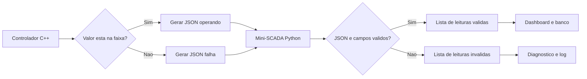

# Tratamento de Erros e Exceções entre Controlador C++ e Mini-SCADA Python

## Objetivos de aprendizagem

- Diferenciar erro de entrada, erro operacional e bug de programação na integração entre controlador C++ e mini-SCADA Python.
- Tratar exceções em C++ no dispositivo/controlador simulado sem encerrar toda a simulação por causa de uma leitura inválida.
- Tratar exceções no mini-SCADA Python, separando leituras válidas e inválidas antes de exibir ou salvar dados.

**Tempo estimado:** 2h.

## Material de contexto

O vídeo desta aula será definido após validação de um material específico sobre `throw`, `try` e `catch`. O vídeo usado anteriormente foi removido porque tratava de arquivos e streams, não de tratamento de exceções.

Para acompanhar esta aula, use como referência principal:

- [Microsoft Learn - Instruções `try`, `throw` e `catch` em C++](https://learn.microsoft.com/pt-br/troubleshoot/developer/visualstudio/cpp/language-compilers/catch-exceptions)
 

---

## 1. Por que esta aula entra agora?

Até aqui, o projeto já possui:

- sensores modelados como objetos;
- listas dinâmicas;
- validação de campos;
- JSON ou linhas de dados;
- noções de histórico em banco de dados.

O próximo risco é simples: **um dado ruim não pode derrubar o sistema inteiro**.

Neste projeto, há duas partes com responsabilidades diferentes:

| Parte | Linguagem | Papel |
|---|---|---|
| Dispositivo/controlador simulado | C++ | representar sensores, regras locais e geração de dados |
| Mini-SCADA/supervisório | Python | receber, validar, exibir, registrar histórico e apoiar diagnóstico |

Na integração entre essas duas partes, falhas comuns são:

- leitura fora da faixa física;
- campo obrigatório ausente;
- valor numérico vindo como texto;
- JSON malformado;
- arquivo de dados inexistente;
- comando operacional bloqueado por regra de segurança.

Tratamento de erros é a prática de decidir o que o programa faz quando essas situações aparecem.

### Regra prática desta aula

| Situação | Ação recomendada |
|---|---|
| Leitura fora da faixa | registrar falha da leitura e continuar o ciclo |
| JSON inválido | guardar a linha como inválida e continuar lendo o arquivo |
| Campo obrigatório ausente | rejeitar a leitura antes de virar objeto |
| Arquivo ausente | avisar o operador ou criar histórico vazio |
| Bug de programação | corrigir o código, não esconder o problema |

O objetivo não é colocar `try` em todo lugar. O objetivo é proteger as fronteiras do sistema.

---

## 2. Três tipos de erro que aparecem no projeto

Nem todo erro deve ser tratado do mesmo jeito.

| Tipo de erro | Exemplo | Quem percebe | O que fazer |
|---|---|---|---|
| Entrada inválida | `valor = "erro"` no JSON | mini-SCADA Python | rejeitar a leitura e registrar o motivo |
| Estado operacional inválido | nível `-5%` no sensor | controlador C++ | marcar falha e seguir para o próximo sensor |
| Bug de código | acessar chave inexistente por descuido | programador | corrigir a implementação |

Essa separação evita dois extremos ruins:

- ignorar falhas e exibir dados incorretos;
- encerrar o programa inteiro por causa de uma leitura ruim.

---

## 3. Exceções em C++ no controlador

Em C++, `throw`, `try` e `catch` formam um fluxo de desvio controlado.

Use esta leitura inicial:

| Palavra | Pergunta que ela responde | Papel no código |
|---|---|---|
| `try` | "Vou tentar executar algo que pode falhar?" | delimita o trecho monitorado |
| `throw` | "Esta operação não consegue cumprir a regra?" | lança a exceção e interrompe o trecho atual |
| `catch` | "Se falhar, como o programa deve reagir?" | captura a exceção e executa o tratamento |

No controlador C++, faz sentido lançar exceção quando uma operação tenta quebrar uma regra do objeto. O exemplo mais direto é uma leitura fora da faixa física do sensor.

### Experimento 1: programa completo sem tratamento

Considere que um sensor de nível só aceita valores entre `0%` e `100%`.

Agora force uma leitura impossível: `LT-999 = -5%`.

Arquivo de apoio:

- [exemplo_excecoes_sem_catch.cpp](./exemplo_excecoes_sem_catch.cpp)

Copie este programa completo para a IDE, compile e execute:

```cpp
#include <iostream>
#include <stdexcept>
#include <string>

using namespace std;

class SensorNivel {
private:
    string tag;
    double valorAtual;
    double minimo;
    double maximo;

public:
    SensorNivel(string tag)
        : tag(tag),
          valorAtual(0.0),
          minimo(0.0),
          maximo(100.0) {}

    void atualizarValor(double novoValor) {
        if (novoValor < minimo || novoValor > maximo) {
            throw out_of_range("leitura fora da faixa do sensor");
        }

        valorAtual = novoValor;
    }

    void imprimir() const {
        cout << tag << " = " << valorAtual << "%" << endl;
    }
};

int main() {
    SensorNivel nivel("LT-999");

    cout << "Iniciando ciclo de leitura" << endl;

    nivel.atualizarValor(-5.0);
    nivel.imprimir();

    cout << "Fim do ciclo de leitura" << endl;

    return 0;
}
```

Compile e execute:

```bash
g++ -std=c++17 -Wall -Wextra -pedantic docs/parte-2-projeto/exemplo_excecoes_sem_catch.cpp -o exemplo_sem_catch
./exemplo_sem_catch
```

Resultado típico:

```text
Iniciando ciclo de leitura
terminate called after throwing an instance of 'std::out_of_range'
  what():  leitura fora da faixa do sensor
Aborted
```

Observe o ponto principal: as linhas abaixo não executam.

```cpp
nivel.imprimir();
cout << "Fim do ciclo de leitura" << endl;
```

O `throw` interrompe o fluxo normal. Se ninguém captura a exceção, o programa termina.

### Experimento 2: o mesmo programa com `try` e `catch`

Agora mantenha a mesma leitura impossível, mas trate a falha.

Arquivo de apoio:

- [exemplo_excecoes_com_catch.cpp](./exemplo_excecoes_com_catch.cpp)

Copie este programa completo:

```cpp
#include <iostream>
#include <stdexcept>
#include <string>

using namespace std;

class SensorNivel {
private:
    string tag;
    double valorAtual;
    double minimo;
    double maximo;

public:
    SensorNivel(string tag)
        : tag(tag),
          valorAtual(0.0),
          minimo(0.0),
          maximo(100.0) {}

    void atualizarValor(double novoValor) {
        if (novoValor < minimo || novoValor > maximo) {
            throw out_of_range("leitura fora da faixa do sensor");
        }

        valorAtual = novoValor;
    }

    void imprimir() const {
        cout << tag << " = " << valorAtual << "%" << endl;
    }

    string getTag() const {
        return tag;
    }
};

int main() {
    SensorNivel nivel("LT-999");

    cout << "Iniciando ciclo de leitura" << endl;

    try {
        nivel.atualizarValor(-5.0);
        nivel.imprimir();
    } catch (const exception& erro) {
        cout << nivel.getTag()
             << " | falha | "
             << erro.what()
             << endl;
    }

    cout << "Fim do ciclo de leitura" << endl;

    return 0;
}
```

Compile e execute:

```bash
g++ -std=c++17 -Wall -Wextra -pedantic docs/parte-2-projeto/exemplo_excecoes_com_catch.cpp -o exemplo_com_catch
./exemplo_com_catch
```

Saída esperada:

```text
Iniciando ciclo de leitura
LT-999 | falha | leitura fora da faixa do sensor
Fim do ciclo de leitura
```

Agora a utilidade fica visível:

| Sem `catch` | Com `catch` |
|---|---|
| o programa aborta | o programa continua |
| a falha aparece como erro de execução | a falha vira mensagem operacional |
| o ciclo não chega ao fim | o ciclo termina de forma controlada |

### Entendendo o `throw`

O `throw` é usado no ponto em que a regra é violada. Ele não deve ficar espalhado de forma aleatória pelo programa.

No nosso caso, a regra está dentro do objeto:

```text
SensorNivel
  minimo = 0
  maximo = 100
  novoValor = -5
```

```cpp
if (novoValor < minimo || novoValor > maximo) {
    throw out_of_range("leitura fora da faixa do sensor");
}
```

Leitura prática:

- o `if` verifica a regra de domínio do objeto;
- `throw` informa que a operação não pode continuar daquele jeito;
- `out_of_range` comunica que o valor saiu da faixa esperada;
- a linha `valorAtual = novoValor` não executa quando a exceção é lançada;
- quem chamou o método decide como registrar a falha.

Quando o valor é válido, o `throw` não acontece:

```text
novoValor = 42
42 está entre 0 e 100
valorAtual recebe 42
programa continua normalmente
```

Quando o valor é inválido, o `throw` acontece:

```text
novoValor = -5
-5 está fora da faixa
valorAtual não recebe -5
o método é interrompido
o C++ procura um catch compatível
```

### O que acontece exatamente quando o `throw` executa?

O C++ faz três coisas importantes:

1. cria um objeto de erro do tipo `out_of_range`;
2. interrompe imediatamente o método atual;
3. procura um `catch` compatível no caminho de chamada.

No nosso caso, o caminho é:

```text
main()
  chama sensor->simularLeitura()
    chama atualizarValor(-5)
      lança out_of_range
  volta para o catch do main()
```

Isso é diferente de retornar um valor especial como `-1` ou `"erro"`. A exceção separa o caminho normal do caminho de falha.

### Entendendo o `try` e o `catch`

Em C++, o `try` precisa vir acompanhado de pelo menos um `catch`.

O `try` marca o trecho de risco:

```cpp
try {
    sensor->simularLeitura();
    cout << sensor->gerarJsonOperando() << endl;
}
```

Depois, adicione um `catch` para decidir o que fazer se a exceção acontecer:

```cpp
catch (const exception& erro) {
    cout << sensor->gerarJsonFalha(erro.what()) << endl;
}
```

Juntos, eles formam o bloco de tratamento:

```cpp
try {
    sensor->simularLeitura();
    cout << sensor->gerarJsonOperando() << endl;
} catch (const exception& erro) {
    cout << sensor->gerarJsonFalha(erro.what()) << endl;
}
```

Agora a diferença prática aparece:

| Antes do `catch` | Depois do `catch` |
|---|---|
| o programa termina ao encontrar `LT-999 = -5` | o programa registra a falha de `LT-999` |
| os sensores seguintes podem não ser processados | o laço continua para os sensores seguintes |
| a falha aparece como abortamento do programa | a falha vira dado para o mini-SCADA Python |

### Onde capturar no controlador C++?

Capture a exceção no ponto em que o programa consegue tomar uma decisão útil.

No controlador C++, esse ponto costuma ser o ciclo de leitura:

```cpp
for (const auto& sensor : sensores) {
    try {
        sensor->simularLeitura();
        cout << sensor->gerarJsonOperando() << endl;
    } catch (const exception& erro) {
        cout << sensor->gerarJsonFalha(erro.what()) << endl;
    }
}
```

Leitura do bloco:

| Linha | O que significa |
|---|---|
| `try {` | tente processar este sensor |
| `sensor->simularLeitura();` | pode funcionar ou lançar exceção |
| `gerarJsonOperando()` | só executa se a leitura foi aceita |
| `catch (const exception& erro)` | entra aqui se alguma exceção compatível foi lançada |
| `erro.what()` | recupera a mensagem associada à falha |
| `gerarJsonFalha(...)` | transforma a falha em dado visível para o mini-SCADA Python |

Assim, um sensor com problema não impede os demais sensores de serem processados.

### Onde o `try` deve ficar?

Compare duas possibilidades:

| Local do `try` | Consequência |
|---|---|
| fora do `for` inteiro | a primeira falha interrompe o restante do laço |
| dentro do `for`, para cada sensor | uma falha afeta apenas o sensor atual |

Para este projeto, a segunda opção é melhor:

```cpp
for (const auto& sensor : sensores) {
    try {
        sensor->simularLeitura();
        cout << sensor->gerarJsonOperando() << endl;
    } catch (const exception& erro) {
        cout << sensor->gerarJsonFalha(erro.what()) << endl;
    }
}
```

Esse desenho combina com o comportamento esperado do controlador simulado: uma leitura ruim deve ser visível para o mini-SCADA Python, mas não deve impedir o controlador de processar o restante da estação.

### Por que `catch (const exception& erro)`?

`out_of_range` é um tipo específico de exceção da biblioteca padrão. Ele deriva de `exception`.

Por isso, este `catch`:

```cpp
catch (const exception& erro)
```

consegue capturar `out_of_range` e outras exceções comuns da biblioteca padrão.

Leitura da assinatura:

| Trecho | Sentido |
|---|---|
| `const` | o tratamento não vai modificar o objeto de erro |
| `exception&` | recebe a exceção por referência, sem copiar |
| `erro` | nome da variável usada dentro do `catch` |

Para exemplos pequenos, isso é suficiente. Em sistemas maiores, pode fazer sentido capturar tipos mais específicos primeiro, como `out_of_range`, e deixar `exception` como caso geral.

---

## 4. Exemplo completo em C++: controlador com falha controlada

Arquivo de apoio:

- [exemplo_excecoes_controlador.cpp](./exemplo_excecoes_controlador.cpp)

```cpp
#include <iostream>
#include <memory>
#include <stdexcept>
#include <string>
#include <vector>

using namespace std;

class Sensor {
private:
    string tag;
    string tipoSensor;
    string unidade;
    double minimo;
    double maximo;
    double valorAtual;

protected:
    void atualizarValor(double novoValor) {
        if (novoValor < minimo || novoValor > maximo) {
            throw out_of_range("leitura fora da faixa permitida");
        }

        valorAtual = novoValor;
    }

public:
    Sensor(string tag, string tipoSensor, string unidade, double minimo, double maximo)
        : tag(tag),
          tipoSensor(tipoSensor),
          unidade(unidade),
          minimo(minimo),
          maximo(maximo),
          valorAtual(0.0) {}

    virtual ~Sensor() = default;

    virtual void simularLeitura() = 0;

    string getTag() const { return tag; }
    string getTipo() const { return tipoSensor; }
    string getUnidade() const { return unidade; }
    double getValorAtual() const { return valorAtual; }

    string gerarJsonOperando() const {
        return "{\"tag\":\"" + tag +
               "\",\"tipo\":\"" + tipoSensor +
               "\",\"valor\":" + to_string(valorAtual) +
               ",\"unidade\":\"" + unidade +
               "\",\"status\":\"operando\"}";
    }

    string gerarJsonFalha(const string& mensagem) const {
        return "{\"tag\":\"" + tag +
               "\",\"tipo\":\"" + tipoSensor +
               "\",\"valor\":null" +
               ",\"unidade\":\"" + unidade +
               "\",\"status\":\"falha\"" +
               ",\"erro\":\"" + mensagem + "\"}";
    }
};

class SensorNivel : public Sensor {
private:
    double leituraSimulada;

public:
    SensorNivel(string tag, double leituraSimulada)
        : Sensor(tag, "nivel", "%", 0.0, 100.0),
          leituraSimulada(leituraSimulada) {}

    void simularLeitura() override {
        atualizarValor(leituraSimulada);
    }
};

class SensorPressao : public Sensor {
private:
    double leituraSimulada;

public:
    SensorPressao(string tag, double leituraSimulada)
        : Sensor(tag, "pressao", "bar", 0.0, 10.0),
          leituraSimulada(leituraSimulada) {}

    void simularLeitura() override {
        atualizarValor(leituraSimulada);
    }
};

int main() {
    vector<unique_ptr<Sensor>> sensores;

    sensores.push_back(make_unique<SensorNivel>("LT-101", 42.0));
    sensores.push_back(make_unique<SensorPressao>("PT-201", 2.7));
    sensores.push_back(make_unique<SensorNivel>("LT-999", -5.0));

    for (const auto& sensor : sensores) {
        try {
            sensor->simularLeitura();
            cout << sensor->gerarJsonOperando() << endl;
        } catch (const exception& erro) {
            cout << sensor->gerarJsonFalha(erro.what()) << endl;
        }
    }

    return 0;
}
```

### Como compilar e executar

```bash
g++ -std=c++17 -Wall -Wextra -pedantic docs/parte-2-projeto/exemplo_excecoes_controlador.cpp -o exemplo_excecoes_controlador
./exemplo_excecoes_controlador
```

Saída esperada, com uma leitura em falha:

```json
{"tag":"LT-101","tipo":"nivel","valor":42.000000,"unidade":"%","status":"operando"}
{"tag":"PT-201","tipo":"pressao","valor":2.700000,"unidade":"bar","status":"operando"}
{"tag":"LT-999","tipo":"nivel","valor":null,"unidade":"%","status":"falha","erro":"leitura fora da faixa permitida"}
```

### O que observar

O programa não encerra quando `LT-999` falha.

A falha vira dado. Isso permite que o mini-SCADA Python mostre o problema, salve histórico ou gere alarme.

---

## 5. Ponte C++ -> Python

| Conceito | Controlador C++ | Mini-SCADA Python |
|---|---|---|
| Lançar erro | `throw out_of_range(...)` | `raise ValueError(...)` |
| Capturar erro | `catch (const exception& erro)` | `except (ValueError, TypeError) as erro` |
| Erro de JSON | normalmente tratado no receptor | `json.JSONDecodeError` |
| Leitura inválida | gerar pacote com `status = falha` | separar em lista de inválidas |
| Continuidade do sistema | seguir para o próximo sensor | seguir para a próxima linha |

O C++ protege os objetos do controlador simulado.  
O mini-SCADA Python protege a entrada do supervisório.

Essas duas proteções são complementares.

---

## 6. Exemplo completo em Python: mini-SCADA validando JSON Lines

Arquivo de apoio:

- [exemplo_excecoes_supervisor.py](./exemplo_excecoes_supervisor.py)

O mini-SCADA Python receberá linhas JSON. Algumas podem estar corretas, outras podem trazer falha operacional ou erro de formato.

```python
import json


STATUS_VALIDOS = {"operando", "alerta", "falha", "manutencao"}
CAMPOS_OBRIGATORIOS = {"tag", "tipo", "valor", "unidade", "status"}


def validar_leitura(leitura: dict) -> None:
    faltantes = CAMPOS_OBRIGATORIOS - set(leitura)

    if faltantes:
        raise ValueError(f"campos ausentes: {sorted(faltantes)}")

    if not isinstance(leitura["tag"], str) or not leitura["tag"]:
        raise TypeError("tag deve ser texto nao vazio")

    if not isinstance(leitura["tipo"], str) or not leitura["tipo"]:
        raise TypeError("tipo deve ser texto nao vazio")

    if not isinstance(leitura["unidade"], str) or not leitura["unidade"]:
        raise TypeError("unidade deve ser texto nao vazio")

    if leitura["status"] not in STATUS_VALIDOS:
        raise ValueError(f"status invalido: {leitura['status']}")

    if leitura["status"] != "falha" and not isinstance(leitura["valor"], int | float):
        raise TypeError("valor deve ser numerico quando a leitura nao esta em falha")


class LeituraSupervisor:
    def __init__(self, dados: dict) -> None:
        validar_leitura(dados)
        self.tag = dados["tag"]
        self.tipo = dados["tipo"]
        self.valor = dados["valor"]
        self.unidade = dados["unidade"]
        self.status = dados["status"]

    def como_linha(self) -> dict:
        return {
            "tag": self.tag,
            "tipo": self.tipo,
            "valor": self.valor,
            "unidade": self.unidade,
            "status": self.status,
        }


def importar_linhas_json(linhas: list[str]) -> tuple[list[LeituraSupervisor], list[dict]]:
    leituras_validas = []
    leituras_invalidas = []

    for numero, linha in enumerate(linhas, start=1):
        try:
            dados = json.loads(linha)
            leitura = LeituraSupervisor(dados)
            leituras_validas.append(leitura)
        except json.JSONDecodeError as erro:
            leituras_invalidas.append({
                "linha": numero,
                "erro": f"JSON invalido: {erro.msg}",
            })
        except (TypeError, ValueError) as erro:
            leituras_invalidas.append({
                "linha": numero,
                "erro": str(erro),
            })

    return leituras_validas, leituras_invalidas


if __name__ == "__main__":
    linhas_recebidas = [
        '{"tag":"LT-101","tipo":"nivel","valor":42.0,"unidade":"%","status":"operando"}',
        '{"tag":"PT-201","tipo":"pressao","valor":2.7,"unidade":"bar","status":"operando"}',
        '{"tag":"LT-999","tipo":"nivel","valor":null,"unidade":"%","status":"falha","erro":"leitura fora da faixa"}',
        '{"tag":"FT-301","tipo":"vazao","valor":"erro","unidade":"m3/h","status":"operando"}',
        '{"tag":"LT-102","tipo":"nivel","valor":51.0,"unidade":"%","status":"operando"',
    ]

    validas, invalidas = importar_linhas_json(linhas_recebidas)

    print("Leituras validas:")
    for leitura in validas:
        print(leitura.como_linha())

    print("\nLeituras invalidas:")
    for item in invalidas:
        print(item)
```

### Como executar

```bash
python3 docs/parte-2-projeto/exemplo_excecoes_supervisor.py
```

### Leitura do resultado

O mini-SCADA aceita:

- leituras normais;
- leitura em `falha` com `valor` nulo.

O mini-SCADA rejeita:

- leitura em operação com `valor` textual;
- JSON incompleto ou malformado.

---

## 7. Fluxo recomendado no projeto final

Use este fluxo como referência:



Leitura do fluxo:

- o controlador C++ não deve enviar qualquer valor como se fosse confiável;
- o mini-SCADA Python não deve confiar cegamente em tudo que recebe;
- leituras inválidas devem virar diagnóstico, não silêncio.

---

## 8. Quando não usar exceção?

Exceção não é substituta para toda decisão do programa.

| Caso | Use exceção? | Motivo |
|---|---|---|
| Leitura fora da faixa física | Sim | quebra uma regra do objeto |
| JSON malformado | Sim | entrada não pode ser interpretada |
| Sensor com status `alerta` | Não necessariamente | pode ser estado operacional normal do domínio |
| Nível abaixo de `30%` | Não necessariamente | é regra de controle, não erro de formato |
| Usuário escolheu filtro vazio | Não necessariamente | pode ser interação comum da interface |

Uma boa regra:

**use exceção quando a operação não consegue cumprir seu contrato.**

Se o dado é válido, mas representa uma condição crítica do processo, trate como evento, alarme ou regra de controle.

---

## 9. Exercício prático

Evolua a integração entre controlador C++ e mini-SCADA Python com uma falha controlada.

### Parte C++

1. Criar pelo menos três sensores na lista dinâmica.
2. Fazer um deles produzir valor fora da faixa.
3. Lançar `out_of_range` dentro do método de atualização.
4. Capturar a exceção no laço principal.
5. Gerar uma linha JSON com `status = falha`.

### Parte Python

1. Ler uma lista de linhas JSON.
2. Validar campos obrigatórios.
3. Separar leituras válidas e inválidas.
4. Aceitar `valor = null` quando `status = falha`.
5. Rejeitar `valor` textual quando `status` não é `falha`.

### Entrega mínima

- saída do C++ com pelo menos uma falha;
- saída do Python com lista de válidas e inválidas;
- explicação curta: onde a exceção é lançada, onde é capturada e por que o programa continua.

---

## 10. Mini-caso prático

Durante a simulação da estação de bombeamento, o sensor de nível `LT-999` retorna `-5%`.

Esse valor não é uma condição operacional aceitável. Ele viola a faixa física do objeto `SensorNivel`, que deveria operar entre `0%` e `100%`.

A decisão correta é:

1. o controlador C++ rejeita o valor;
2. o ciclo continua para os demais sensores;
3. o controlador envia uma leitura com `status = falha`;
4. o mini-SCADA Python aceita a falha como diagnóstico;
5. o mini-SCADA separa entradas realmente inválidas, como JSON quebrado ou valor textual em leitura normal.

Esse comportamento mantém o sistema observável: o erro aparece para análise, mas não impede o restante da estação de operar.

---

## 11. Perguntas de revisão rápida

1. Qual é a diferença entre uma leitura em `falha` e um JSON inválido?
2. Por que o `catch` do controlador C++ deve ficar no ciclo de leitura, e não apenas no final do programa?
3. Por que o mini-SCADA Python precisa validar os dados mesmo quando o controlador C++ já validou?

---

## Fontes de referência

- [cppreference - Exceptions](https://en.cppreference.com/w/cpp/language/exceptions)
- [cppreference - `std::out_of_range`](https://en.cppreference.com/w/cpp/error/out_of_range)
- [Python Docs - Errors and Exceptions](https://docs.python.org/3/tutorial/errors.html)
- [Python Docs - `json`](https://docs.python.org/3/library/json.html)
- [Python Docs - Built-in Exceptions](https://docs.python.org/3/library/exceptions.html)
