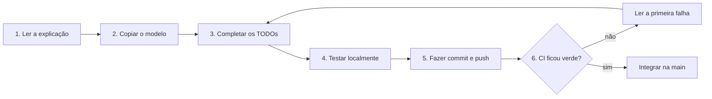
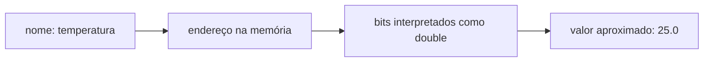
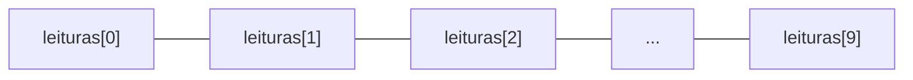
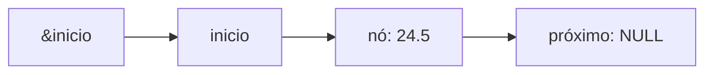
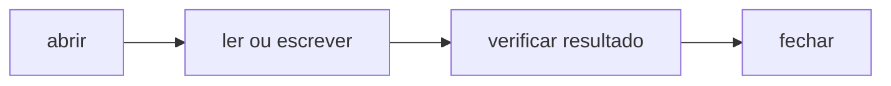

# Revisão guiada de programação em C

## Objetivos de aprendizagem

- Reconhecer como tipos, variáveis, decisões e repetições aparecem em um programa completo.
- Aplicar vetores, ponteiros, `struct`, listas e arquivos copiando modelos e realizando pequenas modificações orientadas.
- Identificar os limites de uma `struct` pública e as responsabilidades que dependem de disciplina manual em C.

**Tempo estimado:** 200 minutos presenciais, organizados em duas aulas de 100 minutos, mais uma atividade de casa com prazo até a semana seguinte. Uma terceira aula pode ser usada como contingência, revisão ou validação final.

## Vídeo de contexto

O vídeo **Revisão de algoritmos e linguagem C** apresenta os elementos centrais da programação procedural. Não é necessário assistir ao vídeo inteiro durante a aula; use-o para consultar um conceito que ainda não esteja claro.


---

## 1. Como realizar esta revisão

Esta atividade não exige criar um programa a partir de uma tela vazia. O repositório fornece a estrutura, os nomes das funções e os testes. Nesta página, cada etapa fornece um modelo de código para copiar e indica pequenas modificações.

Repita este ciclo em cada etapa:



!!! important
    Não tente memorizar todo o código. Primeiro identifique entradas, decisão, repetição e saída. Depois explique com suas palavras o que cada bloco faz.

### Organização das três partes

| Parte | Realização | Trabalho principal | Ponto de parada |
|---|---|---|---|
| 1 — dados e controle | aula 1, 100 min | tipos, memória, `if`, `else`, `switch`, vetores, `for` e funções | etapas 01 e 02 encaminhadas |
| 2 — endereços e coleções | aula 2, 100 min | ponteiro simples, ponteiro para `struct`, ponteiro duplo, `while`, lista e liberação | etapa 03 encaminhada e lista desenhada |
| 3 — persistência e consolidação | atividade de casa | escrita, leitura, erros de arquivo e experimento de alteração por endereço | etapa 04 validada e revisão entregue |

Entre as aulas, use o tempo de atividade de casa para terminar o checkpoint iniciado. A parte 3 é realizada fora da aula e tem prazo até a semana seguinte. Uma terceira aula somente será necessária se a turma precisar de recuperação assistida, revisão coletiva ou validação oral.

### Como trabalhar em dupla

Cada estudante mantém seu próprio fork, seus commits e suas execuções da CI. O trabalho em dupla serve para explicar, observar e revisar; não para que apenas uma pessoa produza o código dos dois integrantes.

Alternem estes papéis a cada checkpoint:

| Papel | Responsabilidade |
|---|---|
| pessoa que digita | executa os comandos e realiza as pequenas modificações no próprio fork |
| pessoa que acompanha | lê a instrução, antecipa o resultado e aponta possíveis erros |
| revisão conjunta | compara o resultado com o contrato, lê o diff e interpreta a CI |

Depois, troquem os papéis e repitam o checkpoint no fork do outro integrante. Antes de enviar uma evidência, cada pessoa deve conseguir explicar o trecho correspondente sem depender da leitura do colega.

---

## Parte 1 — aula 1: dados, decisões e vetores

**Objetivo do encontro:** compreender como dados são representados, classificados e percorridos em uma coleção de tamanho conhecido.

**Resultado esperado:** etapas 01 e 02 encaminhadas em sala e aprovadas antes da parte 2.

### 1. Conhecer o programa antes de modificá-lo

O programa representa um sensor de temperatura. Ele precisa:

1. receber leituras;
2. rejeitar temperaturas fora da faixa do equipamento;
3. guardar leituras válidas;
4. calcular mínima, máxima e média;
5. salvar as leituras em arquivo;
6. recuperar as leituras posteriormente.

#### 1.1 O que significa contrato de uma função

Neste material, **contrato** não significa um documento jurídico. É uma forma curta de descrever o acordo entre uma função e o código que a utiliza.

O contrato responde a quatro perguntas:

1. **O que a função recebe?** Os tipos e o significado dos parâmetros.
2. **O que ela promete fazer?** O cálculo, a validação ou a modificação esperada.
3. **O que ela devolve?** Um resultado, `true`/`false` ou nenhuma informação direta (`void`).
4. **Quais situações ela rejeita?** Por exemplo, ponteiro `NULL`, leitura fora da faixa ou vetor cheio.

Exemplo:

```c
bool leitura_valida(double valor);
```

Seu contrato pode ser lido assim:

- recebe uma temperatura do tipo `double`;
- não altera a temperatura recebida;
- devolve `true` quando o valor está entre `-40.0` e `125.0`;
- devolve `false` fora dessa faixa.

O arquivo de cabeçalho mostra a assinatura — nome, retorno e parâmetros. A explicação da atividade e os testes completam o contrato ao mostrar o comportamento esperado.

#### 1.2 Arquivos do repositório

```text
revisao-programacao-c/
├── include/monitor.h       contrato das funções e estruturas
├── src/monitor.c           funções que serão completadas
├── src/main.c              ponto inicial do programa
├── tests/                  testes automáticos
├── Makefile                comandos de compilação e teste
└── .github/workflows/      validação no GitHub
```

Durante a atividade, modifique somente `src/monitor.c`. O arquivo `monitor.h` informa o que cada função recebe e devolve, mas não deve ser alterado.

---

### 2. Preparar o fork e executar o código inicial

Abra o repositório:

[github.com/rafaelrezo/revisao-programacao-c](https://github.com/rafaelrezo/revisao-programacao-c)

1. Clique em **Fork**.
2. Mantenha sua conta como proprietária.
3. Confirme a criação.
4. No seu fork, abra **Actions** e habilite os workflows se o GitHub solicitar.

No terminal, substitua `SEU_USUARIO`:

```bash
cd ~/curso-poo
git clone git@github.com:SEU_USUARIO/revisao-programacao-c.git
cd revisao-programacao-c
git remote -v
make build
make run
```

Confira os remotos:

- `origin`: seu fork, onde você pode enviar commits;
- o clone da atividade mantém somente `origin`, apontando para o fork do estudante.

O código inicial compila, mas ainda apresenta resultados incompletos. Isso é intencional: cada etapa substituirá um pequeno conjunto de funções.

---

### 3. Etapa 1 — tipos, memória e decisões

Crie a branch:

```bash
git switch -c pratica/01-fundamentos
```

#### 3.1 O que uma variável representa

Considere:

```c
double temperatura = 25.0;
```

- `double` informa como interpretar os bits armazenados;
- `temperatura` é o nome usado no código;
- `25.0` é o valor inicial;
- `&temperatura` é o endereço da variável na memória;
- `sizeof(temperatura)` informa quantos bytes ela ocupa nessa plataforma.



| Tipo | Uso no programa | Atenção |
|---|---|---|
| `bool` | indicar sucesso, falha ou presença de dados | usa `true` e `false` |
| `char` | formar a tag textual do sensor | strings terminam com `\0` |
| `size_t` | representar tamanho e índice | não representa valores negativos |
| `double` | representar temperatura e média | alguns valores decimais são aproximações |
| `EstadoLeitura` | representar um conjunto fechado de estados | cada constante possui um valor inteiro associado |
| `T *` | guardar endereço de um dado do tipo `T` | deve ser validado antes do acesso indireto |

!!! note "Cartão de leitura: `enum`"
    Um `enum` cria nomes para um conjunto pequeno de valores inteiros relacionados. `EstadoLeitura` pode assumir `LEITURA_INVALIDA`, `LEITURA_NORMAL` ou `LEITURA_ALERTA`. Os nomes evitam espalhar números sem significado pelo programa.

Para observar os tamanhos, experimente temporariamente em `main`:

```c
printf("char: %zu byte(s)\n", sizeof(char));
printf("size_t: %zu byte(s)\n", sizeof(size_t));
printf("double: %zu byte(s)\n", sizeof(double));
printf("ponteiro: %zu byte(s)\n", sizeof(double *));
```

Remova essas linhas depois do experimento. Os tamanhos podem variar entre plataformas; por isso devem ser observados, não decorados como regra universal.

#### 3.2 `if` e `else`: decidir por uma condição

No arquivo `src/monitor.c`, substitua as três primeiras funções pelos modelos abaixo.

Copie a conversão e complete somente o denominador:

```c
double celsius_para_fahrenheit(double temperatura) {
    return temperatura * 9.0 / /* TODO: denominador */ + 32.0;
}
```

O valor correto é `5.0`. Usar `9 / 5` faria uma divisão inteira antes de continuar a expressão.

Copie a validação e complete o operador entre as comparações:

```c
bool leitura_valida(double valor) {
    return valor >= -40.0 /* TODO: && ou || */ valor <= 125.0;
}
```

As duas condições precisam ser verdadeiras simultaneamente; portanto, use `&&`.

Agora copie a classificação:

```c
EstadoLeitura classificar_leitura(double valor) {
    if (!leitura_valida(valor)) {
        return LEITURA_INVALIDA;
    } else if (valor >= /* TODO: inicio do alerta */) {
        return LEITURA_ALERTA;
    } else {
        return LEITURA_NORMAL;
    }
}
```

Complete com `80.0`. Leia o fluxo em voz alta:

1. se a leitura não é válida, encerre retornando `LEITURA_INVALIDA`;
2. caso contrário, se atingiu 80, retorne `LEITURA_ALERTA`;
3. se nenhuma condição anterior ocorreu, retorne `LEITURA_NORMAL`.

#### 3.3 `switch`: escolher entre estados discretos

`if` foi adequado para testar intervalos. Agora o valor já é um dos estados definidos no `enum`; por isso `switch` deixa a correspondência explícita.

```c
const char *estado_como_texto(EstadoLeitura estado) {
    switch (estado) {
        case LEITURA_INVALIDA:
            return "INVALIDA";
        case LEITURA_NORMAL:
            return /* TODO: texto do estado normal */;
        case LEITURA_ALERTA:
            return "ALERTA";
    }

    return "DESCONHECIDA";
}
```

Complete com `"NORMAL"`. O retorno final protege a função caso ela receba um valor que não corresponda aos casos conhecidos.

#### 3.4 Testar e enviar

```bash
make test ETAPA=01
git diff
git add src/monitor.c
git commit -m "Implementa conversao e classificacao das leituras"
git push -u origin pratica/01-fundamentos
```

No fork, abra **Actions > Validação da prática**. Se a execução ficar vermelha, abra **Executar testes da etapa** e leia a primeira mensagem de falha.

Depois da validação verde:

```bash
git switch main
git merge --no-ff pratica/01-fundamentos
git push origin main
```

---

### 4. Etapa 2 — vetor, `for` e funções

```bash
git switch main
git status
git switch -c pratica/02-vetores-funcoes
```

#### 4.1 Do valor isolado para uma coleção

Um sensor produz mais de uma leitura. O vetor guarda elementos do mesmo tipo em posições contíguas:

```c
double leituras[MAX_LEITURAS];
```

Se `MAX_LEITURAS` vale 10, os índices permitidos vão de `0` a `9`.



A `struct` agrupa informações que descrevem o mesmo sensor:

```c
typedef struct {
    char tag[16];
    double leituras[MAX_LEITURAS];
    size_t quantidade;
} Sensor;
```

!!! note "Cartão de leitura: `#define`, `typedef` e `struct`"
    `#define MAX_LEITURAS 10` dá um nome a uma constante usada antes da compilação. `struct` reúne campos relacionados. `typedef` permite escrever `Sensor` em vez de `struct Sensor` ao declarar variáveis.

`quantidade` informa quantas posições já contêm dados. Ela não pode ultrapassar `MAX_LEITURAS`.

#### 4.2 `for`: repetir quando existe um limite conhecido

!!! note "Cartão de leitura: `const`, `->`, `continue` e curto-circuito"
    Em `const Sensor *sensor`, `const` impede que essa função altere o `Sensor` apontado. O operador `->` acessa um campo por meio do ponteiro. `continue` encerra somente a iteração atual e avança para a próxima. Em uma expressão com `||`, C para de avaliar quando uma condição verdadeira já determina o resultado; por isso `sensor == NULL || sensor->...` evita acessar `sensor->` quando o ponteiro é nulo.

Copie a função abaixo. Complete os dois `TODOs`.

```c
bool calcular_estatisticas(const Sensor *sensor, Estatisticas *resultado) {
    if (sensor == NULL || resultado == NULL ||
        sensor->quantidade > MAX_LEITURAS) {
        return false;
    }

    size_t validas = 0;
    double soma = 0.0;

    for (size_t i = 0; i < sensor->quantidade; i++) {
        double valor = sensor->leituras[i];

        if (!leitura_valida(valor)) {
            continue;
        }

        if (validas == 0 || valor < resultado->minima) {
            resultado->minima = valor;
        }

        if (validas == 0 || valor > resultado->maxima) {
            resultado->maxima = valor;
        }

        soma += valor;
        /* TODO 1: incrementar a quantidade de leituras validas */
    }

    if (validas == 0) {
        return false;
    }

    resultado->media = soma / /* TODO 2: divisor correto */;
    return true;
}
```

Complete com:

```c
validas++;
```

e use `validas` como divisor. O teste `validas == 0` possui duas funções:

- inicializar mínima e máxima com o primeiro valor aceito;
- impedir divisão por zero quando nenhum valor é aceito.

`for` foi escolhido porque o percurso começa em zero e termina em uma quantidade conhecida.

#### 4.3 Testar e enviar

```bash
make test ETAPA=02
git add src/monitor.c
git commit -m "Calcula estatisticas com vetor e for"
git push -u origin pratica/02-vetores-funcoes
```

Depois da CI verde, integre a branch na `main`.

---

### Encerramento da parte 1 e atividade entre aulas

Antes de encerrar, confirme:

- [ ] a etapa 01 está integrada na `main`;
- [ ] a etapa 02 foi iniciada ou concluída;
- [ ] consigo explicar por que `9 / 5` e `9.0 / 5.0` produzem resultados diferentes;
- [ ] consigo distinguir capacidade do vetor e quantidade utilizada;
- [ ] sei em qual função continuar trabalhando.

Se a etapa 02 não estiver verde, conclua-a em casa antes da aula 2. Registre no caderno ou no README do seu fork:

1. um exemplo de valor `NORMAL`, `ALERTA` e `INVALIDA`;
2. por que o laço usa `i < sensor->quantidade`;
3. qual condição evita a divisão por zero.

#### Desafio A no Google Classroom — dados e controle

Cada estudante envia:

1. nome do colega da dupla;
2. link para o próprio fork;
3. link para a execução verde da etapa 02;
4. hash do commit validado, obtido com `git log -1 --oneline`;
5. resposta curta: “por que a média não pode ser calculada quando `validas == 0`?”.

A evidência é individual, mesmo quando a discussão e a revisão foram feitas em dupla.

---

## Parte 2 — aula 2: endereços, ponteiros e lista encadeada

**Objetivo do encontro:** acompanhar endereços e construir uma coleção cujos nós são alocados dinamicamente.

**Resultado esperado:** etapa 03 encaminhada em sala, com demonstração e desenho concluídos antes da parte 3.

### Checkpoint de entrada da parte 2

```bash
git switch main
git status
make build
make test ETAPA=02
```

Prossiga quando:

- [ ] `git status` não mostra alterações pendentes;
- [ ] as etapas 01 e 02 estão integradas;
- [ ] `make test ETAPA=02` termina com sucesso;
- [ ] consigo apontar `leituras`, `quantidade` e `tag` dentro de `Sensor`.

### 5. Etapa 3 — ponteiros, `while` e lista encadeada

```bash
git switch main
git switch -c pratica/03-struct-ponteiros
```

#### 5.1 Ler os símbolos de ponteiro

```c
double temperatura = 25.0;
double *ponteiro = &temperatura;
*ponteiro = 26.0;
```

Leia da seguinte forma:

- `&temperatura`: “endereço de temperatura”;
- `double *ponteiro`: “ponteiro capaz de apontar para `double`”;
- `*ponteiro`: “valor localizado no endereço guardado pelo ponteiro”;
- `NULL`: “não existe objeto válido sendo apontado”.

Quando o ponteiro aponta para uma `struct`, `sensor->quantidade` é uma forma curta de escrever `(*sensor).quantidade`.

#### 5.1.1 Microexperimento: alterar um valor por endereço

Antes de usar `Sensor *`, acompanhe uma única variável:

```c
void definir_temperatura(double *destino, double novo_valor) {
    if (destino != NULL) {
        *destino = novo_valor;
    }
}

double temperatura = 25.0;
definir_temperatura(&temperatura, 26.0);
```

Antes da chamada, `temperatura` vale `25.0`. `&temperatura` compartilha seu endereço; `*destino = novo_valor` escreve nesse endereço; depois da chamada, a mesma variável vale `26.0`.

#### 5.2 Inserir no vetor usando um ponteiro

Copie e complete o operador de comparação:

```c
bool sensor_adicionar_leitura(Sensor *sensor, double valor) {
    if (sensor == NULL || !leitura_valida(valor) ||
        sensor->quantidade /* TODO: operador */ MAX_LEITURAS) {
        return false;
    }

    sensor->leituras[sensor->quantidade] = valor;
    sensor->quantidade++;
    return true;
}
```

Use `>=`. Essa forma também rejeita uma `quantidade` que já esteja incorretamente acima da capacidade.

#### 5.3 Por que aparece um ponteiro para ponteiro

O primeiro nó de uma lista pode mudar de `NULL` para um endereço. Para modificar a variável `inicio` de quem chamou, a função recebe seu endereço:

```c
NoLeitura *inicio = NULL;
lista_adicionar(&inicio, 24.5);
```

Logo, o parâmetro é `NoLeitura **inicio`.



Observe primeiro a mudança sem alocação:

!!! note "Cartão de leitura: inicializador designado"
    Em `NoLeitura no = {.valor = 24.5, .proximo = NULL};`, os nomes depois do ponto indicam explicitamente qual campo recebe cada valor. Isso reduz a dependência da ordem dos campos na `struct`.

```c
void apontar_para_no(NoLeitura **destino, NoLeitura *no_existente) {
    if (destino != NULL) {
        *destino = no_existente;
    }
}

NoLeitura no = {.valor = 24.5, .proximo = NULL};
NoLeitura *inicio = NULL;
apontar_para_no(&inicio, &no);
```

`inicio` começa nulo. A função recebe `&inicio` e muda a variável-ponteiro para que ela aponte para `no`. `NoLeitura **` é, portanto, o endereço de uma variável que já é ponteiro.

#### 5.4 Copiar o modelo de inserção

!!! note "Cartão de leitura: pilha, heap, `malloc` e propriedade"
    Variáveis locais comuns possuem duração controlada pelo bloco da função. `malloc` reserva uma região dinâmica no heap e devolve seu endereço, ou `NULL` se falhar. Essa região continua reservada até uma chamada a `free`. Nesta atividade, a lista é responsável pelos nós que aloca, e `lista_liberar` devolve todos eles.

```c
bool lista_adicionar(NoLeitura **inicio, double valor) {
    if (inicio == NULL || !leitura_valida(valor)) {
        return false;
    }

    NoLeitura *novo = malloc(sizeof(*novo));
    if (novo == NULL) {
        return false;
    }

    novo->valor = valor;
    novo->proximo = NULL;

    if (*inicio == NULL) {
        *inicio = novo;
        return true;
    }

    NoLeitura *atual = *inicio;
    while (atual->proximo != NULL) {
        atual = atual->proximo;
    }

    atual->proximo = novo;
    return true;
}
```

Aqui `while` é adequado porque não sabemos previamente quantos nós serão percorridos. A repetição termina ao encontrar o último nó.

#### 5.5 Contar e calcular a média

Copie as duas funções. Na segunda, complete o avanço do ponteiro.

```c
size_t lista_quantidade(const NoLeitura *inicio) {
    size_t quantidade = 0;
    const NoLeitura *atual = inicio;

    while (atual != NULL) {
        quantidade++;
        atual = atual->proximo;
    }

    return quantidade;
}

double lista_media(const NoLeitura *inicio, bool *possui_dados) {
    if (possui_dados == NULL) {
        return 0.0;
    }

    double soma = 0.0;
    size_t quantidade = 0;
    const NoLeitura *atual = inicio;

    while (atual != NULL) {
        soma += atual->valor;
        quantidade++;
        atual = /* TODO: proximo no */;
    }

    *possui_dados = quantidade > 0;
    return quantidade > 0 ? soma / quantidade : 0.0;
}
```

Complete com `atual->proximo`.

#### 5.6 Liberar todos os nós

Memória obtida com `malloc` deve ser devolvida com `free`. Copie:

```c
void lista_liberar(NoLeitura **inicio) {
    if (inicio == NULL) {
        return;
    }

    while (*inicio != NULL) {
        NoLeitura *proximo = (*inicio)->proximo;
        free(*inicio);
        *inicio = proximo;
    }
}
```

O endereço do próximo nó é guardado **antes** de liberar o atual. Depois de `free`, o nó não pode mais ser acessado.

#### 5.7 Relatório integrado

Use esta implementação para reunir as funções anteriores:

```c
void exibir_relatorio(const Sensor *sensor) {
    if (sensor == NULL) {
        return;
    }

    Estatisticas resultado;
    if (!calcular_estatisticas(sensor, &resultado)) {
        printf("Sensor %s sem leituras validas\n", sensor->tag);
        return;
    }

    size_t validas = 0;
    for (size_t i = 0; i < sensor->quantidade; i++) {
        if (leitura_valida(sensor->leituras[i])) {
            validas++;
        }
    }

    printf("Sensor: %s\n", sensor->tag);
    printf("Leituras aceitas: %zu\n", validas);
    printf("Minima: %.1f C\n", resultado.minima);
    printf("Maxima: %.1f C\n", resultado.maxima);
    printf("Media: %.1f C\n", resultado.media);
    printf("Estado: %s\n",
           estado_como_texto(classificar_leitura(resultado.media)));
}
```

#### 5.8 Testar e enviar

```bash
make test ETAPA=03
make run
git add src/monitor.c
git commit -m "Implementa ponteiros e lista encadeada"
git push -u origin pratica/03-struct-ponteiros
```

Depois da CI verde, integre a branch.

---

### Encerramento da parte 2 e preparação para o trabalho de casa

Execute a demonstração:

```bash
git switch main
make demo ETAPA=03
```

Antes de encerrar, confirme:

- [ ] consigo diferenciar `Sensor *` de `NoLeitura **`;
- [ ] consigo desenhar `inicio`, dois nós e os respectivos campos `proximo`;
- [ ] consigo explicar por que o próximo endereço é salvo antes de `free`;
- [ ] a etapa 03 está integrada ou sei exatamente qual teste ainda falha.

Como atividade de casa, conclua a etapa 03 e desenhe o estado da lista:

1. antes da primeira inserção;
2. depois de inserir `24.5`;
3. depois de inserir `80.0`;
4. depois de `lista_liberar`.

#### Desafio B no Google Classroom — ponteiros e lista

Cada estudante envia:

1. nome do colega da dupla;
2. link para a execução verde da etapa 03;
3. hash do commit validado;
4. imagem ou PDF do desenho dos dois nós;
5. explicação de duas ou três frases sobre por que `lista_adicionar` recebe `NoLeitura **inicio`.

Antes do envio, a dupla troca os desenhos e confere `inicio`, `valor`, `proximo` e `NULL`.

---

## Parte 3 — atividade de casa: arquivos e consolidação

**Objetivo do encontro:** persistir a lista, tratar caminhos de falha e observar como endereços compartilhados permitem alterar o estado.

**Resultado esperado:** etapa 04 aprovada, demonstração do arquivo executada e revisão final respondida.

### Checkpoint para iniciar a atividade de casa

```bash
git switch main
git status
make build
make test ETAPA=03
make demo ETAPA=03
```

Prossiga quando:

- [ ] a etapa 03 está integrada;
- [ ] os testes cumulativos da etapa 03 passam;
- [ ] a demonstração mostra dois nós e termina com zero nós;
- [ ] consigo explicar quem é responsável por liberar a lista.

### 6. Etapa 4 — escrever e ler arquivos

```bash
git switch main
git switch -c pratica/04-arquivos
```

#### 6.1 Por que usar um arquivo

Variáveis e nós existem enquanto o processo está em execução. Um arquivo preserva dados para outra execução.

Nesta atividade, cada linha terá um número:

```text
24.5
80
```

!!! note "Cartão de leitura: `FILE *` e resultados de entrada/saída"
    `FILE *` representa um fluxo de arquivo aberto. `fopen` devolve esse ponteiro ou `NULL`. `fprintf` devolve um valor negativo quando a escrita falha. `fscanf` devolve quantos valores conseguiu converter; por isso `== 1` significa que um `double` foi lido. Todo arquivo aberto deve chegar a `fclose`, inclusive nos caminhos de erro.

O fluxo de arquivo possui quatro responsabilidades:



#### 6.2 Escrever a lista

Copie e complete o modo de abertura:

```c
bool salvar_leituras(const char *caminho, const NoLeitura *inicio) {
    if (caminho == NULL) {
        return false;
    }

    FILE *arquivo = fopen(caminho, /* TODO: modo de escrita */);
    if (arquivo == NULL) {
        return false;
    }

    const NoLeitura *atual = inicio;
    while (atual != NULL) {
        if (fprintf(arquivo, "%.17g\n", atual->valor) < 0) {
            fclose(arquivo);
            return false;
        }
        atual = atual->proximo;
    }

    return fclose(arquivo) == 0;
}
```

Complete com `"w"`. Esse modo cria o arquivo ou substitui seu conteúdo.

#### 6.3 Ler e reconstruir a lista

Copie e complete a condição do `while`:

```c
bool carregar_leituras(const char *caminho, NoLeitura **inicio) {
    if (caminho == NULL || inicio == NULL) {
        return false;
    }

    FILE *arquivo = fopen(caminho, "r");
    if (arquivo == NULL) {
        return false;
    }

    NoLeitura *temporaria = NULL;
    double valor;

    while (fscanf(arquivo, "%lf", &valor) /* TODO: conversao bem-sucedida */) {
        if (!lista_adicionar(&temporaria, valor)) {
            lista_liberar(&temporaria);
            fclose(arquivo);
            return false;
        }
    }

    if (ferror(arquivo) || fclose(arquivo) != 0) {
        lista_liberar(&temporaria);
        return false;
    }

    lista_liberar(inicio);
    *inicio = temporaria;
    return true;
}
```

Complete a condição com `== 1`. `fscanf` devolve a quantidade de conversões realizadas. A comparação garante que o laço continue somente quando um `double` foi realmente lido.

A lista temporária evita destruir os dados anteriores antes de saber se a leitura pode ser concluída.

#### 6.4 Testar e enviar

```bash
make test ETAPA=04
git add src/monitor.c
git commit -m "Salva e recupera leituras em arquivo"
git push -u origin pratica/04-arquivos
```

Depois da CI verde, integre a branch.

Observe também o comportamento fora dos testes:

```bash
git switch main
make demo ETAPA=04
```

Abra `build/leituras_demo.txt` no editor e relacione cada linha à saída da demonstração.

---

### 7. Se um teste falhar

Uma falha não significa recomeçar. Leia primeiro a mensagem e identifique a menor parte relacionada.

| Mensagem ou situação | Primeiro ponto a conferir |
|---|---|
| erro de compilação | linha indicada e `;`, `{}`, tipo ou nome escrito |
| limite `-40` ou `125` falhou | uso de `<` versus `<=` |
| média incorreta | incremento de `validas` e divisor |
| programa trava na lista | teste de `NULL` e avanço para `proximo` |
| vazamento ou acesso inválido | ordem entre guardar `proximo` e executar `free` |
| arquivo não abre | caminho, modo `"r"`/`"w"` e retorno de `fopen` |
| workflow não iniciou | nome exato da branch e Actions habilitado |

Comandos de diagnóstico:

```bash
git status
git branch --show-current
make build
make test ETAPA=NN
```

Substitua `NN` por `01`, `02`, `03` ou `04`.

---

### 8. Limites da `struct` pública e das responsabilidades manuais

O programa em C já foi dividido em funções. Isso reduz a quantidade de detalhes dentro do fluxo principal e melhora a legibilidade. Boa decomposição também é possível em programação procedural.

Ainda existem responsabilidades que dependem de disciplina manual:

- chamar a função correta para validar uma leitura;
- não alterar diretamente os campos de `Sensor`;
- lembrar de liberar cada nó obtido com `malloc`;
- fechar arquivos em todos os caminhos de sucesso e falha.

Este código compila, embora crie um estado impossível:

```c
sensor.leituras[0] = 900.0;
sensor.quantidade = MAX_LEITURAS + 20;
```

Uma função que confiar em `quantidade` poderá acessar memória fora do vetor.

#### 8.1 Experimento: outra função consegue alterar o estado?

Uma variável local não pode ser acessada pelo nome dentro de outra função. Entretanto, seu valor pode ser modificado quando o endereço é compartilhado.

Crie temporariamente `experimento_acesso.c` na raiz do repositório:

```c
#include <stdio.h>

#include "include/monitor.h"

void tentar_alterar_por_valor(size_t quantidade) {
    quantidade = 999;
    printf("Dentro da funcao por valor: %zu\n", quantidade);
}

void alterar_por_endereco(size_t *quantidade) {
    if (quantidade != NULL) {
        *quantidade = 999;
    }
}

void corromper_sensor(Sensor *sensor) {
    if (sensor != NULL) {
        sensor->leituras[0] = 900.0;
        sensor->quantidade = MAX_LEITURAS + 20;
    }
}

int main(void) {
    Sensor sensor = {
        .tag = "TMP-01",
        .leituras = {25.0},
        .quantidade = 1
    };

    printf("Estado inicial: %zu leitura(s)\n", sensor.quantidade);

    tentar_alterar_por_valor(sensor.quantidade);
    printf("Depois da passagem por valor: %zu\n", sensor.quantidade);

    alterar_por_endereco(&sensor.quantidade);
    printf("Depois da passagem por endereco: %zu\n", sensor.quantidade);

    sensor.quantidade = 1;
    corromper_sensor(&sensor);
    printf("Depois de corromper_sensor: quantidade=%zu, primeira=%.1f\n",
           sensor.quantidade, sensor.leituras[0]);

    return 0;
}
```

Compile e execute:

```bash
gcc -std=c17 -Wall -Wextra -pedantic experimento_acesso.c -o experimento
./experimento
```

Saída esperada:

```text
Estado inicial: 1 leitura(s)
Dentro da funcao por valor: 999
Depois da passagem por valor: 1
Depois da passagem por endereco: 999
Depois de corromper_sensor: quantidade=30, primeira=900.0
```

O experimento mostra três situações:

1. **passagem por valor:** a função altera somente sua cópia;
2. **passagem de endereço:** a função alcança a variável original por meio do ponteiro;
3. **ponteiro para `struct` pública:** a função pode alterar qualquer campo acessível, inclusive ignorando as regras de validação.

Isso não significa que uma função “entra” na memória local de outra sem permissão. O acesso tornou-se possível porque `main` compartilhou os endereços com `&sensor.quantidade` e `&sensor`.

Remova os arquivos do experimento depois da observação:

```bash
rm experimento experimento_acesso.c
```

Não inclua esses arquivos no commit da atividade.

As funções do programa possuem responsabilidades diferentes: validar, inserir, calcular, salvar e carregar. Essa divisão melhora a leitura, mas a `struct Sensor` continua pública. A linguagem não obriga o restante do programa a usar `sensor_adicionar_leitura`.

| Responsabilidade | Função prevista | Como ainda pode ser ignorada |
|---|---|---|
| validar a faixa | `leitura_valida` | um valor pode ser escrito diretamente no vetor |
| controlar a capacidade | `sensor_adicionar_leitura` | `quantidade` pode ser alterada diretamente |
| liberar a lista | `lista_liberar` | o código pode esquecer a chamada e causar vazamento |
| fechar o arquivo | `salvar_leituras` e `carregar_leituras` | um retorno antecipado mal implementado pode deixar o arquivo aberto |

Portanto, a organização atual depende de duas coisas:

1. cada função cumprir sua responsabilidade;
2. todo o restante do programa respeitar voluntariamente essas funções.

!!! note
    C permite encapsular uma implementação com módulos, cabeçalhos e tipos opacos. A limitação observada aqui é específica da `struct` pública usada na atividade: seus campos permanecem acessíveis a qualquer trecho que possua uma variável `Sensor`.

---

### 9. Mini-caso prático consolidado

Explique o percurso da leitura `80.0`:

1. ela cabe em um `double` e é recebida por valor;
2. `leitura_valida` confirma que está entre `-40.0` e `125.0`;
3. `classificar_leitura` devolve `LEITURA_ALERTA`;
4. ela pode ser armazenada no vetor ou em um nó da lista;
5. o laço inclui o valor no cálculo da média;
6. `salvar_leituras` converte o valor para texto no arquivo;
7. `carregar_leituras` converte o texto novamente para `double`;
8. uma escrita direta nos campos da `struct` ainda pode ignorar a validação.

---

### 10. Verificação final

- [ ] Consigo explicar a diferença entre valor, tipo e endereço.
- [ ] Consigo justificar o uso de `if`, `switch`, `for` e `while` nos exemplos.
- [ ] Consigo identificar o primeiro e o último índice válido do vetor.
- [ ] Consigo desenhar dois nós ligados por ponteiros.
- [ ] Consigo explicar por que `free` aparece na lista.
- [ ] Consigo identificar abertura, leitura ou escrita e fechamento do arquivo.
- [ ] Consigo localizar no GitHub o teste relacionado ao meu commit.
- [ ] Consigo mostrar como uma escrita direta nos campos pode criar um estado inválido.

---

### 11. Perguntas de revisão rápida

1. Por que `for` foi usado no vetor e `while` na lista encadeada?
2. Por que a lista temporária é liberada quando a leitura do arquivo falha?
3. Por que oferecer `sensor_adicionar_leitura` não impede que outro trecho altere diretamente uma `struct Sensor` pública?

!!! success "Respostas comentadas para autocorreção"
    1. O `for` combina inicialização, condição e avanço quando existe uma quantidade conhecida de posições. Na lista, a quantidade não precisa ser conhecida antes do percurso; o `while` avança pelos ponteiros até encontrar `NULL`.
    2. Os nós da lista temporária foram obtidos com `malloc`. Se a leitura falhar e eles não forem liberados, a memória continuará reservada sem possibilidade de uso, caracterizando vazamento.
    3. A função oferece um caminho correto, mas os campos da `struct` continuam acessíveis. Outro trecho que possua `Sensor` ou `Sensor *` pode escrever diretamente em `leituras` e `quantidade`, ignorando a função.

### Entrega da parte 3: prazo e critério mínimo

O prazo final é a semana seguinte. Antes da entrega, confirme:

- [ ] as quatro etapas estão integradas na `main` do seu fork;
- [ ] `make test ETAPA=04` termina com sucesso;
- [ ] `make demo ETAPA=03` mostra inserção e liberação da lista;
- [ ] `make demo ETAPA=04` cria e recupera o arquivo;
- [ ] consigo explicar uma decisão do código sem apenas ler o texto;
- [ ] registrei o uso de IA conforme as regras da disciplina, se aplicável.

Se não concluir uma aula, não avance apagando testes ou copiando uma etapa posterior. Pare na última branch verde, anote a primeira falha restante e retome a partir dela. Para acompanhar o encontro seguinte, o mínimo é que a etapa anterior compile e que você consiga identificar o TODO ainda não concluído.

#### Desafio C no Google Classroom — arquivos e consolidação

Cada estudante envia até o prazo da semana seguinte:

1. nome do colega da dupla;
2. link para a execução verde da etapa 04;
3. hash do commit final na `main`;
4. saída de `make demo ETAPA=04` e o conteúdo de `build/leituras_demo.txt`;
5. resposta curta: “por que `carregar_leituras` constrói uma lista temporária antes de substituir a lista existente?”;
6. uma observação sobre o que a revisão do colega ajudou a encontrar ou compreender.

O Google Classroom registra a evidência e a reflexão. O código verificável permanece no fork e no histórico de commits.

### Quando pode ocorrer uma terceira aula

A terceira aula não faz parte do percurso obrigatório. Ela pode ser usada quando houver necessidade coletiva de:

- corrigir falhas recorrentes da etapa 03 ou 04;
- reconstruir visualmente a lista encadeada;
- comparar soluções e discutir legibilidade;
- validar oralmente o experimento de acesso ao estado;
- concluir entregas que permaneceram bloqueadas mesmo após a atividade de casa.

Se a maioria concluir a parte 3 dentro do prazo, a terceira aula fica disponível para o próximo conteúdo do curso.

---

## Fontes de referência

- [GitHub Docs: criar um fork](https://docs.github.com/pt/pull-requests/collaborating-with-pull-requests/working-with-forks/fork-a-repo)
- [cppreference: tipos aritméticos em C](https://en.cppreference.com/w/c/language/arithmetic_types)
- [cppreference: estruturas de controle em C](https://en.cppreference.com/w/c/language/statements)
- [cppreference: arrays em C](https://en.cppreference.com/w/c/language/array)
- [cppreference: ponteiros em C](https://en.cppreference.com/w/c/language/pointer)
- [cppreference: gerenciamento dinâmico de memória](https://en.cppreference.com/w/c/memory)
- [cppreference: entrada e saída](https://en.cppreference.com/w/c/io)
- [cppreference: `std::vector`](https://en.cppreference.com/w/cpp/container/vector)
- [cppreference: `std::list`](https://en.cppreference.com/w/cpp/container/list)
- [Python Docs: listas](https://docs.python.org/pt-br/3/tutorial/introduction.html#lists)
